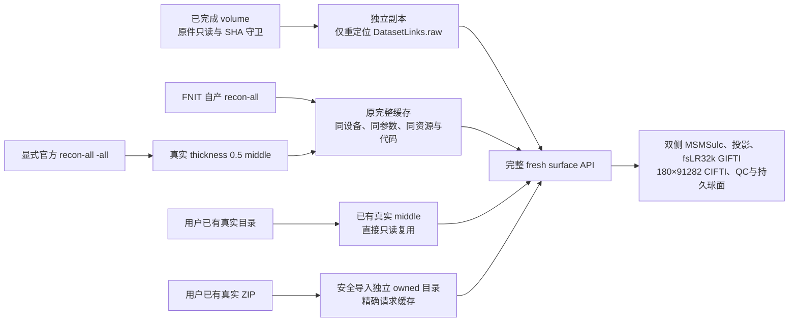
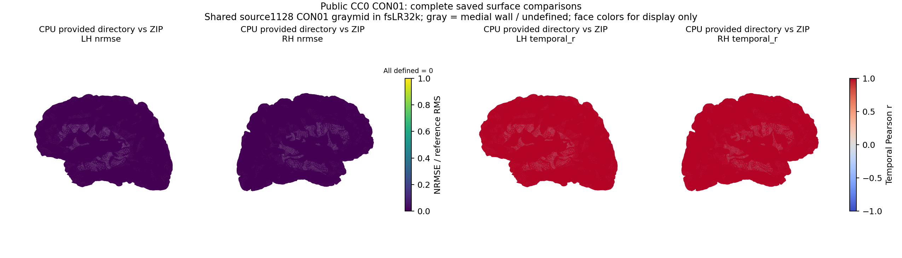
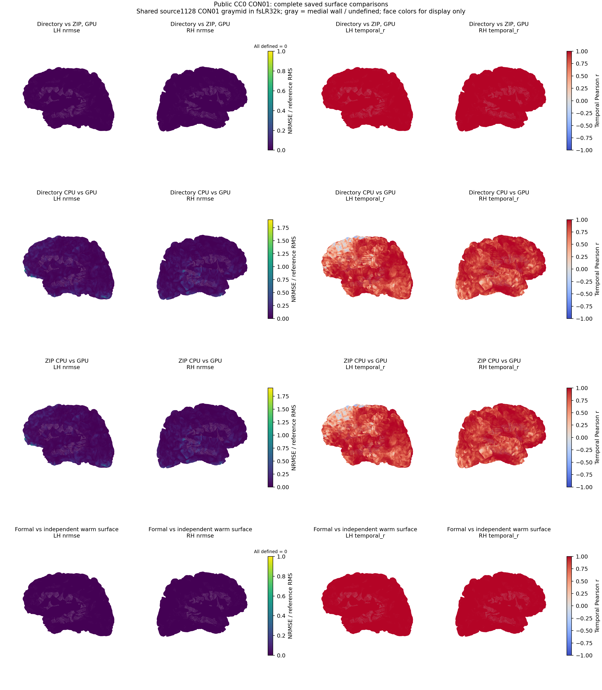

# 三种重建入口与独立 surface 验证

## 1. 功能简介与流程

`fMRISurface_pipeline` 接受 FNIT 自动重建、用户明确选择的官方 FreeSurfer 重建，以及已有 recon-all 目录或 ZIP。这里用公开数据 OpenNeuro ds001226 v5.0.1 的 CON01 验证接入：完整 BOLD 为 180 帧，TR 2.1 秒。MRI 生产代码固定为 `1128bc52c7a0233266e5b8a8d7dc0b382994e676`；每个独立验证 helper 另记录源码 SHA-256。



完整冷重建、ZIP 导入、volume 副本准备、缓存检查和完整 surface API 各自计时。FNIT 独立 surface-only 测量复用正式 CON01 的同版本 volume 与原绝对重建输出；它是一次新的完整 surface API 调用，不能用整例时间减去前序时间替代。

## 2. Python 调用、输入与输出

产品 API 的逐参数说明见[表面 pipeline 文档](../../../docs/fmri/surface.md)。验证入口为 [`run_surface_backend_demo.py`](run_surface_backend_demo.py)，其私有 JSON 使用原产品 API 参数，不修改数值算法。输入如下：

- `bids_root`、`subject`、`session`、`task`：指向原始 BIDS T1w 与完整 BOLD；`auto_volume=False` 要求现有 volume 已通过真实模板、来源、形状、帧数和有限值检查。
- `derivatives_root`：本次独立副本，保存新的表面结果；原 volume MRI 和 sidecar 保持字节相同。移动副本后仅将 owned `dataset_description.json` 的 `DatasetLinks.raw` 写为发布 API 要求的规范相对路径。
- `recon_all_backend`：`fnit`、`freesurfer` 或 `provided`。前两者使用原绝对 `recon_all_output_dir`；`provided` 的 `recon_all` 是只读目录或真实 ZIP，导入输出使用单独的 owned 目录。
- `device`：同时传给表面计算与重建适配器，属于重建缓存键。`recon_all_options` 不能覆盖该值。请求 `cuda:0`、实际隐藏 CUDA 的官方 FreeSurfer CPU 冷重建与后续 `cuda:0` GPU 表面调用可共用精确缓存；将 API 设备改为 `cpu` 会使该缓存失配，因此不这样复用该 GPU 演示的缓存。额外 CON08 CPU 冷诊断从新目录开始，重建与 surface 均请求 `cpu`。
- `fsnative_to_t1w`：已有重建 scanner-RAS → 原始 T1w scanner-RAS 的正向 4×4 矩阵。此次官方 fMRIPrep 保存的 ITK 文件使用 pull 语义，先处理 fixed center 与 LPS/RAS，再取逆，详见[真实方向证明](provided_transform_provenance.public.json)与[只读验证器](verify_provided_transform.py)。不按文件名猜方向或拟合对齐。
- `hcp_assets_dir`、`volume_options.mni_template`、`wb_command`：沿用已验证固定资源与项目 Conda 的实际程序；GPU演示使用 TF32、默认 float32，没有半精度变更。
- `cpu_threads`、`parallel`：CPU 示例为共享双侧总预算 4 线程；GPU 示例保留其实际配置并记录。示例不改变完整 180 帧或空间定义。

Python 运行示例，变量名称与注释均指明范围：

```python
import json
from pathlib import Path
from fnit.fmri import fMRISurface_pipeline

# 该配置已完成只读来源、ready-volume 与精确 recon 缓存检查。
# 原 volume 和重建目录保持只读；只有本次 derivatives 副本写出表面结果。
surface_configuration_file = Path("/path/to/private/config.private.json")
surface_configuration = json.loads(surface_configuration_file.read_text())
assert surface_configuration["auto_volume"] is False
surface_result = fMRISurface_pipeline(**surface_configuration)
assert surface_result.volume_executed is False
print(surface_result.left, surface_result.right, surface_result.dtseries)
print(surface_result.timing_seconds)
```

输出包括双侧每帧一个 32492 顶点数组的 GIFTI、180×91282 CIFTI、BIDS sidecar、QC 和持久配准球面。驱动另保存匿名 `report.public.json` 与私有路径/故障记录，检查这些产物的完整帧数、TR、brain models、有限值、来源及运行前后 SHA；保存检查耗时与 API 时钟分开记录。GPU 采样报告字节、十进制 GB 与 GiB；无法可靠测量时结果为 `null`，不认作通过 20 GB。

## 3. 命令行调用

验证驱动的四个必需参数为 `--config`（私有产品参数 JSON）、`--output`（必须不存在的独立报告目录）、`--source-root`（实际导入的冻结 FNIT 根目录）及 `--source-revision`（对应完整提交）。下面使用已经准备完成的配置，设置实际可用的绝对路径：

```bash
FNIT_FROZEN_SOURCE=/path/to/fnit/source_1128bc52
FNIT_PYTHON=/path/to/conda/bin/python
SURFACE_DEMO_CONFIG=/path/to/ready/config.private.json
SURFACE_DEMO_REPORT=/path/to/fresh/surface_attempt
SURFACE_DEMO_RUNNER=/path/to/run_surface_backend_demo.py

# 必须在全新 Python 启动前选择缓存策略；flag 即使为空或 0 也表示禁用。
unset PYTORCH_NO_CUDA_MEMORY_CACHING
# CPU 示例配置中的 device='cpu'；隐藏 CUDA，不抢占正式 GPU 队列。
export CUDA_VISIBLE_DEVICES=''
export OMP_NUM_THREADS=4 OPENBLAS_NUM_THREADS=4 MKL_NUM_THREADS=4
PYTHONPATH="$FNIT_FROZEN_SOURCE/src" "$FNIT_PYTHON" "$SURFACE_DEMO_RUNNER" \
  --config "$SURFACE_DEMO_CONFIG" --output "$SURFACE_DEMO_REPORT" \
  --source-root "$FNIT_FROZEN_SOURCE" \
  --source-revision 1128bc52c7a0233266e5b8a8d7dc0b382994e676
```

GPU 示例配置 `device='cuda:0'`。本轮[标准库等待器](wait_and_run_surface_backend_demos.py)先核验 GPU0 的 CON03、05、07、09、11 全部报告完成、队列条目退出码均为 0、队列正常结束且原进程与后代消失，再取得原物理锁；失败或残留任务会记录阻塞。取得锁后再次核验，在同一锁内串行运行官方 backend、已有目录、真实 ZIP 和 FNIT 独立 surface-only 四项。锁前使用 Python `-S`，不导入 PyTorch、不建立 CUDA context；锁后设置 `CUDA_VISIBLE_DEVICES=0`，按实际 CUDA 进程的 NVML 记录核对 GPU UUID。排队等待不计入 API 时钟。

等待器参数 `--fnit-root` 指统一索引根目录，`--python` 指已核验的 Conda 解释器，`--formal-launcher-pid` 和 `--formal-queue-pid` 指仍存活的原正式队列身份，`--poll-seconds` 为标准库状态检查间隔（默认 10 秒）。它保留原锁文件及 inode，不删除或替换锁。generated 缓存预检先只读验证设备、参数、当前资源与实际选中 native 的路径和 SHA，任何不匹配直接停止；API 后再次检查同一完整缓存闭包。

```bash
FNIT_SERVER_ROOT=/path/to/FNIT
FNIT_PYTHON=/path/to/conda/bin/python
FORMAL_LAUNCHER_PID=12345  # 替换为现场核验的原 flock 进程，不能填任意空闲 PID。
FORMAL_QUEUE_PID=12346     # 替换为 queue_CON03.private.json 记录的原队列 PID。
GPU_GATE_RUNNER=/path/to/wait_and_run_surface_backend_demos.py

# 此等待进程仅使用标准库；它在成功取得原锁后才启动科学计算子进程。
"$FNIT_PYTHON" -S "$GPU_GATE_RUNNER" \
  --fnit-root "$FNIT_SERVER_ROOT" --python "$FNIT_PYTHON" \
  --formal-launcher-pid "$FORMAL_LAUNCHER_PID" \
  --formal-queue-pid "$FORMAL_QUEUE_PID" --poll-seconds 10
```

CON08 晚复核入口不调用重建、volume 或 surface，只读取原产物。`--fnit-root` 是现场索引根；`--cold-run` 指原 failed attempt；`--original-runner` 指原 v3 的精确字节，不能用修复后的默认 helper 替代；`--output-root` 必须是另一个不存在的统一 runs 子目录，且与原件、源码和资源互不包含。输出为独立匿名报告、新私有 file map 和纯 460 源文件 SHA 清单，原 failed 报告不变。

后验时序比较的 `--metric-helper` 是原固定全数组 metric helper，`--cold-helper` 同样为原 v3 的只读轴检查函数。原 driver failed 时，`--late-report`、`--late-files` 和 `--late-source-manifest` 三个参数必须同时传入，分别绑定刚完成的独立晚复核、明确晚生成的 file map 和原科学源；不给三份绑定或伪造丢失时钟均拒绝。

```bash
FNIT_SERVER_ROOT=/path/to/FNIT  # 当前统一 INDEX.json 所在目录
FNIT_PYTHON=/path/to/conda/bin/python
CON08_COLD_RUN=/path/to/FNIT/runs/CON08_original_failed_attempt
ORIGINAL_COLD_RUNNER=/path/to/run_surface_backend_cold_cpu_diagnostic_v3.py
LATE_VALIDATOR=/path/to/validate_CON08_backend_saved_late_v1.py
CON08_LATE_OUTPUT="$FNIT_SERVER_ROOT/runs/CON08_new_late_validation"
CON08_COMPARISON_OUTPUT="$FNIT_SERVER_ROOT/runs/CON08_new_saved_comparison"
CON08_COMPARISON_HELPER=/path/to/compare_CON08_backend_saved_timeseries_v2.py
SAVED_ARRAY_METRIC_HELPER=/path/to/compare_surface_backend_outputs_v1.py

export CUDA_VISIBLE_DEVICES='' PYTHONDONTWRITEBYTECODE=1
export OMP_NUM_THREADS=4 OPENBLAS_NUM_THREADS=4 MKL_NUM_THREADS=4
# 只读原件，生成新的独立验证记录；不执行任何 MRI。
"$FNIT_PYTHON" "$LATE_VALIDATOR" --fnit-root "$FNIT_SERVER_ROOT" \
  --cold-run "$CON08_COLD_RUN" --original-runner "$ORIGINAL_COLD_RUNNER" \
  --output-root "$CON08_LATE_OUTPUT"
"$FNIT_PYTHON" "$CON08_COMPARISON_HELPER" --fnit-root "$FNIT_SERVER_ROOT" \
  --cold-run "$CON08_COLD_RUN" --metric-helper "$SAVED_ARRAY_METRIC_HELPER" \
  --cold-helper "$ORIGINAL_COLD_RUNNER" --output-root "$CON08_COMPARISON_OUTPUT" \
  --late-report "$CON08_LATE_OUTPUT/report.public.json" \
  --late-files "$CON08_LATE_OUTPUT/files.private.json" \
  --late-source-manifest "$CON08_LATE_OUTPUT/source.private.json"
```

Python 可用同一完整 CLI 合同调用独立只读验收；所有路径替换为现场核验的绝对路径：

```python
from pathlib import Path
import json
import subprocess
import sys

fnit_server_root = Path("/path/to/FNIT")
original_cold_attempt = fnit_server_root / "runs/CON08_original_failed_attempt"
original_cold_runner = Path("/path/to/run_surface_backend_cold_cpu_diagnostic_v3.py")
late_validator_script = Path("/path/to/validate_CON08_backend_saved_late_v1.py")
late_validation_output = fnit_server_root / "runs/CON08_new_late_validation_python"
# 此解释器启动前已隐藏 CUDA。独立新目录只保存晚复核，不覆盖原失败。
subprocess.run([sys.executable, str(late_validator_script),
    "--fnit-root", str(fnit_server_root), "--cold-run", str(original_cold_attempt),
    "--original-runner", str(original_cold_runner),
    "--output-root", str(late_validation_output)], check=True)
late_saved_report = json.loads((late_validation_output / "report.public.json").read_text())
assert late_saved_report["status"] == "complete_saved_outputs_verified_late"
assert late_saved_report["full_api_seconds"] is None  # 丢失时钟不能从其他范围推算。
print(late_saved_report["saved_timing_seconds"]["total_before_publication"])
```

## 4. 原软件调用

显式 FreeSurfer 模式运行官方 `recon-all`，选定合法许可后用 argv 传参，不 source 用户配置脚本：

```bash
SOURCE_T1W_IMAGE=/path/to/raw/sub-CON01_ses-preop_T1w.nii.gz  # 本轮原始公开 T1w
RECON_SUBJECT_NAME=subject
RECON_SUBJECTS_DIR=/path/to/fresh/reconstruction  # 新的 subjects 根，不能写原件
RECON_SUBJECT_DIR="$RECON_SUBJECTS_DIR/$RECON_SUBJECT_NAME"
RECON_ALL_COMMAND=/path/to/FreeSurfer/bin/recon-all
MRIS_EXPAND_COMMAND=/path/to/conda/bin/mris_expand  # 固定源独立编译的程序

# 仅显式 freesurfer backend 使用官方程序，调用前已配置合法 FS_LICENSE。
"$RECON_ALL_COMMAND" -all -i "$SOURCE_T1W_IMAGE" -s "$RECON_SUBJECT_NAME" \
  -sd "$RECON_SUBJECTS_DIR" -parallel -openmp 4

# middle 使用同一 white 的 sibling pial/thickness/sphere，独立编译固定源程序。
"$MRIS_EXPAND_COMMAND" -thickness "$RECON_SUBJECT_DIR/surf/lh.white" 0.5 \
  "$RECON_SUBJECT_DIR/surf/lh.graymid"
"$MRIS_EXPAND_COMMAND" -thickness "$RECON_SUBJECT_DIR/surf/rh.white" 0.5 \
  "$RECON_SUBJECT_DIR/surf/rh.graymid"
```

`-parallel -openmp 4` 是原软件每分支的线程设置，不能解释为整个进程树始终只有 4 个 CPU 线程。已有目录与 ZIP 的真实 middle 已完整，不运行任何 recon-all 或 middle 程序。官方完整 fMRIPrep 参考使用固定容器 25.2.4，属于独立参考流程；本项目 API 不通过该封装软件运行。

## 5. 最新真实精度与时间

[最终官方 backend 匿名实测](backend_fs_cpu_final1128.public.json)已完成真实冷重建及同请求缓存控制：

| 范围 | 秒 | 实际设备与结果 |
|---|---:|---|
| 官方 FreeSurfer 8.2.0 `recon-all -all` | 4742.234953 | CPU，原公开 T1w，全流程成功 |
| 固定自编 `mris_expand` LH | 921.025872 | CPU，真实 thickness 0.5 |
| 固定自编 `mris_expand` RH | 726.354038 | CPU，真实 thickness 0.5 |
| 完整冷重建适配 API | 6390.436483 | 含真实 middle、原件身份及输出检查 |
| 随后精确同请求缓存 lookup | 0.912131 | `reused=True`；实际 closure及二进制 SHA 通过 |
| 目录 provided 完整 CPU surface API | 392.438434 | 新副本，完整 180 帧；不计前序 volume/recon |
| 真实 ZIP provided 完整 CPU surface API | 400.658598 | owned 安全导入缓存，完整 180 帧 |
| 官方 backend 完整 GPU surface API | 248.842574 | 原 FS8.2 重建缓存；8 CPU 线程 |
| provided 目录完整 GPU surface API | 211.869836 | 原件直接只读复用；8 CPU 线程 |
| provided ZIP 完整 GPU surface API | 248.646889 | owned 导入缓存；4 CPU 线程 |
| FNIT 独立 warm surface API | 215.281975 | 正式 CON01 volume 与 FNIT 重建缓存；8 CPU 线程 |

原 T1w、冻结 Python 源、验证 helper 与实际驱动前后 SHA 均相同。冷重建请求设备记录为 `cuda:0`，但官方计算实际 `CUDA_VISIBLE_DEVICES=''`、`torch.cuda_available=False`；两者含义分开记录。表中的冷重建与 cache 行不包含 BOLD volume 或下游 surface；后面的完整 surface 行包含表面计算，复用前序 volume 和重建。冷重建行不是冷整例的总时长。

两条完整 CPU 表面路线均已保存全部 180 帧、TR 2.1 秒、两侧 180×32492 GIFTI、180×91282 CIFTI、QC 与真实配准球面。`volume_executed=False`，目录原件直接复用，ZIP owned 缓存复用；原始 T1w/BOLD、ready-volume、16 项重建闭包、显式变换、冻结源、helper、自身与配置前后 SHA 全部通过。原报告分别为[目录 CPU](backend_provided_dir_cpu1128.public.json)与[ZIP CPU](backend_provided_zip_cpu1128.public.json)。各范围如下；双侧内部时间是分支计时，不能求和当作并行墙钟。

| 完整 CPU API 内部步骤 | 目录：秒 | ZIP：秒 |
|---|---:|---:|
| 只读 volume 状态检查 | 6.386375 | 6.334695 |
| 重建适配器的复用检查 | 0.405808 | 0.474817 |
| native surface 准备 | 6.919067 | 6.460434 |
| MSMSulc 输入准备与双侧配准 | 269.257751 | 276.856812 |
| 双侧完整投影（并行墙钟） | 95.958597 | 97.397437 |
| CIFTI 组装 | 9.070854 | 8.495599 |
| 驱动从检查开始至保存产物复核 | 402.291334 | 410.801025 |

[独立完整保存数组比较](backend_provided_dir_vs_zip_cpu1128.public.json)确认两侧全部 GIFTI 与 CIFTI 数据逐值、逐位完全相同，最大绝对差及 NRMSE 均为 0；CIFTI time/brain models 轴相同，CIFTI 文件字节 SHA 相同。原生两侧配准球面的坐标与 face 顺序也完全相同（L 142173 顶点，R 148403 顶点）。Pearson 只统计有方差的点/帧，无方差数量另记；不把零方差强行记成相关系数 1。这证明本例真实目录与安全 ZIP 导入给出同一产品结果；两条任务共享 CPU 节点，各使用 4 线程，此单次计时不概括其他数据或设备的速度。



图中标量通过实际 CIFTI cortical brain-model vertex indices 映射到共用 source1128 CON01 graymid 展示几何；它保留两条 provided 路线各自的原生产来源。NRMSE 使用全部 180 帧除以参考 RMS，全部有定义的皮层点均为 0，时间 Pearson r 均为 1；每侧 29390 点有定义，左/右另有 306/326 个零信号点，灰色还包括 medial wall。颜色由三顶点面平均值绘制，仅用于展示。PNG、原保存 CIFTI、真实显示几何与 helper 的前后 SHA 见[图形证据](backend_figures/provided_cpu_directory_vs_zip.public.json)。

这些 provided 演示的 volume 原始生产来源是 diagnostic-v2 CON01、提交 `01de7f30579d79ef6cfad0ea51de713828dc4206`；该例先前 volume 已完成，后续完整 surface 在 ribbon 子功能失败。实际[谱系检查](backend_volume_lineage1128.public.json)从该 attempt 到旧准备目录及两个新 CPU 副本逐文件证明 6 个 MRI/volume sidecar 字节相同，仅 owned `DatasetLinks.raw` 重定位。正式 v4 CON01 的三项 MRI 字节恰好与 v2 相同，也不会改变这些演示的原生产版本或时钟。独立 FNIT surface-only GPU 示例则直接使用正式 v4 的源版本1128 volume，与这些 provided 演示分开记录。

GPU 的官方/FNIT 配置另经过[实际缓存控制](backend_generated_cache_preflight1128.public.json)：只读精确键与全文件检查后，真实 adapter lookup 分别 0.708374 与 5.465847 秒，均复用原目录且 manifest SHA 不变；实际检查隐藏 CUDA，不包含冷重建或表面计算。

四条 GPU 路线均在正式 GPU0 五例完整成功、原队列正常保存并退出后，持原物理锁串行完成。锁前与取得锁时均未导入模型；源、配置、自编 FastPD 及其五个源文件、Workbench、原件与完整重建缓存前后守卫全部通过。实际 CUDA context 与结束时物理卡均为 H100 PCIe、UUID `GPU-26e41f63-1a65-6b3e-5370-fa9a2934ca8e`。这些调用没有执行 cold volume 或 cold reconstruction，均保存完整 180 帧、TR 2.1 秒、双侧 GIFTI、91k CIFTI、QC 与真实配准球面；[最终等待器记录](backend_gpu_lane0_waiter1128.public.json)保存了门控、原锁与各项退出码。四份原始匿名报告为[官方 backend](backend_freesurfer_gpu1128.public.json)、[目录](backend_provided_dir_gpu1128.public.json)、[ZIP](backend_provided_zip_gpu1128.public.json)和[独立 FNIT](backend_fnit_surface_only_gpu1128.public.json)。

| 完整 GPU API 内部步骤/驱动范围：秒 | FS8.2 缓存 | 目录 | ZIP | FNIT warm |
|---|---:|---:|---:|---:|
| API 内 volume 状态检查 | 7.066857 | 7.054511 | 7.097738 | 7.080022 |
| API 内重建复用检查 | 0.659622 | 0.435690 | 0.520188 | 5.341326 |
| native surface 准备 | 6.349986 | 6.522073 | 6.453501 | 6.549175 |
| MSMSulc 准备与双侧配准 | 148.875173 | 112.567144 | 112.522613 | 109.181012 |
| atlas area surfaces | 1.115462 | 1.337961 | 1.174963 | 1.142288 |
| 双侧完整投影：并行墙钟 | 71.573431 | 70.815417 | 108.224381 | 71.496996 |
| CIFTI 组装 | 9.370442 | 9.449338 | 9.194880 | 9.715083 |
| API 完整独立实测 | 248.842574 | 211.869836 | 248.646889 | 215.281975 |
| 驱动检查开始至保存产物复核 | 261.106175 | 223.593826 | 260.910570 | 242.732149 |

API 时钟包含内部 ready-volume/cache 检查、全 surface 计算与发布；外层驱动还执行重复的只读合同及输出复核，范围较宽，不能当作 kernel 时间。独立 FNIT warm 的 API 外 ready-volume 检查、adapter lookup、原缓存合同检查和 API 后缓存检查分别为 7.354684、5.417425、5.916791 和 5.201749 秒；API 内原 FNIT reconstruction closure 检查为 5.341326 秒。它是直接完整独立调用，未以整例时长作减法。各双侧子阶段计时保存在原报告，不能将左右分支相加替代并行墙钟。

| GPU 路线 | owned tree 采样峰值：字节 | 十进制 GB | GiB | CPU 总线程 |
|---|---:|---:|---:|---:|
| 官方 FS8.2 缓存 | 2195718144 | 2.195718144 | 2.044921875 | 8 |
| provided 目录 | 1950351360 | 1.950351360 | 1.816406250 | 8 |
| provided ZIP | 1950351360 | 1.950351360 | 1.816406250 | 4 |
| FNIT 独立 warm | 1998585856 | 1.998585856 | 1.861328125 | 8 |

四条路线的采样均无监测错误，均低于 20,000,000,000 字节；这表示本次 owned CUDA 进程树的采样峰值。共享整卡利用率中位数均为 100%，整卡显存约 40.00–50.87 十进制 GB，包含本任务以外的进程与设备开销；不能把整卡值当成本任务显存。[负载原样汇总](backend_gpu_shared_load1128.public.json)另外记录样本数量、整卡负载及 owned tree 范围。CPU 与 GPU 的线程/共享节点负载不同，单次墙钟不支持通用 GPU 加速倍数。

完整保存数组与球面均做无拟合、无强度重写的独立比较；21 个 CIFTI brain models 与时间轴逐项完全相同。下面的 NRMSE 使用全部 180×91282 的参考 RMS，时间 r 均值只使用双方有方差的 grayordinate；`passed` 表示比较成功完成，不表示两套结果数值等价。

| 实际对照 | CIFTI 最大绝对差 | 完整91k NRMSE | 时间 r 均值 | sphere 坐标分量最大差 LH/RH：mm |
|---|---:|---:|---:|---:|
| [目录↔ZIP，GPU](backend_provided_dir_vs_zip_gpu1128.public.json) | 0 | 0 | 1 | 0 / 0 |
| [目录 CPU↔GPU](backend_provided_dir_cpu_vs_gpu1128.public.json) | 447.565857 | 0.050893271 | 0.922607767 | 7.131283 / 3.433142 |
| [ZIP CPU↔GPU](backend_provided_zip_cpu_vs_gpu1128.public.json) | 447.565857 | 0.050893271 | 0.922607767 | 7.131283 / 3.433142 |
| [正式整例↔FNIT 独立 warm surface](backend_fnit_formal_vs_surface_only_gpu1128.public.json) | 0 | 0 | 1 | 0 / 0 |

目录与 ZIP 的 GPU GIFTI、CIFTI 和球面数组逐位相同，面序相同，CIFTI 文件字节 SHA 也相同；正式整例与独立 FNIT warm 同样满足这些实际检查。CPU↔GPU 的 provided 结果非等价，LH/RH GIFTI NRMSE 为 0.056778363/0.055024583，时间 r 均值为 0.872056539/0.889193449；皮层下时间数组相同，皮层与注册球面存在差异。CPU↔GPU 每组有 90617 个定义时间 r、665 个未定义 grayordinate；两套 GPU provided 输出互比有 90625/657，FNIT 正式↔warm 为 90683/599，不把零方差记成 r=1。

[实际配置核验](backend_configuration_cpu_vs_gpu1128.public.json)确认四条 provided 路线 460 个 Python 源 SHA 逐项相同且运行前后不变，MSMSulc 均为 optimized，全部算法参数、固定 HCP 资源根、Workbench 选择和显式 scanner-RAS affine 字节相同；parallel 均为 True。目录 CPU/GPU 的总线程为 4/8、每侧 2/4；ZIP CPU/GPU 均为 4、每侧均为 2，两套 GPU 输出仍逐位相同。TF32 flags 都开启，CPU 实际没有 CUDA 算术。CPU 驱动为原 v3、GPU 为 v5，实际驱动 SHA 分别保留；几毫米的球面差不被描述为浮点尾数误差，也没有据此认定或修改成熟算法 bug。

这些 provided 配准的相对取向 QC 也按原值保留：CPU LH 的 solver/output fold 各 1、最小输出 ratio −1.863858；GPU LH 各 2、最小输出 ratio −4.375429，RH 均 0。该计数相对于注册输入，不能直接解释为绝对 inward 面数。完整 API 的执行成功不等于严格球面质量通过；这里保持固定版本算法与已有记录行为，没有新增最后一步展开来改写结果。



四行依次为 GPU 目录↔ZIP、目录 CPU↔GPU、ZIP CPU↔GPU、正式 FNIT↔独立 warm。每一行均用全部 180 帧计算皮层逐点 NRMSE 与时间 r；NRMSE 为零行的色条注明全部定义点为 0，各行色条采用自己的实际最大值。灰色表示 medial wall 或零信号/零方差导致未定义的点。标量按真实 CIFTI vertex indices 映射到共用 source1128 CON01 的实际 graymid→32k 展示几何，不将该几何重新命名为各 backend 的 producer。颜色只作三顶点面平均展示，脑图与所有输入/显示几何/helper SHA 见[匿名图证据](backend_figures/backend_gpu_surface_comparisons.public.json)。

中间层同输入与官方原程序的两侧坐标差均为 0 mm、face 顺序完全相同，详细范围见[middle 验证](middle_same_input.md)。已有官方重建到 raw T1w 的实际同顶点方向验证最大误差约 8.04×10⁻⁶ mm；未取逆的错误方向最大误差约 0.1775 mm。与独立官方完整参考的时序/空间精度及脑图由十例验证页记录；本页两种 provided 输入互相一致的结果不会替代该独立参考比较。

额外 CON08 同例诊断已保存官方 FS8.2 冷重建及完整 CPU surface 产物。独立驱动固定 source1128，复用 formal-v4 CON08 的 7 文件 volume 副本；[准备记录](backend_CON08_freesurfer82_cpu1128_preparation.public.json)确认原件、源码、资源和 native SHA 未变，4.347201 秒复制耗时排除在内部时钟之外。重建与 surface 均请求 `device='cpu'`，4 线程、隐藏 CUDA，完整 180 帧、TR 2.4 秒。原始文件来自同一公开 CC0 清单。

科学 API 返回并完成产物检查后，原独立驱动 v3 在保存 dataclass 中的 `PosixPath` 时发生 JSON `TypeError`，没有保存返回结果的外层 API 时钟或 `timing_seconds.total`。[原失败报告](backend_CON08_freesurfer82_cpu1128_original_reporter_failed.public.json)继续保持 failed，7952.462965 秒是驱动失败墙钟，不能作为完整 API 时间。MRI 产物及原执行源码未重跑或改写；后续[独立晚复核](backend_CON08_freesurfer82_cpu1128_late_saved_outputs.public.json)用原报告、绑定、实际 sidecar 和确定输出名核对全部已保存数据，耗时 7.458315 秒，原始输入、58 项资源/native/配置守卫、16 项重建闭包及 460 个源码文件前后均相同。新 file map 明确是晚生成，原 `files.private.json` 仍不存在。

| CON08 独立范围 | 秒 | 计时边界 |
|---|---:|---|
| 官方 `recon-all -all` | 4770.574420 | 原冷重建命令 |
| 自编真实 middle LH / RH | 1032.293647 / 1191.034983 | 相同 white/pial/thickness 的真实 thickness 0.5 |
| 完整重建适配器 | 6994.671139 | 冷重建、middle、来源与输出检查 |
| volume 状态检查 | 6.368050 | 已完成正式 volume，只检查与复用 |
| MSMSulc 准备与双侧配准 | 834.670374 | CPU，并行墙钟 |
| 双侧投影 | 92.327074 | 完整 180 帧，并行墙钟 |
| CIFTI 组装 | 9.386052 | 保存 91k 产品 |
| sidecar 保存的 `total_before_publication` | 7948.804876 | 截止最终 sidecar/QC 序列化和发布前 |
| 完整外层 API / 返回的 total | `null` / `null` | 返回变量未保存，不推算 |
| 原验证驱动失败墙钟 | 7952.462965 | 含检查，终止于 Path 序列化故障 |
| 独立晚只读验收 | 7.458315 | 不重跑任何 MRI |
| 独立完整保存时序比较 | 8.284272 | 不含上述 MRI 或晚复核 |

晚复核确认 180×91282 CIFTI、完整时间轴、21 个结构及固定有序 59412 皮层顶点和 31870 皮层下体素；双侧 GIFTI 均为 180×32492、全部有限，皮层取值与 CIFTI 完全相同。持久球面面序和 domain、实际原生程序、原 source1128 及所有输入守卫均通过。原产品相对取向 QC 两侧 solver/output fold 均为 0；这些字段的原生插值与基线限制仍按成熟 MSM 文档解释，不以有限值或执行完成代替完整拓扑评估。

[正式 FNIT GPU 与额外 FS8.2 CPU 的完整保存时序对照](backend_CON08_freesurfer82_cpu_vs_fnit_gpu_saved_timeseries.public.json)使用相同已验证 volume、完整 180 帧与相同 fsLR 标量轴，不拼接不同 native 顶点，不拟合或归一化。

| CON08 实际完整数组 | 最大绝对差 | NRMSE / FNIT reference RMS | 定义点时间 r 均值 |
|---|---:|---:|---:|
| 全部 91k CIFTI | 482.451965 | 0.045833861 | 0.933848506 |
| 左侧全部 32k GIFTI | 482.451965 | 0.054921331 | 0.885776491 |
| 右侧全部 32k GIFTI | 478.247589 | 0.045662580 | 0.910185943 |

91k 中有 90659 个定义时间 r、623 个零方差未定义点；完整 180 帧空间 r 均值为 0.993167694。十九个皮层下结构时序数组相同，差异在皮层。正式报告没有保存全 GIFTI 文件 SHA，因此该侧使用原 private file map、原 CIFTI SHA 及逐值皮层对应关系，并另核对本次完整 GIFTI 前后 SHA；FS8.2 侧用独立晚复核的完整 GIFTI/CIFTI SHA。两个 backend 同时存在 CPU/GPU MSM 差异，本单例不把原 fMRIPrep7.3 与 FNIT 的差异全部归因于软件版本。这些补充结果单列，不替换十例 fMRIPrep7.3 基线、四组 GPU 时钟或它们的原生产版本。

另一个[独立同例解剖对照](standalone_FS82_reconstruction/CON08.public.json)直接比较正式 FNIT 与这次完整 FS8.2 产物，不使用 fMRIPrep 的额外变换或拟合。aseg/aparc/wmparc/ribbon Dice 分别为 0.998778/0.970045/0.961796/0.987644，双侧厚度 MAE 为 0.013029/0.026118 mm；原 raw 与 orig/001 的 canonical grid 和像素相同，native sphere/sphere.reg 负面、零面积和非有限值均为 0。独立后验计算 352.732189 秒不计 MRI 时钟。八个网格的全三角自交检查均因 2000 万候选预算未完成，状态仍为 `terminal_partially_measured`，不会把未知自交结果当通过；这项高相似度也不会单独证明与原 7.3 差异全部由版本导致。


第一行是原官方 fMRIPrep25.2.4/FreeSurfer7.3 CPU → 正式 FNIT1128 GPU，第二行是正式 FNIT1128 GPU → 额外 FreeSurfer8.2 CPU。两行均使用该例正式 FNIT 的真实 graymid，经其已保存 MSM 球面映射到固定 fsLR32k 的共同展示几何；不是球面或 CON01 借用几何，不重命名参考 backend 的生产来源。实际 native graymid/保存球面面序先逐项核对，Workbench 后验 BARYCENTRIC 重采样只写独立显示目录，没有重跑 MRI、MSM 或拟合。

标量使用各自完整 180 帧与相同 CIFTI cortical vertex indices。NRMSE 由该行 reference RMS 定义，因此第一行和第二行分母不同；颜色上限明确为每行所有定义皮层顶点的 99 分位，超界值只在显示时饱和，真实最大值和饱和点数保留在[图形来源与守卫](backend_figures/CON08_backend_saved_cortical_comparisons.public.json)。灰色包括 medial wall 和未定义值，面颜色为三顶点均值，仅用于展示。第一行包含不同完整 volume 方法，第二行复用同一正式 volume；CPU/GPU MSM 差异与算法差异仍存在，图不证明唯一软件版本归因。额外 FS8.2 已保存数据验收通过，`full_api_seconds=null` 是原 reporter 未保存外层计时，不代表 MRI 数据状态未知。

[`render_CON08_backend_comparisons.py`](render_CON08_backend_comparisons.py)只有一个参数 `--config`：私有 JSON 绑定当前 `fnit_root`、原 `formal_report/files/source_manifest/configuration`、原 `reference_report/files`、实际 `cohort_pair_report`、原 `original_cold_report/cold_binding`、独立 `late_report/files/source_manifest`、`extra_comparison`、公开 `public_data_manifest`、三个固定只读 helper 和新 `output_root`。每个 file map 必须符合对应报告的精确 SHA；`output_root` 必须是不存在的统一 runs 子目录，与原件、源码、资源、native 和 helper 目录互不包含。输出只含新的展示几何、PNG 和匿名前后 SHA 报告，时钟独立于 MRI。

```bash
FNIT_PYTHON=/path/to/conda/bin/python
CON08_FIGURE_RENDERER=/path/to/render_CON08_backend_comparisons_v2.py
CON08_FIGURE_PRIVATE_CONFIG=/path/to/CON08_actual_graymid_figure_v2_config.private.json
export CUDA_VISIBLE_DEVICES='' PYTHONDONTWRITEBYTECODE=1
export OMP_NUM_THREADS=4 OPENBLAS_NUM_THREADS=4 MKL_NUM_THREADS=4
"$FNIT_PYTHON" "$CON08_FIGURE_RENDERER" --config "$CON08_FIGURE_PRIVATE_CONFIG"
```

Python 可调用同一个图 CLI，不建立额外数值 API：

```python
from pathlib import Path
import subprocess
import sys

con08_figure_renderer = Path("/path/to/render_CON08_backend_comparisons_v2.py")
con08_figure_private_configuration = Path("/path/to/CON08_actual_graymid_figure_v2_config.private.json")
# 私有配置已绑定三组保存数据、原报告与实际 CON08 graymid；输出必须是新目录。
subprocess.run([sys.executable, str(con08_figure_renderer),
    "--config", str(con08_figure_private_configuration)], check=True)
```

图中的原软件几何操作如下。`CON08_NATIVE_GRAYMID_GIFTI` 是成熟 `prepare_t1w_surface_geometry` 从真实 graymid 经原 orig/header 转成 scanner-T1w RAS 的 GIFTI；它与保存 sphere 的面序相同。此原命令仅重采样展示几何，未重新估计配准：

```bash
WORKBENCH_COMMAND=/path/to/conda/bin/wb_command
CON08_NATIVE_GRAYMID_GIFTI=/path/to/new/display/native/lh.midthickness.T1w.native.surf.gii
CON08_SAVED_MSM_SPHERE=/path/to/original/CON08_saved_hemi-L_sphere.surf.gii
FSLR32K_LEFT_SPHERE=/path/to/fixed/assets/L.sphere.32k_fs_LR.surf.gii
CON08_DISPLAY_GRAYMID32K=/path/to/new/display/L.CON08.graymid.32k.surf.gii
"$WORKBENCH_COMMAND" -surface-resample "$CON08_NATIVE_GRAYMID_GIFTI" \
  "$CON08_SAVED_MSM_SPHERE" "$FSLR32K_LEFT_SPHERE" BARYCENTRIC "$CON08_DISPLAY_GRAYMID32K"
```

该冷诊断 helper 的 `--fnit-root` 为已读统一索引根，`--target` 必须是 `FNIT/runs` 下的新独立子目录，与原源码、raw、formal、资源和原配置实体互不包含；`--prepare` 只复制并验证 volume，不执行重建。去掉 `--prepare` 后，必须仍无重建目录，才调用完整产品 API。脚本的 CPU affinity 由后代继承，不作为 cgroup 配额或连续观测保证。

```bash
FNIT_SERVER_ROOT=/path/to/FNIT  # 含当前 INDEX.json 的统一入口
FNIT_FROZEN_SOURCE="$FNIT_SERVER_ROOT/workspaces/fnit_surface_ten_public_20261003/source_1128bc52"
FNIT_PYTHON=/path/to/conda/bin/python
COLD_DIAGNOSTIC_RUNNER=/path/to/run_surface_backend_cold_cpu_diagnostic.py
COLD_DIAGNOSTIC_TARGET="$FNIT_SERVER_ROOT/runs/fmri_surface_backends_20261003/CON08_new_attempt"

unset PYTORCH_NO_CUDA_MEMORY_CACHING
export CUDA_VISIBLE_DEVICES='' PYTHONDONTWRITEBYTECODE=1
export OMP_NUM_THREADS=4 OPENBLAS_NUM_THREADS=4 MKL_NUM_THREADS=4 NUMEXPR_NUM_THREADS=4
export PYTHONPATH="$FNIT_FROZEN_SOURCE/src"
# 官方分支需调用者已配置合法 FS_LICENSE；不读取或发布许可文件。
"$FNIT_PYTHON" "$COLD_DIAGNOSTIC_RUNNER" --fnit-root "$FNIT_SERVER_ROOT" \
  --target "$COLD_DIAGNOSTIC_TARGET" --prepare
"$FNIT_PYTHON" "$COLD_DIAGNOSTIC_RUNNER" --fnit-root "$FNIT_SERVER_ROOT" \
  --target "$COLD_DIAGNOSTIC_TARGET"
```

## 6. 更新与历史 benchmark

- source1128：修正标准官方 `pial -> pial.T1` 内部软链接的缓存核验，仍拒绝外部/逃逸/损坏链接；独立真实第4次冷重建与随后 cache 成功。旧 manifest 不迁移为新生产版本。
- 原显式官方环境第一次在 0.091898 秒失败，缺原软件 `FREESURFER` alias；记录保留。随后最小环境配置修复只影响明确选中的官方分支。
- sourcee21 第2次首次冷适配成功，但旧缓存规则误拒绝内部 pial 链接并触发第二次重建；经验证 PID 后终止，只保留真实冷计时与部分第二次产物，不认作缓存或完整 surface 成功。第3次旧源完整首次产物由身份检查 watcher 在第二次缓存调用前保留，计时及中断范围见[匿名记录](backend_fs_cpu_third_preserved.public.json)。
- CPU surface 初次 v1 准备副本写绝对 `DatasetLinks.raw`，只读 volume 检查接受同源解析，但发布 API 要求规范相对字符串并拒绝；两个 full API 均在表面计算前失败，原件与失败记录保留。独立准备 helper 在 fresh v2/v4 副本使用规范相对值并实际调用发布合同检查，不改变 MRI 生产代码。
- 独立驱动 v4 的预检新增实际选中 recon-all/middle 的 resolved 路径检查。真实 CPU 完整记录固定使用 v3，已完成；对应实际脚本保存在 [frozen_harnesses](frozen_harnesses/run_surface_backend_demo_v3.py)，不将后续驱动更改重标为原计时版本。
- GPU 独立驱动 v5 新增实际进程 UUID 核验、API 前后缓存闭包检查与分界计时；标准库等待器 v2 自动等正式五例成功并持原锁串行执行，并在等待前、每项 API 前后和全部比较结束时绑定实际 Workbench、自编 FastPD 扩展及五个原生源文件的路径与 SHA。v1 仅在等待阶段被同身份核验后替换，未取得锁或执行 GPU。[20 项小合同测试](backend_harness_contract1128.public.json)覆盖失败或不完整队列、原父/子进程残留、锁 inode 与软链接保护、原生程序改选、稳定缓存选择、命令/PATH/middle 改选、设备改变和 UUID 错配，全部通过。它们验证执行合同，不属于 MRI benchmark；数值 pipeline 仍固定 source1128。
- 四条真实 GPU surface 与四组完整保存比较全部正常完成，数值 MRI 仍固定1128。独立 renderer 原 v3 首次因 formal 报告使用 `raw_inputs_unchanged` 而旧字段不匹配，在绘图预检阶段拒绝；[失败记录](backend_figures/backend_gpu_plot_preflight_failed.public.json)与[原 renderer](frozen_harnesses/render_surface_backend_comparison_v3.py)保留。v4 明确区分 staged/formal 全部真实守卫，并按对应原报告 SHA 核对 private file map 的 CIFTI；[5 项合同测试](test_render_backend_contract.py)通过（3.49 秒，非 MRI benchmark），新独立绘图成功，实际 renderer SHA `419e700795deb96bcc338a12bf0bcd3b89cf99d6a7b4c7788537691f61d3e332`，不重标旧 CPU 图 producer。
- CON08 冷 CPU helper 首次预检因统一索引软链接与已解析路径表示不同，在复制和重建前退出；[失败记录](backend_CON08_cold_cpu_preflight_failed.public.json)及[原 helper](frozen_harnesses/run_surface_backend_cold_cpu_diagnostic_v1.py)保留。v3 独立修复路径解析，添加新目录保护、冻结 helper 预导入核验、当前 executable 选择和完整 CIFTI 模型检查；[10 项合同测试](test_surface_backend_cold_cpu_contract.py)通过（7.44 秒，不作为 MRI benchmark）。新 attempt02 的真实预检通过后启动，MRI 源码仍为1128。

- CON08 原冷 CPU v3 在完整科学 API 返回及保存检查后，因 `dataclasses.asdict(FMRISurfaceResult)` 中真实 `Path` 无法直接 JSON 序列化而失败。这是 FNIT 自有验证脚本的记录故障，不是成熟 MRI 子函数故障；[原 v3 源](frozen_harnesses/run_surface_backend_cold_cpu_diagnostic_v3.py)和 failed 报告保留。新默认 helper 只对 `Path` 写字符串，未知对象继续拒绝；[12 项合同测试](test_surface_backend_cold_cpu_contract.py)包含真实产品 dataclass 的所有 Path、tuple 和嵌套配置，6.79 秒通过，不作为 benchmark。
- [`validate_CON08_backend_saved_late.py`](validate_CON08_backend_saved_late.py)独立只读验收保留原失败、全部文件与源码链；[10 项合同](test_CON08_backend_late_contract.py)限制精确 TypeError 阶段、原 guards、新目录及外部 symlink，和 serializer 合计 22 项在 8.36 秒通过。实际晚复核 SHA `8ba881d05112cc952d120f123e7cca8f48ea9a43db2fd8478e7f6dbcfe8080e8`，只记录保存的 pre-publication 时间，丢失 API 时钟仍为 null。
- [`compare_CON08_backend_saved_timeseries.py`](compare_CON08_backend_saved_timeseries.py) v2 显式要求三份 late report/files/source 参数，绑定原失败报告及原 source1128，再测完整保存数组。实际 helper SHA `c9b7d8c9af4b1f15e5112069ec9c820d214a1c0615dabc8339bd2cb25ca22ed1`；[16 项合同](test_CON08_saved_timeseries_contract.py)在 3.12 秒通过，拒绝缺失来源、改变 file map 或发明 API 时钟。已部署但未执行数值的 [v1 源](frozen_harnesses/compare_CON08_backend_saved_timeseries_v1.py)保留，不重标 producer。

- CON08 真实灰质图 v1 的长标题在实际查看时发生重叠，源与服务器独立记录保留；新 v2 用多行明确 CPU/GPU 名称及已声明的 99 分位显示色阶，数值报告不改。[9 项图合同测试](test_CON08_backend_figure_contract.py)约束原参考 completed、exit0、完整原始帧与源码/输入/补检守卫，非 MRI benchmark。图按独立实际 producer SHA `138fe75d43d85a87531a3ceb2e608b57a6b7954c83a84a49f0d9254af617e6e1` 记录；最终后验几何 4.749095 秒、图与几何合计 61.756650 秒，排除在 MRI 时钟之外，不更改 MRI1128或旧图来源。

## 7. 参考文献与原实现

数据来自 [OpenNeuro ds001226 v5.0.1](https://openneuro.org/datasets/ds001226/versions/5.0.1)，本页仅发布匿名范围、代码和数值证据。官方程序为 [FreeSurfer recon-all 固定源](https://github.com/freesurfer/freesurfer/blob/d932c45/scripts/recon-all)、[mris_expand 原实现](https://github.com/freesurfer/freesurfer/blob/d932c45/mris_expand/mris_expand.cpp)。官方保存空间方向的实际版本及源码 SHA 见方向证据；对应 [sMRIPrep 表面变换实现](https://github.com/nipreps/smriprep/blob/0.19.2/src/smriprep/interfaces/surf.py)与 [NiTransforms LTA 转换](https://github.com/nipy/nitransforms/blob/25.1.0/nitransforms/io/lta.py)。

表面算法参考：[Fischl et al., *NeuroImage* 9, 195–207 (1999)](https://pubmed.ncbi.nlm.nih.gov/9931269/)；[Robinson et al., *NeuroImage* 100, 414–426 (2014), MSM](https://pubmed.ncbi.nlm.nih.gov/24939340/)；[Esteban et al., *Nature Methods* 16, 111–116 (2019), fMRIPrep](https://www.nature.com/articles/s41592-018-0235-4)。完整表面算法参数和相关原命令见产品[表面 pipeline 文档](../../../docs/fmri/surface.md)。
