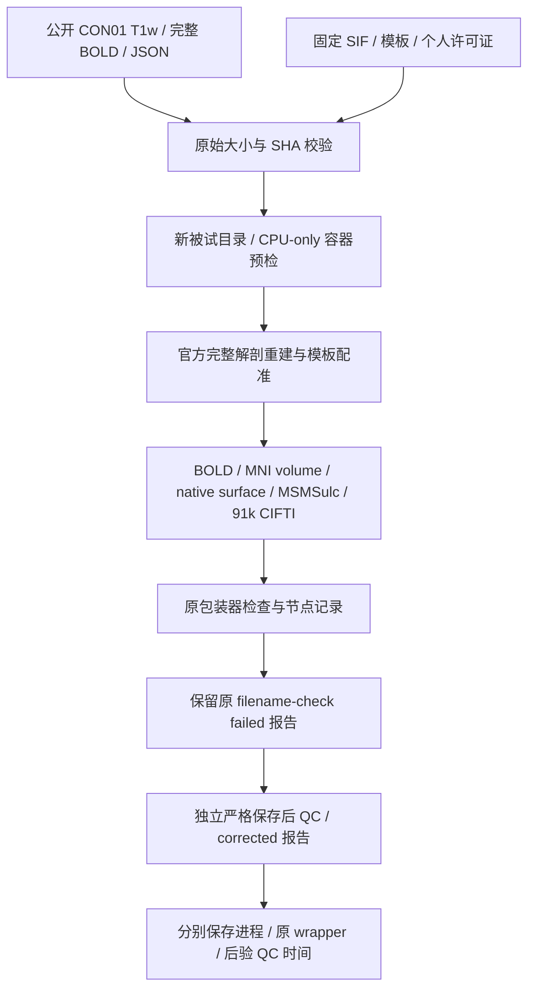

# CON01 同主机完整参考控制

## 功能简介与流程图

这项控制在正式 FNIT 候选所在的共享 H100 主机上，用 **CPU** 完整运行一次官方 fMRIPrep 25.2.4，帮助解释十例主对照中的主机差异。输入是同一公开 CON01 的原始 T1w 和完整 180 帧静息态 BOLD，TR 为 2.1 s；从新的 work、derivatives、home 和 FreeSurfer subject 启动，只复用容器及非被试模板。

正式十例 FNIT 在 gpucw1 运行，十例主参考在 CPU10 运行。本控制单列，不并入十例中位数或精度配对，也不替代任何主参考。它是独立原软件 benchmark，不是 FNIT 生产运行入口。



## Python 调用与逐项输入输出

实际运行使用[冻结 v2 驱动](frozen_harnesses/run_reference_cohort_v2.py)，没有额外的 FNIT Python API。Python 可以通过标准库启动同一 CLI；返回 `subprocess.CompletedProcess`，影像和报告写入指定根。下面路径是具名占位符，需替换为已核验的本地资源。调用会真正执行完整原软件流程，新 attempt 目录必须不存在。

```python
from pathlib import Path
import subprocess
import sys

validation_directory = Path("/absolute/path/FNIT/validation/fmri/public_ten_20261003")
new_same_host_reference_root = Path("/absolute/path/new_same_host_reference")  # 独立输出根
verified_public_raw_bids_directory = Path("/absolute/path/public_raw_bids")  # 含 public_manifest.json
verified_fmriprep_image = Path("/absolute/path/fmriprep_25_2_4.sif")  # 固定大小及 SHA
verified_template_cache = Path("/absolute/path/non_subject_template_cache")  # 不含被试重建
private_freesurfer_license = Path("/absolute/path/private_license.txt")  # 已有合法许可证，只读挂载
cpu_only_singularity_shim = validation_directory / "singularity_cpu.py"  # 必须已具备执行权限

reference_command = [
    sys.executable, str(validation_directory / "frozen_harnesses/run_reference_cohort_v2.py"),
    "--worker", "--subjects", "CON01", "--attempt", "1",  # 本机单例 worker
    "--root", str(new_same_host_reference_root),
    "--raw", str(verified_public_raw_bids_directory),
    "--image", str(verified_fmriprep_image),
    "--template-cache", str(verified_template_cache),
    "--license", str(private_freesurfer_license),
    "--singularity", str(cpu_only_singularity_shim),
]
reference_process = subprocess.run(reference_command, check=False)
# 旧 v2 的 wrapper 返回值包含末端文件名检查状态；还需读原报告及独立 recovery 报告。
print(reference_process.returncode)
```

驱动全部公开参数如下；本控制固定 `--worker --subjects CON01 --attempt 1`，不经过 SSH dispatcher。

| 参数 | 类型、默认值 | 输入或作用 |
| --- | --- | --- |
| `--root` | Path，必填 | 独立参考输出根。创建 `cases/sub-CON01/attempt-01`；已有 attempt 明确失败，不覆盖。 |
| `--raw` | Path，必填 | BIDS 根及 `public_manifest.json`。包含此例 T1w、BOLD、各自 JSON，逐文件验证大小和 SHA。BOLD 必须是完整 180 帧。 |
| `--image` | Path，必填 | 固定 fMRIPrep 25.2.4 SIF；SHA 不符即失败，版本探针还核对容器内 FreeSurfer 7.3.2。 |
| `--template-cache` | Path，必填 | 已核验的非被试 TemplateFlow 缓存；复制到新 attempt，不复用解剖结果。 |
| `--license` | Path，必填 | 已有合法、可读的个人 FreeSurfer 许可证，只读挂载；采集脚本只核对文件可读，不散列或发布内容。 |
| `--singularity` | Path，默认系统 Singularity 4.2.2 路径 | 本控制显式传入 [CPU shim](singularity_cpu.py)，底层程序为 `/public/software/apps/singularity/4.2.2/bin/singularity`。 |
| `--subjects` | 字符串列表，默认 CON01、CON03–CON11 | 公开队列选择；不允许重复。`--worker` 下只接受一个被试。 |
| `--worker` | bool，默认 false | true 在当前主机运行单例；false 启动 SSH dispatcher。 |
| `--node` | 字符串，默认 `nodecw10` | dispatcher 目标主机；本机 worker 不使用。 |
| `--control-socket` | Path，默认 `/tmp/common30-nodecw10-20260909.sock` | dispatcher 使用的已认证 SSH socket；本机 worker 不使用。 |
| `--concurrency` | int，默认 4 | dispatcher 并发数，实际限制为 1–4；不改变本机单例线程设置。 |
| `--attempt` | int，默认 1 | 输出 attempt 编号。复跑使用新的独立根或编号，不能替换已绑定的报告。 |

原始数据来自 ds001226 v5.0.1、CC0，固定来源和原始 SHA 见[数据清单](data_manifest.public.json)。模板来源和许可见[资源清单](assets_manifest.public.json)；个人许可证、私有绝对路径、影像和容器不随公开报告发布。

固定科学设置是 8 个调度进程、每进程 OpenMP 设置 4、`--mem-mb 49152`（48 GiB **调度内存预算**，没有容器总 RSS 硬限），关闭 slice timing，无 fieldmap，不请求 SyN SDC，不作 BOLD 去噪，默认完整 MSMSulc。请求输出 MNI152NLin6Asym 2 mm、T1w、fsnative 和 fsLR 91k CIFTI。[实际配置快照](reference_control_scope.public.json)还记录内部 MNI152NLin2009cAsym ANTs 配准；它属于真实整例工作范围。该快照保留采集时的 running 状态，最终完成以[完整报告](hardware_control_completed/CON01.public.json)为准。

| 输出 | 数据结构与检查 |
| --- | --- |
| `derivatives/sub-CON01/…space-MNI152NLin6Asym_res-2_desc-preproc_bold.nii.gz` | 完整 `91×109×91×180` NIfTI，2 mm；原 TR、全部保存值有限。 |
| `derivatives/sub-CON01/…space-T1w_desc-preproc_bold.nii.gz` | 本次实际 `50×60×45×180` NIfTI；原 TR、全部保存值有限。 |
| 左/右 fsnative BOLD GIFTI | 本次实际 `180×141733` / `180×147903`，每帧完整原生顶点域。 |
| 左/右保存 MSMSulc 球面 | 141733/147903 个顶点、283462/295802 个三角面；索引合法，与各侧 BOLD 顶点域一致。此检查不代替取向、跨层或自交 QC。 |
| `…den-91k_bold.dtseries.nii` | `180×91282`，Series 起点 0 s、步长 2.1 s、单位 SECOND；21 个 BrainModel，双侧皮层完整顶点域各 32492。 |
| 原 `report.public.json`、`files.private.json` | 原版本、命令摘要、输入/输出 SHA、计时及 QC 状态；精确私有路径保留在服务器。 |
| 独立 `report.corrected.public.json`、`files.corrected.private.json` | 绑定原报告、原文件和检查工具 SHA 的严格补检；不改原报告或 MRI。公开副本是 [CON01.public.json](hardware_control_completed/CON01.public.json)。 |
| `node_runtime.public.json` 与阶段汇总 | 原 607 条节点 runtime；匿名副本及汇总见[节点记录](hardware_control_completed/CON01.nodes.public.json)和[分步骤时间](hardware_control_stages.public.json)。 |

## 命令行调用

在候选所在主机执行下列本机 worker。所有变量都有具体含义，示例使用全新被试目录。

```bash
validation_directory="/absolute/path/FNIT/validation/fmri/public_ten_20261003"
new_same_host_reference_root="/absolute/path/new_same_host_reference"  # 全新输出根
verified_public_raw_bids_directory="/absolute/path/public_raw_bids"  # 已核验完整原始 BIDS
verified_fmriprep_image="/absolute/path/fmriprep_25_2_4.sif"  # 固定 SIF
verified_template_cache="/absolute/path/non_subject_template_cache"  # 仅非被试资源
private_freesurfer_license="/absolute/path/private_license.txt"  # 已有合法许可证
cpu_only_singularity_shim="$validation_directory/singularity_cpu.py"  # 已具备执行权限

python3 "$validation_directory/frozen_harnesses/run_reference_cohort_v2.py" \
  --worker --subjects CON01 --attempt 1 \
  --root "$new_same_host_reference_root" \
  --raw "$verified_public_raw_bids_directory" \
  --image "$verified_fmriprep_image" \
  --template-cache "$verified_template_cache" \
  --license "$private_freesurfer_license" \
  --singularity "$cpu_only_singularity_shim"
```

旧 v2 的 native GIFTI 文件名检查顺序有误，本次 MRI 正常退出后原 wrapper 记录 failed。独立恢复的完整调用、原失败与原通过两种分支见 [reference recovery](reference_recovery.md)；缺少产物或 MRI 非零退出不属于这个已知检查问题。

恢复后可用[只读保存校验器](validate_reference_saved.py)再次核对精确绑定的完整 GIFTI/CIFTI。其参数为 `--reference-root`（含 cases 的根，必填）、`--output-root`（独立检查目录，必填）、`--subjects`（默认公开十例）、`--report-name`（默认 `report.public.json`，这里显式选择 corrected）、`--watch`（默认 false）和 `--poll-seconds`（默认 60 s）。其额外检查时间单列，不加入原整例。

```bash
validation_directory="/absolute/path/FNIT/validation/fmri/public_ten_20261003"
completed_same_host_reference_root="/absolute/path/completed_same_host_reference"
new_saved_data_diagnostic_root="/absolute/path/new_saved_data_diagnostic"

python3 "$validation_directory/validate_reference_saved.py" \
  --reference-root "$completed_same_host_reference_root" \
  --output-root "$new_saved_data_diagnostic_root" \
  --subjects CON01 --report-name report.corrected.public.json \
  --watch --poll-seconds 60
```

## 原软件调用

实际容器内命令如下；外层驱动先准备新的 `/case`、只读 `/data`、模板、许可证挂载及环境。它调用官方 fMRIPrep 完整工作流，其中 FreeSurfer、ANTs、FSL 等由固定参考容器执行，属于本次明确授权的独立原软件对照。

```bash
fmriprep /data /case/derivatives participant \
  --participant-label CON01 --ignore slicetiming \
  --cifti-output 91k \
  --output-spaces MNI152NLin6Asym:res-2 T1w fsnative \
  --fs-license /opt/fs-license/license.txt \
  --fs-subjects-dir /case/derivatives/sourcedata/freesurfer \
  --nprocs 8 --omp-nthreads 4 --mem-mb 49152 \
  --work-dir /case/work --resource-monitor --stop-on-first-crash --notrack
```

[CPU shim](singularity_cpu.py) 在 `exec` 时加入 `--env CUDA_VISIBLE_DEVICES=`，没有 `--nv`。实际容器预检确认 CUDA 可见变量为空、`/dev/nvidia*` 为空；generic oracle Python 没有 Torch，因此没有伪记 Torch CUDA 状态。OpenMP、MKL、OpenBLAS 和 ITK 环境线程设置均为 4。8 个调度进程和每进程 OpenMP 设置不表示整棵进程树具有 4 CPU 硬上限。

固定 SIF 大小为 **2,413,375,488 B**、SHA `8e32238619053c1f9d1739b26f4afd72df809d914f5a5771707bf5da4b1d0f39`；实际版本为 fMRIPrep 25.2.4、FreeSurfer 7.3.2、sMRIPrep 0.19.2、Nipype 1.10.0、nibabel 5.3.2、Python 3.12.11。完整命令和程序来源绑定保留在原匿名报告。

## 最新真实精度、耗时与脑图

本次官方 MRI 完整退出 0；原末端 GIFTI 文件名检查 failed，独立严格补检 complete。完整 180 帧、原 TR、全部保存值有限、CIFTI 时间/脑模型域及输入/源码/保存文件前后 SHA 校验通过。这里的 passed 是保存合同检查结果；尚未将这次同主机输出与 FNIT 另做数值配对，不由有限值或退出状态宣布方法等价。

[完整匿名报告](hardware_control_completed/CON01.public.json) SHA 为 `02f9aedfbc4de225f4f026423839e04d68a76b9a1b99332e84a32d43330951f1`；[原检查失败报告](hardware_control_completed/CON01.original-qc-failed.public.json)保留原字节。

| 实测时间字段 | 秒 | 实际边界 |
| --- | ---: | --- |
| `container_process_wall_seconds` | 12859.636531 | 容器进程创建至 MRI 进程退出，完整输出保存包含在内。 |
| `continuous_wall_through_saved_QC_seconds` | 12924.445142 | 同一起点，继续到原 runtime 提取、文件名检查及原末端报告；本次边界为 filename-check failed。 |
| `recovered_QC_seconds` | 9.046063 | 后续独立严格恢复校验；`corrective_QC_seconds` 是同一时间的别名。 |
| `recovery_gap_since_original_end_seconds` | 21.440631 | 原 wrapper 结束到恢复完成的墙钟跨度，已包含恢复 QC，不能与上一行再相加。 |

输入散列、模板复制和版本探针在容器进程时钟外；后验检查不补入原连续 whole wall。本控制没有对应的 FNIT API 边界，不能把参考进程时间除以只含候选 API 的时间作为同范围提速。

[分步骤时间](hardware_control_stages.public.json)从 607 条原节点记录去除 116 条聚合重复后，得到 491 个执行区间。下表 union 是组内实际记录的活动区间并集，span 是首节点启动至末节点结束、包括依赖等待的跨度。不同组可能嵌套或重叠，不能相加替代整例，也不将大 span 当成纯计算。

| 实际节点组 | 活动区间并集 / s | 含依赖等待跨度 / s |
| --- | ---: | ---: |
| FreeSurfer 重建（含本工作流中间面准备） | 6507.144384 | 8519.784792 |
| 解剖模板配准（MNI6 与内部 2009c） | 2390.560372 | 11022.492273 |
| 头动 | 24.314245 | 46.430906 |
| MNI6 volume 重采样 | 59.698045 | 10970.176922 |
| native surface 采样 | 37.165678 | 2062.390775 |
| MSMSulc | 2063.838783 | 4004.697983 |
| fsLR metric 重采样 | 74.076142 | 99.527511 |
| CIFTI 创建 | 8.234013 | 8.234013 |

虽请求 `--resource-monitor`，FS recon-all、MSM、MCFLIRT 等核心外部节点的峰值样本未保存。170 个其他节点有实际资源记录；它们不能给出整棵参考进程树的峰值 RSS，缺失不填 0。2026-10-03 主机启动快照有 128 个逻辑 CPU、约 958 GiB 可用内存、166 GiB 临时盘空闲、近期 load 约 7.6，背景 GPU 使用率约 98–99%。launcher 于 07:41:49 UTC 启动、容器于 07:42:05 UTC 开始；性能用本机 elapsed 时钟，不从跨主机 UTC 或文件 mtime 相减。

同一原始 CON01 的现有真实脑图可见[完整 MNI 时间均值/差值图](paired_batches/v12_batch_007/figures/CON01_mni_mean_difference.png)和[皮层时间相关图](paired_batches/v12_batch_007/figures/CON01_cortical_temporal_r.png)，[图来源与 SHA](paired_batches/v12_batch_007/figures_provenance.public.json)绑定正式 source 1128bc52。**这些图比较 FNIT 与十例主参考中的 CPU10 CON01，未使用本次同主机控制输出。** 本控制当前只发布上述时钟和保存校验，不为它另造精度数字或脑图。

## 最近版本与 benchmark 记录

| 记录 | 实际变化与范围 |
| --- | --- |
| 2026-10-03 冻结 v2 同主机启动 | 与早期十例 v2 驱动逐字节相同；harness SHA `e62da8ff23168516ea3f35272363f6f6a5242e6ef337701596e811fedb5e16ad`，CPU shim SHA `b30bcee569ae7ec644b1b00e90c5bda877321ab63d513d9e4385a06d5a38d67b`。从全新 subject 完整运行。 |
| 原 MRI 与 wrapper 结束 | MRI exit 0、12859.637 s；旧 native GIFTI 文件名实体顺序检查失败，原报告和 12924.445 s 检查边界保持。 |
| 独立 recovery | 明确绑定同一个 attempt 的原文件和原报告；严格完整保存检查通过，额外 QC 9.046 s 单列。没有修改 MRI 或伪造连续成功墙钟。 |
| 节点阶段提取 | [冻结 v1 collector](frozen_harnesses/collect_reference_stages_v1.py)生成单例[阶段报告](hardware_control_stages.public.json)；原 schema 的 `partial_cohort` 表示不满正式十例，不表示本控制 MRI 未完成。 |
| 文档整理 | 补齐七部分、全部驱动参数和 corrected 校验选择；测量数字、冻结脚本和原报告字节不变。正式十例完整结果仍单独见[主验收页](README.md)。 |

## 参考文献与原代码库

- 实际参考驱动：[冻结 run_reference_cohort v2](frozen_harnesses/run_reference_cohort_v2.py)、[CPU-only Singularity shim](singularity_cpu.py)及[冻结脚本清单](frozen_harnesses/manifest.public.json)。
- 官方 [fMRIPrep 25.2.4](https://github.com/nipreps/fmriprep/tree/25.2.4)、[固定 BOLD 重采样实现](https://github.com/nipreps/fmriprep/blob/25.2.4/fmriprep/interfaces/resampling.py)和[完整应用工作流](https://github.com/nipreps/fmriprep/blob/25.2.4/fmriprep/workflows/bold/apply.py)。
- 本容器的 [FreeSurfer v7.3.2 源码](https://github.com/freesurfer/freesurfer/tree/v7.3.2)及 [sMRIPrep 0.19.2 表面处理源码](https://github.com/nipreps/smriprep/blob/0.19.2/src/smriprep/interfaces/surf.py)。
- Esteban et al. (2019), *fMRIPrep: a robust preprocessing pipeline for functional MRI*, Nature Methods. [DOI: 10.1038/s41592-018-0235-4](https://doi.org/10.1038/s41592-018-0235-4)。
- [OpenNeuro ds001226 v5.0.1](https://openneuro.org/datasets/ds001226/versions/5.0.1)，固定来源、CC0 与原始文件 SHA 见[数据清单](data_manifest.public.json)；资源许可见[资源清单](assets_manifest.public.json)。
- 本任务的[十例协议与主结果](README.md)、[独立恢复规则](reference_recovery.md)及[重建质量比较](reconstruction_comparison.md)。
