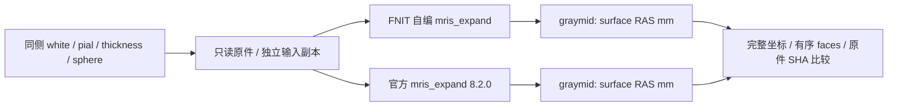

# 真实同输入 middle 表面比较（2026-10-03）

## 功能简介与结构

本步骤从真实重建的 white、pial、thickness 和 sphere 生成半厚度中层面 `graymid`，用于 fMRI surface 的皮层采样。实际调用是固定源码的 `mris_expand -thickness white 0.5 graymid`，通过 thickness 约束的 `MRISexpandSurface` 展开，不以 white/pial 顶点坐标平均替代。

本页比较一例已有完整 T1 重建的双侧相同输入：FNIT Conda 独立编译程序与官方 FreeSurfer 8.2.0 各执行一次。完整 recon-all 与 fMRI volume/surface 另记；该子功能不从原始 T1 重新重建。匿名 [middle_same_input.json](middle_same_input.json)保存 8 个输入文件、源码和二进制的 SHA，以及全部坐标/面序比较。



## Python 调用与逐项输入输出

这个固定原生步骤通过 `subprocess.run` 调用，返回 `CompletedProcess`，实际输出写入指定文件；没有另造一个 PyTorch 中层面算法。下面示例只执行 FNIT Conda 自编程序，先将两侧必要输入复制到新目录，不写原重建。调用者预先配置合法 `FS_LICENSE`；示例不读取许可证内容。

```python
from pathlib import Path
import os
import shutil
import subprocess
import nibabel as nib

fnit_mris_expand_program = Path("/absolute/path/fnit_conda/bin/mris_expand")
source_surface_directory = Path("/absolute/path/existing_subject/surf")  # 原件只读
new_copied_input_directory = Path("/absolute/path/new_middle_control/inputs")
new_middle_output_directory = Path("/absolute/path/new_middle_control/outputs")
new_copied_input_directory.mkdir(parents=True, exist_ok=False)
new_middle_output_directory.mkdir(parents=True, exist_ok=False)

for hemisphere_name in ("lh", "rh"):
    for surface_suffix in ("white", "pial", "thickness", "sphere"):
        surface_filename = f"{hemisphere_name}.{surface_suffix}"
        shutil.copyfile(
            source_surface_directory / surface_filename,
            new_copied_input_directory / surface_filename,
        )

native_command_environment = dict(os.environ)  # 继承已有合法 FS_LICENSE
native_command_environment["OMP_NUM_THREADS"] = "4"
for hemisphere_name in ("lh", "rh"):
    copied_white_surface = new_copied_input_directory / f"{hemisphere_name}.white"
    generated_graymid_surface = new_middle_output_directory / f"{hemisphere_name}.graymid"
    middle_surface_command = [
        str(fnit_mris_expand_program), "-thickness", str(copied_white_surface),
        "0.5", str(generated_graymid_surface),
    ]
    subprocess.run(middle_surface_command, env=native_command_environment, check=True)
    graymid_coordinates, graymid_faces = nib.freesurfer.read_geometry(generated_graymid_surface)
    print(hemisphere_name, graymid_coordinates.shape, graymid_faces.shape)
```

| 输入、选项或输出 | 格式、含义与实际设置 |
| --- | --- |
| 原生程序路径 | 必须是已安装的可执行文件。FNIT 使用 Conda 独立构建产物；独立官方对照使用明确选择的官方程序。程序路径不是影像输入。 |
| `-thickness` | 本步骤固定启用厚度约束；输出半厚度位置。 |
| `white` 位置参数 | FreeSurfer 三角网格，坐标 `N×3`、有序面 `M×3`，surface RAS，单位 mm。路径同时决定下面三个隐式 sibling 输入。 |
| 同目录 `lh/rh.pial` | 同侧真实 pial 表面；不能省略，也不以其他被试表面代替。 |
| 同目录 `lh/rh.thickness` | 同侧 FreeSurfer morph-data 标量厚度，逐顶点、单位 mm。 |
| 同目录 `lh/rh.sphere` | 同侧重建原生球面；不是 fsLR atlas sphere 或最终 MSM 球面。 |
| `0.5` 位置参数 | 本次固定半厚度系数；产品补面同样固定 0.5，没有暴露自由调节比例。 |
| 输出位置参数 | 新 `lh/rh.graymid`，FreeSurfer 三角网格；坐标仍为 surface RAS mm，保留原 white 完整面顺序。本例左/右为 105598/104619 个顶点、211192/209234 个面。 |
| `OMP_NUM_THREADS` | 本次环境为 4；原生过程独立计时。该设置不是进程树的 cgroup CPU 配额。 |
| `FS_LICENSE` | 调用者已有合法个人许可证路径。运行时按原程序要求使用，验证报告不保存许可内容或实际路径。 |
| 匿名比较 JSON | 完整坐标误差、顶点距离、面序、每侧时钟、输入/程序/输出 SHA 和原件不变守卫；仅发布数值，不发布此例网格。 |

生产接入复用 [surface reconstruction adapter](../../../src/fnit/fmri/surface_reconstruction.py)；当某侧已有 `midthickness` 或 `graymid` 时跳过补面。缺面 provided 目录/ZIP 先复制到独立持久目录，再执行相同命令，不改原输入。`recon_all_options["mris_expand_command"]` 可显式选程序，否则从 FNIT Conda `native_bin_dir` 定位；显式 freesurfer backend 还可从其官方程序目录定位。`threads` 是 fnit/freesurfer 重建选项，provided 不接受此字典选项，其补面使用 adapter 默认 4。全部 backend 参数、来源与失败行为见 [surface pipeline](../../../docs/fmri/surface.md#python-调用输入输出与参数)。后续使用原 `orig.mgz` 头和必要的 fsnative→T1w 变换将 surface RAS 转为源 T1w 世界坐标；中层面命令本身不作该转换。

## 命令行调用

FNIT 自编程序提供真实原生 CLI。这里 `copied_input_directory` 已包含上节 8 个相同输入，`new_middle_output_directory` 为新目录；原始输入复制和目录准备不计入本页原生时钟。

```bash
fnit_mris_expand_program="/absolute/path/fnit_conda/bin/mris_expand"
copied_input_directory="/absolute/path/new_middle_control/inputs"  # 含两侧 white/pial/thickness/sphere
new_middle_output_directory="/absolute/path/new_middle_control/outputs"
export OMP_NUM_THREADS=4  # 本次同输入控制的环境设置
# FS_LICENSE 已由调用者配置；不读取或输出许可证内容。

"$fnit_mris_expand_program" -thickness "$copied_input_directory/lh.white" \
  0.5 "$new_middle_output_directory/lh.graymid"
"$fnit_mris_expand_program" -thickness "$copied_input_directory/rh.white" \
  0.5 "$new_middle_output_directory/rh.graymid"
```

完整 `fnit-fmri surface` 的 `--mris-expand-command` 对应 `recon_all_options["mris_expand_command"]`，`--recon-all-native-bin-dir` 对应 `["native_bin_dir"]`，`--fs-license` 对应 `["fs_license"]`；fnit/freesurfer 的 `--recon-all-threads` 对应重建 `["threads"]`。这几个接入选项不改变固定半厚度算法，完整 CLI 示例见[产品调用](../../../docs/fmri/surface.md#命令行调用)。

## 原软件调用

独立参考使用官方 FreeSurfer 8.2.0 的实际 `mris_expand`。它读取与 FNIT 路线相同的输入副本，只写另一新输出目录。此处不是 FNIT 默认生产程序。

```bash
reference_mris_expand_program="/absolute/path/freesurfer_8_2/bin/mris_expand"
copied_input_directory="/absolute/path/new_middle_control/inputs"
new_reference_output_directory="/absolute/path/new_middle_control/reference_outputs"
export OMP_NUM_THREADS=4
# FS_LICENSE 已由调用者配置；reference_outputs 已创建且无同名输出。

"$reference_mris_expand_program" -thickness "$copied_input_directory/lh.white" \
  0.5 "$new_reference_output_directory/lh.graymid"
"$reference_mris_expand_program" -thickness "$copied_input_directory/rh.white" \
  0.5 "$new_reference_output_directory/rh.graymid"
```

FNIT 程序从固定 FreeSurfer 源码 `d932c45b7941662ea380a05efef580568b98d41a` 在 Conda C++ 环境独立编译，只读复用同一固定源码的既有 Conda 静态库构建缓存。原生源码 SHA 为 `55535a45ce94355781f919cedfb016ed5195830820239330bcbf8e9678ab16fc`，两个实际二进制 SHA 见 JSON。编译/链接墙钟 **3.148189 s** 单列；当次 `ldd` 未发现缺库或预装 FreeSurfer 动态库。安装方法见[项目 Conda 原生构建说明](../../../docs/recon_all/CONDA_CPP_BUILD.md)。

## 最新真实精度、耗时与脑图

[middle_same_input.json](middle_same_input.json) SHA 为 `90c75ffd794e155025c3867c52b4c9b6a3c81c7857c16d5326a6244568e328ee`。8 个源文件的大小和 SHA 在运行结束后再次核对，原件均保持不变。

| 半球 | 顶点 / 三角面 | 坐标绝对误差 max / mean，mm | 有序 faces | FNIT 自编墙钟，s | 官方参考墙钟，s |
| --- | ---: | ---: | --- | ---: | ---: |
| lh | 105598 / 211192 | 0.0 / 0.0 | 完全一致 | 669.847384 | 430.882120 |
| rh | 104619 / 209234 | 0.0 / 0.0 | 完全一致 | 583.344591 | 424.782752 |
| 双侧原生时钟合计 | — | 0.0 / 0.0 | 完全一致 | 1253.191975 | 855.664872 |

左右坐标数组逐值一致，完整面顺序一致，两种输出均保留原 white 面顺序；顶点距离 max、mean、RMS 都为 0 mm。输出文件整体 SHA 不同，不能把几何数组一致改写为文件逐字节一致。**本次 FNIT 自编程序耗时长于官方参考。**

每种程序、每个半球各运行一遍，实际顺序为 FNIT 左侧、官方左侧、FNIT 右侧、官方右侧，`OMP_NUM_THREADS=4`。各时钟包括进程启动、读取、计算和写出，不包括输入复制、编译或结果分析。JSON 的 `total_validation_wall_seconds=2108.992575` 是四个原生调用所在验证外层时钟；它不能称为完整重建或 fMRI 时间。报告没有提供 GPU 设备、张量 dtype 或峰显存测量，不据默认 pipeline 配置给这个独立原生步骤补填精度或 GPU 性能声明。

本匿名 case-A 不另发布网格脑图。已获准公开的实际中层面应用示例见[正式 CON01 皮层图](paired_batches/v12_batch_007/figures/CON01_cortical_temporal_r.png)和[图来源/SHA](paired_batches/v12_batch_007/figures_provenance.public.json)：展示几何来自正式 CON01 的自产 graymid→T1w RAS→fsLR32k，与本例 case-A 是不同输入，颜色是正式全帧时序比较，不能当成本例中层面误差图。双侧同输入几何精度以本页完整数值为准。

## 最近版本与 benchmark 记录

| 记录 | 实际变化与范围 |
| --- | --- |
| 2026-10-03 首次 Conda `mris_expand` 接入 | 加入固定源码构建/安装目标和程序 SHA 清单；真实双侧相同输入坐标与面序完全一致。编译/链接 3.148 s 排除在原生时钟之外。 |
| 首次 middle 同输入 benchmark | 本例仅从已有重建取同源 white/pial/thickness/sphere，双侧自编/官方 1253.192/855.665 s；没有完整重建精度或 raw→fMRI 整链声明。 |
| 后续 surface pipeline 使用 | 默认 FNIT、自选官方及 provided 三 backend 均按缺面条件接入同一厚度展开命令。完整调用/复用/独立时钟见[backend 实测](backend_demos.md)，不把其不同输入和整链时钟合并为本例结果。 |
| 本轮文档整理 | 补齐七节和具名 Python/CLI 示例；JSON、输入与程序 SHA、原测量数字不变，没有新增 MRI benchmark。 |

## 参考文献与原实现

- 固定 [mris_expand 原实现](https://github.com/freesurfer/freesurfer/blob/d932c45b7941662ea380a05efef580568b98d41a/mris_expand/mris_expand.cpp)与[原构建目标](https://github.com/freesurfer/freesurfer/blob/d932c45b7941662ea380a05efef580568b98d41a/mris_expand/CMakeLists.txt)。
- Fischl & Dale (2000), *Measuring the thickness of the human cerebral cortex from magnetic resonance images*. [DOI: 10.1073/pnas.200033797](https://doi.org/10.1073/pnas.200033797)。
- FNIT [Conda C++ 安装](../../../docs/recon_all/CONDA_CPP_BUILD.md)、[实际 adapter 源码](../../../src/fnit/fmri/surface_reconstruction.py)和[完整 surface pipeline](../../../docs/fmri/surface.md)。外置许可按已有合法文件使用，内容与私有路径不进入公开报告。
