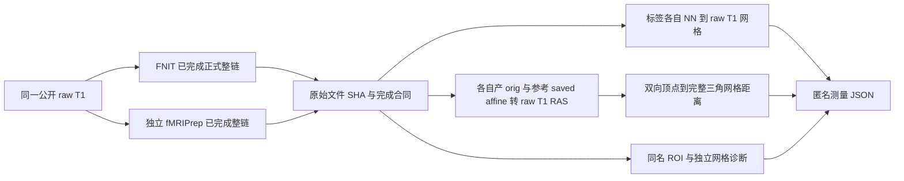
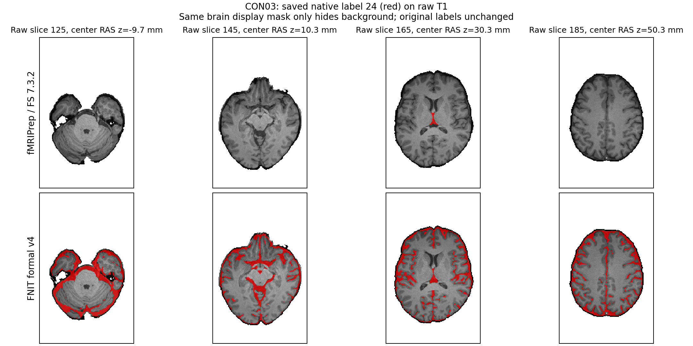

# 十例完整重建的独立比较

## 1. 功能简介与流程

[compare_reconstruction.py](compare_reconstruction.py) 只读本轮两个已完成的重建目录，比较标签、皮层网格、同名脑区统计、重建网格质量和最终 MSM 球面。[run_reconstruction_qc.py](run_reconstruction_qc.py) 是逐例 CPU 等待入口；当前 v7 等待器只接受 `candidate_v4` 的整例 `complete` 报告和冻结源码 `1128bc52c7a0233266e5b8a8d7dc0b382994e676`，对应 fresh 参考必须先完成独立保存后严格检查。每例只有 4 个 CPU 线程，不使用 GPU；额外诊断时间单列，不加入生产整链墙钟。



## 2. Python 调用、输入输出与参数

输入 `--reference`、`--candidate` 分别是本轮完成的 FreeSurfer/FNIT subject 目录，其中 `mri/orig.mgz` 给出各自物理坐标，`mri/aseg.mgz`、`aparc+aseg.mgz` 等给出离散标签，`surf/{lh,rh}.{white,pial,sphere,sphere.reg}` 给出原生网格，`stats/*.stats` 给出具名 ROI。`--reference-report`、`--candidate-report` 是各自完整运行报告；必须为 `complete`、源码运行前后未变、原始 T1 SHA 相同。`--raw-t1w` 是来源清单中的原始 T1 NIfTI；候选报告同目录的 `source.private.json` 逐文件绑定实际源码，导入前必须全部匹配；`--source` 是冻结 FNIT 源码根目录；`--helpers` 包含三个既有比较 helper 和实际保存变换的 `verify_provided_transform.py` 快照，逐文件 SHA 进入报告。`--lut` 可选，给出原有标签颜色表；未知标签仍按原整数 ID 保留。

`--case-id` 是公开被试编号，`--threads` 默认 4；`--quality-timeout` 默认 180 秒，以外层子进程超时分别限制每次 white/pial 穿越扫描和每个独立自交 worker（包含导入）；`--pair-budget` 默认 20,000,000。穿越复用原脚本 bbox 候选预算；自交复用可信原函数，用 `count_neighbors` 先计数其原始包围球候选对，再决定是否生成对列表，可能先于 bbox 过滤停止；这不是整个进程的内存硬上限。预算不足写 `incomplete`。`--output` 必须是新报告文件，输出每一项指标、输入/源码前后 SHA、软件版本、坐标矩阵、耗时和测量边界。诊断子报告写于相邻 `diagnostics` 目录。

等待入口的 `--root` 是含本轮 `raw`、`reference_fmriprep25_2_4_v1` 的独立队列根；`--candidate-root` 显式指向最终冻结的正式候选队列，`--source` 是其真实源码根，`--output-root` 是新后验目录，必须与 MRI 输入、两条生产输出及源码分开。`--helpers` 显式指向统一 workspace 中的冻结本入口、比较程序、三个既有 helper 及保存变换验证脚本；省略时兼容旧输出目录的 `code` 子目录。`--lut` 可选，只读合法现有颜色表；`--subjects` 默认本轮十例，`--poll-seconds` 默认 60。重启必须匹配原候选根、参考/raw 根、源码、helper、LUT 和等待器的指纹；先前失败或被中断的单例保留，不能用旧链补位。

`--reference-report-name` 默认旧归档的 `report.public.json`；本轮必须显式选择 `report.corrected.public.json`，对应精确 fresh attempt。`--self-intersection-worker` 接收原生 FreeSurfer 格式的单网格文件，`--cross-worker` 接收含 surf/label 的完成 subject 目录，`--hemisphere` 取 `lh`/`rh`；这三项由主比较程序启动质量子进程时传入，普通整例调用不填。

Python 调用同一只读脚本：

```python
import subprocess
import sys

# 按本次实际目录修改：输入均来自同一已完成 fresh case，输出必须新建。
helper_directory = "/benchmark/helpers"
comparison_script_file = helper_directory + "/compare_reconstruction.py"
reference_subject_directory = "/benchmark/reference/cases/sub-CON01/attempt-02/derivatives/sourcedata/freesurfer/sub-CON01_ses-preop"
candidate_subject_directory = "/benchmark/candidate_v4/CON01/reconstruction/subject"
reference_run_report_file = "/benchmark/reference/cases/sub-CON01/attempt-02/report.corrected.public.json"
candidate_run_report_file = "/benchmark/candidate_v4/CON01/report/report.public.json"
raw_t1w_file = "/benchmark/raw/sub-CON01/ses-preop/anat/sub-CON01_ses-preop_T1w.nii.gz"
frozen_fnit_source_directory = "/benchmark/source_1128bc52"
fixed_helper_snapshot_directory = helper_directory
new_reconstruction_report_file = "/benchmark/new_posthoc/CON01/report.public.json"
comparison_arguments = [
    "--case-id", "CON01", "--reference", reference_subject_directory,
    "--candidate", candidate_subject_directory,
    "--reference-report", reference_run_report_file,
    "--candidate-report", candidate_run_report_file,
    "--raw-t1w", raw_t1w_file, "--source", frozen_fnit_source_directory,
    "--helpers", fixed_helper_snapshot_directory,
    "--threads", "4", "--quality-timeout", "180", "--pair-budget", "20000000",
    "--output", new_reconstruction_report_file,
]
subprocess.run([sys.executable, comparison_script_file, *comparison_arguments], check=True)
```

额外 CON08 FS8.2 的 Python 入口仍调用独立比较脚本；late 分支四份文件必须来自同一次实际只读补检：

```python
import os
import subprocess
import sys

# 原 failed cold case 保留；新 late filemap 精确绑定其保存产物。
standalone_comparison_script = "/benchmark/helpers/compare_standalone_fs82_reconstruction.py"
formal_fnit_case_directory = "/benchmark/candidate_v4/CON08"
original_fs82_cold_case_directory = "/benchmark/standalone_FS82/CON08"
frozen_fnit_source_directory = "/benchmark/source_1128bc52"
fixed_metric_helper_directory = "/benchmark/metric_helpers"
existing_label_color_table = "/benchmark/inputs/FreeSurferColorLUT.txt"
new_independent_comparison_directory = "/benchmark/new_FS82_comparison/CON08"
late_validation_directory = "/benchmark/late_saved_outputs/CON08"
fixed_late_validation_script = "/benchmark/backend_helpers/validate_CON08_backend_saved_late.py"
standalone_comparison_arguments = [
    "--candidate-case", formal_fnit_case_directory,
    "--standalone-case", original_fs82_cold_case_directory,
    "--source", frozen_fnit_source_directory, "--helpers", fixed_metric_helper_directory,
    "--lut", existing_label_color_table, "--case-id", "CON08",
    "--output-root", new_independent_comparison_directory,
    "--threads", "4", "--quality-timeout", "180", "--pair-budget", "20000000",
    "--late-report", late_validation_directory + "/report.public.json",
    "--late-files", late_validation_directory + "/files.private.json",
    "--late-source-manifest", late_validation_directory + "/source.private.json",
    "--late-validator", fixed_late_validation_script, "--wait", "--poll-seconds", "60",
]
comparison_environment = dict(os.environ, CUDA_VISIBLE_DEVICES="", PYTHONDONTWRITEBYTECODE="1")
subprocess.run([sys.executable, standalone_comparison_script, *standalone_comparison_arguments],
               check=True, env=comparison_environment)
```

## 3. 命令行调用

将示例中的 `/benchmark` 改为本次实际目录。下列相对脚本名从本页所在 validation 目录或固定 helper snapshot 目录运行；生产源与额外输出分开保存。

```bash
reference_subject_dir="/benchmark/reference/cases/sub-CON01/attempt-02/derivatives/sourcedata/freesurfer/sub-CON01_ses-preop"
candidate_subject_dir="/benchmark/candidate_v4/CON01/reconstruction/subject"
raw_t1w_file="/benchmark/raw/sub-CON01/ses-preop/anat/sub-CON01_ses-preop_T1w.nii.gz"
reference_run_report="/benchmark/reference/cases/sub-CON01/attempt-02/report.corrected.public.json"
candidate_run_report="/benchmark/candidate_v4/CON01/report/report.public.json"
frozen_fnit_source_dir="/benchmark/source_1128bc52"
fixed_helper_snapshot_dir="/benchmark/helpers"
new_reconstruction_report="/benchmark/new_posthoc/CON01/report.public.json"
python compare_reconstruction.py \
  --case-id CON01 \
  --reference "$reference_subject_dir" --candidate "$candidate_subject_dir" \
  --reference-report "$reference_run_report" --candidate-report "$candidate_run_report" \
  --raw-t1w "$raw_t1w_file" --source "$frozen_fnit_source_dir" \
  --helpers "$fixed_helper_snapshot_dir" --threads 4 \
  --quality-timeout 180 --pair-budget 20000000 \
  --output "$new_reconstruction_report"
```

```bash
# 整队列入口接受本轮十例，当前参考必须选择 corrected 报告。
this_public_cohort_root="/benchmark"
final_formal_candidate_cohort_root="/benchmark/candidate_v4"
new_reconstruction_comparison_root="/benchmark/new_posthoc_cohort"
existing_licensed_label_color_table="/benchmark/inputs/FreeSurferColorLUT.txt"
python run_reconstruction_qc.py \
  --root "$this_public_cohort_root" \
  --candidate-root "$final_formal_candidate_cohort_root" \
  --source "$frozen_fnit_source_dir" \
  --output-root "$new_reconstruction_comparison_root" \
  --helpers "$fixed_helper_snapshot_dir" \
  --reference-report-name report.corrected.public.json \
  --lut "$existing_licensed_label_color_table" --poll-seconds 60
```


### 独立诊断与绘图入口

独立 FS8.2 比较的 `--candidate-case` 是正式同例根，内含完成的 `report/report.public.json`、`files.private.json`、`source.private.json`；`--standalone-case` 是这次新冷运行的根，内含原报告、数据/源码/native binding 和自产 adapter manifest。`--source` 必须是双方冻结的 `1128bc52`；`--helpers` 是原 v7 距离/ROI/质量 helper，核心 SHA 固定。`--output-root` 必须是此前不存在的新隔离目录，不能是任何输入、subject、raw、helper、LUT 所在目录或整个来源 BIDS 根的父/子目录；前置拒绝不会写这个目录。`--lut` 是已校验的标签颜色表，`--case-id` 必须对应双方实际公开编号。`--threads` 为 1–4，默认 4；`--quality-timeout`、`--pair-budget` 默认 180 s 和 20M，预算不足仍为 `partially_measured`。`--wait` 只以标准库等待原完成报告或下述明确的 late 分支，`--poll-seconds` 为 1–60，默认 60；等待不进入额外 QC 计时。输出新 `report.public.json`、私有精确文件绑定和分角色质量子报告，异常只写本次已创建的新目录并以非零退出。

v5 的四项可选参数必须同时提供：`--late-report` 是独立晚期保存产物检查的公开报告，`--late-files` 是其具名 typed Path 私有文件映射，`--late-source-manifest` 是其实际 460 文件源码 SHA 清单，`--late-validator` 是生成这份记录的固定 SHA 检查器。本轮只允许原 a194 冷 reporter 的明确 PosixPath 序列化错误；严格绑定原 failed 报告、完整错误尾行、raw/config/native/source 守卫、保存后的全 180 帧产物和新 filemap。原 API 两项时钟必须显式为 null，原 failed 外层时间保持原值。没有这四项时，原 failed 状态仍直接拒绝，不会改写旧报告。

```bash
# 每个目录都绑定到本轮同例实际产物；新目录不能已有任何输出。
formal_fnit_case_directory="/benchmark/candidate_v4/CON08"
standalone_fs82_case_directory="/benchmark/standalone_FS82/CON08"
frozen_fnit_source_directory="/benchmark/source_1128bc52"
fixed_metric_helper_directory="/benchmark/helpers"
existing_label_lut_file="/benchmark/inputs/FreeSurferColorLUT.txt"
new_fs82_comparison_directory="/benchmark/new_FS82_comparison/CON08"
late_saved_output_report="/benchmark/late_saved_outputs/CON08/report.public.json"
late_saved_output_private_files="/benchmark/late_saved_outputs/CON08/files.private.json"
late_saved_output_source_manifest="/benchmark/late_saved_outputs/CON08/source.private.json"
fixed_late_saved_output_validator="/benchmark/backend_helpers/validate_CON08_backend_saved_late.py"
CUDA_VISIBLE_DEVICES= PYTHONDONTWRITEBYTECODE=1 python compare_standalone_fs82_reconstruction.py \
  --candidate-case "$formal_fnit_case_directory" \
  --standalone-case "$standalone_fs82_case_directory" \
  --source "$frozen_fnit_source_directory" --helpers "$fixed_metric_helper_directory" \
  --lut "$existing_label_lut_file" --output-root "$new_fs82_comparison_directory" \
  --case-id CON08 --threads 4 --quality-timeout 180 --pair-budget 20000000 \
  --late-report "$late_saved_output_report" --late-files "$late_saved_output_private_files" \
  --late-source-manifest "$late_saved_output_source_manifest" \
  --late-validator "$fixed_late_saved_output_validator" \
  --wait --poll-seconds 60
```

Python 用 `subprocess.run([sys.executable, comparison_script_file, *comparison_arguments], check=True)` 调用同一 CLI，`comparison_arguments` 按上例逐项组成字符串列表，并在子进程环境设置 `CUDA_VISIBLE_DEVICES=""`。这一额外入口不运行原软件；其原始重建由报告绑定的实际 `recon-all -all -i raw_T1 -s subject -sd new_root -parallel -openmp 4` 生成，比较器验证该保存命令和程序 SHA，不重新运行它。[v5 真实元数据合同](standalone_FS82_reconstruction_contract_v5.public.json)的 20 项检查均通过，[新独立启动记录](standalone_FS82_reconstruction_launch_v5.public.json)绑定固定 source 87b16dbf；[实际终态报告](standalone_FS82_reconstruction/CON08.public.json)已经保存距离、标签、ROI 和质量扫描，原 self 预算不足仍为 `partially_measured`。

`audit_csf_label.py` 的 `--reference`/`--candidate` 为上述 exact 完整 subject，`--source` 为正式冻结 FNIT 根，`--case-id` 为公开编号，`--output` 是新 JSON 文件。逐步读取 `synthseg.rca/aseg.auto/presurf/aseg` 中原整数 id24 和原 `aseg.stats`，不重新运行部分容积算法；输出体素数、原 PV 表格值、相关源码及输入前后 SHA。对应原统计计算命令已保存在官方报告和本页的匿名 CSF 诊断中。

`render_csf_label_comparison.py` 的 `--report` 是上述已测量正式重建报告，`--binding` 是该 attempt 的 `files.private.json`，包含 exact raw T1 和 subject 路径，仅本地读取；`--output-root` 必须是新目录，保存 PNG 和匿名 `render.public.json`。两侧采用相同真实 T1 背景、slice 与显示 mask；原标签及统计不受显示 mask 影响。运行前限制 CPU 线程，代码不导入 Torch 或启动原 MRI 程序。

```bash
# 这些变量指本轮完成且已守卫的原件；新诊断目录不能复用旧结果。
python audit_csf_label.py \
  --reference "$fresh_reference_subject_dir" \
  --candidate "$complete_formal_fnit_subject_dir" \
  --source "$frozen_fnit_source_dir" --case-id CON03 \
  --output "$new_csf_diagnostic_json"

OMP_NUM_THREADS=1 MKL_NUM_THREADS=1 OPENBLAS_NUM_THREADS=1 \
  python render_csf_label_comparison.py \
  --report "$completed_reconstruction_comparison_report" \
  --binding "$this_comparison_private_binding" \
  --output-root "$new_pure_brain_render_directory"
```

`audit_csf_versions.py` 的 `--cohort-root` 是本轮 raw 和正式候选/参考共同根；`--fs82-cold-binding` 是已完成独立 FS8.2 adapter 的 exact 私有 `cold_complete.private.json`，包含 subject 和原 raw T1 绑定；`--fs82-report` 是该 adapter 的完整公开报告，须通过原 raw/source/helper 守卫；`--output-root` 必须是与这些原件互不包含的新目录。输出每条链 aseg24 硬计数、原 `.stats` PV、原生 shape/voxel volume、输入前后 SHA；不重新运行分割或统计程序。

```bash
CUDA_VISIBLE_DEVICES="" OMP_NUM_THREADS=1 MKL_NUM_THREADS=1 OPENBLAS_NUM_THREADS=1 \
  python audit_csf_versions.py --cohort-root "$this_public_cohort_root" \
  --fs82-cold-binding "$complete_FS82_adapter_private_binding" \
  --fs82-report "$complete_FS82_adapter_report" \
  --output-root "$new_isolated_csf_version_diagnostic_dir"
```

`read_saved_msm_absolute.py` 通过 `--posthoc-case` 读取已完成后验的 exact 私有绑定和两链报告，`--source` 指实际冻结 FNIT 源，`--output-root` 必须新建且与输入/源码互不包含。它核对两链左右四份最终 GIFTI 的原 SHA、顶点域和完整面序，再同场记录 float64 的绝对向外 triple product 与成熟 float32 有向面积的负面集合。输出匿名逐侧 JSON、前后输入/helper SHA 与 CPU1 独立时间，不恢复原 solver 或改变球面。

```bash
CUDA_VISIBLE_DEVICES="" OMP_NUM_THREADS=1 MKL_NUM_THREADS=1 OPENBLAS_NUM_THREADS=1 \
  python read_saved_msm_absolute.py \
  --posthoc-case "$this_completed_reconstruction_posthoc_dir" \
  --source "$frozen_fnit_source_dir" --output-root "$new_saved_sphere_readout_dir"
```

[read_saved_registration_qc.py](read_saved_registration_qc.py) 只摘录原生产已经保存的数值。`--case-root` 是已完成正式整链根，`--source` 是原 source manifest 绑定的实际冻结源码，`--output-root` 必须与输入和源码互不包含且此前不存在。输入为原 report、私有文件绑定、metadata 与实际 `msmsulc.py`；输出新匿名 JSON，保留原 literal 字段和所测阶段、全部前后 SHA 与独立读出时间。它不导入 MRI 算法、重算几何或调用原软件。

```bash
python read_saved_registration_qc.py --case-root "$complete_formal_fnit_case_root" \
  --source "$frozen_fnit_source_dir" --output-root "$new_saved_production_qc_readout_dir"
```

`audit_sphere_orientation.py` 的 `--cohort-root` 为本轮已完成候选、参考和 raw 的共同根；`--source` 为冻结 FNIT 源码，`--posthoc-case` 为上述单例已完成独立测量目录，`--case-id` 为公开编号，`--output-root` 必须是与输入和源码互不包含的新目录。它读取原始 FS 球面和最终 GIFTI 的完整面序、原保存 QC 和 SHA；只执行原 Workbench preparation 重新生成临时基线，输出匿名有向面积、逐面分子/分母、前后守卫及重建基线边界。对应 preparation 原命令为 `wb_command -surface-sphere-project-unproject`、`-surface-affine-regression`、`-surface-apply-affine` 和 `-surface-modify-sphere ... 100 ...`；不执行 MRI 重建或 MSM solver。

```bash
CUDA_VISIBLE_DEVICES="" OMP_NUM_THREADS=1 MKL_NUM_THREADS=1 OPENBLAS_NUM_THREADS=1 \
  python audit_sphere_orientation.py \
  --cohort-root "$this_public_cohort_root" --source "$frozen_fnit_source_dir" \
  --posthoc-case "$this_completed_reconstruction_posthoc_dir" --case-id CON07 \
  --output-root "$new_isolated_sphere_diagnostic_dir"
```

`run_self_intersection_supplement.py` 复用 exact 已完成报告的 frozen comparator worker，`--posthoc-case` 是该报告/私有绑定的目录，`--comparator` 是原 wrapper 字节，`--source` 是 actual candidate source，`--output-root` 是新目录。`--pair-budget` 默认 200M，`--timeout` 默认 600 s，`--waiter-pid` 只允许本轮自有 v7 后验等待父进程。该诊断必须在父进程没有 worker 时暂停其调度，逐网格串行 CPU4，完成或中断时恢复；任何其他进程被拒绝，不影响 MRI。完整结果和未完成预算各自保留。通用原生 self scan 的计算定义见上述表格，完整分块版本及独立真实 oracle 由 [完整补测](self_intersection_complete/CON03/cohort.public.json) 绑定实际另版源码。

Python 可用同一个脚本参数调用，而不另写 MRI 计算：

```python
import subprocess
import sys

# 精确完成报告和私有绑定由本轮 posthoc 等待器生成。
render_script_file = "/benchmark/helpers/render_csf_label_comparison.py"
completed_reconstruction_comparison_report = "/benchmark/new_posthoc/CON03/report.public.json"
this_comparison_private_binding = "/benchmark/new_posthoc/CON03/files.private.json"
new_pure_brain_render_directory = "/benchmark/new_CSF_render/CON03"
render_arguments = [
    "--report", completed_reconstruction_comparison_report,
    "--binding", this_comparison_private_binding,
    "--output-root", new_pure_brain_render_directory,
]
subprocess.run([sys.executable, render_script_file, *render_arguments], check=True)
```

## 4. 原软件调用

本程序没有单独对应的原 MRI 软件命令，它是两个独立结果的后验测量。官方结果由 [完整 fMRIPrep 命令](README.md#原软件调用) 生成；比较阶段不再次调用 FreeSurfer/fMRIPrep。历史 strict138 默认同顶点、同网格与精确值门槛不作为这轮跨版本等价结论。


原整链生成命令（容器内目录）与 actual SIF/版本/SHA 见[完整参考](reference_recovery.md#4-原软件调用)：

```bash
fmriprep /data /case/derivatives participant \
  --participant-label CON01 --ignore slicetiming --cifti-output 91k \
  --output-spaces MNI152NLin6Asym:res-2 T1w fsnative \
  --fs-license /opt/fs-license/license.txt \
  --fs-subjects-dir /case/derivatives/sourcedata/freesurfer \
  --nprocs 8 --omp-nthreads 4 --mem-mb 49152 \
  --work-dir /case/work --resource-monitor --stop-on-first-crash --notrack
```

## 5. 最新真实精度、时间与脑图

| 项目 | 实际测量方法与边界 |
|---|---|
| aseg/aparc/wmparc/ribbon Dice | 原参考体积先使用本例保存变换的正向 `F @ label.affine`；候选要求 fresh raw/orig001 的内容和网格身份守卫通过。然后两个离散体积各自通过 nibabel `resample_from_to(order=0, mode="constant", cval=0)` 到固定 raw T1 shape/affine；不再配准。标签域为两份原生标签的整数 ID 并集加 0，保留未知、单侧缺失及重采样后双方均空的标签。双方均空 Dice 为 null，不置 1。背景与非背景统计分列。`ribbon.mgz` 单独固定 0=背景、2/41=左右白质、3/42=左右皮层，未知 ID 保留；不套用于二值 mask。 |
| white/pial 距离 | 候选使用各自产 `orig.affine @ inv(orig.header.get_vox2ras_tkr())`，并核对 raw/orig001 身份。参考额外左乘本例官方保存 ITK 的正确正向 `F`，才能进入 raw T1 scanner RAS；复用 [完整三角形搜索](../../recon_all/python_gpu_port/compare_surface_chain.py)，双向评估全部原生顶点。KD 树只保守筛候选，最后是精确点到完整三角形距离；报告 mean/P99/max。这是顶点采样距离，不是连续 Hausdorff；不依赖同索引顶点对应。 |
| ROI 厚度、面积、体积 | 复用 [具名脑区统计](../../recon_all/python_gpu_port/compare_region_stats.py) 按 ROI 名称比较，列绝对/相对偏差、相关性及每个脑区。保留原始 `.stats` 的 GrayVol 计算开关记录；零参考相对误差为 null。厚度单位 mm、面积 mm²、体积 mm³。FS7.3.2 与 FNIT 算法不同，等价判定为 `not_assessed`。 |
| 闭合与非流形 | 复用 [原生拓扑检查](../../../src/fnit/recon_all/compare_subject.py)，各份 orig/white/pial/sphere/sphere.reg 分别记录连通分量、Euler、边界边、非流形边、重复与退化索引面；另查顶点 link。 |
| 球面翻折 | 复用 FNIT `face_area_normals(signed_sphere=True)`，分别列负面积、零面积及非有限面，不删阳性。 |
| 最终 MSM 球面 | 从当前参考 QC 和候选保存后的元数据精确绑定双侧最终 GIFTI，不搜索历史输出；必须保持各自产原生 `lh/rh.sphere` 的顶点和完整面序。两链用同一成熟 `fnit.msm.msmsulc._native_output_qc`，记录保存坐标的翻折数、原生基准退化面数、最小有向面积比与 helper/input 前后 SHA。这是注册后的球面诊断，与重建 sphere/sphere.reg 分列；原生基准与生产流程的临时 rotated sphere 基准不同，FNIT 原生产 QC 另列。保存文件不能恢复未保存的 solver 精度。 |
| 自交 | 独立 worker 只读调用 FNIT `mris_remove_intersection_python.mark_intersections`。与原函数一致，排除共享顶点的面片对；记录相交面数。超时/候选预算明确未完成，不能说明无自交。 |
| white/pial 穿越 | 复用 [扩展质量诊断](../../recon_all/python_gpu_port/benchmark_surface_quality_extended.py) 的完整包围球/bbox 查询与可信三角碰撞内核；真横穿、端点/边/共面诊断及皮层子集分列。并非全局包含证明。 |

### 坐标来源与十例测量

参考的 `from-fsnative_to-T1w_mode-image_xfm.txt` 由实际工作流保存。单个 ITK 的 LPS 仿射含 fixed center：`A[:3, 3] = translation + center - matrix @ center`；转换到 RAS 后它是 T1→FS 的 pull，取逆 `F` 才是 FS scanner RAS→raw T1 的点变换。每例读取自己的文件，核对相反方向 ITK、type-1 LTA、FS T1/orig affine、raw/preproc grid 和官方同顶点 white GIFTI，逐文件 SHA 前后守卫；不拟合新配准，不复用 CON01 的矩阵。原生 `.stats` 的面积/GrayVol/厚度保留原定义，不用这个小仿射重算统计值。

实际四例方向检查与保存 white GIFTI 的最大残差分别为 CON01 0.00000804、CON03 0.00000778、CON04 0.00000852、CON05 0.00002296 mm；[保存变换证明](provided_transform_provenance.public.json)记录实际版本、源码 SHA 和原文件 SHA。此前只有 `orig` header 的准备检查对应 native scanner RAS，不作为 full workflow raw T1 对齐结果。

十例正式后验现已完成标签、距离、ROI、拓扑与球面测量，两链输入和实际源码前后 SHA 均相同，比较过程中未初始化 CUDA。下面 Dice 是双方原整数标签并集中的非背景逐标签宏平均，包含单侧缺失的小标签；不能解释为整个脑体素一致率。完整逐标签和 ROI、每侧点到三角形距离、crossings/拓扑均保存在匿名报告。原自交预算不足的状态仍为 `partially_measured`，后续完整扫描另立证据。

| 正式 case | 额外重建比较 / s | aseg / aparc+aseg / wmparc 宏 Dice | ribbon 宏 Dice | 厚度 MAE 左/右 / mm | 网格 self scan 原预算 |
|---|---:|---|---:|---|---|
| [CON01](reconstruction_completed/CON01.public.json) | 474.628 | 0.70195 / 0.79822 / 0.83727 | 0.94958 | 0.10241 / 0.08109 | 未完成：原候选超过 20M |
| [CON03](reconstruction_completed/CON03.public.json) | 416.370 | 0.68946 / 0.79247 / 0.82849 | 0.94185 | 0.08276 / 0.10553 | 未完成：原候选超过 20M |
| [CON04](reconstruction_completed/CON04.public.json) | 394.264 | 0.71184 / 0.80997 / 0.84479 | 0.94682 | 0.10065 / 0.11526 | 未完成：原候选超过 20M |
| [CON05](reconstruction_completed/CON05.public.json) | 505.392 | 0.67180 / 0.79021 / 0.83162 | 0.94805 | 0.09709 / 0.09924 | 未完成：原候选超过 20M |
| [CON06](reconstruction_completed/CON06.public.json) | 411.949 | 0.65753 / 0.76229 / 0.79827 | 0.91287 | 0.12582 / 0.15324 | 未完成：原候选超过 20M |
| [CON07](reconstruction_completed/CON07.public.json) | 470.599 | 0.65970 / 0.77412 / 0.81402 | 0.94415 | 0.10715 / 0.09671 | 未完成：原候选超过 20M |
| [CON08](reconstruction_completed/CON08.public.json) | 398.171 | 0.68115 / 0.57990 / 0.61832 | 0.70252 | 0.28300 / 0.44894 | 未完成：原候选超过 20M |
| [CON09](reconstruction_completed/CON09.public.json) | 554.897 | 0.65578 / 0.77449 / 0.81672 | 0.93967 | 0.10424 / 0.11162 | 未完成：原候选超过 20M |
| [CON10](reconstruction_completed/CON10.public.json) | 462.412 | 0.67188 / 0.77896 / 0.81385 | 0.93390 | 0.13109 / 0.13206 | 未完成：原候选超过 20M |
| [CON11](reconstruction_completed/CON11.public.json) | 411.341 | 0.68368 / 0.80324 / 0.83668 | 0.94633 | 0.08435 / 0.08988 | 未完成：原候选超过 20M |

所有已测 orig/white/pial/sphere/sphere.reg 拓扑有效。CON01/03–06、CON08、CON11 的双侧重建球面及保存 MSM 未检出负取向；CON07、CON09、CON10 的实际阳性单列于下，不能据拓扑有效判断全部皮层质量通过。完整 white/pial 真横穿面片对，CON01 参考左/右为 20/437、FNIT 为 201/103；CON03 为 229/71 和 110/18；CON04 为 90/19 和 20/40；CON05 为 48/119 和 80/133；CON06 为 81/0 和 44/94；CON07 为 117/27 和 212/28；CON08 为 27/498 和 19/22；CON09 为 98/15 和 156/36；CON10 为 64/52 和 144/184；CON11 为 37/3 和 128/81。它们是原生完整 face 查询得到的对数，不是独立缺陷个数，保留皮层子集及横穿几何详情。十例原质量总状态为 `partially_measured`，自交预算未完成不填 0。

CON07 候选左侧 `sphere`、`sphere.reg` 和保存 MSM 球面绝对向外取向分别有 28、23、26 个负面积面；其余候选右侧与原参考两侧为 0。[独立取向诊断](reconstruction_completed/CON07.sphere-orientation-baseline.public.json)用 float64 重算同一已保存 float32 坐标，负面集合与成熟 float32 函数完全一致；native 负面积为 −0.000212709 至 −0.000000000484 mm²。最终 MSM 对自身原生基线有 2 个非正取向比，最小 −96.8782，但这两面都是原负面积转成正面积，并非新增绝对向内面。生产 QC 对临时 normalized rotated 基线记录保存后 1 个相对反向、最小 −0.80807，保存前 native 插值 QC 字段 `folded_solver_faces` 为 0、最小 0.68420；相对基线的翻转不能当绝对向内面数。新 CPU1 诊断只复用原 surface preparation，native/sulc/affine/reference 字节 SHA 与生产记录相同，重新生成基线的保存后 QC 精确复现 1/−0.80807；原临时 rotated 文件已未保留，新文件含新路径的 Workbench provenance，完整 SHA 不同，故不声称恢复原临时坐标或未保存 solver 精度。诊断额外 12.265 s，与十例生产墙钟分列。原 [CON07 完整字段](reconstruction_completed/CON07.public.json)保持不变，未再展开或修正球面。

CON08 的解剖边界差异更大：white 双向顶点到完整三角形距离 mean 左侧 1.037/0.943、右侧 1.406/1.223 mm；pial 为 0.680/0.709 与 0.845/0.834 mm。候选 canonical raw/orig001 逐值相同，参考保存 F 与官方同顶点 white GIFTI 的残差小于 0.000008 mm，未拟合额外配准。[四份最终 MSM 绝对取向](reconstruction_completed/CON08.saved-MSM-absolute.public.json)逐文件 SHA 守卫，两链左右均有限、零面积和负面为 0；[临时基线独立诊断](reconstruction_completed/CON08.sphere-orientation-baseline.public.json)再现候选左侧保存相对 QC 的最小比 0.7093996。这些检查只限定坐标与球面的实际状态，不能抵消上表 ribbon/厚度/网格距离差异，也不足以将不同算法的较低相关性判为实现 bug。该额外诊断不重跑 MRI，原后验质量预算状态保持。

为进一步区分版本和实现差异，CON08 的独立原 FreeSurfer 8.2 冷重建＋完整 CPU surface 已返回并保存产物，复用已完成的正式 volume。自有 reporter 在随后保存 dataclass 私有文件映射时因 PosixPath JSON 序列化报 TypeError，[原 failed 报告](backend_CON08_freesurfer82_cpu1128_original_reporter_failed.public.json)的外层墙钟 7952.463 s 保留；局部 API 秒数没有保存，不能补造。该运行不替代十例 FS7.3.2 参考。新的 [只读重建比较入口](compare_standalone_fs82_reconstruction.py) 已按 [保护目录、未完成不可进入测量及既有 CON01 scanner-frame 预检](standalone_FS82_reconstruction_contract_v4.public.json)核对，[等待记录](standalone_FS82_reconstruction_waiter_v4.public.json)对应的原 v4 门控在原 failed 后已[正常拒绝进入数值测量](standalone_FS82_reconstruction_waiter_v4_terminal.public.json)，没有创建分析 attempt。[独立 late QC](backend_CON08_freesurfer82_cpu1128_late_saved_outputs.public.json)随后用 7.458 s 核对了原失败原因、完整 180×91,282 保存产物、21 BrainModel、GIFTI/CIFTI 逐值对应、原 raw/source/native 与 typed metadata。新 v5 明确绑定这份检查记录，20 项真实 metadata 接受/拒绝合同通过；在新目录完成了[全部实际解剖测量](standalone_FS82_reconstruction/CON08.public.json)，[匿名摘要](standalone_FS82_reconstruction/CON08.summary.public.json)绑定原报告 SHA。独立单 T1 `recon-all -all -i raw_T1` 没有 fMRIPrep 的额外 ITK 变换；每份 `orig.affine @ inv(vox2ras_tkr)` 按自身原 scanner RAS 使用，原始命令、raw SHA 和 orig001 网格证明来源。本例 raw/orig001 数组 exact equal，canonical affine 最大差 0.00000763 mm；逐值 exact equality、tolerance allclose 和强度变化分列，不拟合新配准，不计入十例正式精度或 whole wall。

### CON08 额外同版本原流程对照

下表两列均比较同例 FNIT 正式重建，各自使用原报告定义的 scanner RAS 和 raw 网格；FS7.3.2 列仍是十例固定基线，FS8.2 列是上述额外冷运行的保存结果。没有对齐拟合或强度归一化。FS8.2 实际 build 为 `freesurfer-linux-centos7_x86_64-8.2.0-20260314-d932c45`。

| 解剖指标 | 正式 FS7.3.2 vs FNIT | 额外 FS8.2 vs FNIT |
|---|---:|---:|
| aseg 非背景宏 Dice | 0.68115 | 0.99878 |
| aparc+aseg 非背景宏 Dice | 0.57990 | 0.97005 |
| wmparc 非背景宏 Dice | 0.61832 | 0.96180 |
| ribbon 非背景宏 Dice | 0.70252 | 0.98764 |
| ROI 厚度 MAE 左/右 / mm | 0.28300 / 0.44894 | 0.01303 / 0.02612 |
| white 双向 mean 左 / mm | 1.03698 / 0.94255 | 0.04857 / 0.04812 |
| white 双向 mean 右 / mm | 1.40601 / 1.22308 | 0.04643 / 0.04693 |
| pial 双向 mean 左 / mm | 0.67982 / 0.70926 | 0.05106 / 0.05080 |
| pial 双向 mean 右 / mm | 0.84453 / 0.83447 | 0.04568 / 0.04596 |

额外解剖比较 CPU4 墙钟 352.732 s，输入/460 文件源码/helper 前后 SHA 全部相同，CUDA 未初始化。原 FS8.2 与 FNIT 拓扑均有效，双侧原生 sphere/sphere.reg 的负面积、零面积和非有限面均为 0；white/pial 真横穿对为 FS8.2 左/右 21/22、FNIT 19/22。八份 self scan 都在 20M 原始候选预算前停止，完整报告仍是 `partially_measured`，不能据此说明无自交。raw 网格重采样的 CSF24 计数为 395,111 与 395,110，原 stats PV 为 392,226.8 与 392,172.9 mm³；标签域与原统计定义未合并或更名。

本例原 FS8.2 解剖结果更接近 FNIT，表中仍有差异。[完整保存时序对照](backend_CON08_freesurfer82_cpu_vs_fnit_gpu_saved_timeseries.public.json)的 CIFTI NRMSE 为 0.04583386，定义时序相关均值为 0.93384851（623 个零方差 grayordinate 的相关未定义），双侧皮层相关均值为 0.88577649/0.91018594；19 个皮层下 BrainModel 因复用同份已完成 volume 而逐值、逐位相同。该时序比较另耗时 8.284 s。FS8.2 原重建和 surface 用 CPU，正式 FNIT 用 GPU，MSM 执行后端也不同；这项单例诊断不能单独归因版本或替换十例 FS7.3.2 结果。原 failed 外层、内部 `total_before_publication`、独立 late QC 和额外比较时钟分列，API/returned-total 仍为 null。


图使用本例正式 FNIT graymid，经已保存注册球面只做显示用的 fsLR32k 重采样；没有重新运行 MRI、注册或拟合。上排为 FS7.3.2 与 FNIT，下排为额外 FS8.2 CPU 与 FNIT；颜色表示保存时序 NRMSE 和相关，展示几何统一采用 FNIT graymid，不是 native 距离图。两排 NRMSE 色阶各用本排定义皮层值的第 99 百分位，超出顶端只饱和显示，完整数值/实际最大值保留；灰色为内侧壁或未定义值。[图像来源与 SHA](backend_figures/CON08_backend_saved_cortical_comparisons.public.json)绑定原数据、三个报告、完整 CIFTI 轴和显示几何，绘图及几何准备 61.757 s 单列。

CON09 官方右侧最终 MSM 保存球面实际有 1 个绝对负面，成熟 float32 与同坐标 float64 的负面集合完全相同；own-native 相对最小取向比 −0.089506，双方 native/sphere.reg 都为负/零/nonfinite 0，候选最终 MSM 双侧为 0。[四份保存球面检查](reconstruction_completed/CON09.saved-MSM-absolute.public.json)保留原软件的这一阳性、实际输入/helper SHA 与完整面序，不猜测未保存的官方 solver 精度或改写球面。

CON10 候选左侧 native `sphere` 和 `sphere.reg` 负面均为 0，最终保存 MSM 有 1 个绝对负面（face 27100），成熟有向面积 −0.1080211 mm²；相对自身 native 基线也为 1，最小比 −0.4259676。[原生产 QC 摘录](reconstruction_completed/CON10.production-MSM-qc.public.json)绑定 metadata SHA `d5ee03585c320feea102b95d5fcde1150e0e69f293bc59cd845f303c334f5c53`、正式 whole 报告与实际函数源码，normalized rotated 基线的 `folded_solver_faces`/`folded_output_faces` 各 1 个相对反向，最小比 −0.4486986/−0.4486895。原函数前者是在最后 `_sphere_warp` 插值到 native 后、保存 float32 前检查，并非 DATA/control 网格优化器末态；后者检查保存精度。因此不能将其产生仅归于保存 cast；未保存的插值坐标仍不能恢复绝对面集合。参考左侧 native/reg 分别为 14/19 个负面，最终保存 MSM 为 14 个、最小面积 −0.0000109110 mm²；其 own-native 相对反向数为 0，不表示绝对取向全部为正。两链右侧为 0。[四份实际球面检查](reconstruction_completed/CON10.saved-MSM-absolute.public.json)确认 float32/float64 负面集合相同、点全部有限、零面积为 0、完整面序与原文件/source SHA 不变。候选这一面与 CON07 的原负转正情况不同；本报告记录实际保存状态，尚未确定原因，不据它改写原生产成功合同或预判移植 bug。[CON11 同检查](reconstruction_completed/CON11.saved-MSM-absolute.public.json)四份球面全部有限且负/零面积均为 0。独立读出分别为 2.342/2.349 s，原 QC 摘录 0.035 s，不计入 MRI 墙钟。

CSF 统计存在明确上游分割差异。CON03 官方 aseg id24 为 988 个 1 mm³ 体素、部分容积 944.5 mm³；FNIT 为 274,411 个、部分容积 262,452.4 mm³。FNIT 最初 SynthSeg 保存输出已含 274,450 个 id24，mri_cc 后变 274,411，后续步骤保持同数；原 `.stats` 的 NVoxels 与实际图像计数一致。[只读诊断](reconstruction_completed/CON03.csf-diagnostic.public.json)绑定每步文件与成熟统计函数 SHA，表明差异不是表格解析造成。没有确立两算法相同的 CSF 解剖标签覆盖范围，不强行归一或删行。下图来自正式 CON03 原始 T1 和两份实际 aseg id24；每份标签先经上述保存物理变换独立 NN 采样，红色仅表示原整数标签 24，未合并脑脊液类别。原生计数和绘图网格计数分别保留，NN 边界采样可能产生少量体素数变化。原始网格含小角度 obliquity，图题的 RAS z 指选中 raw 轴位体素平面的中心位置。v3 使用两份 resampled aseg 非背景域的并集再 2 次 face-connected voxel dilation，给两排同一个纯显示 mask；域外 T1 背景置白，仅裁背景，不改标签数组或原计数，mask 定义及二值数组 SHA 入绘图清单。v1/v2 原图仍在原运行目录保留，公开目录仅发布纯脑 v3 PNG。



[绘图输入、坐标与 SHA](reconstruction_figures/CON03.csf_label24.public.json)记录 raw、参考/FNIT aseg 与完整原报告守卫，额外 CPU 绘图 2.818 s，不加入 MRI whole wall。

CON01 同名 CSF 部分容积也为官方 810.3 与 FNIT 325,714.2 mm³，CON04 为 1,035.0 与 324,844.6 mm³，CON05 为 881.5 与 325,792.6 mm³，CON06 为 1,268.3 与 435,180.3 mm³，CON07 为 720.9 与 309,952.5 mm³，CON08 为 1,206.1 与 392,172.9 mm³，CON09 为 1,989.3 与 380,623.0 mm³，CON10 为 1,370.1 与 369,005.7 mm³，CON11 为 851.4 与 362,262.5 mm³；完整报告保留这项偏差，跨算法等价仍为 `not_assessed`。

同一 raw CON01 又做了[独立三版本只读检查](reconstruction_completed/CON01.csf-version-diagnostic.public.json)：已完成 standalone FS8.2 的 aseg24 硬计数为 337,193、原 PV 为 325,658.8 mm³；FNIT 为 337,192 / 325,714.2；本轮 full fMRIPrep FS7.3.2 为 776 / 810.3。各自原 `.stats` 的 NVoxels 都等于实际原生标签计数，网格均 256³、1 mm³。FS8.2 与 FNIT 此项仅差 1 voxel、55.4 mm³ PV，说明本例巨大域差异与原 FS7→8 算法变化相符；这不是全十例跨版本等价证明，也不替换本轮固定 FS7.3.2 参考。CPU1 额外只读时间 1.014 s，没有重新计算 PV。

CON04 的成熟统计子函数另有一个单体素边界警告：实际 aseg id77 只有 1 个体素，`_statistics` 在最终标准差分支之前计算 `variance / (count - 1)`。最终保存的该行 `normStdDev=0`，其均值/范围均为有限值；[只读边界诊断](reconstruction_completed/CON04.single-voxel-stat-warning.public.json)绑定原统计表和 source SHA。本轮冻结源码不改写。四例 worker 日志也含球面 quadratic fit 的溢出/invalid 候选警告；已测四例 native/sphere.reg 和最终 MSM 有限、有向面积指标如实记录，不以日志警告代替保存输出检查。

随后对实际 CON04 完整 aseg/wmparc writer 做[独立旧/新源码回归](reconstruction_completed/CON04.single-voxel-full-writer-regression.public.json)：新文件仅将方差计算移入 `count > 1` 分支。四次均完整计算原部分容积；两张旧/新表与正式原保存表逐字节相同，旧 aseg 的一条边界警告在新模块消失。460 个冻结源码文件、277 个 subject 文件、raw 与 LUT 前后 SHA 均相同。CPU1 诊断总时间 55.753 s，与原 ten-case MRI 时钟分列；这是 FNIT 同输入修改回归，没有新增官方统计 benchmark。[原参考实际两条命令](reconstruction_completed/CON04.original-segstats-commands.public.json)来自本例 FS7.3.2 日志。

2026-10-03 随后以相同冻结 comparator/predicate 为 CON03 追加新独立 self scan，候选预算 200M、每网格硬超时 600 s，额外活动墙钟 172.138 s。8 份 white/pial 网格中 7 份完整扫描且未检出自交，官方右侧 pial 仍在生成对列表前超过候选预算；原 20M/180 s 报告保持原样。补测只扩大扫描范围，未改变几何或等价门槛；[后续完整分块复核](self_intersection_complete/CON03/cohort.public.json)另立 attempt，不覆盖本记录。同一冻结成熟三角形 predicate 用保守 radius-bin 分块枚举全部候选，7 份已完成成熟 baseline 的 face/vertex 标记精确相同；8/8 网格现已完整扫描且未检出自交，最初预算不足的官方右 pial 也完成。独立批次进程墙钟 227.404 s，source/mesh/ordered-face/SHA 守卫保持。完整自交结果不抹去原 crossings 的阳性对数，不将原 v7 状态改成功。

## 6. 最近版本与 benchmark 记录

- v2 诊断和 v3 无缓存正式尝试不进入本轮 v4 的十例统计；旧后验等待器按 source/root 换版，在比较前停止并保留记录。生产成熟子函数错误与修复在 pipeline 更新记录单列。
- v6 引入保存后的最终 MSM 球面，同一成熟 `_native_output_qc` 用于两链；真实诊断输入只作准备检查，未进入正式配对统计。
- v7 固定实际 source1128/candidate_v4，逐例采用已核验的保存 ITK 正向变换；只在两条整例报告 complete 后运行。十例真实变换和正式指标如上；原 20M 自交预算状态保留，CON07/09/10 实际取向阳性另列。
- 独立 FS8.2 v4 等待器严格拒绝了原 CON08 reporter-only failed，没有开始几何比较。v5 新增四项显式 late 绑定，只接受固定序列化失败和独立保存产物检查；新真实 metadata 合同 20 项通过。随后实际几何比较完成，额外 352.732 s，原源、failed 报告和空 API 时钟均保留，计算仍使用原 b5a 距离/标签/ROI 内核，20M 自交预算仍未完成。
- 20M/180 s 自交上限和 200M/600 s 补测失败均保留。独立诊断、等待或补检耗时不加入生产 MRI 的连续墙钟，也不以新补测回写旧状态。

## 7. 参考文献与固定原代码

原方法来源：[FreeSurfer recon-all](https://surfer.nmr.mgh.harvard.edu/fswiki/recon-all)、[本轮 FreeSurfer 7.3.2 源码](https://github.com/freesurfer/freesurfer/tree/v7.3.2)、[独立 FS8.2 原源码](https://github.com/freesurfer/freesurfer/tree/v8.2.0)、[fMRIPrep 25.2.4](https://github.com/nipreps/fmriprep/tree/25.2.4)、[皮层重建论文](https://doi.org/10.1006/nimg.1998.0395)、[Desikan 分区论文](https://doi.org/10.1016/j.neuroimage.2006.01.021)。
