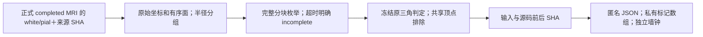

# 公开十例的完整网格自交补充检查

## 功能简介

[scan_surface_self_intersections.py](scan_surface_self_intersections.py) 读取正式流程保存的原始 white/pial 三角网格，在 CPU 上完整枚举候选，并调用冻结 FNIT `mris_remove_intersection_python._triangles_intersect` 的原判定。检测沿用其共享顶点排除、浮点精度和容差。输入表面保持只读，新增结果和标记数组放到独立目录；检查耗时单列。

原独立检查的统一最大三角片半径可能产生过大的全局候选表。补充工具按半径的二进制数量级分组，每组对以 `r_i + max(r_group) + 1e-5` 查询，再分块应用原有个别半径、包围盒与共享顶点过滤。相交三角片的包围球必须相交，因此此查询保留原判定需要的候选。调用判定前恢复全局面片编号的升序，保留原参数次序。



## Python 调用与逐项输入输出

从仓库根目录加载验证工具：

```python
import sys
from pathlib import Path

validation_directory = Path("validation/fmri/public_ten_20261003").resolve()
sys.path.insert(0, str(validation_directory))
from scan_surface_self_intersections import run

surface_manifest_path = Path("/data/fnit/public_ten/CON03_reference_rh_pial.private.json")
new_quality_directory = Path("/data/fnit/public_ten/new_rh_pial_quality")
quality_report = run(
    manifest_path=surface_manifest_path,       # 私有具名输入，绑定 mesh/报告/判定源码 SHA
    output_root=new_quality_directory,        # 必须是新目录，独立于全部受保护输入
    threads=4,                               # SciPy 空间查询与 BLAS 的线程设置
    block_faces=256,                          # 每次查询的面片数；必要时自动分成更小块
    maximum_pairs_per_block=2_000_000,        # 分块大小控制；不会丢弃剩余候选
    timeout_seconds=900,                     # 扫描时间预算；超时保存 incomplete
)
```

| manifest 字段 | 格式与含义 |
|---|---|
| `cohort_id`、`case_id` | 本轮固定 `formal-v4` 与十例之一 CON01、CON03–11。 |
| `candidate_source_revision` | 候选实际冻结 revision，本轮 `1128bc52c7a0233266e5b8a8d7dc0b382994e676`。 |
| `role`、`hemisphere`、`surface_kind` | `reference/candidate`、`lh/rh`、`white/pial`，用于具名绑定与公开报告。 |
| `source_root`、`predicate_module_sha256` | 冻结 FNIT 根和 `src/fnit/recon_all/mris_remove_intersection_python.py` 的实际 SHA；本轮为 `e74908d742e4670560d236a77980ee3d5b23068e6f5ec20fa6c6b96c5f66851c`。 |
| `surface` | `{path, sha256}`；FreeSurfer 三角表面格式，surface-RAS 毫米坐标，保持原顶点和有序面。 |
| `run_report` | `{path, sha256}`；同一公开病例的 completed pipeline 报告，源码守卫必须通过；candidate revision 另严格核对。 |
| `protected_roots` | 冻结源码、原始数据和两边运行目录。检查输出不得进入它们，也不得覆盖其上层目录。 |
| `baseline` | 可选 `{path, sha256}`，指向已完成的成熟扫描补测总报告。必须绑定同病例、同 mesh bytes、有序面、顶点/面数、判定源码及前后输入守卫；未完成的 baseline 无法用于一致性判定。 |

依赖是项目环境已有的 NumPy、SciPy 与 nibabel；计算使用 CPU float64。工具按需直接加载被绑定的冻结判定文件，不初始化 CUDA，也不调用 MRI 软件。

| 输出 | 内容 |
|---|---|
| `report.public.json` | `measured/incomplete_time_budget/failed`，相交面和标记顶点数、完整候选计数、SHA、软件版本、原始来源前后守卫与独立耗时。 |
| `marks.private.npz` | 完整扫描的 Boolean 顶点与面片标记；保留私有。 |
| `error.private.txt` | 失败原因留在运行目录；公开报告仅保存错误类型及文本 SHA。 |

`maximum_pairs_per_block` 控制单块候选规模。若一个面片本身就超过该设置，仍查询该组的完整面片集合；报告记录实际最大块。完整遍历没有全局候选预算截断。时间预算在各查询块及判定间检查，正在执行的单次 SciPy 查询完成后才能响应；未完成扫描不发布零相交结论。

[run_complete_self_scan_cohort.py](run_complete_self_scan_cohort.py) 为同一十例逐一等待已保存的重建比较，再串行调用上述工具。它读取具名目录，不启动或改动 MRI 流程；执行前只读检查原重建比较 worker，存在该 worker 时继续等待。每个扫描 worker 设置四线程；其他服务器任务仍可能同时运行，因此这不是整台服务器的总线程上限。

| cohort 配置字段 | 输入与含义 |
|---|---|
| `cohort_id`、`cases`、`candidate_source_revision` | 固定 `formal-v4`、有序十例 `CON01, CON03, …, CON11` 与本轮生产源码 revision。 |
| `scanner`、`scanner_sha256` | 冻结独立扫描脚本的路径及实际 SHA；本轮 `6ad501c3da35044b3c9392a6fd7c509a7b76754dd89fc72c50dd7e509dec5398`。 |
| `source_root`、`predicate_module_sha256` | 冻结 FNIT 判定根目录与 SHA，沿用单网格工具的绑定。 |
| `posthoc_root` | 每例已保存的 `report.public.json`、`files.private.json` 及原 worker 的进程绑定；源码与输入守卫必须通过。 |
| `protected_roots` | 源码、原 MRI 和历史比较目录；新的 cohort 输出与它们互不包含。 |
| `reuse` | 可选 `{case: {"role/hemi.kind": {path, sha256}}}`；只复用同病例、角色、半球、表面、原网格和完整 MRI 报告、扫描及判定源码均严格相同的已完成扫描。 |

每例新增八份 worker 报告及一份 `cohort.public.json`。总报告逐例记录真实相交面数与来源，分别保存新 worker 的完整子进程墙钟之和、等待时间和包括等待的总墙钟。复用记录的 `new_worker_process_seconds` 为 null，原测量时间仍保留；两者不会累计成一次新扫描时间。一例失败保留原因并继续其他病例，总状态不会写成全部完成。

## 命令行调用

```bash
surface_manifest_path=/data/fnit/public_ten/CON03_reference_rh_pial.private.json
new_quality_directory=/data/fnit/public_ten/new_rh_pial_quality
python scan_surface_self_intersections.py \
  --manifest "$surface_manifest_path" \
  --output-root "$new_quality_directory" \
  --threads 4 --block-faces 256 \
  --maximum-pairs-per-block 2000000 --timeout-seconds 900
```

十例等待器的完整调用如下。`--poll-seconds` 默认为 60 秒，`--output-root` 必须不存在；每个 worker 的完整扫描预算为 900 秒，外层子进程预算为 960 秒。

```bash
cohort_configuration_path=/data/fnit/public_ten/self_scan_cohort.private.json
new_cohort_quality_directory=/data/fnit/public_ten/new_complete_self_scan
python run_complete_self_scan_cohort.py \
  --config "$cohort_configuration_path" \
  --output-root "$new_cohort_quality_directory" \
  --poll-seconds 60
```

Python 启动示例保留相同边界：

```python
import subprocess
import sys
from pathlib import Path

validation_directory = Path("validation/fmri/public_ten_20261003").resolve()
cohort_configuration_path = Path("/data/fnit/public_ten/self_scan_cohort.private.json")
new_cohort_quality_directory = Path("/data/fnit/public_ten/new_complete_self_scan")
subprocess.run(
    [sys.executable, str(validation_directory / "run_complete_self_scan_cohort.py"),
     "--config", str(cohort_configuration_path),
     "--output-root", str(new_cohort_quality_directory),
     "--poll-seconds", "60"],
    check=True,  # 等待真实十例；输出不进入任何原始或历史运行目录
)
```

## 原软件调用

原软件的 `mris_remove_intersection input_surface output_surface` 执行检测和迭代修复。其独立环境示例：

```bash
original_white_surface=/data/reference/subject/surf/lh.white
new_repaired_white_surface=/data/reference/diagnostic/lh.white.repaired
mris_remove_intersection "$original_white_surface" "$new_repaired_white_surface"
```

本工具复用 FNIT 成熟函数的只读检测判定。官方修复程序的耗时和修改结果需另行测量，不计入本补充检查。

## 最新真实精度、耗时与脑图

正式 CON03 的两个原始流程均已完成。原自交检查的 20,000,000 候选预算不足；随后同一冻结原检测在 200,000,000 候选预算和每网格 600 秒外层预算下，7/8 网格完整扫描均为零相交面，参考 RH pial 仍因候选数量超预算而未完成。原报告与计时保持原样。

分块补测已对 CON03 两条流程的双侧 white/pial 共八份真实完整网格全部完成。八份均为零相交面和零标记顶点，原网格、有序面、判定文件、运行报告与检查源码的前后 SHA 均相同。七份完整成熟基线的计数完全相同；零计数进一步证明两边 Boolean 标记逐位全为 false。原参考 RH pial 的完整补充扫描也未检出相交。

| 完整原网格 | 相交面/标记顶点 | 补充 worker 内 QC 墙钟（秒） | 公开报告 |
|---|---:|---:|---|
| 官方 LH white | 0 / 0 | 15.143 | [来源与扫描](self_intersection_complete/CON03/reference-lh.white.public.json) |
| 官方 LH pial | 0 / 0 | 42.898 | [来源与扫描](self_intersection_complete/CON03/reference-lh.pial.public.json) |
| 官方 RH white | 0 / 0 | 14.989 | [来源与扫描](self_intersection_complete/CON03/reference-rh.white.public.json) |
| 官方 RH pial | 0 / 0 | 41.602 | [来源与扫描](self_intersection_complete/CON03/reference-rh.pial.public.json) |
| FNIT LH white | 0 / 0 | 15.502 | [来源与扫描](self_intersection_complete/CON03/candidate-lh.white.public.json) |
| FNIT LH pial | 0 / 0 | 42.461 | [来源与扫描](self_intersection_complete/CON03/candidate-lh.pial.public.json) |
| FNIT RH white | 0 / 0 | 14.861 | [来源与扫描](self_intersection_complete/CON03/candidate-rh.white.public.json) |
| FNIT RH pial | 0 / 0 | 38.956 | [来源与扫描](self_intersection_complete/CON03/candidate-rh.pial.public.json) |

八个子进程依次执行的整体墙钟为 **227.404 秒**，包括子进程启动、校验、读取、完整检测、私有标记写入和最终守卫，[整体记录](self_intersection_complete/CON03/cohort.public.json)。表中 worker 内计时开始于预检与初始报告完成后，包含导入、读取、扫描、标记写出和末尾守卫，最后报告保存单列在此边界之外。参考 RH pial 产生 5,321,232 个分组候选，后续 436,165 对进入原三角判定，实际最大查询块为 8,989 个候选。

十例等待器已完成 CON01、CON03–11 每例的八份真实网格，共 **80/80** 份完整 white/pial；全部相交面/标记顶点为 0，来源守卫通过。CON03 复用原八份完整扫描，逐份核对来源，不追加新的 MRI 或扫描时间。[最终十例总报告](self_intersection_complete/cohort.public.json)绑定实际源码、配置、每例报告和扫描输入；原 posthoc 的预算未完成状态仍保留。

| 病例 | 八个完整子进程墙钟之和（秒） | 完整网格数 | 相交面/标记顶点 | 原始公开记录 |
|---|---:|---:|---:|---|
| CON01 | 263.667 | 8/8 | 0 / 0 | [逐网格来源与计时](self_intersection_complete/CON01/cohort.public.json) |
| CON03 | 227.404，首次整体测量；本次复用 | 8/8 | 0 / 0 | [首次来源与计时](self_intersection_complete/CON03/cohort.public.json) |
| CON04 | 184.584 | 8/8 | 0 / 0 | [逐网格来源与计时](self_intersection_complete/CON04/cohort.public.json) |
| CON05 | 246.806 | 8/8 | 0 / 0 | [逐网格来源与计时](self_intersection_complete/CON05/cohort.public.json) |
| CON06 | 185.588 | 8/8 | 0 / 0 | [逐网格来源与计时](self_intersection_complete/CON06/cohort.public.json) |
| CON07 | 224.933 | 8/8 | 0 / 0 | [逐网格来源与计时](self_intersection_complete/CON07/cohort.public.json) |
| CON08 | 196.237 | 8/8 | 0 / 0 | [逐网格来源与计时](self_intersection_complete/CON08/cohort.public.json) |
| CON09 | 248.049 | 8/8 | 0 / 0 | [逐网格来源与计时](self_intersection_complete/CON09/cohort.public.json) |
| CON10 | 223.667 | 8/8 | 0 / 0 | [逐网格来源与计时](self_intersection_complete/CON10/cohort.public.json) |
| CON11 | 191.741 | 8/8 | 0 / 0 | [逐网格来源与计时](self_intersection_complete/CON11/cohort.public.json) |

CON01 含病例绑定检查的经过时间为 263.766 秒。CON03 首次整体计时含其启动与末尾守卫，其他九例采用等待器记录的八个完整 worker 子进程之和；字段边界分别保留，均不包含原 MRI 时间。九例新 worker 子进程的墙钟之和为 1965.273 秒；等待已保存 MRI/重建比较为 15720.018 秒，包括等待的总经过时间为 17687.664 秒。后三个数各自保留原边界，不相互替代，也不加入生产流程墙钟。

这些时间与旧 200M 诊断分别对应自己的枚举范围和时钟，不形成速度比；补测不加入 raw→volume→recon→surface 的生产墙钟。脑图见[最终真实十例 volume/皮层图](paired_batches/v12_batch_007/figures_provenance.public.json)；本自交检查输出网格质量数值，不改变这些影像或几何。White/pial 两层之间的横穿仍按[原始重建比较](reconstruction_comparison.md)单独报告。球面取向也使用独立判据；CON07 候选球面存在负面积面，见[实际基线诊断](reconstruction_completed/CON07.sphere-orientation-baseline.public.json)，CON09 官方参考的最终 RH MSM 球面也有一个实际负向面，见[四份保存球面独立检查](reconstruction_completed/CON09.saved-MSM-absolute.public.json)。CON10 最终 LH MSM 的候选/参考分别有 1/14 个绝对负向面，见[实际保存球面检查](reconstruction_completed/CON10.saved-MSM-absolute.public.json)；候选 native/reg 为 0，最终面 27100 的 signed area 为 −0.108021095 mm²，不能沿用 CON07 的负转正解释。[原生产 QC 只读证据](reconstruction_completed/CON10.production-MSM-qc.public.json)显示最后 native 插值之后、保存 float32 之前和保存精度的相对 folded count 已分别为 1/1；字段名 `folded_solver_faces` 不指 DATA/control 优化器网格，不能认为该异常仅由保存 cast 引入，也不能恢复未保存坐标的绝对面集合。CON11 四份保存 MSM 球面均未检出负向面，见[对应检查](reconstruction_completed/CON11.saved-MSM-absolute.public.json)。CON08 的重建几何和时序差异按原值报告，完整自交检查为 0 不能证明跨流程等价。

## 最近版本与 benchmark 记录

| 版本 | 变更与验证 |
|---|---|
| 原 posthoc v7 | 保留 20M 候选、180 秒的原失败/未完成记录。 |
| 追加原判定 v1 | 200M 候选、600 秒；CON03 七份真实网格完整，参考 RH pial 未完成；检查活动墙钟 172.138 秒。 |
| 半径分组 v1，源码 `6ad501c3…` | 只改独立候选枚举；判定源码和输入次序不变；12 项有正相交的枚举单元合同通过。CON03 八份真实网格完整检测，整体 227.404 秒，七份完整成熟基线的计数与零标记逐位一致。 |
| 十例等待器 v1，源码 `36580fea…` | 逐例绑定实际已保存 MRI 与网格；复用 CON03 八份扫描前逐报告核对 SHA。十例共 80/80 份完整 white/pial 检查全部完成、未检出相交面；扫描、等待与生产时钟分列，绝对球面负向面按另一判据保留。 |

## 参考文献与原代码库

- [FNIT 成熟检测与修复说明](../../../docs/recon_all/INTERSECTION_REPAIR.md)、[成熟检测实现](../../../src/fnit/recon_all/mris_remove_intersection_python.py)。
- [FreeSurfer 固定原源码](https://github.com/freesurfer/freesurfer/tree/d932c45b7941662ea380a05efef580568b98d41a/mris_remove_intersection)。
- Fischl B. FreeSurfer. *NeuroImage*. 2012;62(2):774–781. [DOI](https://doi.org/10.1016/j.neuroimage.2012.01.021)。
- [ds001226 v5.0.1 公开配对数据与 CC0 许可](https://openneuro.org/datasets/ds001226/versions/5.0.1)。
