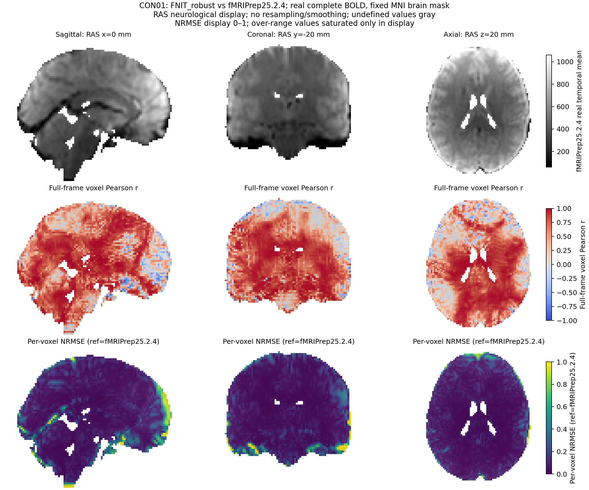

# fMRI Volume benchmark 完整记录（README 压缩迁移）

本页逐字保留基线 `db61cebc9d3683720e6c0a288db3cdc7d6f30a7c` 的 `docs/fmri/README.md` 第5章完整原文。
该原章 SHA-256 为 `9fa6dfa739eedf9726be67d18aab5b92a69e93fbda87a761459e3948c6fbea19`。
2026-10-06 的本次迁移只压缩用户手册；没有新增 MRI 运行，也没有修改原始正式 JSON、CSV 或脑图。
原结果仍绑定正文中的冻结源码版本；本页不是当前 main 的重新 benchmark。
回到 [fMRI Volume 用户手册](../../docs/fmri/README.md)。

## 5. 最新精度和运行时间

### 2026-10-06：完整 CPU volume 与 fMRIPrep 25.2.4 的差异指标

同一真实公开病例的原始 T1w 与完整 180 帧 BOLD；FNIT 冻结候选为 `98019133`，原版固定为 fMRIPrep 25.2.4，分别使用 CPU1/CPU8。STC 关闭，两者采用相同线程预算，实际物理核组不同。本节从已完成调用的输出读取全量数值，新增影像 API 为 0。

#### MNI152NLin6Asym 2 mm preproc

四组 MNI preproc 的物理网格、方向、mm/sec 单位和 TR（2.1 s）相符，均为 float32 的 `91×109×91×180`。每组比较全部 **162,473,220 个值**，均为有限值；数值并不相同。

| FNIT 后端 | CPU 线程 | RMSE（原始强度单位） | 最大绝对差 | 全网格 Pearson | 逐体素时间相关均值 |
|---|---:|---:|---:|---:|---:|
| FNIRT | 1 | 67.169521 | 1377.010880 | 0.969899 | 0.525382 |
| FNIRT | 8 | 68.034841 | 1380.043915 | 0.969140 | 0.500816 |
| SynthMorph | 1 | 39.852096 | 926.561951 | 0.989566 | 0.742280 |
| SynthMorph | 8 | 40.927701 | 971.624786 | 0.988997 | 0.732729 |

RMSE 和最大差包含整个空间网格及 180 帧。全网格 Pearson 将全部空间、时间值展平后计算；逐体素时间相关分别沿 180 帧计算，再对满足双方方差门槛的体素作普通算术平均，不使用 Fisher-z 或脑掩膜。本轮各组 902,629 个空间体素全部进入该时间相关均值，零个常量序列被排除。相关性高低仅描述本例两条独立估计管线的差异，不构成算法等价或整链精度通过。

比较器先证明空间单位、物理网格、完整帧数和 TR，再按八帧前向块用 float64 累加平方差及 Pearson 统计量。只允许无损轴置换/翻转，本轮 MNI 对齐为恒等；没有新增配准、插值或强度拟合。

#### 其他已证明或尚有缺口的输出

| 输出 | 本轮实际结果 |
|---|---|
| T1w preproc | FNIT 为 50×59×47×180，原版为 50×59×44×180；仿射项最大差 6.600 mm，四组均为不同物理网格，未计算逐值误差。 |
| HMC BOLD reference | 64×64×42 同网格，172,032 值完整有限；RMSE 4.144169，全网格 Pearson 0.999885；四组相同。 |
| T1w brain | 160×256×256 同网格，10,485,760 值完整有限；CPU1 RMSE 66.761659／Pearson 0.979546，CPU8 RMSE 43.812320／Pearson 0.979258；两种 FNIT 后端共享该解剖结果。 |
| MNI brain mask（冻结 `98019133`） | FNIT 输出空间单位为 unknown，原版为 mm；该原始报告未计算 Dice。保存单位已单独修复，四次真实 writer 验证及修复后 Dice 见下节。 |
| 原版 working-native | 64×64×42×180、float32、全量有限；时间单位为 unknown。原始 BIDS TR=2.1 s 与无单位的 header zoom 2.0999999046 分别记录，时间轴未获证明。FNIT 未保存同范围的 motion-only native 输出，未与 FNIT clean 比较。 |
| BBR 与 180 帧 HMC 变换 | 坐标约定、方向及对应原始 fixed/moving 网格尚未完全证明，未声称仿射数值一致。 |
| 非线性形变 | ANTs、FNIRT、SynthMorph 的表示与独立估计不同，本轮未比较形变等价。 |

预先要求的八组完整 preproc 比较中，四组 MNI 已比较、四组 T1w 仍有网格缺口；报告状态保持 `finished_readout_with_grid_or_mapping_gaps`，`required_preproc_comparisons_available=false`。

原版完整时钟还包含其额外 MNI2009 解剖注册，并生成混杂变量；FNIT 完整 API 包含 PICA、ICA-AROMA 与 clean 后处理。总时钟按各自范围单列，不计算同范围整链速度比。该输出差异表不能代替 FNIT 优化前后逐值保持性验证。

仅发布聚合指标、尺寸和 SHA，不发布本轮个体脑图。完整指标见 [官方保存输出报告](../../validation/fmri_cpu_20261004/task05_volume/official_saved_comparison_v2.public.json)，SHA-256 为 `09d70ba88b7629d48041fe0f655ca704ca2beb5fef3d62a7bf0d7e37111ecae2`。

#### MNI mask 空间单位修复与真实 writer 验证

修复 `_save_mask` 新建 NIfTI 时丢失 reference 空间单位的问题：输出明确继承实际 reference 的 xyz 单位。本轮对 `98019133` 完整测试保存的四份真实 MNI mask，直接调用修后的生产 writer，分别对应 FNIRT/SynthMorph × 原完整运行 CPU1/CPU8；writer 验证统一使用 CPU1。

每份完整 91×109×91 mask 的 902,629 个值、uint8 dtype、shape、affine、qform/sform 及其 code 均保持一致。空间单位由 unknown 改为 mm，3D 时间单位保持 unknown；加载后的完整头及原始 348-byte NIfTI-1 头，除 `xyzt_units`（原始 byte123）外逐字节相同。生产函数 AST、实际 reference 和旧输出 SHA 均绑定，旧文件前后 SHA 不变。

单位修复后的 mask 与匹配预算的官方 MNI mask 处于同一物理网格，全量有限；Dice 以双方值大于 0 的前景集合计算。

| FNIT 后端 | 原完整运行 CPU 线程 | writer CPU 线程 | 官方 mask Dice |
|---|---:|---:|---:|
| FNIRT | 1 | 1 | 0.943918 |
| FNIRT | 8 | 1 | 0.943564 |
| SynthMorph | 1 | 1 | 0.949085 |
| SynthMorph | 8 | 1 | 0.948682 |

新增验证仅 **4 次 mask writer 调用**，完整 volume API 与 GPU API 均为 0 次。原 16 次 CPU、4 次 GPU 的完整计时和保持性报告继续标注冻结 `98019133`；本轮没有重跑运动、配准、插值、ICA 或完整 pipeline。原官方差异报告保留旧 mask 的单位缺口，这里的 writer/Dice 报告单独记录修复后的范围。仅发布匿名聚合指标及 SHA，不发布新个体影像或脑图。

[真实 writer 报告](../../validation/fmri_cpu_20261004/task05_volume/mask_units_writer_replay_v1.public.json) SHA-256：`2b79d47120fea94181dc0cc956ee7225e5eb7879b81e70d184d2302a8cdfcd33`。

### 2026-10-06：fMRIPrep 25.2.4 完整体积预处理（CPU1/CPU8）

同一真实公开病例的原始 T1w 和完整 180 帧 BOLD，在固定 fMRIPrep 25.2.4 容器中分别使用 1、8 线程；nthreads 与 omp-nthreads 均按该预算设置。STC、fieldmap、recon-all 与 surface 关闭，dummy scans 为 0。两个预算各完成 first 和新进程 workflow-cache 调用，四次实际 fMRIPrep 进程及容器启动器均退出 0。原始输入大小及 SHA-256 与 FNIT 冻结测试相符。

| CPU 线程 | first 完整 wall | first payload wall | 缓存新进程完整 wall | 缓存 payload wall |
|---:|---:|---:|---:|---:|
| 1 | 19400.443 s | 19399.265 s | 1107.668 s | 1106.255 s |
| 8 | 2957.476 s | 2956.069 s | 453.581 s | 452.485 s |

完整 wall 含正常读写及外层启动，payload wall 仅记录容器内实际 fMRIPrep 进程。原版生成 T1w/MNI preproc 和混杂变量，执行其完整解剖模板注册流程（包括额外 MNI2009 注册），没有 PICA、ICA-AROMA 或 FNIT clean 后处理。FNIT 与原版采用相同 1/8 线程预算，但完整计算范围不同、实际物理核组不同；上述原版总时钟按自身范围列示，不计算同范围整链速度比。

原版缓存调用启动新进程并复用 workflow cache；FNIT warm 则在同一进程复用解剖缓存。每格为一次完整运行观察。

#### 原版保存 leaf 节点时钟

| 原版工作流分组 | leaf 数（各预算） | CPU1 leaf duration 合计 | CPU8 leaf duration 合计 | CPU8 活动区间并集 |
|---|---:|---:|---:|---:|
| BOLD reference 相关工作流 | 6 | 14.693 s | 14.764 s | 14.739 s |
| 运动校正工作流 | 2 | 22.516 s | 23.375 s | 23.375 s |
| 解剖脑提取相关工作流 | 53 | 2206.239 s | 435.447 s | 420.752 s |
| 解剖标准化工作流（含原版模板注册） | 13 | 15924.751 s | 2022.059 s | 2018.837 s |
| BOLD→T1w 配准工作流 | 13 | 78.085 s | 78.133 s | 78.133 s |
| native preproc 工作流 | 3 | 26.558 s | 9.494 s | 9.494 s |
| T1w preproc 工作流 | 4 | 22.002 s | 8.262 s | 8.262 s |
| MNI preproc 工作流 | 11 | 167.916 s | 78.034 s | 76.376 s |
| 混杂变量生成工作流 | 44 | 22.286 s | 24.277 s | 20.588 s |
| 其他原版节点 | 110 | 515.603 s | 197.173 s | 178.192 s |

每个预算的 259 个 leaf 来自 first/cache 共享 work 目录中的当前保存结果；按真实 runtime 去重，并排除 MapNode 父节点。缓存节点可能保留 first 的 runtime，因此不拆成两套调用阶段表。leaf duration 合计计入同时运行的节点；活动区间并集仅计算这些节点实际运行区间的覆盖时间，两者都不能替代完整调用 wall。起止跨度还含组内等待及跨调用间隔。

未记录 GNU time 的整体 user/system/RSS，不从 leaf 推导进程资源统计。匹配空间与输出层的科学比较单独记录。新个体影像、路径和原始命令不公开。

完整执行与保存节点见 [CPU1 原版报告](../../validation/fmri_cpu_20261004/task05_volume/official_saved_nodes_cpu1_v2.public.json)及 [CPU8 原版报告](../../validation/fmri_cpu_20261004/task05_volume/official_saved_nodes_cpu8_v2.public.json)。

### 2026-10-06：完整 volume CPU 优化前后对照

同一真实公开病例的原始 T1w 和完整 180 帧 BOLD，使用冻结基线 `6f624040` 和候选 `98019133`，分别运行 FNIRT/SynthMorph、CPU1/CPU8。每个预算的旧、新实现绑定同一组物理核心；PyTorch interop=1，STC 关闭。每份源码在同一进程运行一次 first（重新准备解剖结果）及一次 warm（复用已生成的解剖缓存），合计 16 次完整正常 API。

| 后端 | CPU 线程 | 基线 first | 候选 first | 基线 warm | 候选 warm |
|---|---:|---:|---:|---:|---:|
| FNIRT | 1 | 1351.524 s | 851.694 s | 832.104 s | 405.339 s |
| FNIRT | 8 | 748.712 s | 581.172 s | 611.512 s | 432.309 s |
| SynthMorph | 1 | 1710.378 s | 1243.552 s | 804.598 s | 411.036 s |
| SynthMorph | 8 | 793.044 s | 617.190 s | 595.666 s | 405.428 s |

本次观测中，first 的基线/候选时间比为 1.28–1.59，warm 为 1.41–2.05；每格各一次完整调用。API 时钟包含原始输入、完整计算和正常输出读写；导入、来源校验、锁等待及额外保存对照副本在 API 时钟外。进程时钟同时覆盖 first/warm 及这些外围工作，不能替代单次 API。

8 组旧、新配对及 8 组 first/warm 配对均完整比较十个科学输出，每组 **395,140,404 个值**：不同值数、最大绝对误差、RMSE 均为 0，dtype、网格、affine、qform/sform、加载后及原始存储头一致。所有四张 BOLD 输出均为完整 180 帧、float32、有限值，mm/sec 单位及 TR 经校验。真实核预算、完整源码和原始输入前后校验通过；科学配置只对基线缺失的 `confound_projection` 按既有 `orthogonal` 补齐。

本表记录 FNIT 优化前后的完整 API。官方 fMRIPrep 整链时钟见上表；preproc 与 FNIT clean 的后处理范围不同，精度在匹配输出层比较。

#### 候选 CPU8 的分步骤时钟

| 已记录的阶段 host wall | FNIRT first | FNIRT warm | SynthMorph first | SynthMorph warm |
|---|---:|---:|---:|---:|
| 解剖准备／缓存读入 | 140.100 s | 0.064 s | 192.509 s | 3.208 s |
| 其中 T1w→MNI 配准 | 84.861 s | —（缓存命中） | 123.652 s | —（缓存命中） |
| FEAT core | 37.817 s | 36.161 s | 37.177 s | 36.537 s |
| 其中强度缩放 | 0.105 s | 0.103 s | 0.115 s | 0.110 s |
| 其中 Gaussian 高通 | 0.157 s | 0.125 s | 0.131 s | 0.126 s |
| BBR | 46.986 s | 44.104 s | 43.917 s | 41.088 s |
| PICA＋ICA-AROMA＋混杂处理 | 151.339 s | 155.960 s | 143.470 s | 127.473 s |
| MNI mask 重采样 | 0.149 s | 0.146 s | 0.163 s | 0.146 s |
| clean MNI 重采样 | 105.797 s | 103.072 s | 102.618 s | 104.661 s |
| T1w preproc 单次插值 | 8.867 s | 8.454 s | 8.573 s | 8.869 s |
| MNI preproc 单次插值 | 40.594 s | 38.661 s | 38.734 s | 38.740 s |

解剖准备包含 T1w→MNI，FEAT core 包含强度缩放和高通；这些已有 observer 时钟存在嵌套，不相加代替完整 API。warm 未重新调用 T1w→MNI，表中按实际缺省事件标为缓存命中。重采样四项按生产调用顺序分别对应 MNI mask、clean MNI、T1w preproc、MNI preproc。未保存独立时钟的步骤不补造计时。
完整 first/warm 阶段、全量误差与来源 SHA 见 [CPU 机器可读报告](../../validation/fmri_cpu_20261004/task05_volume/final_merged_cpu_v1.public.json)。本轮仅公开聚合报告。

### 2026-10-06：完整 volume 默认 GPU 保持性回归

本轮用同一真实公开病例的原始 T1w 和完整 180 帧 BOLD（64×64×42×180），在 NVIDIA H100 PCIe 上串行运行四次 cold API。两份冻结源码为 FNIT main 基线 `6f624040` 与 CPU 优化候选 `98019133`；两种后端分别配对。调用包括原始输入、robust reference、完整运动校正、T1w 配准、PICA/ICA-AROMA，以及 preproc 和 clean 的正常读写；STC 关闭，CUDA 使用 TF32，四张 BOLD 输出保持 float32。不包含 recon-all 或 surface。

| 后端 | 基线 GPU API | 候选 GPU API | Torch 峰值 allocation | Torch 峰值 reservation | 采样 owned 进程树峰值 |
|---|---:|---:|---:|---:|---:|
| FNIRT | 597.814 s | 599.190 s | 6.537 GB | 11.899 GB | 14.053 GB |
| SynthMorph | 421.071 s | 415.174 s | 13.323 GB | 16.182 GB | 15.804 GB |

显存以 1 GB = 10⁹ bytes 计；同一后端的旧、新三项峰值均相同，全部低于 20e9 bytes。每次使用相同的 8 个 GPU 主机物理核心、PyTorch 8 线程、interop=1，来源和完整输入前后校验通过，末次 owned GPU 存活采样绑定实际 guard SHA。

两种后端各比较十个科学输出的全部 **395,140,404 个值**，不同值数、最大绝对误差和 RMSE 均为 0；dtype、affine、qform/sform、加载后的二进制头及原始存储头一致。四张 BOLD 均完整保留 180 帧并为有限值；11 份正常输出均绑定 SHA。元数据仅将基线未写出的 `confound_projection` 规范化为原有 `orthogonal`。

四次调用共 487 次共享设备采样，利用率均为 100%。上表是每个后端各一次旧、新 cold 运行的观测时间；FNIRT 按基线→候选、SynthMorph 按候选→基线执行。稳定 GPU 速度结论需要独立重复和可控设备负载。
API 时间包含正常读写和首尾 CUDA 同步；进程时钟另含导入、锁等待、来源/输出验证和最后采样握手。实际 owned 采样间隔最大为 0.972 s，采样峰值按该采样范围解释。

#### 候选 GPU 的分步骤时钟

| 生产阶段 host wall | FNIRT 候选 | SynthMorph 候选 |
|---|---:|---:|
| 稳健 BOLD 参考 | 23.017 s | 18.459 s |
| EPI SynthStrip | 0.709 s | 0.631 s |
| T1w SynthStrip | 2.227 s | 2.233 s |
| 模板准备 | 0.061 s | 0.060 s |
| FAST | 13.196 s | 12.007 s |
| T1w→MNI 仿射 | 6.410 s | 4.994 s |
| T1w→MNI 非线性 | 63.435 s | 7.613 s |
| 形变转换 | 0.480 s | 0.529 s |
| 解剖缓存查验 | 0.067 s | 3.993 s |
| FEAT core：运动、高通与强度缩放 | 141.031 s | 96.532 s |
| BBR 初始 FLIRT | 4.661 s | 3.748 s |
| BBR 精化 | 2.563 s | 1.842 s |
| BBR 最终重采样 | 0.065 s | 0.060 s |
| AROMA 掩膜 | 0.001 s | 0.002 s |
| PICA＋ICA-AROMA＋混杂处理 | 232.561 s | 158.283 s |
| clean MNI 重采样 | 17.459 s | 16.951 s |
| T1w/MNI preproc 单次插值及阶段保存 | 84.236 s | 81.605 s |

这些是生产实现已有的 host wall 阶段时钟，部分边界嵌套，不相加替代完整 API，也不视为独立同步的 CUDA kernel 时间。
完整误差、源码/输入 SHA、四次时钟及显存见 [GPU 机器可读报告](../../validation/fmri_cpu_20261004/task05_volume/final_merged_gpu_v1.public.json)。本轮仅公开聚合报告。

### 2026-10-04：官方连续 volume→surface 对照

本节的官方精度数据来自 2026-10-04 的 [两例连续 volume→surface 对照](../../validation/fmri/reference_alignment_20261004/CONTINUOUS_BENCHMARK.md)。
数值运行绑定 `cc940273` 基线的冻结 source_v1；随后 `140c3739` 保护修复不改变本轮算法。
不是把原十例重标成当前 main；逐病例结果、源码清单及失败记录均在详细报告。

| 条件 | 实测记录 |
|---|---|
| 数据 / n | OpenNeuro ds001226 v5.0.1（CC0），两例配对 T1w＋完整180帧 BOLD。 |
| 参考 | 官方 fMRIPrep25.2.4；稳健参考组件 NiWorkflows1.14.4。 |
| CPU / GPU | CPU具体型号未单独保存；共享 NVIDIA H100 PCIe。 |
| 线程 | runner PyTorch8线程；surface4线程且串行，不能把整个进程称4线程。 |
| precision / 峰值 | float32＋默认TF32，无半精度；本进程采样峰值14.0551 GB。 |
| timing | volume自动阶段墙钟；连续API包括文件保存/QC，排除重建/MSM的冷计算。 |

### 端到端 benchmark

| 指标，两病例中位数 | FNIT robust | 原软件 | 差异 |
|---|---:|---:|---|
| 本轮 volume 阶段 | 543.23 s | 未单独测同范围 | 不计算速度比。 |
| 连续 volume→surface API | 719.11 s | 无同复用边界时钟 | 使用已有FNIT重建/MSM。 |
| MNI全帧时间r | 0.520368 | fMRIPrep为参照 | middle对照为0.511970。 |
| MNI NRMSE | 23.845726% | fMRIPrep RMS归一 | middle对照为24.044193%。 |

### 分步骤 benchmark

| 阶段，两病例中位数 | FNIT | 原软件 |
|---|---:|---:|
| 自动 volume | 543.23 s | 同范围未测。 |
| 稳健BOLD参考：FNIT API / 官方核心（边界不同） | 28.07 s | 仅RobustAverage核心15.38 s；节点/容器墙钟另列。 |
| 原生表面准备（连续链内） | 12.19 s | 同范围未测。 |
| 双侧投影（连续链内） | 138.51 s | 同范围未测。 |
| CIFTI组装（连续链内） | 10.26 s | 同范围未测。 |

阶段可能嵌套，不能求和替代连续API墙钟。
NRMSE=RMSE/参考RMS，使用全部帧和固定脑mask，不筛零值、不拟合强度。
时间r对常数序列未定义，未定义数单独报告；它们仍计入NRMSE。

脑图为本轮实际完整序列计算的切面；不是模拟结果。
旧十例三方结果见 [独立报告](../../validation/fmri/threeway_20261004/final10/REPORT.md)，不混入本轮两例中位数。

## 较早更新

从用户手册移入的两条较早更新；原科学证据保持不变。

| 日期 | commit/version | 变化 | benchmark |
|---|---|---|---|
| 2026-10-03 | `1128bc52` | 自动volume、重建来源选择与完整preproc输出。 | [十例三方独立记录](threeway_20261004/final10/REPORT.md)。 |
| 2026-10-02 | `81f1bb3` | 最终节点复用公共采样接口。 | [历史完整连续链](e2e_latest/README.md)。 |
