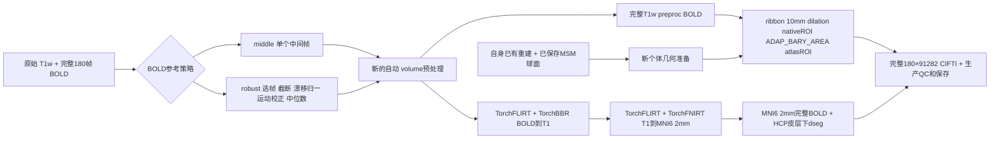
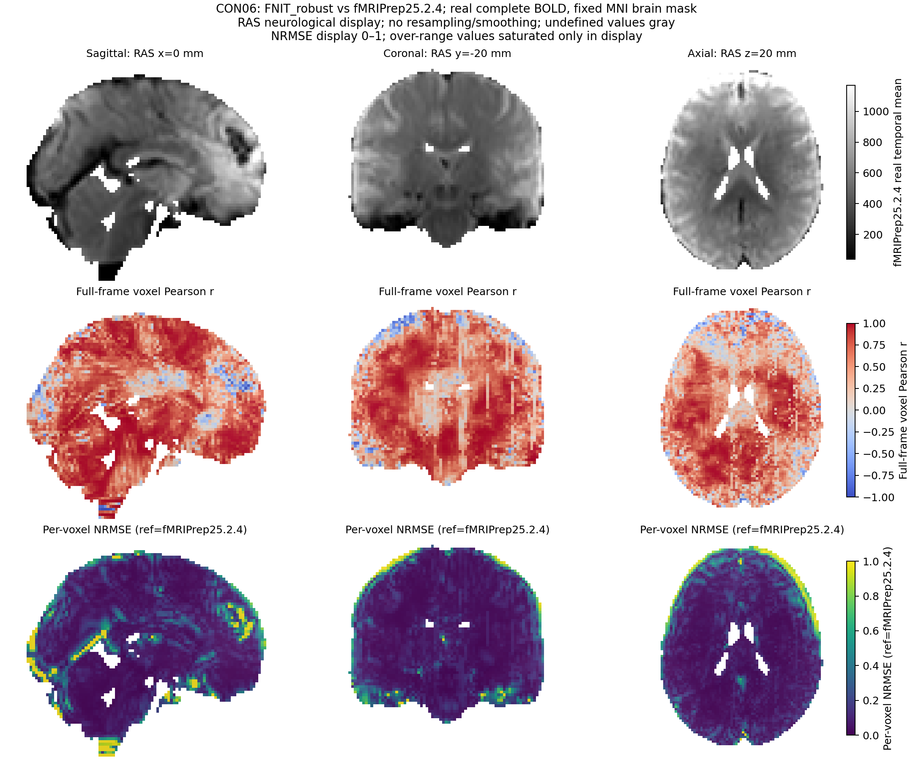

# BOLD 参考图策略的连续 volume→surface 对照

## 1. 功能与流程

本对照使用 ds001226 v5.0.1（CC0）的 CON01、CON06 配对 T1w 和完整 180 帧静息态 BOLD，分别运行 `bold_reference_strategy="middle"` 与 `"robust"`。API 从原始 BIDS 自动执行新的 volume 预处理，再使用 FNIT 自身已有重建和已保存的 final MSM 球面生成双侧 fsLR32k GIFTI 和 91k CIFTI。每次 volume 和 derivatives 都从新目录启动；冷重建和 MSM 求解复用，不计入本轮时间。



冻结基线为 main `cc9402734faeba93b3a13c29932fa1392eaccf62` 加本次参考图实现。远端 `source_v1` 的 484 个 Python 文件清单 SHA 为 `dc8ea8c5688ca06373088c6d4968c249dee6f3e24b1dcfb74a7c1a71d2be96b5`，其中 `reference.py` SHA 为 `ac885355a286ff6799aaeafc9735de1d0c0264b8afba55041ea4e94b1ddc3484`。这轮不把更新后的本地源码冒充原冻结运行版本。

## 2. Python、输入、输出与参数

```python
import json
from pathlib import Path
from fnit.fmri import fMRISurface_pipeline

continuous_input_manifest = Path("/absolute/FNIT/runs/fmri_reference_alignment_20261004/continuous_v1/manifests/CON01.robust.private.json")
continuous_configuration = json.loads(continuous_input_manifest.read_text())["configuration"]
# configuration 已具名绑定原始MRI、自身重建、资源、球面和全新输出目录；不要改成已有 derivatives。
continuous_surface_result = fMRISurface_pipeline(**continuous_configuration)
print(continuous_surface_result.dtseries)       # 保存的完整时序 CIFTI
print(continuous_surface_result.timing_seconds) # 原API分步骤时钟；不求和替代整段墙钟
```

示例直接调用 API。正式 benchmark 使用 [run_continuous.py](run_continuous.py)，它额外核对 manifest、源文件、GPU、全帧和输出，保存原 API 与外部验证的独立时钟。只能在新的隔离输出目录复现。

| 实际 API 参数 | 本轮值与含义 |
|---|---|
| `bids_root` | 原始 BIDS 根；每例一个 T1w、一个完整 BOLD 和 JSON，影像由 nibabel 读取 |
| `derivatives_root` | 每病例、每策略独立的新目录；拒绝已有 run |
| `subject`, `session`, `task` | `CON01` 或 `CON06`、`preop`、`rest`；TR 分别为 2.1、2.4 秒 |
| `hcp_assets_dir` | 已校验资源根，包含固定 HCP dseg、fsLR ROI/球面与初始化模板 |
| `recon_all_backend`, `recon_all` | `provided` 与原 FNIT 1128 自产完整 subject；重建来源不是官方 FreeSurfer |
| `registered_spheres` | 同一病例 FNIT 1128 保存的左、右 final MSM 球面；本轮不求解新 MSM |
| `wb_command` | 已校验的 FNIT Conda Workbench 二进制；用于成熟 surface API |
| `device` | `cuda:0`，由队列映射到物理 GPU0；没有 CPU 回退 |
| `signal` | `preproc`，比较未去噪的 preproc 终点；自动 volume 仍执行其正常生产支路，不能把时间缩写为仅生成 preproc |
| `cpu_threads`, `parallel` | `4`、`False`：双侧采样串行；runner 另设 PyTorch CPU 线程 8，不能称整进程只有4线程 |
| `volume_options.mni_template`, `mni_brain_mask` | 固定 TemplateFlow MNI152NLin6Asym res-02 T1 与 brain mask；原许可、大小和 SHA 保留在资源 manifest |
| `volume_options.registration_backend`, `fnirt_config` | `fnirt`、`t1`：T1→MNI 采用 TorchFLIRT+TorchFNIRT；BOLD→T1 为 TorchFLIRT+TorchBBR |
| `volume_options.slice_timing`, `reuse_anatomical` | `False`、`False`；STC 关闭，volume 不复用既有解剖配准输出；无 fieldmap 的本队列无 SDC |
| `volume_options.synthstrip_weights` | 原已校验 SynthStrip 权重路径；不重新下载或发布权重 |
| `volume_options.bold_reference_strategy` | `middle` 或 `robust`；这是病例内两次连续运行的策略变量 |

runner 的两个 CLI 参数为 `--manifest`（配置与具名输入 SHA 的私有 JSON）和 `--output`（新报告目录）。Manifest 还记录 `case_id`、`variant`、`tr_seconds`、`baseline_commit`、`source_root`、`source_manifest`、`validation_helper` 和 `input_files`。`input_files` 是原 runner 实际 before/after 子集，不能自动解释为完整资源闭包。

输出 derivatives 包括新的 BOLD reference 及 sidecar、T1w/MNI preproc BOLD、生产 volume 其他产物、双侧 GIFTI、91k CIFTI、metadata 与生产 QC。报告目录含 `report.public.json`、`files.private.json`、`source.private.json`、GPU采样日志；队列保存每个 child 的 exit code 和进程墙钟。私有路径清单仅用于现场复现；匿名报告保留 SHA 和标量。

## 3. 命令行与独立分析

```bash
FNIT_TASK_WORKSPACE=/absolute/FNIT/workspaces/fmri_reference_alignment_20261004
FNIT_TASK_RUNS=/absolute/FNIT/runs/fmri_reference_alignment_20261004
FNIT_PYTHON=/absolute/original-conda/bin/python
CONTINUOUS_RUN_MANIFEST="$FNIT_TASK_RUNS/continuous_v1/manifests/CON01.robust.private.json"
CONTINUOUS_FRESH_REPORT="$FNIT_TASK_RUNS/continuous_reproduction/CON01/robust/report"
# 在已获GPU协作锁、显存准入和固定环境中运行；此命令不会替用户取得锁。
PYTHONPATH="$FNIT_TASK_WORKSPACE/source_v1/src" CUDA_VISIBLE_DEVICES=0 \
  "$FNIT_PYTHON" "$FNIT_TASK_WORKSPACE/runner_v1_code/run_continuous.py" \
  --manifest "$CONTINUOUS_RUN_MANIFEST" --output "$CONTINUOUS_FRESH_REPORT"
```

复现需同时把 manifest 的 `configuration.derivatives_root` 指向自己的全新目录并重新冻结 manifest。不要用原报告目录配合改名的 report 根运行。原队列持有已登记的 GPU0 协作锁，要求 free≥20480 MiB；shared GPU 的 utilization 可非零，不以 utilization=0 作为准入。

最新只读 collector 为 [continuous_analysis_v2/collect_continuous.py](continuous_analysis_v2/collect_continuous.py)，参数如下：

| 参数 | 含义 |
|---|---|
| `--bindings` | 原三方输入、固定mask/轴及旧 fMRIPrep 成品的私有清单，硬核对 SHA `c6043f24…` |
| `--runs` | 本轮 `continuous_v1` 根；检查4个原 manifest、原 queue 和已完成 child 身份 |
| `--metric-helper` | 原完整时序算法的实际服务器路径，SHA 必须为 `cb04445f…`；不使用 bindings 中不可访问的本地路径 |
| `--output` | 全新独立分析根；拒绝覆盖、进入或包住原 MRI、raw、source、resources、helper 目录 |
| `--preflight-only` | 可选；仅检查已保存来源/闭包，不计算数值端点 |

```bash
ORIGINAL_PAIR_BINDINGS=/absolute/FNIT/workspaces/fmri_threeway_20261004/fnit_bindings.private.json
ORIGINAL_METRIC_HELPER=/absolute/FNIT/workspaces/deepprep_fmriprep_ten_20261004/analysis_assets/compare_subject.py
CONTINUOUS_FRESH_ANALYSIS="$FNIT_TASK_RUNS/analysis_reproduction"
CUDA_VISIBLE_DEVICES= OPENBLAS_NUM_THREADS=1 OMP_NUM_THREADS=1 \
  "$FNIT_PYTHON" "$FNIT_TASK_WORKSPACE/analysis_v2_code/collect_continuous.py" \
  --bindings "$ORIGINAL_PAIR_BINDINGS" --runs "$FNIT_TASK_RUNS/continuous_v1" \
  --metric-helper "$ORIGINAL_METRIC_HELPER" --output "$CONTINUOUS_FRESH_ANALYSIS"
```

collector 把 manifest 保存到新根 `manifests/`，端点保存到 sibling `endpoints/<case>/<variant>/`。输出包括来源检查 `provenance.public.json`、私有 collection、每次完整 MNI/CIFTI 比较 JSON/CSV、时钟 CSV 与私有误差数组。返回0表示所有预期运行已完成并通过当前操作；2表示已记录的端点比较失败；3表示尚有 pending。来源预检异常会抛出并以非零退出，不能当作 complete。比较 preflight 拒绝且未创建 endpoint 时，collector 在自己的分析根保存拒绝报告并返回2。

目录合同可独立复现；此命令创建两帧文件格式 fixture，不执行 MRI pipeline，不是科学 benchmark。`--code` 为上述 v2 五脚本目录，另外三个参数沿用原bindings/数值helper与新的隔离控制输出。

```bash
LAYOUT_FRESH_CONTROLS="$FNIT_TASK_RUNS/layout_contract_reproduction"
CUDA_VISIBLE_DEVICES= "$FNIT_PYTHON" "$FNIT_TASK_WORKSPACE/analysis_v2_code/test_endpoint_layout.py" \
  --bindings "$ORIGINAL_PAIR_BINDINGS" --code "$FNIT_TASK_WORKSPACE/analysis_v2_code" \
  --metric-helper "$ORIGINAL_METRIC_HELPER" --output "$LAYOUT_FRESH_CONTROLS"
```

## 4. 对应原软件调用

原完整参考为固定 fMRIPrep25.2.4 SIF SHA `8e32238619053c1f9d1739b26f4afd72df809d914f5a5771707bf5da4b1d0f39`。它从原始 T1+BOLD 到完整输出，含独立冷 FreeSurfer7.3.2 重建及默认 MSMSulc，另有内部 MNI152NLin2009cAsym 解剖配准。本轮复用其已经校验的原成品作为比较目标，没有重测该冷完整流程。其原调用的关键参数为：

```bash
FMRIPREP_IMAGE=/absolute/fmriprep-25.2.4.sif
RAW_BIDS_DIRECTORY=/absolute/raw-bids
REFERENCE_CASE_DIRECTORY=/absolute/new-reference-case # 原launcher创建的新case，内含runtime_home和独立templateflow副本
FREESURFER_LICENSE_PATH=/absolute/legal-license/license.txt # 仅传路径，不发布内容
singularity exec --cleanenv --containall \
  --bind "$RAW_BIDS_DIRECTORY:/data:ro,$REFERENCE_CASE_DIRECTORY:/case,$REFERENCE_CASE_DIRECTORY/templateflow:/opt/templateflow,$FREESURFER_LICENSE_PATH:/opt/fs-license/license.txt:ro" \
  --home "$REFERENCE_CASE_DIRECTORY/runtime_home:/home/fmriprep" --pwd /case \
  --env TEMPLATEFLOW_HOME=/opt/templateflow,FS_LICENSE=/opt/fs-license/license.txt,TZ=UTC,OMP_NUM_THREADS=4,MKL_NUM_THREADS=4,OPENBLAS_NUM_THREADS=4,ITK_GLOBAL_DEFAULT_NUMBER_OF_THREADS=4 \
  "$FMRIPREP_IMAGE" fmriprep /data /case/derivatives participant \
  --participant-label CON01 --work-dir /case/work \
  --nprocs 8 --omp-nthreads 4 --mem-mb 49152 \
  --fs-license /opt/fs-license/license.txt --fs-subjects-dir /case/derivatives/sourcedata/freesurfer --ignore slicetiming \
  --cifti-output 91k --output-spaces MNI152NLin6Asym:res-2 T1w fsnative \
  --resource-monitor --stop-on-first-crash --notrack
```

原参考 `RobustAverage` 是内部节点，没有独立 fMRIPrep CLI。本轮官方节点读取真实输入、显式选帧/NSS 和实际参数，再隔离运行 ValidateImage→NSS→RobustAverage；选中数据先非负裁剪与漂移归一，再由 AFNI `3dvolreg -twopass -Fourier -zpad 4` 运动校正，随后取时间中位数。FNIT 使用成熟 TorchMCFLIRT，运动估计和插值算法与 AFNI 有差异，不能把策略接入称为全部数值等价。节点单测的原命令和源身份见 [bold_reference/run_reference_benchmark.py](bold_reference/run_reference_benchmark.py)。

皮层参考采用原 Workbench ribbon-constrained、10 mm nearest dilation、native ROI、ADAP_BARY_AREA（个体 native/32k 灰中面、current ROI）、atlas ROI，再由原 NiWorkflows 组装 CIFTI。完整同输入原调用见 [surface/SURFACE_ALIGNMENT.md](surface/SURFACE_ALIGNMENT.md)。官方容器仅用于隔离 benchmark；FNIT 生产链不导入 fMRIPrep/Nipype/NiWorkflows，也不调用 AFNI/FSL/FreeSurfer。

## 5. 最新真实结果、时钟和脑图

2026-10-04 的四次连续运行均 exit0、`scientific_complete`，完整180帧，原 runner 的 raw/source 子集守卫通过。以下秒数直接来自各原报告和 queue，不从 UTC、文件 mtime 或阶段求和推算：

| 病例 / 策略 | API 保存终点 | API 加外部验证 | child 进程墙钟 | 自动 volume | native准备 | 双侧投射 | CIFTI组装 |
|---|---:|---:|---:|---:|---:|---:|---:|
| CON01 middle | 657.773 | 665.499 | 670.349 | 478.007 | 12.414 | 142.998 | 10.147 |
| CON01 robust | 679.862 | 687.594 | 692.192 | 500.354 | 12.483 | 141.533 | 10.407 |
| CON06 robust | 758.358 | 766.101 | 771.043 | 586.115 | 11.897 | 135.483 | 10.107 |
| CON06 middle | 704.434 | 712.643 | 717.370 | 526.365 | 12.067 | 140.902 | 10.392 |

API 时钟从调用前 CUDA synchronize 后开始，到 API 返回并 synchronize；包括生产 QC、文件发布。API 加外部验证继续到独立输出验证、原 raw/source 子集检查后，尚未计入 monitor join 和最终 wrapper report 写入。child 时钟从父进程打开日志/Popen 前到 child exit，额外包括导入、preflight、验证、monitor join 和 wrapper 写盘，排除排队等待。阶段时钟可能嵌套，不求和替代这些连续墙钟。

GPU采样间隔目标为2秒；自有进程的采样峰值为 CON01 middle 14,050,918,400 B、CON01 robust/CON06 robust 14,055,112,704 B、CON06 middle 13,790,871,552 B，均低于20,000,000,000 B。本轮共享 GPU0，默认 TF32、未改 float16；这些是共享条件下的实际观察。不能将排除冷重建/MSM 的新连续链与完整冷 fMRIPrep 参考比较为同等处理范围加速。

精度分析固定全部原始帧、完整 MNI brain mask 和精确91k/21结构轴，不取共同非零点、轴交集或拟合强度。Pearson r 只对非恒定时序定义；zero/constant 点仍计入 RMSE 和 reference RMS，NRMSE 为 RMSE/reference RMS。四对新成品的严格 endpoint 分析全部 `comparison_complete`，原输入 SHA 前后一致。

| 病例 / 策略 | MNI时序r均值 | MNI NRMSE | CIFTI时序r均值 | CIFTI NRMSE | 具名原报告 |
|---|---:|---:|---:|---:|---|
| CON01 middle | 0.534949 | 16.170960% | 0.705385 | 9.250767% | [完整比较](continuous_results/CON01/middle/comparison.public.json) |
| CON01 robust | 0.539100 | 16.041490% | 0.715012 | 9.242601% | [完整比较](continuous_results/CON01/robust/comparison.public.json) |
| CON06 middle | 0.488992 | 31.917426% | 0.729887 | 9.247057% | [完整比较](continuous_results/CON06/middle/comparison.public.json) |
| CON06 robust | 0.501636 | 31.649962% | 0.759578 | 9.098470% | [完整比较](continuous_results/CON06/robust/comparison.public.json) |

两例分别从 middle 改为 robust 后，MNI/CIFTI 的时序r均值都提高，NRMSE都降低。病例内r先取所有defined点的均值，再在这两例间取中位数：MNI **0.511970→0.520368**，CIFTI **0.717636→0.737295**；两例各自NRMSE的中位数分别为 **24.044193%→23.845726%**、**9.248912%→9.170536%**。这里 n=2，每策略各一次；不是旧十例使用新策略的重测，也不是把不同病例或所有点混池得到的相关。两例仍保留完整误差、恒定/零时序和21结构结果，没有将执行成功写成算法等价。

17份原匿名报告/CSV 与 [下载SHA清单](continuous_results/DOWNLOAD_SHA256.public.json)同字节整理在 `continuous_results/`。独立[来源报告](continuous_results/provenance.public.json) SHA 为 `f8ad0880d8ce9dd9c6d6de854e6a63a7c8b67c7967e882670816b1628e8349db`。

四张新 **MNI volume** 脑图均由本轮具名成品生成，`figure_complete`、输入前后 SHA 一致、PNG SHA 与实际字节匹配。每张第一排是同例官方完整180帧时间均值；第二排是原 endpoint 的逐体素时间r；第三排重新读取全帧能量得到逐体素NRMSE，且其总能量与原比较报告核对一致。显示采用固定脑域、相同RAS切面，未重采样/平滑；NRMSE色阶0–1，超过1仅在显示时饱和，原数值和统计不截断。这些切片不作为皮层表面图。

| 病例 / 策略 | 真实脑图 | 绘图来源与显示范围 |
|---|---|---|
| CON01 middle | [MNI图](continuous_figures/CON01_middle/volume_consistency.png) | [renderer记录](continuous_figures/CON01_middle/figure.public.json) |
| CON01 robust | [MNI图](continuous_figures/CON01_robust/volume_consistency.png) | [renderer记录](continuous_figures/CON01_robust/figure.public.json) |
| CON06 middle | [MNI图](continuous_figures/CON06_middle/volume_consistency.png) | [renderer记录](continuous_figures/CON06_middle/figure.public.json) |
| CON06 robust | [MNI图](continuous_figures/CON06_robust/volume_consistency.png) | [renderer记录](continuous_figures/CON06_robust/figure.public.json) |




绘图为独立CPU后验处理，未运行新MRI；[同输入皮层采样页](surface/SURFACE_ALIGNMENT.md)另外提供保存的个体灰中面上的两例真实皮层图，不能混作本轮连续链的皮层精度图。

只读来源检查额外核对每次运行 metadata 实际记录的16个重建文件与原140文件重建 manifest，以及11个消耗的 HCP/TemplateFlow文件与固定资源 manifest。**这是独立后验检查**。原 runner 的 before/after 输入只有子集，遗漏的 thickness/资源没有本轮完整运行期间不变的原始证据；不能用晚期 SHA 一致补造原始完整闭包守卫。原 runner 检查所选 BOLD SHA 和一个T1数量，实际T1来源另由后验配置、manifest及重建adapter运行时记录的所选T1 SHA确认。

## 6. 近期更新与保留记录

| 版本 / 尝试 | 改动与实际记录 |
|---|---|
| main cc940 + `source_v1` | 接入 `robust` BOLD参考；冻结484文件清单后运行本表4次连续链。20项参考控制与74项volume/cache/bootstrap/FEAT控制通过；控制不是科学benchmark |
| MRI `runner_v1_code` | SHA `7964a43f…`；queue SHA `e25016cd…`；原输入子集 before/after、API/外部验证/进程三个边界分别保留 |
| 分析 v1 | collector SHA `47b7c9bd…`；独立 `analysis_v1_partial3` 在12.22466秒失败。manifest 放在分析根导致冻结端点正确拒绝输出目录重叠，collector随后误读不存在报告；原失败日志、源和 manifest 保留 |
| 分析 v2 | collector SHA `601c29be4529c4f42c6cbde994af22122f17e7b818814d606429e1fd10a85a07`；只修 sibling目录与失败落盘，数值endpoint `dedd26ec…` 和metric `cb04445f…` 不变。[4项真实NIfTI/CIFTI文件格式控制](continuous_analysis_v2/endpoint_layout_controls.public.json)通过：合法新布局完整保存、原布局拒绝且不建endpoint、错误SHA拒绝、pending返回3；2帧fixture不作为MRIbenchmark |
| 本地发布候选的后续修复 | `_run_paths` 纳入新 BOLD reference 及sidecar，避免失败只留下参考图时误判 missing；46项status/bootstrap控制通过。远端已运行 `source_v1` 未改，因此本表结果仍绑定原v1 |
| 发布前参考来源修复 | 冻结v1在写clean-native sidecar时覆盖局部 `reference` 变量，导致desc-hmc sidecar的 `FNIT.SHA256` 指向原4D BOLD。已发布3D参考、mask/HMC/BBR均正确；本页及参考阶段比较用runner具名实际文件SHA和helper输出SHA绑定，不用错误字段。发布候选改局部变量名并核对sidecar与实际3D文件SHA；冻结v1和原报告保持原字节 |
| 独立参考API覆盖保护 | 文件型Nibabel image原可绕过路径输入的重叠保护；发布候选同样检查其 `get_filename()`，防止overwrite覆盖原输入。普通Path连续链不受此缺口影响；统计、运动及中位数算法保持本轮冻结定义 |

已被替代的默认分析入口统一指向 v2，真实执行过的 v1 源码与失败证据保留为历史；不覆盖已保存报告、时钟或脑图。后续若加强 MRI runner 的完整资源/所选T1守卫，应作为新冻结版本和新尝试，不能改写本轮身份。

## 7. 原实现与参考文献

- FNIT 成熟实现：[reference.py](../../../src/fnit/fmri/reference.py)、[surface_volume.py](../../../src/fnit/fmri/surface_volume.py)、[surface_fmriprep.py](../../../src/fnit/fmri/surface_fmriprep.py)。本轮源版本以第1节完整SHA清单为准。
- [NiWorkflows1.14.4 RobustAverage 原实现](https://github.com/nipreps/niworkflows/blob/1.14.4/niworkflows/interfaces/images.py)；[fMRIPrep25.2.4 resampling 原流程](https://github.com/nipreps/fmriprep/blob/25.2.4/fmriprep/workflows/bold/resampling.py)；[NiWorkflows1.14.4 CIFTI组装](https://github.com/nipreps/niworkflows/blob/1.14.4/niworkflows/interfaces/cifti.py)。
- [AFNI3dvolreg 参数说明](https://afni.nimh.nih.gov/pub/dist/doc/program_help/3dvolreg.html)；[Connectome Workbench 源码](https://github.com/Washington-University/workbench)。
- Esteban et al. *fMRIPrep: a robust preprocessing pipeline for functional MRI*. Nature Methods 2019. [doi:10.1038/s41592-018-0235-4](https://doi.org/10.1038/s41592-018-0235-4)。Glasser et al. *The minimal preprocessing pipelines for the Human Connectome Project*. NeuroImage 2013. [doi:10.1016/j.neuroimage.2013.04.127](https://doi.org/10.1016/j.neuroimage.2013.04.127)。
- [公开 ds001226 v5.0.1](https://openneuro.org/datasets/ds001226/versions/5.0.1)；资源保留原作者许可与固定资源manifest，不随本页再分发模板/权重。
