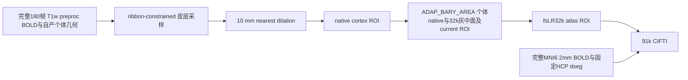
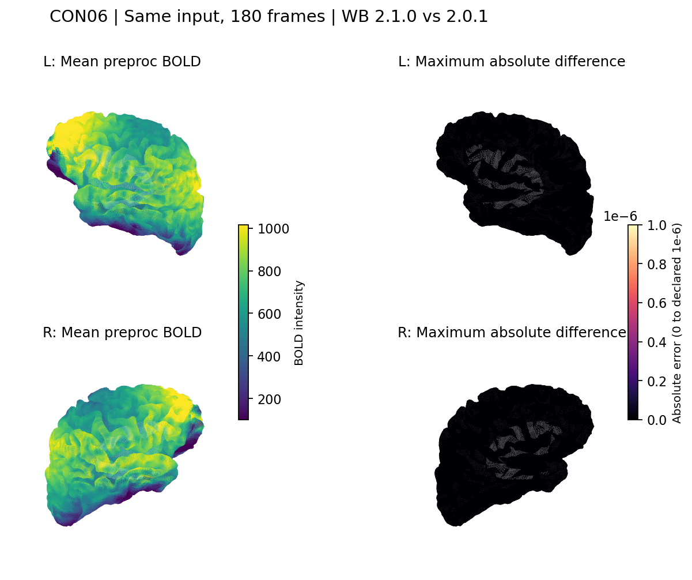

# 皮层采样同输入对照

## 1. 功能简介与流程图

本功能在完整真实 BOLD、FNIT 自产个体几何和固定资源上，对照 FNIT 现有皮层采样 API 与 fMRIPrep 25.2.4 的 Workbench 算子顺序及 NiWorkflows 1.14.4 的 CIFTI 组装。CON01、CON06 两例各 11 项输出的数组逐元素相同，CIFTI 时间轴和脑结构轴一致。

本轮绑定基线 `cc9402734faeba93b3a13c29932fa1392eaccf62`，复用成熟的 `surface_fmriprep.py`、`surface_prepare.py` 和 `sampling_reference.py`。FNIT 生产进程不导入 fMRIPrep、Nipype 或 NiWorkflows；官方依赖只用于隔离参考进程。采样在 CPU 上执行，双半球串行、总线程 4。重建、MSM 求解和 volume 预处理属于此前的自产链，其完整链结果见[表面功能说明](../../../../docs/fmri/surface.md)。



默认不提供 `goodvoxels`，与官方 `project_goodvoxels=False` 一致。个体 native 灰中面与个体 32k 灰中面用于面积权重；固定 atlas 灰中面不能替代它们。两例使用保存的自产重建与 final MSM；在新准备目录生成采样几何和 ROI 时，没有重跑 MRI 重建或 MSM 求解。

## 2. Python 调用、输入格式与输出

对照脚本位于本目录。以下调用从该目录导入脚本；执行时显式将实际 FNIT 源码目录加入 `PYTHONPATH`。

```python
from pathlib import Path
from run_same_input import aggregate

private_input_manifest = Path("/absolute/new-runs/surface/CON06.input.private.json")  # 完整路径与SHA的私有绑定
fresh_sampling_result_directory = Path("/absolute/new-runs/surface/CON06/new-attempt")  # 必须尚不存在
surface_operator_report = aggregate(
    manifest_path=private_input_manifest,        # JSON：真实影像、个体几何、资源与参考程序
    output_root=fresh_sampling_result_directory, # 保存两个角色的完整采样输出和匿名报告
    threads=4,                                  # 此协议只接受整数4；双半球串行
)
```

`aggregate` 的全部参数为 `manifest_path`、`output_root`、`threads=4`。结果目录必须尚不存在，且不能覆盖、包含输入或与 `protected_roots` 重叠。SHA 变化、帧数/TR 不一致或程序末次守卫失败会阻止完成状态。

Manifest 是 UTF-8 JSON。每项文件绑定均为 `{"path": "实际绝对路径", "sha256": "64位小写十六进制SHA-256"}`，含路径的原 manifest 不发布。

| 顶层字段 | 输入、格式与作用 |
|---|---|
| `schema` | 必须为 `fnit.surface_sampler_same_input.v1` |
| `data_kind` | 必须为 `real_mri` |
| `case_id` | 公开代码，仅允许字母、数字、下划线或连字符 |
| `expected_frames` | 原始 BOLD 与 T1w/MNI BOLD 的完整共同帧数；本轮均为 180 |
| `tr_seconds` | 原始 TR，单位秒；三个 BOLD NIfTI 的 TR 与时间单位须一致 |
| `inputs` | 下表影像与资源文件绑定 |
| `hemispheres` | `L`、`R` 两个字典，每侧含下表 8 个几何/ROI 字段 |
| `fnit_workbench` | FNIT 环境中实际 Workbench 的 `path` 和二进制 `sha256` |
| `reference` | `container` 为 SIF 文件绑定；`container_prefix` 为 CPU 容器命令数组，末项须为该 SIF，拒绝 `--nv`；`workbench` 为容器内部命令，默认 `wb_command`；`workbench_sha256` 为其实际二进制 SHA |
| `sampling_grid` | 可选，含 `fixed_t1w`、`moving_bold`、`fov_mask` 三个文件绑定；另行比较 FNIT 和原 NiWorkflows 的采样参考网格。本页两例 11 输出结果不代替这一组件的独立验证 |
| `preparation` | 可选，`subject_dir` 为自产重建目录，`hcp_assets_dir` 为已核验 HCP 资源目录，`recon_source` 必须为 `FNIT_own_frozen_reconstruction`，`input_files` 逐项绑定准备过程读取的文件 |
| `protected_roots` | 可选绝对路径数组，保护旧数据、旧结果和冻结源码 |

| `inputs` 字段 | 输入是什么、如何使用 |
|---|---|
| `raw_bold` | 完整原始 4D BOLD NIfTI；用于帧数、TR 和来源守卫 |
| `raw_t1w` | 原始 T1w NIfTI；保留来源与 SHA |
| `t1w_bold` | FNIT 自产 T1w 空间完整 4D 预处理 BOLD；皮层采样读取此文件 |
| `mni_bold` | FNIT 自产 MNI6 2 mm 空间完整 4D 预处理 BOLD；用于 CIFTI 皮层下部分 |
| `left_label`、`right_label` | 固定 fsLR32k 非内侧壁 ROI 的 GIFTI 文件；每侧 32,492 个顶点 |
| `hcp_dseg` | 与 MNI6 2 mm BOLD 同网格的固定 HCP 分区 NIfTI；提供皮层下脑结构 |
| `goodvoxels` | 可选 T1w BOLD 同网格 ROI；非空时传给 ribbon mapping 的 `-volume-roi`。默认不提供，本轮两例未提供 |

| 每侧 `hemispheres` 字段 | 格式、空间与对应关系 |
|---|---|
| `white`、`pial`、`midthickness` | scanner-RAS 个体表面 GIFTI，坐标单位 mm；三者具有同一 native 拓扑 |
| `registered_sphere` | 保存的 final MSM 个体球面，native 顶点顺序与上述表面一致 |
| `native_roi` | 与 native 顶点逐一对应的 GIFTI cortex ROI |
| `atlas_sphere` | 固定 fsLR32k 球面 GIFTI |
| `atlas_midthickness` | 个体灰中面经 final MSM/BARYCENTRIC 重采样的 32k 面；用于面积权重 |
| `atlas_roi` | 固定 fsLR32k 非内侧壁 ROI GIFTI |

提供 `preparation` 时，在新目录生成 `white`、`pial`、`midthickness`、`native_roi`、`atlas_midthickness`，不读取这五个字段的旧临时路径。`input_files` 必须覆盖实际 `orig.mgz`、两侧 white/pial/sphere.reg/thickness、midthickness（缺失时使用 graymid），以及 FS164k 和 FS-to-fsLR164k 资源；本轮还保留原始导入、影像 JSON、重建 manifest、表面 metadata 和源码绑定。准备成本单列，生成文件不冒充已经清理的旧临时文件。

采样输出按角色保存在 `FNIT/`、`reference/`：每侧 `native`、`native_dilated`、`native_masked`、`atlas`、`32k` 五份 `.func.gii`，共 10 份，再加一份 `space-fsLR_den-91k_bold.dtseries.nii`。GIFTI 的每个 data array 对应一帧；对照时堆叠为 `[时间, 顶点]`。CIFTI 为 `[时间, grayordinate]`。`report.public.json` 保存误差、输入/输出 SHA、程序版本、守卫和原运行计时；`coverage.json` 保存时间轴、有限值及信号覆盖检查。`manifest.snapshot.private.json`、`prepared_inputs.private.json` 和失败详情含实际路径，只留在私有运行目录。

已有结果可用 `analyze_existing.analyze(manifest_path, producer_code_root, existing_root, output_root, completed_producer=False)` 读取。四个路径依次指定原 manifest、原 producer 脚本目录、原结果目录和新的分析目录；`completed_producer=False` 只分析保留的 GIFTI-loader `TypeError`，`True` 则要求原 producer 已完成 11 输出并验证其声明的输出 SHA。该调用只读原输出，生成 `metrics.csv` 和匿名报告，不重新采样。

绘图调用为 `plot_same_input.plot(existing_root, manifest_path, proof_path, output_root)`。四个参数依次为原采样结果目录、同例私有 manifest、已通过守卫的数值报告、新图目录；没有隐含可调参数。它检查全部 180 帧和有限值，读取保存的个体 32k 灰中面与 atlas ROI，输出 PNG 和 `figure.public.json`。绘图环境需要已安装的 NumPy、Nibabel、Matplotlib，保持 CPU 执行。

## 3. 命令行调用

以下是新尝试的复现示例，变量均须指向现场核验的冻结源码、解释器和输入；不覆盖本页已保存结果。

```bash
FNIT_SOURCE_DIRECTORY=/absolute/frozen-source/src                 # 实际FNIT源码
SAMPLER_PYTHON_EXECUTABLE=/absolute/original-conda/bin/python       # 原采样环境
SURFACE_DRIVER_DIRECTORY=/absolute/task/surface_v2_code           # 对应采样driver
PRIVATE_INPUT_MANIFEST=/absolute/new-runs/surface/CON06.input.private.json
FRESH_SAMPLING_RESULT_DIRECTORY=/absolute/new-runs/surface/CON06/new-attempt

CUDA_VISIBLE_DEVICES='' PYTHONPATH="$FNIT_SOURCE_DIRECTORY" \
  "$SAMPLER_PYTHON_EXECUTABLE" "$SURFACE_DRIVER_DIRECTORY/run_same_input.py" \
  --manifest "$PRIVATE_INPUT_MANIFEST" \
  --output-root "$FRESH_SAMPLING_RESULT_DIRECTORY" \
  --threads 4
```

`--manifest`、`--output-root` 均必需，`--threads` 默认为 4 且此协议只允许 4。CON01 原失败结果使用 `analyze_existing.py`；CON06 原成功结果使用 `verify_completed.py`。两者必需参数均为 `--manifest`、`--producer-code-root`、`--existing-root`、`--output-root`，分别对应第 2 节的四个路径。

```bash
VERIFICATION_DRIVER_DIRECTORY=/absolute/task/surface_v3_verification_code
ORIGINAL_PRODUCER_CODE_DIRECTORY=/absolute/task/surface_v2_code    # CON06对应v2；CON01对应v1
EXISTING_SAMPLING_RESULT_DIRECTORY=/absolute/new-runs/surface/CON06/attempt-01
FRESH_VERIFICATION_DIRECTORY=/absolute/new-runs/surface/CON06/new-completion-receipt

CUDA_VISIBLE_DEVICES='' PYTHONPATH="$FNIT_SOURCE_DIRECTORY" \
  "$SAMPLER_PYTHON_EXECUTABLE" "$VERIFICATION_DRIVER_DIRECTORY/verify_completed.py" \
  --manifest "$PRIVATE_INPUT_MANIFEST" \
  --producer-code-root "$ORIGINAL_PRODUCER_CODE_DIRECTORY" \
  --existing-root "$EXISTING_SAMPLING_RESULT_DIRECTORY" \
  --output-root "$FRESH_VERIFICATION_DIRECTORY"

PLOT_PYTHON_EXECUTABLE=/absolute/existing-matplotlib-environment/bin/python
GUARDED_NUMERICAL_REPORT=/absolute/new-runs/surface/CON06/completion-receipt-v3/report.public.json
FRESH_FIGURE_DIRECTORY=/absolute/new-runs/surface/CON06/new-figure
CUDA_VISIBLE_DEVICES='' OMP_NUM_THREADS=1 OPENBLAS_NUM_THREADS=1 MKL_NUM_THREADS=1 \
  "$PLOT_PYTHON_EXECUTABLE" "$VERIFICATION_DRIVER_DIRECTORY/plot_same_input.py" \
  --existing-root "$EXISTING_SAMPLING_RESULT_DIRECTORY" \
  --manifest "$PRIVATE_INPUT_MANIFEST" \
  --proof "$GUARDED_NUMERICAL_REPORT" \
  --output-root "$FRESH_FIGURE_DIRECTORY"
```

绘图的四个参数均必需，输入绑定在绘图前后核对 SHA；结果目录已存在即拒绝。参考 SIF、资源和权重均复用已声明来源与 SHA，不在对照过程中另行下载。

## 4. 对应原软件调用

fMRIPrep 的采样是内部 workflow，没有独立的 `fmriprep` 皮层采样 CLI。本对照在固定输入上执行对应原 Workbench 命令；如提供 `goodvoxels`，仅第一步增加 `-volume-roi goodvoxels.nii.gz`。

```bash
wb_command -volume-to-surface-mapping preproc_T1w.nii.gz native_mid.surf.gii native.func.gii -ribbon-constrained native_white.surf.gii native_pial.surf.gii
wb_command -metric-dilate native.func.gii native_mid.surf.gii 10 native_dilated.func.gii -nearest
wb_command -metric-mask native_dilated.func.gii native_roi.shape.gii native_masked.func.gii
wb_command -metric-resample native_masked.func.gii finalMSM.surf.gii fsLR32k.sphere.surf.gii ADAP_BARY_AREA atlas.func.gii -area-surfs native_mid.surf.gii individual_mid32k.surf.gii -current-roi native_roi.shape.gii
wb_command -metric-mask atlas.func.gii atlas_roi.shape.gii atlas_masked.func.gii
```

官方 CIFTI 在隔离参考环境中直接调用其已安装函数，显式提供 MNI BOLD、HCP dseg、双侧 metric、双侧 labels 和 TR：

```python
from niworkflows.interfaces.cifti import _create_cifti_image

reference_cifti_file = _create_cifti_image(
    "/absolute/preproc_MNI6_2mm.nii.gz",      # 完整MNI空间BOLD
    "/absolute/HCP_MNI6_2mm_dseg.nii.gz",    # 同网格皮层下分区
    ("/absolute/L.32k.func.gii", "/absolute/R.32k.func.gii"),  # 双侧皮层信号
    ("/absolute/L.atlasroi.shape.gii", "/absolute/R.atlasroi.shape.gii"),  # 固定皮层ROI
    2.4,                                   # CON06原始TR，单位秒
)
```

参考三份源文件与原二进制 SHA 由 driver 验证。其 `REFERENCE_SOURCE_SHA256` 对应 fMRIPrep `resampling.py` 与 NiWorkflows `cifti.py`、`nibabel.py`。FNIT 使用 Workbench 2.1.0，官方容器使用 2.0.1，`same_workbench_binary=false`；两边版本与二进制 SHA 均保存在报告中。

## 5. 最新真实精度、端到端与分步骤耗时及脑图

2026-10-04 两例均为完整真实 180 帧。CON01 的 TR 为 2.1 秒，CON06 为 2.4 秒。原始影像、自产中间结果、几何、模板、程序和源码均有 SHA 绑定；本次现场复核每例 22 个保存输出文件，全部仍匹配其后验报告。两例 11 项数组均为有限 `float32`，不同元素数、最大绝对误差和 RMSE 均为 0，满足运行前声明的绝对容差 `1e-6`。

| 输出（每个角色各一份） | CON01 数组形状 | CON06 数组形状 | 不同元素 / 最大绝对误差 / RMSE（两例各自） |
|---|---|---|---|
| `L.native.func.gii` | `[180, 141831]` | `[180, 134159]` | 0 / 0 / 0 |
| `L.native_dilated.func.gii` | `[180, 141831]` | `[180, 134159]` | 0 / 0 / 0 |
| `L.native_masked.func.gii` | `[180, 141831]` | `[180, 134159]` | 0 / 0 / 0 |
| `L.atlas.func.gii` | `[180, 32492]` | `[180, 32492]` | 0 / 0 / 0 |
| `L.32k.func.gii` | `[180, 32492]` | `[180, 32492]` | 0 / 0 / 0 |
| `R.native.func.gii` | `[180, 148047]` | `[180, 140683]` | 0 / 0 / 0 |
| `R.native_dilated.func.gii` | `[180, 148047]` | `[180, 140683]` | 0 / 0 / 0 |
| `R.native_masked.func.gii` | `[180, 148047]` | `[180, 140683]` | 0 / 0 / 0 |
| `R.atlas.func.gii` | `[180, 32492]` | `[180, 32492]` | 0 / 0 / 0 |
| `R.32k.func.gii` | `[180, 32492]` | `[180, 32492]` | 0 / 0 / 0 |
| `space-fsLR_den-91k_bold.dtseries.nii` | `[180, 91282]` | `[180, 91282]` | 0 / 0 / 0 |

CON01 数值来自[保留原失败的后验报告](CON01.same_input.posthoc-v2.public.json)及[逐阶段 CSV](CON01.same_input.metrics.csv)；CON06 来自[完成收据](CON06.same_input.completion-receipt-v3.public.json)及[逐阶段 CSV](CON06.same_input.metrics.csv)。CIFTI 差分同时验证时间轴和脑结构轴。这些结果说明该固定真实输入上的采样接线与组装相符；整体 pipeline 科学等效仍为 `not_assessed`。

| 原运行计时，秒 | CON01 | CON06 |
|---|---:|---:|
| 自产几何、ROI 与个体 32k 面准备（独立） | 14.928574 | 14.307790 |
| FNIT 采样 API 总墙钟 | 153.914689 | 146.942928 |
| 官方算子与 CIFTI 总墙钟 | 172.083081 | 164.248820 |

这里的端到端边界是采样：FNIT 总墙钟包含其 API 输入检查、Workbench、CIFTI、QC 和发布；官方总墙钟包含串行原算子、原 NiWorkflows CIFTI 和每次容器启动。几何准备单列，重建、MSM、volume 预处理、SHA 守卫和差分分析不在该墙钟内。完整 raw MRI 连续链的耗时和精度由对应端到端报告给出，本页不将采样计时推算为整链提速。

| 步骤，秒 | CON01 FNIT | CON01 官方 | CON06 FNIT | CON06 官方 |
|---|---:|---:|---:|---:|
| `L_ribbon` | 14.376443 | 15.074549 | 14.924522 | 14.796383 |
| `L_dilate` | 40.726073 | 42.473727 | 37.945737 | 39.279675 |
| `L_native_mask` | 7.447250 | 8.657030 | 7.195756 | 8.476135 |
| `L_resample` | 4.885655 | 6.225384 | 5.167621 | 6.492387 |
| `L_atlas_mask` | 1.777986 | 3.000031 | 1.776518 | 2.889086 |
| `R_ribbon` | 15.548992 | 15.516894 | 15.252962 | 14.800258 |
| `R_dilate` | 42.302263 | 42.462770 | 38.064436 | 39.406385 |
| `R_native_mask` | 7.905957 | 8.981213 | 7.469500 | 9.067577 |
| `R_resample` | 5.392997 | 6.344642 | 5.314337 | 6.337341 |
| `R_atlas_mask` | 1.770430 | 2.953400 | 1.768489 | 2.900040 |
| `cifti` | 10.253052 | 20.388740 | 10.524524 | 19.799404 |

FNIT 的双半球投影父阶段耗时为 CON01 `142.134647` 秒、CON06 `134.880954` 秒，已经包含上述双侧子步骤，不能再与子步骤相加。两例原报告均记录 4 线程、串行半球、`cuda_initialized=false` 以及前/中/后共享 CPU 负载；本页时间是这两次实际运行的观察值。

脑图左列为完整 180 帧平均 BOLD，右列为逐顶点跨时间最大绝对误差，色条固定为 `0–1e-6`。几何来自本轮保存的自产个体 fsLR32k 灰中面，非内侧壁 ROI 来自固定模板。两个角色在皮层的最大误差均为 0；这不是对旧临时几何的字节恢复或原重建质量评估。




图的来源与前后守卫见 [CON01 图收据](figures/CON01_same_input.figure.public.json)、[CON06 图收据](figures/CON06_same_input.figure.public.json)。CON06 绘图独立耗时 `53.260953` 秒，真实 renderer 退出码为 0；[执行收据](figures/CON06_same_input.execution.public.json)记录 Python 3.11.16、NumPy 1.26.4、Nibabel 5.4.2、Matplotlib 3.10.9、空 CUDA 可见设备、102 个原保存文件/代码/解释器的前后 SHA 一致。绘图时间不并入原采样时钟。

## 6. 最近版本更新与 benchmark 记录

| 版本与记录 | 实际结果及保留边界 |
|---|---|
| 基线 `cc940273` | 已有成熟采样顺序；本轮没有改写其采样数值或修改成熟 FNIT 子函数 |
| CON01 producer v1 | 两个采样角色完成后，driver 的数组读取向 GIFTI 传入 NIfTI 专用 `keep_file_open` 参数，触发 `TypeError`；原报告保留 `validation_failed`，见[原失败报告](CON01.producer-v1.failed.public.json) |
| 对照 driver v2 | `compare_files` 使用通用 `nib.load`，保留 shape、有限值、CIFTI 轴和 `1e-6` 阈值检查；这是对照报告读取器的修复，没有重跑 CON01 采样 |
| CON01 posthoc v2 | 读取已完成的 11 对保存输出，新的前后守卫通过，11 项逐元素零差；保留原失败状态、原错误类型和原计时 |
| CON06 producer v2 | 原报告为 `operator_comparison_complete`，11 项逐元素零差，全部输出 SHA 已保存，见[原 producer 报告](CON06.same_input.producer-v2.public.json) |
| CON06 completion receipt v3 | 新一次只读数组核验验证 producer 声明的 22 文件 SHA，前后守卫通过，11 项零差；没有重跑 sampler 或 MRI |
| 图 v3 | CON01 原图复用；CON06 首试因原环境缺少 Matplotlib 退出 1，见[保留失败收据](figures/CON06_same_input.failed-attempt01.public.json)。新 `attempt-02` 复用已有绘图环境并退出 0，所有原结果和冻结代码保持原样 |

采样 producer 的原操作系统退出码没有归档，本页按原 terminal report、保存输出与独立收据描述其状态，不补写退出码 0。新图的退出码来自实际 `subprocess` 结果。原始私有路径、原失败日志和新图的完整执行命令留在服务器私有运行目录；本目录只提供匿名报告和脑图。

本地脚本与已验证服务器源码相同：`run_same_input.py` 的 SHA 为 `9e544da488e20aab963e9a699d39a99121cf7c8031f37612ace7a552939c06b1`，`plot_same_input.py` 为 `ebbb99d21d58e81cdcb649fd4ab702094802a1050cccfc8a9a3836d3256dd163`。数值和图报告分别保留原 producer、输入和工具链的完整 SHA，不把后验报告改标为新的 MRI benchmark。

## 7. 参考文献与原软件代码

- [fMRIPrep 25.2.4 皮层采样源码](https://github.com/nipreps/fmriprep/blob/25.2.4/fmriprep/workflows/bold/resampling.py#L967)：ribbon、dilation、mask、ADAP_BARY_AREA 和 atlas mask。
- [NiWorkflows 1.14.4 CIFTI 组装](https://github.com/nipreps/niworkflows/blob/1.14.4/niworkflows/interfaces/cifti.py)与[采样参考网格](https://github.com/nipreps/niworkflows/blob/1.14.4/niworkflows/interfaces/nibabel.py)。
- [Connectome Workbench 原代码库](https://github.com/Washington-University/workbench)。
- Esteban et al. fMRIPrep: a robust preprocessing pipeline for functional MRI. *Nature Methods* 16, 111–116 (2019). [doi:10.1038/s41592-018-0235-4](https://doi.org/10.1038/s41592-018-0235-4)。
- Glasser et al. The minimal preprocessing pipelines for the Human Connectome Project. *NeuroImage* 80, 105–124 (2013). [doi:10.1016/j.neuroimage.2013.04.127](https://doi.org/10.1016/j.neuroimage.2013.04.127)。
