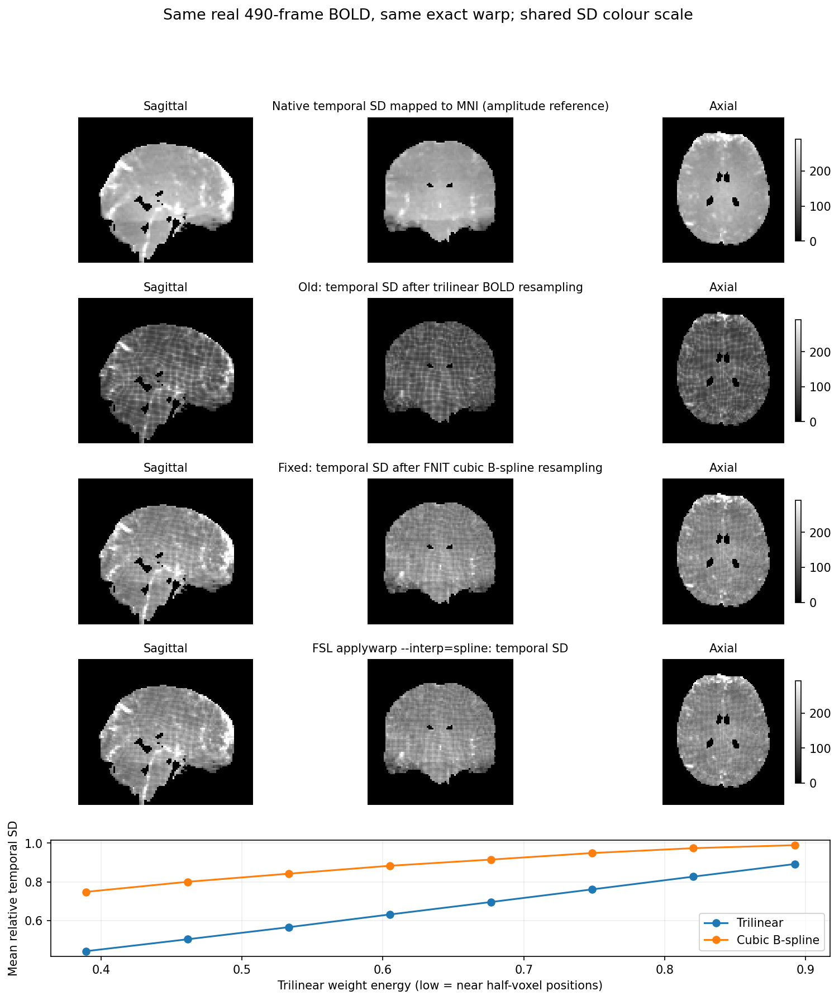

# 最终 MNI BOLD 的 temporal SD 格纹

旧流程将清理后的 4D BOLD 用三线性插值采样到 MNI。绘图脚本直接计算每个体素跨时间的标准差，格纹已存在于 NIfTI 中。回归后的邻近体素时序相关较低，三线性采样对八个体素求加权平均，使噪声方差随采样位置变化：接近原体素位置时变化小，接近八个体素的中点时衰减明显。非线性配准加上约 2.4 mm→2 mm 的网格变化，把这种变化表现为空间格纹。

现在完整 volume 的最后一步使用 float32 GPU 三次 B 样条。每帧只在三个空间轴求样条系数，然后把合成的 BBR 与 T1→MNI 变换应用一次。此步骤保留时间轴与回归后的负值，不添加空间平滑。样条系数采用周期边界；源体素边界使用 `±1e-6 voxel` 浮点容差，只将容差内微小越界夹回合法边界，真实图像外与目标掩膜外保持零。独立 `resample_world` 默认仍为线性；组织概率、ICA 图和 surface 皮层投影使用各自的采样策略，二值掩膜使用最近邻。

## 真实数据验证

以下 490 帧结果来自 2026-09-30 的固定 warp 插值验证，使用与当时完整 volume benchmark 相同的真实 BOLD、MNI→T1 pull 场及 T1→EPI RAS 矩阵。线性、FNIT 样条、SciPy 和 FSL 控制固定清理后的原生 BOLD、变换及目标掩膜，只改变重采样器。配准和去噪不会在这个控制中重新估计。

`relative_SD = SD(重采样的 4D BOLD) / 线性映射到 MNI 的原生 temporal SD`。分母提供局部信号幅度参照；它不等同于重采样 4D 后的 SD。`weight_energy = sqrt(∏[f²+(1−f)²])`，其中 `f` 是 XYZ 源体素坐标的小数部分；这个量衡量三线性权重平方和。用脑内、远离源网格边界与无信号区域的体素，回归 relative SD 对 weight energy 的斜率，量化采样位置造成的方差变化。斜率下降表示格纹减轻，不表示空间噪声方差完全一致。

| 同 warp、完整 490 帧 | 三线性 | 三次 B 样条 |
|---|---:|---:|
| 脑内有效分析体素 | 177,980 | 177,980 |
| relative SD 中位数 | 0.557756 | 0.837381 |
| SD 对采样位置的斜率 | 0.922613 | 0.568288 |
| 重采样含读写墙钟 | 39.13 s | 54.09 s |

斜率下降 **38.4%**。对同一输入重复 GPU 样条的最大绝对差为 0；完整 490 帧输出全部有限、TR 为 0.735 s、掩膜外为零。独立 SciPy 参照使用其中 8 个真实时间点：r=0.99999999995、MAE=0.001138、RMSE=0.001635、最大绝对差 0.0570，强度单位与 BOLD 相同。当时的 9 项 CPU/GPU 回归测试覆盖坐标合成、不同帧批次、独立参照、常数保持、掩膜和源网格外零值；本次新增的边界测试见下一节。

测量结果及输入、输出、代码哈希见[同 warp 对照报告](resampling.public.json)和[FSL 重采样参照](fsl_resampling.public.json)。FSL 6.0.7.22 在同一合成 warp 上处理完整 490 帧：脑掩膜内 r=0.99999999993、MAE=0.001431、RMSE=0.002011、最大绝对差 0.1271。远离边界的 182,718 个体素上 r=0.99999999993，MAE=0.001438。FSL 输出全部有限、网格一致、掩膜外为零、gzip CRC 通过；程序返回 255，因此条件接受该输出作为数值参照，并保留退出码。FSL 进程墙钟为 554.42 s；FNIT 样条为 54.09 s，前者包含进程启动，后者是初始化 CUDA 后的单次 API，二者均含输入解码和输出写盘。共享机器、单例测量，不能外推为稳定加速比。FSL 导出 `OMP_NUM_THREADS=8`，运行中主计算进程约使用一个 CPU 核心；未将其当作 8 线程并行优化后的速度。

完整流程报告另见[volume](fmri_volume.public.json)与[surface](fmri_surface.public.json)。FNIT 使用 ICA-AROMA 清理 BOLD，并按调用参数进行组织、运动或全局信号回归；UKB 发布数据使用 FIX。固定 warp 的对照用于检验坐标合成、插值精度及输出网格，整链报告记录实际去噪配置、耗时和输出统计。



上四行使用同一色阶，未做显示平滑；第一行是原生 SD 映射到 MNI 的幅度参照，第二、三行分别是旧线性与 FNIT 样条重采样 4D BOLD 后的 SD，第四行是官方 FSL `applywarp --interp=spline` 的 SD。下图按 weight energy 分箱显示 relative SD；每箱至少包含 100 个体素。

## 修复后整链输出的固定 warp 复核（8 帧）

2026-10-01 从修复后整链 `a7c5a64` 的原生清理 BOLD 中取前 8 帧（索引 0–7），使用本次整链保存的 MNI→T1 pull、T1→EPI 矩阵和 MNI 脑掩膜。将合成的 RAS pull 转成 FSL relative warp，独立运行原 FSL `applywarp --rel --interp=spline`，与本次 FNIT MNI 输出的相同 8 帧比较。源 BOLD、warp 和掩膜均来自这次运行；上一节保留的 490 帧控制有自己的输入和哈希。

| 新整链同 warp、8 帧 | MNI 脑掩膜内 | 内部有效区 |
|---|---:|---:|
| 体素数量 | 221,134 | 182,753 |
| FNIT 与 FSL Pearson r | 0.999999999931 | 0.999999999930 |
| MAE | 0.00138036 | 0.00137539 |
| RMSE | 0.00195595 | 0.00192060 |
| 最大绝对差 | 0.0536194 | 0.0534668 |

指标在同一掩膜内的八帧全部数值上计算；误差单位与 BOLD 强度相同。内部区同时剔除目标掩膜边缘和源 FOV 边界。FSL 进程墙钟为 **9.23 s**，包含 8 帧重采样与读写；没有在这个控制中重新估计配准或 ICA-AROMA。FSL 返回 255，保留该退出码，完整输出通过 gzip CRC、91×109×91×8 网格与 affine、全部有限值、float32、掩膜外零值及 TR 0.735 s 检查，按这些检查条件接受为插值参照。输入、warp、矩阵、FSL 可执行文件及源码 SHA-256 见[新 8 帧公开报告](volume_fixed_resampling.public.json)。影像与 FSL 日志保留在服务器私有验证目录。

## 边界回归测试

2026-10-01 修复了斜切网格的边界误判：源图像与参考网格相同、变换为单位矩阵时，affine 求逆的浮点舍入可能把边界坐标推到 `−1e-14` 等微小负值，旧的严格范围判断会将这些合法体素置零。现在 `linear`、`nearest` 和 `spline` 在采样前共同应用 `±1e-6` **源体素**容差；只将容差内微小越界夹回 `0` 或 `N−1`，真实图像外仍置零。

| 控制 | 检验内容 | 结果 |
|---|---|---|
| CPU/CUDA，三种插值，斜切 4D 恒等变换 | 六个边界面及角点的值、负值、帧数、float32、affine、TR 与时间单位 | 完整图像与原图匹配，绝对与相对误差容限均为 `2e-5` |
| 平移 `±5e-7 voxel` | 容差内微小越界保留边界值 | 通过 |
| 平移 `±2e-6 voxel` | 超出容差的源图像外边界保持零 | 通过 |
| 三组旋转的全 1 图像，13×15×11 网格 | 恒等变换后错误零值数量 | 修复前 243 / 254 / 364；修复后全部为 0，最大误差为 0 |
| 真实 EPI 网格与已保存脑掩膜的恒等坐标往返 | 判断该问题是否影响本例脑内体素 | 88×88×64 网格，最大往返误差 `7.105e-15 voxel`；旧判断误拒绝 2974 个 FOV 边界体素，其中脑内 0 个 |

全 1 图像和斜切随机图用于检查边界规则；真实数据的插值精度由上一节固定 warp 的 490 帧控制评估。2026-10-01 修复后，归一化、运动重采样与归一化接口的 **42 项 CPU/CUDA 测试全部通过，耗时 9.11 s**。可在已安装 FNIT 的环境中复测：

```bash
# 检查坐标组合、斜切边界、真实图像外置零、三种插值及时间轴保存。
python -m pytest -q tests/test_fmri_normalization.py \
  tests/test_fmri_motion_spatial.py tests/test_fmri_normalization_api.py
```

## 单被试复测

用独立的验证输出目录保留实际 warp。捕获操作只复制位移场和矩阵，计时报告单独记录并排除其开销；不会改变 pipeline 的计算。

```bash
# 运行完整 volume，并在私有目录保留最终重采样使用的实际变换。
python validation/fmri/benchmark_bids.py volume \
  --bids-root /data/bids --derivatives-root /results/fnit --subject 0001 \
  --mni-template /templates/MNI152_T1_2mm.nii.gz \
  --mni-brain-mask /templates/MNI152_T1_2mm_brain_mask.nii.gz \
  --source-root /path/to/Fudan-Neuroimaging-toolkit --source-revision YOUR_COMMIT \
  --capture-resampling-inputs /private/resampling_inputs \
  --report-out /private/volume.json --device cuda:0

# 固定刚生成的 clean_native、MNI 掩膜与捕获的变换，只比较插值。
python validation/fmri/validate_resampling.py \
  --native /results/fnit/sub-0001/func/sub-0001_task-rest_space-boldref_desc-clean_bold.nii.gz \
  --candidate /results/fnit/sub-0001/func/sub-0001_task-rest_space-MNI152NLin6Asym_res-2_desc-clean_bold.nii.gz \
  --reference /templates/MNI152_T1_2mm.nii.gz \
  --mask /results/fnit/sub-0001/func/sub-0001_task-rest_space-MNI152NLin6Asym_res-2_desc-brain_mask.nii.gz \
  --pull /private/resampling_inputs/mni_to_t1_pull_ras.nii.gz \
  --matrix /private/resampling_inputs/reference_to_source_world.txt \
  --private-output /private/resampling --report-out /private/resampling.json \
  --source-revision YOUR_COMMIT --device cuda:0
```

`compare_fsl_resampling.py` 接收同一组 `native/candidate/reference/mask/pull/matrix` 参数，另加 `--fsl-applywarp /path/to/fsl/bin/applywarp`、`--frames 490`、`--private-output /private/fsl_reference` 和 `--report-out /private/fsl_reference.json`。它用 FNIT 将合成的 RAS pull 转成 FSL relative warp，再独立运行官方 `applywarp --rel --interp=spline`。只在这个参照脚本中调用 FSL；FNIT 运行时没有该依赖。保留退出码并核验 gzip CRC、网格与全部有限值；源边界策略不同的误差单独列出。

`render_resampling.py --private-maps /private/resampling/sd_maps.private.npz --report /private/resampling.json --fsl-bold /private/fsl_reference/fsl_spline_frames.nii.gz --figure-out /private/comparison.png` 生成上图。真实 NIfTI、空间数组和日志应保留在私有目录；公开报告和 PNG 前需确认发布权限。

原软件对应：[FSL applywarp 文档](https://fsl.fmrib.ox.ac.uk/fsl/docs/registration/fnirt/user_guide.html#now-what-applywarp)、[源码](https://git.fmrib.ox.ac.uk/fsl/fugue)。三次 B 样条的独立参照为 [SciPy map_coordinates](https://docs.scipy.org/doc/scipy/reference/generated/scipy.ndimage.map_coordinates.html)，`order=3, mode="grid-wrap"`。实现复用 FNIT 已有 GPU 样条采样核，系数求解位于 `src/fnit/fmri/normalization.py`。
