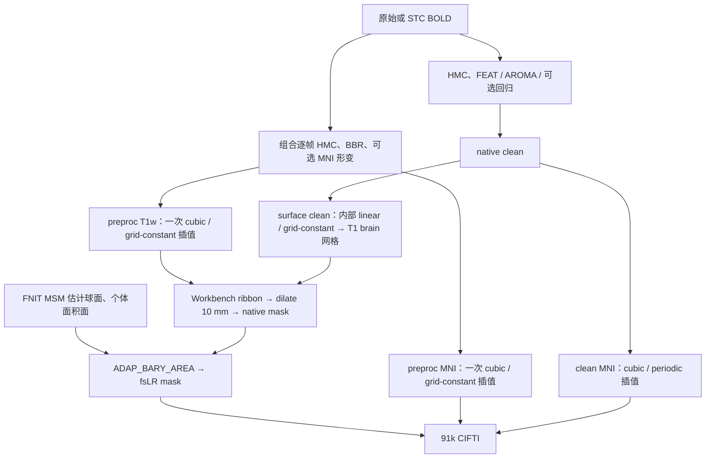

# Volume / surface 重采样机制审计（2026-10-02）

## 1. 范围、版本与流程

审计对象为 `81f1bb3cccf520b736507baad69b73b7fef97fb5`；检查时远端 `main` 与本地相同。本次读取当前调用链、官方固定版本源码和已有真实数据报告，并现场确认服务器上的真实 BOLD、模板、掩膜及权重可读。没有修改生产算子、重跑完整官方 pipeline 或发布原始影像。

对应参考分别是 **FSL 6.0.7.22** 的 applywarp、**FreeSurfer 8.2.0** 的 SynthMorph apply，以及 **fMRIPrep 25.2.4 / NiTransforms 25.1.0 / sMRIPrep 0.19.2** 的 preproc 与 fsLR 工作流。HCP ribbon、FreeSurfer fsaverage 是不同参考流程，单独说明。

图中 `preproc` 与 `clean` 是用户明确选择的两条信号路径，CIFTI 不混用两者。公共函数名决定入口；插值、坐标与边界参数才决定实际重采样机制。

## 2. 已确认的机制差异

### 2.1 clean MNI：Periodic 不等于 FSL Constant/extraslice

当前 [end_to_end.py](../../../src/fnit/fmri/end_to_end.py) 的 `clean_mni` 显式使用 `spline / periodic / float64`。[_world_resampling.py](../../../src/fnit/_world_resampling.py) 用周期 FFT 求空间三次 B 样条系数；超出源中心网格的采样置零，微小越界有 `1e-6 voxel` 容差。

已实时核对 FSL 6.0.7.22 发布清单中的 fugue 2603.0、newimage 2601.0 与 warpfns 2501.0。官方 applywarp 在最终采样前设置 `extraslice`；NEWIMAGE 将它映射为 Splinterpolator 的 **Constant** 系数边界，而 Periodic 是另一枚举值。官方还单独计算并乘源有效域 mask。即使最终图像外均为零，图像内靠近边缘的样条系数仍会不同。此项是明确机制差异，不能写成严格 FSL spline 复现。

FSL 的坐标矩阵和形变组合还在多个节点舍入为 float；当前 World 链默认用 float64 组合，周期样条查询才转 float32。因此既有 FSL 误差不能只归因于系数边界。旧控制导出 FSL relative 场时也有一次 float32 量化。

### 2.2 MNI mask：最近邻半体素舍入不同

`end_to_end.py` 的 MNI mask 使用 World 分支最近邻；共享 sampler 调用 PyTorch `grid_sample(nearest)`，采用 ties-to-even。官方 NEWIMAGE 调用 `MISCMATHS::round`，在源 FOV 内正半整数处向较大索引舍入，例如 `0.5 → 1`。FNIT 常规 FSL ApplyWarp 分支已经用 `floor(coords + 0.5)`，World 分支没有使用同一规则。

恰落半体素的标签或二值掩膜可选中不同源体素。这是确定的离散规则差异；本次没有测量真实非线性 MNI mask 中有多少体素触发。本次在服务器 PyTorch 2.5.1 上做了两值单元核查：源值 `[10,20]`、源坐标 `0.5`，`grid_sample(nearest)` 得到 10，FSL 正半整数规则预期为 20。这不是实测 FSL 命令，也不作为真实数据 benchmark。

### 2.3 SynthMorph final：使用本包扩展的样条协议

当前 [apply_transform](../../../src/fnit/synthmorph/pipeline.py) 收到 `WorldTransformChain` 后，进入共享 world sampler。volume 的 clean 和 preproc 均显式选择 spline。官方 FreeSurfer 8.2.0 `mri_synthmorph apply` 只提供 linear/nearest，默认 linear、fill=0，调用 Surfa。

因此该分支可描述为 **SynthMorph 估计形变，FNIT 按选定的 BOLD 协议采样**；不能描述为官方 SynthMorph apply 的相同机制。preproc 所选的 cubic/grid-constant 是对照固定 fMRIPrep 25.2.4 的策略。上一轮普通 DenseWarp 的官方 linear benchmark 没有验证 World spline 分支。

普通 DenseWarp linear 入口另有已记录的 FOV 支持差异：FNIT `[0,n−1]`，Surfa `[0,n)`。既有首帧真实诊断显示 14,467 个末层中心外体素覆盖该帧全部绝对误差 >1 的位置，与该例模板脑 mask 没有交集；这是该首帧的结果，不能外推全部 490 帧。见 [SynthMorph 边界诊断](../../registration_lossless_20261002/synthmorph_boundary.public.json)。

### 2.4 surface clean：仍有内部线性重采样入口

[surface_pipeline.py](../../../src/fnit/fmri/surface_pipeline.py) 的 `signal="clean"` 将已 HMC/去噪的 native clean 通过 BBR inverse pull 映射到 T1 brain 网格。它仍调用 `normalization.resample_world()`，实际默认参数是 **linear / grid-constant / float64**，没有重复传入运动矩阵。

此处未接入 `TorchApplyWarp` / `apply_transform()` 公共入口，也不是 fMRIPrep preproc 的原始 BOLD 单次插值流程。默认 `signal="preproc"` 直接读取 volume 的 T1w/MNI preproc，不经过这里。最新独立 surface benchmark 使用 preproc，没有关闭 clean 中间采样的官方固定输入验收。

### 2.5 独立 surface 的主要差异在球面估计及其下游面积面

当前四个 surface 模块及 `msm/` 中 19 个受测文件，共 **23 个源码 SHA**，与真实 `surface_gpu_parallel` 的发布记录全部一致。完整独立 surface 对照中，MSM 初始化球面、native sulc、参考球面/参考 sulc、ROI 和有效四级配置相同，输出球面仍有差异；按各自球面产生的个体 32k 面积面也随之改变。

这会改变相同 Workbench `ADAP_BARY_AREA` 命令的输入和权重。现有结果支持继续定位 MSM 首次分歧，不能直接判定 ribbon 或面积校正算法实现错误。

## 3. 已有对齐证据的步骤与其他参考流程

| 步骤 | 当前实现与官方规则 | 结论 |
|---|---|---|
| preproc 一次空间插值 | 组合 HMC/BBR/形变；cubic、grid-constant、cval=0，对照固定 fMRIPrep 25.2.4 | 有完整 490 帧固定变换控制；不是早期 ANTs Lanczos 路径 |
| fsLR ribbon、dilate、mask | 官方 Workbench ribbon-constrained、10 mm nearest dilate、native mask | 与固定 fMRIPrep fsLR 命令顺序一致 |
| fsLR 表面重采样 | ADAP_BARY_AREA、native/个体 32k midthickness 面积面、current ROI、atlas mask | 共同完整输入时已验证零误差；独立球面产生的差异另列 |
| 91k CIFTI | LAS 轴重排、固定 21 结构排序与皮层下取值 | 没有再对皮层下加插值或平滑；共同输入控制一致 |
| AROMA component maps | 内部 wrapper 默认 linear；原 ICA-AROMA register2MNI 也是 applywarp trilinear | 阶数一致，95 maps 固定输入误差很小，50 个 noise 标签一致；入口尚未统一 |
| goodvoxels | FNIT 可选传入；固定 fMRIPrep fsLR 工作流也可不提供 | 不属于默认 fMRIPrep 对照缺失；HCP v5.0.0 默认还估计局部 COV goodvoxels，是另一 profile |
| fsnative/fsaverage | 官方 mri_vol2surf 三线性、厚度分数 0..1 步长 0.2 六点平均 | 当前 FNIT pipeline 只输出 fsLR32k/91k，不能将其认作已实现 fsaverage 采样 |
| midthickness 准备 | 当前要求已有 midthickness/graymid；缺失即报错 | sMRIPrep 可自动生成，这是输入自动化缺口；当前没有用 white/pial 均值偷偷替代 |

低层 FEAT 的可选 `spatial_warp/postmat` 另走 [spatial.py](../../../src/fnit/fmri/spatial.py) 的 SciPy spline 路径；其系数/边界与 FSL Constant 的逐步算术尚未做相同实现验证。默认 raw-BIDS volume 没有启用该分支，不能把它算作默认输出已确认的错误。

## 4. 真实精度证据与未关闭的门禁

本表重新核对已有工件及当前源码绑定，**没有新增完整 benchmark**。数值均保留各报告的版本和输入范围，不将它们合并为当前整链官方等价结论。

| 对照范围 | 结果 | 证明范围 |
|---|---|---|
| 本轮公共入口完整 490 帧、新旧同后端 FNIT | FNIRT/SynthMorph 全输出逐位相同；617 相关 GPU tests 通过、12 跳过 | 入口重构保持 FNIT 结果，不证明官方机制相同 |
| 旧 clean 与 FSL 固定 warp，8 帧 | r≈0.999999999929；MAE 0.001461；max 0.054962 | 高度接近，非逐值一致；官方退出 255，按 CRC/grid/finite 条件接受 |
| 旧 clean 与 FSL 固定 warp，490 帧 | r≈0.99999999993；MAE 0.001431；max 0.1271 | 有边界、坐标和导出场量化因素；同样保留官方退出 255 |
| preproc 与官方安装函数，固定 FNIT 变换，490 帧 | T1w/MNI max 均为 0.00048828125；原门通过 | 坐标组合与采样控制，不包含独立变换估计 |
| preproc 固定官方真实节点变换与网格，490 帧 | T1w max 0.000976563，通过；MNI max 22930.414，未通过 | MNI 实际保存产物的验收缺口仍存在 |
| 上述 MNI 与官方串行源码回放 | max 0.000244141；官方实际产物自身有 12/490 帧不等于串行回放 | 原因未确定；不能据此认定 FNIT sampler 错，也不能替换失败的实际产物门 |
| surface 共同几何、球面、面积面和 volume，490 帧 | 双侧各 15,921,080 个值及 CIFTI 44,728,180 个值误差均为 0 | 投影与组装的固定输入对齐 |
| surface 独立 MSM 等完整链，490 帧 | 球面角差 L/R mean 0.221050° / 0.319595°；CIFTI 时间 r mean 0.977911，relative RMSE 2.2418%；19 个皮层下结构逐值相同 | 皮层/球面仍不同；不包含 raw BIDS volume/recon-all 的独立整链 |

完整计时仍以各独立报告为准：本轮公共入口 FNIRT/SynthMorph API 含保存 542.12 / 461.54 s；其新旧测量为 511.09→542.12 / 499.55→461.54 s，属于共享服务器单轮观察。当前审计没有测量更换机制的速度，不能给出修复后的性能或精度收益。

## 5. 下一步修改与验收顺序

1. **先确定并显式记录采样协议。** 让配准后端与采样协议分开：fMRIPrep preproc、FSL clean、官方 SynthMorph apply 分别采用对应定义。保留现有数据的源码/协议记录，不能用函数名代替机制说明。
2. **补 FSL spline 的 Constant 系数、extraslice/源有效域、逐步坐标和最近邻规则。** 优先审查并复用现有 [MCFLIRT sampling](../../../src/fnit/mcflirt/sampling.py) 的 Constant 样条组件；applywarp 的坐标与有效域仍须单独核对，不能直接套用整条 motion sampler。
3. **统一 surface clean 和 AROMA 中间入口。** 参数显式写出，先要求改造前后逐位一致，再做固定 transform/参考网格的原软件控制。仅换入口不会关闭数值机制差异。
4. **MSM 逐级、逐迭代定位首次分歧。** 固定初始化、球面查询权重、cost、HOCR/FastPD 标签、unfold 与停止条件，再比较球面、个体面积面、GIFTI 和 CIFTI。保持已匹配的 Workbench 投影步骤。
5. **重新关闭官方实际 MNI 节点门。** 保存全部 490 帧真实产物、输入/transform/grid/source SHA，保留逐帧差异，查明 12 帧官方重放不一致的原因。
6. **最后补可选 warp、HCP goodvoxels、fsaverage 等扩展。** 分 profile 验收，不能改变现有 fsLR 定义后仍沿用旧 benchmark。

改 FSL 边界或 SynthMorph 插值会有意改变现有输出，不属于仅保持旧 FNIT 数值的性能重构。应独立发布官方匹配报告和版本记录。本次没有执行上述修改。

## 6. 本次检查、工件与更新记录

- 现场核对本地/远端 `main`、源码和真实私有验证输入可读性；不下载权重或再分发模板。
- 现场下载官方固定源码用于只读审查，记录版本与 SHA；不向 FNIT 复制发布官方源码。
- 当前 surface 4 个模块和 MSM 19 个文件与已完成真实 benchmark 的 SHA 全部相同。
- 当前生产代码没有修改；本次仅新增此审计页及 [source_manifest.public.json](source_manifest.public.json)。没有重跑大 benchmark，也没有将此前测试计数写成新测试结果。
- 2026-10-02：首次明确列出 FSL Constant/Periodic、最近邻舍入、SynthMorph apply 与 World 扩展、surface clean 入口及 MSM/实际 MNI 未关闭项。
- 2026-10-02 上一轮：[公共入口接入](../public_resamplers_20261002/README.md)，保持旧 FNIT 全部输出。
- 2026-10-01 历史：[固定采样](../resampling.md)、[surface 执行优化](../surface_gpu_parallel/README.md)。

## 7. 原实现与证据链接

- [FSL 6.0.7.22 发布清单](https://fsl.fmrib.ox.ac.uk/fsldownloads/fslconda/releases/fsl-6.0.7.22_linux-64.yml)；[applywarp 2603.0](https://git.fmrib.ox.ac.uk/fsl/fugue/-/blob/2603.0/applywarp.cc)；[NEWIMAGE 2601.0](https://git.fmrib.ox.ac.uk/fsl/newimage/-/blob/2601.0/newimage.cc)；[warpfns 2501.0](https://git.fmrib.ox.ac.uk/fsl/warpfns/-/blob/2501.0/warpfns.h)。
- [FreeSurfer v8.2.0 SynthMorph CLI](https://github.com/freesurfer/freesurfer/blob/v8.2.0/mri_synthmorph/mri_synthmorph)；[Surfa](https://github.com/freesurfer/surfa)。
- [fMRIPrep 25.2.4 volume sampler](https://github.com/nipreps/fmriprep/blob/25.2.4/fmriprep/interfaces/resampling.py)；[fsLR 与 fsaverage 工作流](https://github.com/nipreps/fmriprep/blob/25.2.4/fmriprep/workflows/bold/resampling.py)；[sMRIPrep 0.19.2 surfaces](https://github.com/nipreps/smriprep/blob/0.19.2/src/smriprep/workflows/surfaces.py)。
- [HCP v5.0.0 RibbonVolumeToSurfaceMapping](https://github.com/Washington-University/HCPpipelines/blob/v5.0.0/fMRISurface/scripts/RibbonVolumeToSurfaceMapping.sh)；[ICA-AROMA 原实现](https://github.com/maartenmennes/ICA-AROMA/blob/master/ICA_AROMA_functions.py)。
- [官方实际 volume 节点门](../fmriprep/actual_node_interpolation_full490.public.json)；[MNI 失败诊断](../fmriprep/actual_node_mni_replay_failure.public.json)；[surface 共同投影](../fmriprep/surface_stcoff_ca3df003_projection_paired.public.json)；[独立 surface](../surface_gpu_parallel/parallel_vs_official_strict1.public.json)；[AROMA 固定输入](../aroma_spatial_control.public.json)。
- 方法文献：Esteban et al., Nature Methods 2019, [fMRIPrep](https://doi.org/10.1038/s41592-018-0235-4)；Glasser et al., NeuroImage 2013, [HCP minimal preprocessing](https://doi.org/10.1016/j.neuroimage.2013.04.127)；各算法的原文献另见现有 [FNIRT](../../../docs/fnirt/README.md)、[SynthMorph](../../../docs/synthmorph/README.md)、[MSM](../../../docs/msm/README.md) 功能页。
