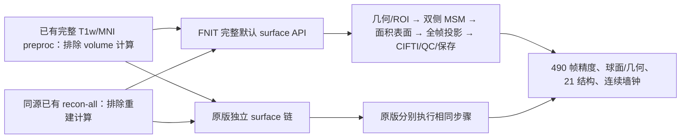

# 完整默认 surface 复测：已有 volume / recon-all → fsLR32k / 91k

2026-10-01，实测 FNIT 源码 `7102c1871395e708d82b19e15d7c3cbc0e5537e1`。使用一例真实 UKB 全 490 帧 BOLD（88×88×64，TR 0.735 s）、`cfb7beee` 完整 volume 的 T1w/MNI preproc，以及同源已有 FreeSurfer 7 重建和 graymid。双方从相同完整 volume 和重建开始，独立准备几何、ROI、MSM 输入和注册球面；没有复用 FNIT 的准备结果作为原版参照。



## 结果与计时范围

| 连续完整 surface | 墙钟秒 | 说明 |
|---|---:|---|
| FNIT 第一次 | **443.929342** | 包含 0.035936 s 私有输入捕获；扣除后 443.893406 s |
| FNIT 第二次 | **441.333966** | 包含 0.037382 s 捕获；扣除后 441.296585 s |
| 原版严格单线程 MSM | **2825.612295** | 全部几何、双侧 MSM、投影、CIFTI、QC 和最终保存 |
| 原版 8 线程 MSM | **846.767766** | 仅时间观察，不作为严格精度参照 |

FNIT 两次使用新进程、新 derivatives 输出，默认 `registered_spheres=None`、`signal="preproc"`、`msm_execution="optimized"`，双侧都实际估计 MSM。计时覆盖 API 输入身份核验至全部最终文件发布，排除安装/编译、导入、CUDA 初始化、事前输入哈希和事后比较；捕获开销另外保留。两个 API 均保存 11 个持久输出。MSM 内部每次重置前记录峰值，整例 allocated/reserved 为 **0.343548 / 0.425722 GB**，而非只读最后一个阶段。

原版计时从几何转换开始，到所有最终数据、球面和完整 QC 报告第一次保存为止；包含参考驱动的检查、哈希与中间保存，追加测得的墙钟字段在此边界外。SIF 校验和包导入在外，容器进程另为单线程 **2838.952767 s**、8 线程 **860.101586 s**。几何/投影使用 8 线程，只有 newMSM 的线程数改变；严格精度使用单线程。共享 H100 两张卡的负载分别保存在 FNIT 报告中，测量时还存在其他 GPU/CPU 任务；不据此声称固定加速比。

### 全帧精度

输入 preproc 两份文件 SHA 完全相同；独立完成的 L/R GIFTI 各比较 15,921,080 个值，CIFTI 比较 44,728,180 个值。不归一化强度，不拟合尺度/偏移，也不追加平滑。Pearson r 为每个非恒定时序的全 490 帧相关系数，恒定序列仍参与逐值误差。

| 输出 | 有效时序 | 时间 r mean / median / minimum | MAE | RMSE | relative RMSE | 最大绝对差 | 不同值数 |
|---|---:|---:|---:|---:|---:|---:|---:|
| 左 GIFTI | 29,695 | 0.979065 / 0.991411 / −0.267302 | 79.0976 | 146.5825 | 0.017778 | 2676.0938 | 14,376,246 |
| 右 GIFTI | 29,716 | 0.953067 / 0.980258 / −0.127232 | 138.3231 | 258.1970 | 0.029083 | 3593.6602 | 14,559,870 |
| 91k CIFTI | 91,281 | **0.977911 / 0.997039 / −0.267302** | 77.3913 | 177.1381 | 0.022418 | 3593.6602 | 28,936,116 |

双方 GIFTI 恒定序列左 2797、右 2776（包括 medial wall），CIFTI 各 1 条恒定序列，单侧恒定不匹配数为 0。CIFTI axes、TR、21 个结构和内嵌 metadata 相同；19 个皮层下结构全部逐值一致。注册球面拓扑相同，角差 mean/p95/max 为左 **0.221050/0.489326/0.951417°**、右 **0.319595/0.704916/1.429378°**；保存球面翻折面数 FNIT/原版左 2/4、右 2/2。

初始球面、实际旋转球面、native sulc、参考球面/参考 sulc、ROI 及四级科学配置逐值相同。sulc 的 GIFTI intent 为 FNIT 2005、原版 11，标量值相同；比较器保留 intent 差异，并单独比较标量。独立 scanner-RAS 几何转换最大顶点差为 8.53e-6 mm。注册球面与其下游 32k 面积表面仍有差异，完整皮层结果未达到逐值一致；未确定配准内部原因，本次未修改计算子函数，也未用历史零误差控制替换这项结果。

两次 FNIT 的 GIFTI 解码时序、CIFTI 和保存球面逐值相同。GIFTI XML 的临时工作路径不同，文件 SHA 不同；重复性报告同时保留文件 SHA 和解码数组检查。

### 内部步骤

| 第一次 FNIT 内部阶段 | 秒 | 原版严格单线程阶段 | 秒 |
|---|---:|---|---:|
| MSM 准备＋双侧估计 | 205.609 | 左 / 右几何、ROI、初始化及 MSM 输入 | 12.051 / 11.423 |
| 左 / 右 ribbon | 28.665 / 28.581 | 左 / 右 MSM 估计 | 1261.620 / 1250.241 |
| 左 / 右 dilate | 36.877 / 37.069 | 左 / 右 32k 面积表面 | 0.692 / 0.688 |
| 左 / 右 native mask | 17.850 / 18.140 | 投影、CIFTI、检查及中间保存 | 288.068 |
| 左 / 右 area resample | 10.373 / 10.574 | 最终发布及报告第一次保存 | 0.824 |
| 左 / 右 atlas mask | 4.647 / 4.659 |  |  |
| CIFTI | 25.263 |  |  |

两边内部阶段范围不同，表中各行不逐项视为同一操作；完整连续墙钟取首表，不能将以前独立 MSM、投影或 volume 时间相加生成本轮结果。

## 复现命令

先按项目主页 Conda 环境安装 FNIT、编译包内 MSMSulc 扩展，校验既有重建及完整 volume 来源；创建两个新目录，各自放入已有 volume 数据与对应 JSON。资源通过 `fnit-setup-fmri-surface-assets --fmriprep` 准备并核验。此驱动固定当前真实 490 帧单例，不是裁帧 benchmark。

```bash
source_root=/absolute/path/Fudan-Neuroimaging-toolkit   # 冻结的 FNIT 源码目录
bids_root=/absolute/path/bids                          # 与 volume 一致的原始 BIDS
volume_derivatives_root=/absolute/path/new-derivatives # 已放入完整 volume 及 JSON，未有 surface
recon_all_subject=/absolute/path/subjects/sub-0001     # 匹配原始 T1 的已有几何
hcp_assets_root=/absolute/path/hcp_surface_assets      # 已按大小和 SHA 校验的资源
surface_report=/absolute/path/private/fnit.public.json # 聚合公开报告
private_capture_root=/absolute/path/private/capture   # 全新私有目录，禁止公开
export PYTHONPATH="$source_root/src"
export CUDA_VISIBLE_DEVICES=1                          # 本次使用物理 H100 1，按现场设备选择
export OMP_NUM_THREADS=8 MKL_NUM_THREADS=8 OPENBLAS_NUM_THREADS=8 NUMEXPR_NUM_THREADS=8

python "$source_root/validation/fmri/benchmark_surface_e2e.py" \
  --bids-root "$bids_root" --derivatives-root "$volume_derivatives_root" \
  --subject 0001 --recon-all "$recon_all_subject" --hcp-assets-dir "$hcp_assets_root" \
  --source-root "$source_root" --source-revision "$(git -C "$source_root" rev-parse HEAD)" \
  --wb-command wb_command --device cuda:0 --threads 8 --gpu-memory-limit-gb 20 \
  --capture-dir "$private_capture_root" --report-out "$surface_report"
```

驱动参数逐项说明：`--bids-root` 是原始来源，`--derivatives-root` 是含完整 volume 的新输出根，`--subject` 是无 `sub-` 的标签；`--recon-all` 为同源重建，`--hcp-assets-dir` 为资源根；`--source-root` 和 `--source-revision` 绑定源码/提交，`--wb-command` 选择 Workbench；`--device` 为逻辑 CUDA 设备，`--threads` 为 CPU/PyTorch 线程数，`--gpu-memory-limit-gb` 为不超过 20 GB 的额度；`--capture-dir` 为可选全新私有捕获目录（精度比较需提供），`--report-out` 为公开聚合 JSON。

原版参考输入 JSON 仅在私有目录保存，字段如下：

```json
{
  "recon_all": "/absolute/path/subjects/sub-0001",
  "hcp_assets_dir": "/absolute/path/hcp_surface_assets",
  "newmsm_env": "/absolute/path/fsl-newmsm-env",
  "t1w_bold": "/absolute/path/space-T1w_res-native_desc-preproc_bold.nii.gz",
  "mni_bold": "/absolute/path/space-MNI152NLin6Asym_res-2_desc-preproc_bold.nii.gz",
  "repetition_time": 0.735,
  "expected_frames": 490,
  "fsnative_to_t1w": null
}
```

`recon_all`/`hcp_assets_dir` 含义同上；`newmsm_env` 包含原版 `bin/newmsm` 及 `lib/`；两份 `*_bold` 为完全相同的 volume 起点；`repetition_time` 为 BIDS 秒单位 TR，`expected_frames` 为完整帧数；`fsnative_to_t1w=null` 表示已核对同源身份，另一重建空间需提供正向 scanner-RAS 4×4 世界仿射文件。

```bash
# 固定容器的 surface-only 原版驱动；不重新运行 volume 或 recon-all。
python validation/fmri/fmriprep/run_surface_reference.py \
  --inputs-json /absolute/path/private/reference-inputs.json \
  --container-image /absolute/path/fmriprep-25.2.4.sif \
  --singularity /absolute/path/singularity \
  --templateflow-dir /absolute/path/templateflow-cache \
  --fs-license /absolute/path/license.txt \
  --output-root /absolute/path/private/new-reference-output \
  --work-root /absolute/path/private/new-reference-work \
  --threads 8 --msm-threads 1

# 另用新 work/output 和 --msm-threads 8 测原版时间；正式精度仍绑定单线程。
python validation/fmri/compare_surface_e2e.py \
  --candidate-manifest /absolute/path/private/capture/outputs.private.json \
  --reference-manifest /absolute/path/private/new-reference-work/outputs_manifest.private.json \
  --report-out /absolute/path/precision.public.json \
  --figure-out /absolute/path/surface_e2e.png
```

原驱动参数：`--inputs-json` 是上述私有输入；`--container-image` 是固定 SHA 镜像，`--singularity` 选择容器程序，`--templateflow-dir` 为已校验缓存；`--fs-license` 只读绑定用户已有合法许可；`--output-root` 与 `--work-root` 必须全新；`--threads` 为投影 CPU 线程，`--msm-threads` 为原版配准线程（1 是严格参照）。比较器参数分别选择两份私有输出 manifest、聚合 JSON 和可选统计脑图。`validation_complete=true` 表示比较完整，不表示所有数值相等。

原软件内部分别使用 FreeSurfer `mris_convert --to-scanner`、sMRIPrep `NormalizeSurf`/形态转换、Workbench `-surface-sphere-project-unproject`/ROI/球面 affine 准备、newMSM 全四级配准，再调用镜像内真实 fMRIPrep fsLR/grayords 工作流。原命令与输入路径留在服务器私有日志；公开驱动显示具体调用。FNIT 运行时没有调用这些原版程序或包装包。

## 来源、运行检查及文件索引

FNIT Python 3.11.16 / PyTorch 2.5.1+cu118 / nibabel 5.4.2；Workbench 2.1.0。CUDA TF32 开启，主要影像与输出 float32，MSM 按原实现使用 float64，未启用低精度。编译器及严格浮点标志见[编译记录](build_provenance.public.json)，运行源码的 107 个文件 SHA 见两份 FNIT 报告；合并 main 的其他模块更新后，这 107 个文件仍逐字节一致，见[发布核对](publication_source.public.json)。

原版 fMRIPrep 25.2.4、sMRIPrep 0.19.2、NiWorkflows 1.14.4、FreeSurfer 7.3.2、Workbench 2.0.1；newMSM binary SHA 与既有源码审计一致，算法源为 MIT `260718953547743c028a45f8c885d163441df87a`。固定 SIF 大小 2,413,375,488 bytes、SHA `8e32238619053c1f9d1739b26f4afd72df809d914f5a5771707bf5da4b1d0f39`。共享文件系统读 SIF 曾报 I/O 错误，改用同 SHA 的服务器本地 SSD 副本，原镜像未改动。

HCP 表面资源按 FNIT 固定 Release 清单核验；TemplateFlow dseg 保持原作者来源，并核对大小和 SHA。源码、容器、输入、几何、实际配准输入和输出哈希分别绑定。原 MRI、完整时间序列、几何、许可及私有绝对路径不发布，仅发布统计脑图、聚合数值和校验和。

第一次 FNIT 启动误用了带 `run-01` 实体的 BIDS，而既有 volume 文件不含该实体，入口按来源合同拒绝；改为 volume 的原始 BIDS 后重新完成。原版驱动首次同时传 `out_file` 和互斥 `out_datatype`，转换器拒绝；按官方接口保留明确 GIFTI 输出路径后重启全新 work/output。这两项是 benchmark 调用/适配问题，没有修改 FNIT 计算函数，失败启动的时间不计入成功 benchmark。

- [发布源码、脚本及脑图核对](publication_source.public.json)。
- [第一次 FNIT API](fnit_run1.public.json)、[第二次 FNIT API](fnit_run2.public.json)：完整计时、内部分步、11 输出、共享 GPU 状态、峰值显存、源码/二进制 SHA。
- [严格单线程原版](reference_strict1.public.json)、[8 线程时间观察](reference_speed8.public.json)：独立完整链、固定版本、实际输入、输出和容器时间。
- [完整精度](precision.public.json)：全帧误差、时间 r、21 结构、注册球面、独立几何、实际 MSM 输入及脑图 SHA。
- [重复性](repeatability.public.json)、[独立几何预检](geometry_precheck.public.json)、[SIF 副本核验](container_local_copy.public.json)、[编译器与严格浮点标志](build_provenance.public.json)。

## 更新记录与参考实现

本次替换 pipeline 文档中“默认 surface 未重测”的最新状态；`ca3df003` 的提供初始化球面控制和 `4f7bd9f2` 的独立 MSM/固定 clean 控制保留为历史，不拼接成新的完整耗时。没有改变 surface/volume/MSM 的运行算法。

[当前功能文档、参数和历史](../../../docs/fmri/surface.md) · [fMRIPrep 25.2.4 resampling](https://github.com/nipreps/fmriprep/blob/25.2.4/fmriprep/workflows/bold/resampling.py) · [sMRIPrep 0.19.2 surfaces](https://github.com/nipreps/smriprep/blob/0.19.2/src/smriprep/workflows/surfaces.py) · [NiWorkflows 1.14.4 CIFTI](https://github.com/nipreps/niworkflows/blob/1.14.4/niworkflows/interfaces/cifti.py) · [MSM 源码审计](../../msm/README.md)。论文引用见[surface 功能页](../../../docs/fmri/surface.md#参考文献与原实现)。
