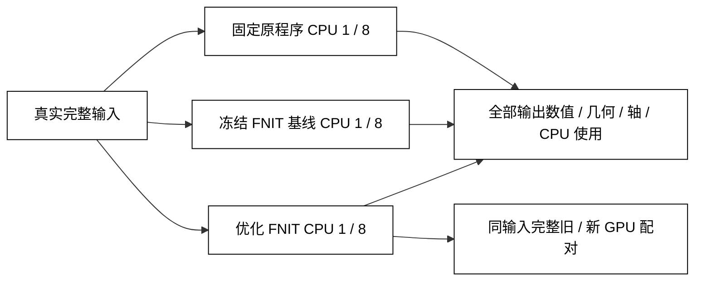

# MSM、HCP 特征与表面 CPU 官方对照

## 1. 功能与本轮范围

本轮基线为 `cc9402734faeba93b3a13c29932fa1392eaccf62`。完整功能清单见 [功能矩阵](FEATURE_MATRIX.md)：MSMSulc、MSMAll、VN、DR、WRN、配准准备、表面几何、体积到表面投影、CIFTI 和 surface pipeline。

此前的 10 项完整基线回执见 [聚合检查点](report.checkpoint.public.json)。2026-10-05 已取回候选配准 CPU1/8 六项、HCP 特征 CPU1/8 八项的完整数值、实际源码与输入 SHA，见 [最新精度与耗时报告](completion_status_20261005.public.json)。全部 14 项输入在配对前后不变；保留完整帧数、顶点、d7–d21 组数和原配准停止条件。原 nodes/spectra 六项已经完成，全部 nodes 的数值核对待导出。固定投影与完整 surface 的原版 command_0 在候选启动前失败，失败原因和重新验证单列，不作为通过项。



## 2. Python 调用与输入输出

每项 API 的完整变量示例、逐参数说明和输出结构分别见 [MSMSulc](../../../docs/msm/README.md)、[MSMAll](../../../docs/msm/msmall.md)、[HCP 特征](../../../docs/msm/features.md)和 [surface](../../../docs/fmri/surface.md)。本目录的 `adapter.py` 仅用于统一记录完整 API，不作为新的运行时入口。

本轮真实输入：

- MSMSulc：左右 native 球面分别 120,035 / 122,950 顶点，参考球面 163,842 顶点；原四级配置完整执行。
- MSMAll：左右各 32,492 顶点的真实 WRN C 特征，33 列；原一级 coarse 和三级 refine 分别完整执行。
- VN/DR/WRN：完整 490 帧，90,568 个有效 grayordinates，d40 参考、32 个显式选中组件；ICA mixing 为 106 列，其中 84 noise / 22 signal。原 91,282 轴中 714 个常数位置已在输入准备时排除，双方读取同一已声明 BrainModelAxis。
- WRN：匹配 59,380 个皮层 grayordinates 的正均值 1 area、全部 d7–d21 参考、同一双侧 midthickness 与 14 mm 原 Workbench 平滑。
- 固定几何投影：490 帧 T1w / MNI BOLD、TR 0.735 s，完整双侧 native 几何；输出 32k GIFTI 与 91,282 列 CIFTI。
- 完整 surface：已公开病例的完整 180 帧、TR 2.1 s，以同一已完成 volume 和 recon-all 为起点，surface 输出目录为空；计入几何准备、MSMSulc、投影、CIFTI、QC 与保存。volume 和 recon-all 计算另属各自整链测试。

原软件产生全部参考输出；FNIT 调用只读原始声明输入，不读取参考输出。逐顶点数组、个体路径和新派生影像保留在私有运行目录。

## 3. 测试命令

协调者用同一 harness 配对运行，各参数含义如下：

```bash
python tools/benchmark_multimodal_cpu.py run \
  --manifest /private/task04/registration.manifest.private.json \
  --baseline-root /path/to/baseline_cc940273 \
  --candidate-root /path/to/candidate \
  --output-dir /private/task04/registration_cpu1_cpu8 \
  --python /path/to/fnit-environment/bin/python \
  --threads 1,8 --cpuset 3,7,19,27,35,43,47,51 \
  --lock-file /private/locks/task04_msm_surface.lock \
  --backends official,candidate --device cpu \
  --single-observation --repetitions 1 --api-repetitions 0
```

`manifest` 声明全部输入、原程序、配置和输出；两 source roots 固定源码版本；`threads` 是进程及子进程总预算；`cpuset` 指定八个不同物理核，单线程使用首核；`lock-file` 使同组任务串行；`single-observation` 表明仅各一次整例；`api-repetitions=0` 不追加热调用。原程序、输入及许可按私有 manifest 现场核验，路径占位符需替换为自己的授权文件。

## 4. 原软件调用

MSMSulc 原版每侧使用当前整个 CPU 预算，两侧依次运行；FNIT 8 核 API 可将预算分给两侧，但进程及子进程始终在同一八核内。

```bash
newmsm --inmesh="$ROTATED_NATIVE_SPHERE" --refmesh="$REFERENCE_SPHERE" \
  --indata="$NATIVE_SULC" --refdata="$REFERENCE_SULC" \
  --conf="$ORIGINAL_CONFIGURATION_WITH_THREAD_BUDGET" --out="$OUTPUT_PREFIX"

newmsm --inmesh="$SOURCE_SPHERE" --refmesh="$REFERENCE_SPHERE" \
  --indata="$SOURCE_FEATURES" --refdata="$REFERENCE_FEATURES" \
  --trans="$INITIAL_SPHERE" --inweight="$SOURCE_WEIGHTS" \
  --refweight="$REFERENCE_WEIGHTS" \
  --conf="$ORIGINAL_MSMALL_CONFIGURATION_WITH_THREAD_BUDGET" --out="$OUTPUT_PREFIX"
```

HCP 使用固定 v4.7 的原 `ComputeVN.m` 与 `MSMregression.m`，连同匹配的原 CIFTI/GIFTI/FSLnets 读写依赖，在 MATLAB R2018b 实际调用。DR+VN/WRN 的中间归一化使用原 `SingleSubjectConcat.sh` 的 Workbench MEAN 与除法步骤。主表使用 `nTPsForSpectra=0`，输出原 maps/weights；原 nodes 的 `nTPsForSpectra=490` 支路还包含 spectra 与绘图，精度和时间单列。

surface 参照使用用户指定 fMRIPrep 25.2.4 镜像内的原工作流与 NiWorkflows CIFTI 实现。原程序仅在隔离参照运行中使用。

## 5. 已完成真实对照

### 完整 CPU1 配准基线

下表是 nodecw8 的 fresh process 墙钟，包含读入、计算、所有输出和进程启动。每项各一次，不能推断稳定中位数。

| 完整双侧功能 | 原版 / s | 冻结 FNIT / s | 本轮精度 |
| --- | ---: | ---: | --- |
| HCP 四级 MSMSulc | 1550.168 | 2185.466 | 有序 faces、顶点对应相同；L/R 角差 mean 0.587 / 0.554°，p99 2.724 / 1.915°；未达到严格参照 |
| WRN C 一级 MSMAll | 96.764 | 93.945 | 全双侧球面坐标逐位相同，0 相对翻面 |
| WRN C 三级 MSMAll | 2034.212 | 2608.629 | 全双侧球面坐标逐位相同，0 相对翻面 |

MSMSulc 的 CPU 不一致已定位到 Point 运算中向量除法的末位舍入，进而改变共享边三角面归属。CPU literal double 修复先通过完整 affine 与首轮成本检查，随后完整四级配准达到双侧坐标和有序 faces 逐位相同。原 FastPD/WLS 固定源码构建与原完整 WLS 包逐位通过。

### 最新完整 CPU1/8 配准

以下在 nodecw8 完成，每项各一次。fresh process 包含程序启动、读入、计算和全部保存；API 是 FNIT 函数的完整读写调用。所有 CPU1 候选双侧坐标与有序 faces 都和原版严格单线程逐位相同；候选 CPU8 与 CPU1 的全部球面文件 SHA 也相同。

| 功能 | CPU 预算 | 原版 fresh / s | FNIT fresh / s | FNIT API / s |
| --- | ---: | ---: | ---: | ---: |
| HCP 四级 MSMSulc | 1 | 1537.903 | 455.084 | 452.696 |
| HCP 四级 MSMSulc | 8 | 466.986 | 173.393 | 171.057 |
| WRN C 一级 MSMAll | 1 | 96.724 | 58.948 | 56.162 |
| WRN C 一级 MSMAll | 8 | 28.814 | 26.671 | 24.196 |
| WRN C 三级 MSMAll | 1 | 2020.025 | 1512.800 | 1510.518 |
| WRN C 三级 MSMAll | 8 | 600.420 | 360.841 | 358.670 |

原版 MSMSulc 的 CPU8 与 CPU1 也逐位相同。原版 MSMAll 多线程存在变化：coarse 的右侧相对单线程平均角差 0.706°、p99 4.266°；refine 的左/右平均角差 0.251/0.277°、p99 0.980/1.419°。FNIT CPU1/8 保持严格单线程参照，不能将这种原版线程差异标成 FNIT 精度回退。

四级 MSMSulc 左侧参照和候选都存在 1 个相对取向改变面，右侧为 0；MSMAll coarse/refine 双侧为 0。数值逐位匹配和几何零翻面是两项独立检查。

实际锁内候选全部 FNIT Python 源码树 SHA 为 `72059515e650f7db02084fd41816ab78abf61bfbc1286e8f398a2ebdfd5b294f`，逐模块与输入 SHA 见报告。本地追加的 float32 selector guard 未覆盖该冻结目录；最终交付快照和完整 GPU 回归另核对源码。

### 完整 490 帧 HCP CPU1 基线

以下在 nodecw10 同一 CPU1 预算完成。该节点共享负载约 2,450–2,510，列出的时间为实测观测。原函数与 fresh process 分列：MATLAB 启动/退出开销不是算法时间。

| 功能 | 原函数 / s | 原 fresh process / s | FNIT 完整 API / s | FNIT fresh process / s | maps 最大误差 / RMSE |
| --- | ---: | ---: | ---: | ---: | --- |
| VN | 30.391 | 222.734 | 42.421 | 67.636 | 2.44e-4 / 1.84e-5 |
| DR | 29.700 | 111.389 | 61.820 | 85.235 | 5.05e-5 / 8.05e-7 |
| DR+VN | 34.819 | 143.223 | 77.818 | 100.794 | 6.91e-6 / 5.09e-7 |
| WRN | 1781.215 | 1888.675 | 954.113 | 977.446 | 3.28e-6 / 2.35e-7 |

原 DR+VN 还包含 31.704 s 的 Workbench 归一化准备，原 wrapper 合计 69.928 s。所有表项均核对完整数组、有限性、保存 float32 与 BrainModelAxis；DR/WRN maps 的全部轴一致，40 组件 weights 逐位相同。VN 的 ScalarAxis 标签名称不同，类型、形状、BrainModelAxis 和全部数值均单独记录。此表未将主参照没有写出的 nodes 标为通过。

已保存的 CPU8 基线使用 nodecw10 同一组八个物理核。旧基线 WRN CPU8 在输入不变检查处失败，其结果不验收；最新候选另用完整且稳定的输入完成全部八项。

| CPU8 功能 | 原函数 / s | 原 fresh process / s | FNIT 完整 API / s | FNIT fresh process / s | maps 最大误差 / RMSE |
| --- | ---: | ---: | ---: | ---: | --- |
| VN | 23.207 | 260.850 | 31.984 | 56.685 | 2.44e-4 / 1.84e-5 |
| DR | 21.724 | 82.336 | 54.316 | 75.814 | 2.10e-5 / 6.81e-7 |
| DR+VN | 29.141 | 129.319 | 67.716 | 88.363 | 8.26e-6 / 4.88e-7 |

CPU8 原 DR+VN 的 Workbench 准备为 33.662 s，原 wrapper 合计 64.867 s。fresh process 包含各自程序启动、读写和结束；FNIT API 与原函数/准备另列。当前 VN、DR 的完整 FNIT API 没有在这些观测中快于原函数，不能只根据 MATLAB 启动开销宣布达到算法速度目标。各组共享负载和实际 user/system CPU 记录保留在聚合检查点，线程预算不是实际持续用满八核的证明。

### 最新完整 490 帧 HCP CPU1/8

最新候选已在 nodecw10 完成全部 maps/weights 配对。以下原版与 FNIT fresh 是同轮进程墙钟；原版 MATLAB 函数和 Workbench 准备的分项仍需导出。不能用 MATLAB 启动差异证明 VN/DR 计算已经快于原函数。

| 功能 | CPU 预算 | 原版 fresh / s | FNIT fresh / s | FNIT API / s | maps 最大误差 / RMSE |
| --- | ---: | ---: | ---: | ---: | --- |
| VN | 1 | 107.621 | 63.373 | 39.671 | 2.44e-4 / 1.84e-5 |
| VN | 8 | 131.837 | 55.529 | 31.964 | 2.44e-4 / 1.84e-5 |
| DR | 1 | 112.120 | 86.136 | 60.982 | 5.05e-5 / 8.05e-7 |
| DR | 8 | 95.747 | 74.894 | 52.172 | 2.10e-5 / 6.81e-7 |
| DR+VN | 1 | 381.639 | 103.930 | 78.871 | 6.91e-6 / 5.09e-7 |
| DR+VN | 8 | 184.906 | 99.782 | 74.660 | 8.26e-6 / 4.88e-7 |
| WRN d7–d21 | 1 | 1943.838 | 723.399 | 699.610 | 3.28e-6 / 2.35e-7 |
| WRN d7–d21 | 8 | 1373.877 | 533.785 | 509.053 | 2.28e-6 / 2.00e-7 |

全部 maps 有限、形状与保存 float32 正确；DR/WRN 轴一致，所有 40 列 weights 逐位相同。VN 的 BrainModelAxis 一致，ScalarAxis 名称仍不同，报告明确 `axes_equal=false`。本轮保留节点负载、实际 user/system CPU 和 affinity，数字是共享节点的一次观测。WRN 缓存保持数学结果；VN/DR 的完整 CPU profile 用于判断仍慢于原函数的热点。

固定投影、完整 surface 和最终 GPU 配对仍待完整回执，当前不填入通过结论。

### 公开脑图例子

下图是项目已经公开的 HCP 参考 RSN，用于说明空间特征。它不展示本轮私人病例的派生图或差异图。


## 6. 本轮更新和测试记录

- 固定原 native 与独立 FNIT 构建：Conda GCC 11.2、`-O3 -std=c++17 -fno-fast-math -ffp-contract=off`；实际 import 的新 `.so` SHA `69fda883c5022d412172eba2de164b79726d18c068b7c421a200b331b6502ad8`。
- CPU containing-face 查询复用静态三角几何，使用独立行 Numba 运算；保留原候选顺序、有限边距离和面号 tie break。CUDA 和梯度调用保留原路径。
- CPU float64 无梯度 Point 运算使用 literal double normalize/tangent/投影/面积权重；全真实首轮 gate 用于定位，最终配准精度仍由完整输出确定。
- CPU WRN 复用固定 BOLD spatial/temporal demean，完整 d7–d21 的顺序和 pinv 容差不变。约增加 710 MB CPU 内存；CUDA 或输入需要梯度时仍按原序列执行。
- 2026-10-05 本地 Point/selector/WRN 检查 30 项通过，sphere execution 的 CPU/CUDA 检查 11 项通过。新增 float32 查询保留 tensor 分支检查；服务器冻结候选保持其原哈希。见 [逐模块与哈希记录](focused_checks_20261005.public.json)。小型功能控制不替代完整真实 CPU/GPU benchmark。
- CA/CAT 尚缺可证明来源的同一个体真实 T1w/T2w myelin 与对应 bias；当前资源缺口保留在功能矩阵中。

## 7. 原实现、来源与许可

- [newMSM](https://github.com/rbesenczi/newMSM)、[官方 MSM 说明](https://fsl.fmrib.ox.ac.uk/fsl/docs/registration/msm.html)。本轮实际原二进制 SHA `af5c04246cfeea19233232168acbc1f31266f28b1a7cb6779b8f1bfa32eb9615`；相关原运算和 HOCR/FastPD 来源见项目 notices。
- [HCP Pipelines v4.7](https://github.com/Washington-University/HCPpipelines/tree/v4.7.0)，commit `f8cac6892f88bdf889d644711ff038198eb81533`。原特征来源使用 HCP BSD 许可；匹配依赖保留各自许可，原 MATLAB 和二进制不随 FNIT 分发。
- [fMRIPrep 25.2.4](https://github.com/nipreps/fmriprep/tree/25.2.4)、[Connectome Workbench](https://github.com/Washington-University/workbench)、[NiWorkflows](https://github.com/nipreps/niworkflows)。镜像 SHA `8e32238619053c1f9d1739b26f4afd72df809d914f5a5771707bf5da4b1d0f39`；Workflows 与 WB 的实际版本分别记录。
- Robinson et al. (2018), *NeuroImage*, Multimodal surface matching with higher-order smoothness constraints；Glasser et al. (2016), *Nature*, A multi-modal parcellation of human cerebral cortex。
- [第三方来源与许可](../../../THIRD_PARTY_NOTICES.md)。模板大小、SHA 与取得位置由私有 manifest 绑定；未获得再分发授权的资源只从原站获取。
