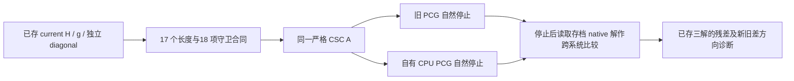

# FNIRT CPU：保存 current 系统的 PCG 两臂回放与残差方向诊断

## 1. 功能与本次结论

本叶复用真实影像产生的第二 accepted 参数检查点，隔离当前已组装系统中的 PCG 算术。旧臂调用冻结 FNIT optimizer，新臂使用自有 FP64 CPU dot/norm 和除法预条件；两个求解臂共享同一个严格 CSC 回调和原 `1e-3` / 500 停止门。

输入沿用 ds003138 v1.0.1（CC0）的既有公开 FAST GM、FLIRT affine、GM template/mask 绑定；输入没有重新生成或分发。GM 为 `224×288×288`，template 为 `91×109×91`、2 mm。来源见前序共享组装记录。

旧臂自然停止于 **53 轮**，新臂于 **49 轮**，均满足当前系统残差门。对另一个存档原生系统解的距离分别为相对 L2 **11.53% / 14.67%**。这一控制没有支持整链精度改善，因此候选没有接入默认生产。跨组装系统的解距离不能单独证明自有算术实现有 bug；比较对象详见 [PAIR_INTERPRETATION](PAIR_INTERPRETATION.public.json)。



原生参数、矩阵与解来自已有冻结捕获；本次科学计算只有两个 current 系统求解臂和一次保存对象诊断。完整非线性估计、matrix-free 回调和最终 warp 仍由相应功能门决定。

## 2. Python 调用、输入输出及参数

独立验证函数位于 [pcg_cpu_candidate.py](source/pcg_cpu_candidate.py)，尚未成为 `fnit` 公共接口。以下调用需要把本叶 `source/` 加入 Python import 路径：

```python
import torch
from pcg_cpu_candidate import preconditioned_conjugate_gradient_cpu

solution, pcg_report = preconditioned_conjugate_gradient_cpu(
    matvec=fixed_current_matvec,       # 同一固定 CPU 算子，输入输出均为一维 FP64 Tensor
    rhs=current_full_gradient,        # 已存 full g；这里求解正 g，配准更新另有负号
    diagonal=current_preconditioner,  # 1.001 × 独立保存的 full diagonal，所有元素须正
    tolerance=1e-3,                   # 相对 RHS L2 的未预条件残差停止阈值
    max_iterations=500,               # 自然停止的最大轮数
)
```

| 参数或文件 | 格式、意义 |
| --- | --- |
| `matvec` | 固定回调；接收 CPU FP64、无梯度、一维 Tensor，返回同形状同 dtype 的 CPU Tensor |
| `rhs` | CPU FP64、无梯度、有限的一维 Tensor；零 RHS 返回零解和 0 轮成功报告 |
| `diagonal` | 同形状、有限正值；`None` 表示单位预条件；本次使用独立保存 diagonal，未改用 H 的对角线 |
| `tolerance` / `max_iterations` | 正停止阈值 / 正最大轮数；本次为 `1e-3` / 500 |
| `H.private.f64` | 小端 FP64、行优先 `n×n` full H；`n` 由保存 g 的长度确定，本次为 1177 |
| `gradient.private.f64` / `diagonal.private.f64` | 小端 FP64、各 `n` 个元素；均为 full native 单位，即生产 linearize 输出的两倍 |
| `solution` / `pcg_report` | CPU FP64 一维解；报告自然轮数、是否过残差门、终点递推相对残差 |
| 私有旧/新解文件 | 各 `n` 个小端 FP64 元素；保留在运行目录，不随本叶发布 |
| 公开输出 | 源码/输入 SHA、算术合同、聚合误差、残差分位数、方向指标及调度日志，无影像或向量数组 |

1177 项由 `3×7×8×7` 个形变系数与一个 global-linear intensity scale 组成；解差的最大值、L2 和 RMSE 是混合参数向量度量，不能整体标成 mm 或 voxel。

RHS/diagonal 的设备、dtype、无梯度、形状及正值守卫在计算前检查，回调输出在每次调用后检查；非法或非正分母返回上一个有效解和未收敛报告。函数不改变调用者 TF32、梯度开关或线程策略。

## 3. 命令行与复现结构

本叶是验证 harness，使用已授权的私有检查点、冻结 workspace 和新输出目录。运行前须按 `preflight_current.py` 核对输入与当前 17 个 FNIRT 源文件，并在 workspace 中保留 SHA 为 `903d5031…` 的 `source/optimizer.py`。完整输入位置清单保留在私有 `expected.json`。

```bash
# 已完成两臂的实际 worker；父目录须有通过的 preflight_before.public.json。
python frozen_workspace/replay_current.py \
  --current saved_current_assembly_directory \
  --oracle saved_native_oracle_directory \
  --output fresh_parent_directory/replay-v1

# 追加诊断只读取已保存解；expected 文件只含10 项文件大小与 SHA。
python frozen_workspace/diagnose_saved_directions.py \
  --root canonical_FNIT_directory \
  --current saved_current_assembly_directory \
  --oracle saved_native_oracle_directory \
  --solutions completed_pair_directory \
  --prior-summary prior_native_replay_summary_file \
  --output fresh_direction_output_directory \
  --expected direction_expected.public.json
```

`--current` 提供已存 H/g/独立 diagonal；`--oracle` 提供既有原生矩阵、RHS 和解；`--solutions` 提供两臂私有解及原 JSON；`--prior-summary` 绑定既有原生自然 69 轮记录；`--root` 用于核对当前源码；`--output` 必须是新目录；`--expected` 见 [10 项绑定](bindings/direction_expected.public.json)。

实际调度脚本见 [两臂 v2](source/run_current_wait_v2.sh) 和 [保存方向诊断](source/run_saved_directions.sh)：同 nodecw7 八个物理核 `32,36,…,60`，Torch/OpenBLAS/MKL/Numba 预算 8，共同 outer CPU 锁之后取本模块 inner 锁，科学 child 硬上限 180 s。GPU 可见设备为空，`LD_LIBRARY_PATH` / `LD_PRELOAD` 清空。

## 4. 原软件调用与参考系统

FSL 6.0.7.4 / FNIRT 2203 的内部 PCG 没有独立官方 CLI。本次使用 [原始共享状态报告](../fnirt_pcg_shared_state_20261004/README.md) 的原软件捕获，不启动新的 FNIRT 或原生观察器。

这里的 native 原系统指既有有限 shared-state 续跑的 `solve3`，其 H/RHS/参数已归档；原始完整 stock registration 的第三次完整状态未保存。current 系统在同已存参数上由 `caab8ffc…` 重新评估得到，不能把同输入/系数称为同一个运行缓存或原 stock 轨迹。

两个比较系统的身份分别为：

| 系统 | A SHA-256 前缀 | RHS SHA-256 前缀 | 自然轮数来源 |
| --- | --- | --- | --- |
| current 保存系统 | `dad18e485e…` | `79e5d87f1b…` | 本次旧 53 / 新 49 |
| 存档 native 原系统 | `041364dc5e…` | `c67ece0088…` | 既有 native 69；本次只读其解与记录 |

本次 `A = saved full H + .001 × diag(saved independent full diagonal)`，预条件为 `1.001 × same diagonal`。独立 diagonal 与保存 H 的对角线有 840 个末位差，已完整保留。原生解在两个 current 求解臂均停止后才读取。

自有归约复用 [上一叶](../fnirt_cpu_reductions_20261006/README.md) 的数学定义：dot 按长度计算 32/16/4 分块，显式 LLVM FMA；norm 为偶/奇两条平方累加链的 `sqrt(SumSquare)`。上一叶已对原 native A/RHS 恢复 69 轮及逐位 trace，本次新增小长度合同只约束声明的自有定义，没有建立其他 BLAS selector 或大向量线程归约的原生位等价。

## 5. 实测精度、残差及计时

### 同 current A/g 的两臂；对 native 原系统存档解作跨组装系统比较

| 求解臂 | 自然轮数 | 终点递推相对残差 | 同 current A/g 的真实相对残差 | 对另一系统 native 解的相对 L2 | 对该解的最大绝对差 |
| --- | ---: | ---: | ---: | ---: | ---: |
| 旧 PCG | 53 | 7.816909e−4 | 7.816909e−4 | 0.1152994 | 1.4879934 |
| 自有 CPU 候选 | 49 | 4.165963e−4 | 4.165963e−4 | 0.1466733 | 2.1182364 |

两个解和输入全部有限；RHS 与预条件 diagonal 均未变。新旧解相对 L2 为 `0.0678620`，最大差 `0.6926207`。原始 [pair JSON](results/pair.public.json) 按运行字节保留，解释性字段另放 [PAIR_INTERPRETATION](PAIR_INTERPRETATION.public.json)。

17 个长度 `0,1,3,4,7,8,15,16,17,31,32,33,47,48,63,64,65` 的 dot/norm 位合同及 18 项守卫全部通过，见 [contracts](results/contracts.public.json)。FMA 使用准确有理数乘加后一次 FP64 舍入的独立定义；守卫包含零 RHS、非正/非有限分母、strided 输入、CPU/F64/无梯度和形状。这里没有新的 MRI benchmark。

### 一次保存对象诊断

| 已存解及评价系统 | 绝对残差 L2 | 相对残差 L2 | 绝对分量 P95 | P99 | 最大值 |
| --- | ---: | ---: | ---: | ---: | ---: |
| 旧解 / current A/g | 0.00817186 | 7.816909e−4 | 5.01804e−4 | 9.60531e−4 | 0.00400153 |
| 新解 / current A/g | 0.00435513 | 4.165963e−4 | 2.81089e−4 | 5.80485e−4 | 0.00104733 |
| native 存档解 / current A/g | 0.00283718 | 2.713943e−4 | 1.60823e−4 | 3.85586e−4 | 0.00142750 |
| native 存档解 / 原 native A/RHS | 0.00284128 | 2.717868e−4 | 1.60875e−4 | 3.85651e−4 | 0.00143538 |

最后一行的真实相对残差与既有自然 69 轮终点 **逐 bit 相同**，没有再次求解。令 `Δx = saved new − saved old`，在同 current A 上：`||Δx||₂=6.00456`、`||AΔx||₂=0.00801891`、方向 Rayleigh 商 `0.0001657254`、方向逆增益 `748.8005`。残差差与 `AΔx` 的一致性误差相对 `8.45e−14`。这些量只描述该保存方向在混合系数/强度坐标下的放大；没有计算谱、全局条件数或物理 voxel 敏感性，见 [saved_directions](results/saved_directions.public.json)。

两臂 worker 的 main 内计时 **38.449 s**，包含小合同、JIT、求解及 DSO 哈希等诊断；imports 在起点之前。旧 `.258 s` / 新 `.041 s` 是同进程顺序观察，首臂与后臂的 JIT/缓存边界不同，不能作速度比。追加保存对象诊断 main 计时 **1.141 s**，独立记录，没有合并成配对或整例耗时。

本次没有产生新 warp 或脑图；真实影像来源及既有非等价配准结果继续见 [sMRI CPU 记录](../smri_cpu/REMAINING.md)。

## 6. 源码绑定、更新与未完成项

实测现场 main 为 `d223722108a9a38d1c99f9c891c1812e8d7cf1c8`，报告快进没有改变 FNIRT 17 源文件；旧输入捕获的基线仍为 `6f624040…`。registration 为 `caab8ffc…`，optimizer 为 `903d5031…`。两臂前后各 **509** 项输入/源码绑定及原 harness 字节完全相同；追加诊断另核对 **10** 个保存对象、17 个生产源和 5 项 harness，前后全相同，私有两解还准确复现原 pair 全部误差字段。

数学源码：owned reductions `3faffbd2…`、CPU candidate `845a8244…`、pair worker `f000d386…`、保存方向 worker `754bd071…`。完整 SHA、部署前后身份和原 JSON 均见 [bindings](bindings/collection_bindings.public.json) 与 [manifest](manifest.json)。现有主页 Conda 已声明 NumPy/SciPy/Numba；本次实际环境为 NumPy 1.26.4、SciPy 1.17.1、Torch 2.5.1、Numba 0.61.2、llvmlite 0.44.0，见 [环境元数据](bindings/installed_environment_after.public.json)。没有新增依赖或分发参考库二进制/源码。

本叶未改 FNIRT 生产 CPU/GPU 文件，调用者 matmul TF32、cuDNN TF32、梯度开关和 CUDA 未初始化状态前后相同。末次 DSO 快照只保留 basename/SHA，没有 FSL DSO；自有 fresh JIT 记录包含 `vfmadd`。这份证据没有扩展为全程系统调用审计。

调度 v1 `98166` 在等待 1119 s、仍只有 `timeout → bash → flock` 时冻结并取消，科学 worker 为 0；旧 trap 的 exitcode 0 不表示计算完成。v2 `108976` 将共同锁等待改为有限 19000 s，科学 child 180 s 和所有数学源未改，最终只完成一个旧/新配对。追加 controller `123131` 只执行保存对象算术。原日志、调度记录和两次元数据传输设置问题保留于 [FAILURES](FAILURES.json)。

当前矩阵-free matvec 由 spline expand/adjoint、spatial normal 和 bending 组合；列物化 H 的 CSC 回放没有验证它在任意方向上的累加。既有 Jte 顺序控制后的 RHS 相对差约 `7.4e−7` 及 H 微差仍未解决。本轮没有接 runtime；下一步只盘点已存真实 level-state 对象及其绑定，再由协调者确定有限定位门。

## 7. 参考与复核入口

- [上一步自有归约及 93/69 位门](../fnirt_cpu_reductions_20261006/README.md)。
- [共享系统、固定 λ 组装与失败桥记录](../fnirt_shared_followup_20261006/README.md)。
- [原始 PCG 共享捕获](../fnirt_pcg_shared_state_20261004/README.md)。
- [FNIRT 原代码库](https://git.fmrib.ox.ac.uk/fsl/fnirt)、[basisfield](https://git.fmrib.ox.ac.uk/fsl/basisfield)、[miscmaths](https://git.fmrib.ox.ac.uk/fsl/miscmaths)。
- [FSL FNIRT 官方说明](https://fsl.fmrib.ox.ac.uk/fsl/docs/registration/fnirt/index.html)、[OpenBLAS 代码库](https://github.com/OpenMathLib/OpenBLAS)、[Numba 代码库](https://github.com/numba/numba)、[llvmlite 代码库](https://github.com/numba/llvmlite)。安装参考身份由上一叶 context SHA 约束。
- Jenkinson M, et al. FSL. *NeuroImage* 2012;62:782–790. doi:10.1016/j.neuroimage.2011.09.015。
