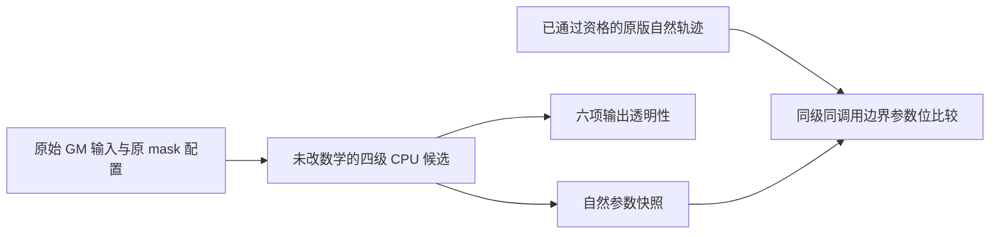

# FNIRT CPU 完整 GM 参数首差（2026-10-07）

## 1. 功能简介

对既有 CPU 修复候选完成一次四级 GM 配准，只在自然调用边界保存参数。候选七个数学源码文件逐字节保持，成本、梯度、Hessian 和 PCG 没有额外调用。六项保存输出与此前完整候选的数据 words、空间 affine 和头信息相同；唯一已接受的头信息变化是 coefficient 的单位0→10。

真实参数首差发生在第1级第一次试步。初始成本、梯度和 Hessian 三个调用的输入参数向量与原版逐位相同，下一次成本调用的参数已有1,167/1,177词不同。因此差异出现早于后续层转接和拓扑投影。这里观察的是参数，不是梯度或 Hessian 返回值；本轮没有证明差异的唯一原因，也没有改善或验收原候选终点精度。



## 2. Python 调用、输入与输出

本目录公开安全聚合记录，不发布参数向量或影像。读取示例：

```python
import json
from pathlib import Path

# summary_path：公开的控制、端点透明性及参数差异统计。
summary_path = Path(
    "validation/fnirt_cpu_full_GM_parameter_trajectory_20261007/summary.json"
)
with summary_path.open(encoding="utf-8") as summary_stream:
    trajectory_summary = json.load(summary_stream)
# first_parameter_difference：首个不同自然边界，不含实际参数值。
first_parameter_difference = trajectory_summary[
    "native_parameter_boundary_diagnostic"
]["safe_summary"]["first_mismatching_natural_boundary"]
print(first_parameter_difference)
```

| 输入 | 含义与格式 |
| --- | --- |
| 原 GM、模板、FLIRT affine、参考 mask | 与既有完整候选相同的四项原始输入，NIfTI图与4×4文本矩阵。保存官方影像不参与候选生成。 |
| 固定 GM 配置 | 四级最大迭代5/5/10/5；前三层拟合全局尺度，末层固定尺度并应用原参考 mask。 |
| 六项既有候选输出 | 只用于本轮完成后的透明性核验，不用作配准输入。 |
| 原版自然轨迹 | 已独立通过保存资格的原版四级参数边界；按自然级别、调用类型、序号和维数进行配对。 |

公开输出为 [summary.json](summary.json)。候选私密快照按成熟参数打包顺序保存：三个分量、Z/Y/X存储顺序；仅拟合 scale 时追加原 Double scale，末级固定 scale 单列。275事件、31份参数文件共5,173,248字节均留在服务器。

## 3. 命令行调用

```bash
python -m json.tool validation/fnirt_cpu_full_GM_parameter_trajectory_20261007/summary.json
```

被动观察器没有生产 CLI，本轮没有将候选接入默认函数。依赖沿用既有 FNIT Conda环境，没有新增安装依赖。

## 4. 原软件对应

对照来自已通过资格的[原版完整 GM 自然轨迹](../fnirt_original_full_GM_trajectory_20261007/README.md)，对应 `fnirt --config=GM_2_MNI152GM_2mm` 的原输入、参考 mask 与四级自然优化调用。本轮原版新调用为0。

候选额外的拓扑后成本调用按实际来源单列，未混入原 `nonlin` 的初始/试步成本序列。级别和调用序号是配对边界，不保证参数相同；相似成本或 PCG 次数不作为参数身份门。原版 PCG 内部迭代轨迹仍为 NA。

## 5. 真实结果、耗时与可视化

| 自然参数边界 | 参数words | 不同words |
| --- | ---: | ---: |
| 第1级初始 cf 输入 | 1,177 | 0 |
| 第1级首次 grad 输入 | 1,177 | 0 |
| 第1级首次 hess 输入 | 1,177 | 0 |
| 第1级首次试步 cf 输入 | 1,177 | 1,167 |

首差的 signed-zero 不同词数为0，首个不同词索引为0。83个配对边界仅以上3个参数向量完全相同。这里只给位差计数，未计算参数差的范数或据此量化终点误差；初始参数相同也不等于中间影像、梯度和算子结果都相同。

| 对此前同一候选的输出透明性 | 数据words | 不同words |
| --- | ---: | ---: |
| moved | 902,629 | 0 |
| full pull Jacobian | 902,629 | 0 |
| nonlinear Jacobian | 902,629 | 0 |
| modulated GM | 902,629 | 0 |
| coefficient | 31,752 | 0 |
| pull transform | 2,707,887 | 0 |

六项 affine 均相同，完整头信息相同，coefficient 仅单位0→10。该门证明观察器未改变已验候选结果；不把其先前未通过的官方精度比较改为通过。原官方 moved/modulated 来自 FNIRT 后接 applywarp/fslmaths，端点链范围仍单列。

实际whole API为1，成本31、线性化25、自然梯度25、自然Hessian25、PCG25、matvec1,759；额外数学调用、原版和GPU均为0。25试步全部接受、拒绝为0；本轮仍未实际覆盖拒绝试步缓存路径。

| 时钟范围 | 秒 |
| --- | ---: |
| 完整 API（含被动观察） | 27.293645 |
| worker | 40.257485 |
| 六端点读回透明性 | 0.373138 |
| 参数字节诊断 | 0.534570 |
| supervisor / OS wrapper | 40.824429 / 40.913850 |

导入/准备与身份校验时钟分列于summary；冷JIT包含在完整API内，未独立计时。时钟嵌套，worker不是纯计算时间。本轮不是速度benchmark。峰值RSS约1.81GB。235门、49项源/输入前后身份和14冻结文件通过；5个PID/start实例退出、FD与共同CPU锁释放、六索引peer保留、执行授权关闭。

本轮未绘制新脑图；本次任务是自然参数首差定位，原始参数与影像数组不公开。

## 6. 版本与 benchmark 记录

- **既有完整候选**：完成四级 CPU 链，保存六项端点；与官方终点精度尚未验收，没有每级参数快照。
- **原版自然轨迹**：一次原版完整配准；原 NIter 语义验证误报保留，独立保存资格通过，三项原端点完整文件相同。
- **本轮候选自然轨迹**：数学源码保持、六端点透明、真实初始参数点相同；首次试步出现参数差。未换求解器、阈值或预条件器，未重跑原版。

下一源码诊断优先审查 bending Hessian 对角构造、基函数归一化和累加顺序；当前不据首次参数差直接归因 PCG、坐标帧或单项浮点尾差，不继续完整配准试跑。

## 7. 参考文献与原实现

- [FNIT CPU 采样候选](../fnirt_cpu_sampler_case_20261006/README.md)。
- [固定保存算子的预条件器三臂控制](../fnirt_cpu_preconditioner_ablation_20261007/README.md)。
- [FSL FNIRT 官方说明](https://fsl.fmrib.ox.ac.uk/fsl/docs/registration/fnirt.html)。
- [FSL fnirt](https://git.fmrib.ox.ac.uk/fsl/fnirt)、[miscmaths](https://git.fmrib.ox.ac.uk/fsl/miscmaths)及[basisfield](https://git.fmrib.ox.ac.uk/fsl/basisfield)原代码库。

原SDK代码、运行库、provider列表、影像及参数文件未随报告发布。
