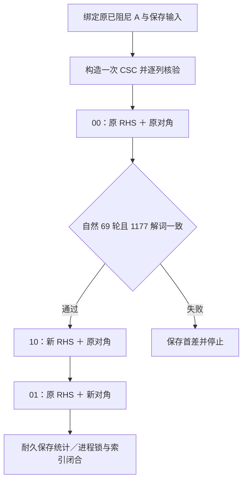

# FNIRT CPU：固定原矩阵的 RHS／预条件对角对照（2026-10-07）

## 1. 功能简介

本轮在一个真实保存参数点上，固定原软件已经组装、已经阻尼的 1177×1177 Double 矩阵，分别替换 RHS 和预条件对角。目的是分清这两组保存输入的尾差对有限 PCG 求解的影响。随后追加一次同保存点的对角分组控制，核对原源码规定的缩放和加法位置。

原 RHS、原对角的 **00 臂复现 69 轮，全部 1177 个解词含符号零逐位一致**。只替换 RHS 的 10 臂仍为 69 轮，解相对差约 **0.83536%**；只替换对角的 01 臂为 53 轮，解相对差约 **11.75062%**。此前二者同时替换的 11 臂为 58 轮，本轮只读取其保存结果。最新对角控制把原累计完成后的 `2/count`、完整 regularizer 因子及最后的 ratio nudge 分列，差词由 **1166 降到 1165**；首个 X 系数和 scale 仍不同，未恢复逐位一致。

这是固定矩阵诊断。本轮没有新完整配准、原软件调用或 GPU 计算，也没有默认接入。此前完整 GM 候选的终点误差仍未通过验收；该完整运行第 49 轮的参数点与本保存点尚未证明相同。



## 2. Python 调用与输入、输出

公开叶只包含本报告和 [summary.json](summary.json)，不包含私密矩阵、影像、参数、运行 worker 或原软件代码。可以直接读取聚合结果：

```python
import json
from pathlib import Path

# 公开 JSON 只含标量、计数、范围说明和原始文本回执身份。
report_path = Path("validation/fnirt_cpu_preconditioner_ablation_20261007/summary.json")
report = json.loads(report_path.read_text(encoding="utf-8"))
for arm_name, arm_result in report["arms"].items():
    pcg_iterations = arm_result["PCG"]["iterations"]
    relative_step_difference = arm_result["step_to_native_positive_solution"]["whole"]["rel_L2"]
    print(arm_name, pcg_iterations, relative_step_difference)
```

真实控制的输入和参数如下，全部科学数组留在原服务器：

| 输入或参数 | 格式与意义 |
|---|---|
| 固定 A | 1177×1177 Float64；原软件完整因子、已经加入阻尼的组装矩阵。构造一次 CSC 后复用，不再 nudge |
| 原 RHS | Float64 长度 1177；原保存正梯度，00、01 使用 |
| 新 RHS | 同布局；来自已验保存状态的新完整正梯度，10 使用，不重建 |
| 原预条件对角 | 原 A 的保存已阻尼对角；1177 个原词与 `A.diagonal()` 精确匹配 |
| 新预条件对角 | 已保存半对角，经原候选 floor、`1.001` 阻尼和乘 2 的既定顺序一次转换；floor 改变词数为 0 |
| 坐标块 | X、Y、Z 各 392 个系数，另 1 个 global scale；Float64，比较含符号零 |
| 初值、停止参数 | 零初值；相对残差阈值 0.001；上限 500；原有直接 division、串行 dot/norm 规则；自然停止，不强制轮数 |
| 原保存正解 | 00 的资格参考；69 轮及全部解词必须通过后才能运行 10、01 |

私密输出为各臂的解、真残差和逐次动作记录；公开输出为全体及 X/Y/Z/scale 的位差、最大绝对差、相对 L2、轮数、调用数和诊断时钟。新三臂统一使用正解约定；历史负更新只做预定义的保存结果符号转换比较，不重新求解。

## 3. 命令行调用

查看公开聚合结果：

```bash
python -m json.tool validation/fnirt_cpu_preconditioner_ablation_20261007/summary.json
```

此次私密控制按冻结输入和唯一授权运行；本叶没有另一个会启动 PCG 或完整配准的公开 CLI。原 69 轮自有归约验证见 [CPU 归约报告](../fnirt_cpu_reductions_20261006/README.md)。

## 4. 原软件调用

历史完整 GM 配准的命令结构为：

```bash
fnirt \
  --in=subject_GM.nii.gz \
  --ref=template_GM.nii.gz \
  --aff=gm_affine.mat \
  --config=GM_2_MNI152GM_2mm \
  --refmask=reference_brain_mask_dil.nii.gz \
  --cout=gm_coeff.nii.gz \
  --fout=gm_dense.nii.gz \
  --jout=gm_nonlinear_jacobian.nii.gz
```

`--in`、`--ref` 是移动和参考 GM，`--aff` 是仿射初始化，`--refmask` 是参考脑掩膜；三个输出分别是系数、稠密场和非线性 Jacobian。该命令不含 `--iout`；历史 moved 和 modulated 图像还经过后续 applywarp／fslmaths，不能把它们当成 FNIRT 单步 SaveRobj 输出。

本次新增原软件调用为 0。原 69 轮参考来自保存的有界 continuation；两次既有逐位验证都对原组装 A 使用自有串行 CSC 回调，不是新的 matrixfree 算子，也不是安装二进制内部乘法追踪。

## 5. 真实精度与时间

所有臂使用同一原 A；00 先通过，再运行 10、01。以下解差以原保存正解为分母：

| 臂 | RHS／预条件对角 | 自然轮数 | 解位差 | 最大绝对差 | 解相对 L2 | 同 CSC 真相对残差 |
|---|---|---:|---:|---:|---:|---:|
| 00 | 原／原 | 69 | 0/1177 | 0 | 0 | 0.0002717867671592058 |
| 10 | 新／原 | 69 | 1177/1177 | 0.08086840117121241 | 0.008353594769385068 | 0.0006628619850806582 |
| 01 | 原／新 | 53 | 1177/1177 | 1.532221744001247 | 0.11750623811665636 | 0.0009455774873621329 |
| 11（旧结果） | 新／新 | 58 | 1177/1177 | 1.21127439391819 | 0.08362291881043697 | 0.0009990141733889702 |

10 的 X/Y/Z/scale 解相对 L2 分别为 0.007633845971382049、0.00835057607637876、0.009055466196589968、0.00009941150022248672；01 分别为 0.08456782361703152、0.12395094822772419、0.1373770443289639、0.014918579069746253。全部原始精度字段见公开 JSON。

输入新 RHS 有 1170 个差词、整体相对 L2 为 5.267661646610532e−15；新预条件对角有 1166 个差词、整体相对 L2 为 7.080781982993898e−16。对角的 X/Y/Z 相对差分别约 2.080e−15、2.343e−15、1.552e−15，scale 为 7.081e−16；不能只读 scale 主导的整体范数。这次替换整个保存对角，未将差词拆成原 data、regularizer 或 nudge 的贡献。

三个 PCG 区间分别为 1.06659、0.04966、0.03805 秒；00 含首次自有串行 JIT，另两臂复用本进程 specialization。worker 12.66262 秒，有限 supervisor 13.10338 秒，外层 13.18145 秒。worker 包含导入、provider／源码／输入身份检查和统计；这些是单次诊断时钟，不是完整 FNIRT 速度比较。峰值 RSS 438,964,224 字节。

1433/1433 门通过；CSC 构造 1 次、PCG 3 次、迭代动作 191 次、独立真残差动作 3 次。原软件、producer、RHS 重建、matrixfree、完整配准、GPU、重试均为 0。5 个实际 PID/start 实例退出，FD／同 inode 锁释放，六锁索引闭合且 peer 键保留。

本轮未生成配准图像或脑图。既有图像终点验收仍独立于这组固定矩阵结果。

### 保存状态对角分组控制

只恢复 fixed、state mask、三个 basis 和保存 bending 对角这六个成员，直接读取已验除法 projection。输入 fixed 为 Float32 `[24,28,24]`，mask 与其同形；三个 basis 为 Float64 `[24,7]`、`[28,8]`、`[24,7]`，保存 bending 对角为 Float64 `[7,8,7]`。保存 projection 是 Float32 `[3,24,28,24]`，本轮只读取。三次 `design_diagonal` 内部九次 einsum，得到累计完成的 data 对角后才乘 `2/count`；保存 half bending 对角先乘 2，再乘 `lambda/count`，然后相加。scale 为原 Float 权重的 Double 和，最后乘 `2/count`。最终使用原 active `1.001` ratio 赋值。原 1177 个未阻尼和已阻尼对角均直接读取，不逆除 nudge，不重算 PCG。

| 范围 | 原分组差词 | 新分组差词 | 新分组最大绝对差 | 新分组相对 L2 |
|---|---:|---:|---:|---:|
| 未阻尼全体 | 1166/1177 | 1165/1177 | 3.637978807091713e−12 | 7.087862768062065e−16 |
| 未阻尼 X | 390/392 | 390/392 | 2.7755575615628914e−16 | 2.1333162402944995e−15 |
| 未阻尼 Y | 389/392 | 385/392 | 1.6653345369377348e−16 | 2.350833083217556e−15 |
| 未阻尼 Z | 386/392 | 389/392 | 1.3877787807814457e−16 | 1.538042147186691e−15 |
| 未阻尼 scale | 1/1 | 1/1 | 3.637978807091713e−12 | 7.087862638028647e−16 |
| 已阻尼全体 | 1166/1177 | 1165/1177 | 3.637978807091713e−12 | 7.080781986410745e−16 |

全体范数仍由 scale 主导。未阻尼首差仍为 X 块第 0 项：新值 `0.0001976661468893698`，原值 `0.00019766614688937034`；已阻尼对应 `0.00019786381303625914` 与 `0.00019786381303625968`。两者 raw word 距离均为 20，符号零差词为 0。更少差词没有消除这个首差，X/Y/Z 的误差也未统一下降。

对角算术区间 0.005018 秒；worker 1.787275 秒、supervisor 2.101790 秒、外层 2.168943 秒。122/122 门、57 项输入／源码前后身份、8 个输出字节闭合；4 个实际 PID/start 实例退出，FD 和同 inode 锁释放，六锁索引闭合且保留 peer。插值、坐标、projection、g、normal、adjoint、完整 H、PCG、JIT、原软件、完整配准和 GPU 都为 0。这些时钟是保存状态诊断，不是完整配准速度。

原软件没有独立保存 data／regularizer 分量。本次保存的分量是候选自己的计算结果，不能通过 `H − regularizer` 将其解释为原 data 观测。此次分组没有解决逐位差，当前不采用；随后优先取得完整自然轨迹，并按源定义核 JtJ 与 bending 的具体累计次序。

## 6. 更新与 benchmark 记录

| 阶段 | 已得结果与范围 |
|---|---|
| 原组装 A 的自有归约／CSC 资格 | 原 RHS、原对角；69 轮、逐轮及解逐位一致 |
| 新 matrixfree 同保存点控制 | 58 轮，更新差约 8.36%；不能由原 A 上的 69 轮资格推定新算子逐位相同 |
| 固定原 A 的组合 11 | 新 RHS 与新对角；58 轮、更新差约 8.36229%；无法单独分辨两个替换的影响 |
| 本轮 00→10→01 | 先复现原解，再分别替换 RHS 和对角；所有控制及关闭门通过，不重复 11 |
| 随后对角分组一次控制 | 相同保存点，累计后缩放、完整 regularizer 因子及 ratio nudge；1165/1177 仍不同，首差和 scale 保留；0 新 PCG |

本保存系统的有限停止轨迹会随这组 RHS／对角尾差改变，其中单独替换对角的解变化更大。该结果不证明完整 GM 终点差异的唯一原因，也没有计算谱、条件数或原 H 的分量分解。源规定的缩放／分组一次控制尚未消除对角首差。后续核原 JtJ 与 bending 的具体累计，并与完整自然轨迹对应；当前不采用为默认。

## 7. 参考文献与原实现

- [FSL FNIRT 文档](https://fsl.fmrib.ox.ac.uk/fsl/docs/registration/fnirt/index.html)、[FNIRT 原代码库](https://git.fmrib.ox.ac.uk/fsl/fnirt)、[MISCMATHS 原代码库](https://git.fmrib.ox.ac.uk/fsl/miscmaths)。原 SDK 只作私密源审，本叶不复制发布其代码。
- [自有 CPU dot/norm/CSC 真实资格](../fnirt_cpu_reductions_20261006/README.md)、[同状态对角控制](../fnirt_cpu_sampler_case_20261006/diagonal_only_v2/README.md)。
- Hestenes MR, Stiefel E. *Methods of Conjugate Gradients for Solving Linear Systems*. Journal of Research of the National Bureau of Standards, 1952. [原论文](https://doi.org/10.6028/jres.049.044)。
- Jenkinson M, Beckmann CF, Behrens TEJ, Woolrich MW, Smith SM. *FSL*. NeuroImage, 2012. [论文](https://doi.org/10.1016/j.neuroimage.2011.09.015)。
