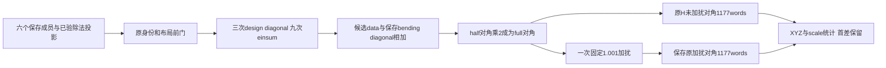

# FNIRT CPU 保存状态对角控制（diagonal only v2）

## 1. 功能与流程

本轮复用已核验的Float32除法投影和真实solve3保存状态，只计算一次成熟FNIT对角后缀，比较原未加扰H的对角和已保存加扰对角。114项输入与合同门通过；两种对照各有1,166/1,177个Float64 words不同，相对L2约7.08e−16。结果属于固定点诊断，未接入默认CPU实现，生产、测试和GPU代码未改。



没有调用会触发采样的完整`linearize`。自有观察helper从成熟源码提取对角后缀，加入只返回原对象的观察点；数学AST保持相同。原H只读取1,177个对角words，未恢复完整H数组，也没有扫描列、运行PCG或新原软件命令。

## 2. Python调用、输入与输出

[自有源码观察helper](diagonal_source_control.py)使用项目成熟的[`_LevelSystem.linearize`](../../../src/fnit/fnirt/registration.py)对角后缀、`_pack`和[`design_diagonal`](../../../src/fnit/fnirt/spline.py)。它用于已核验保存状态，不是完整配准接口。新增依赖0。

下面使用使用者自己的真实保存状态；输入身份、dtype、shape及原字节stride应先与其保存manifest核验。示例没有生成模拟图，也不构成新benchmark。

```python
from pathlib import Path
from types import SimpleNamespace
import json
import runpy
import numpy as np
import torch
from fnit.fnirt import registration, spline

saved_state_path = Path("verified_level_state.npz")
saved_summary_path = Path("verified_level_summary.json")
accepted_projection_path = Path("verified_division_projection.npy")
helper_path = Path(
    "validation/fnirt_cpu_sampler_case_20261006/diagonal_only_v2/diagonal_source_control.py"
)
helper = runpy.run_path(str(helper_path))
member_metadata = json.loads(saved_summary_path.read_text())["checkpoint"]["arrays"]

def restore_saved_member(saved_array, member_name):
    # 恢复保存manifest中的原stride；不使用连续布局替换原布局。
    source_tensor = torch.from_numpy(saved_array.copy(order="K"))
    metadata = member_metadata[member_name]
    restored_tensor = torch.empty_strided(
        tuple(metadata["shape"]),
        tuple(stride // saved_array.itemsize for stride in metadata["strides"]),
        dtype=source_tensor.dtype, device="cpu",
    )
    return restored_tensor.copy_(source_tensor)

member_names = ["fixed", "state_mask", "basis_0", "basis_1", "basis_2", "bending_diagonal"]
with np.load(saved_state_path, allow_pickle=False) as saved_checkpoint:
    restored_members = {
        name: restore_saved_member(saved_checkpoint[name], name) for name in member_names
    }
projected_gradient_cpu = torch.from_numpy(
    np.load(accepted_projection_path, allow_pickle=False)
)

class SavedBendingDiagonal:
    def diagonal(self):
        return restored_members["bending_diagonal"]  # 只读保存的几何对角，不重新构建。

observed_components = {}
def capture_component(component_name, component_tensor):
    observed_components[component_name] = component_tensor
    return component_tensor  # 观察点不改变对象或算术。

design_diagonal_bound = None
def call_bound_design(weight_tensor, basis_tensors):
    return design_diagonal_bound(weight_tensor, basis_tensors)

source_environment = {
    "torch": torch, "design_diagonal": call_bound_design,
    "_pack": registration._pack, "capture": capture_component,
}
design_diagonal_bound, diagonal_suffix = helper["compiled"](
    registration.__file__, spline.__file__, source_environment
)
saved_system = SimpleNamespace(
    fixed=restored_members["fixed"],
    bases=tuple(restored_members[f"basis_{axis}"] for axis in range(3)),
    bending=SavedBendingDiagonal(), estimate_scale=True,
)
valid_count = 14341
regularization_lambda = 9049.463427795125  # 本轮固定原保存值，不由新SSD计算。
half_scale_diagonal, half_diagonal = diagonal_suffix(
    saved_system, SimpleNamespace(dtype=torch.float64), projected_gradient_cpu,
    restored_members["state_mask"].to(torch.float32), valid_count,
    regularization_lambda / valid_count,
)
full_diagonal = 2 * half_diagonal
nudged_diagonal = 1.001 * full_diagonal  # 本轮damping=0.001、old_damping=0。
```

| 参数或输入 | 格式、意义及作用 |
| --- | --- |
| `registration_path`、`spline_path` | `compiled`及`bindings`的成熟源码文件参数；实际控制先绑定大小、SHA和对应AST，未使用main提交号代替文件身份 |
| `environment` | 提供`torch`、`design_diagonal`、`_pack`、`capture`；`capture(name, tensor)`返回同一个张量，仅记录候选组件 |
| `fixed`、`state_mask` | CPU Float32和Boolean `[24,28,24]`；固定图只供scale对角，mask使用已接受的14,341有效点，不重新计算count |
| `basis_0/1/2` | CPU Float64 `[24,7]`、`[28,8]`、`[24,7]`；分别是三个轴的保存B样条basis，保持原stride |
| `bending_diagonal` | CPU Float64 `[7,8,7]`，保存几何缓存；本轮读一次，不重新构建Gram或正则化器 |
| `gradient_fsl` | 已接受的CPU Float32 `[3,24,28,24]`除法投影；原参考48,384words含符号零bit0，本轮不重投影或采样 |
| `count`、`bend_factor` | 分别为固定`14341`和`9049.463427795125 / 14341`；lambda保持原保存状态，不更新latestSSD |
| `coefficients` | 对角后缀仅使用其Float64 dtype元数据，本轮未恢复系数payload |
| 返回值 | `half_scale_diagonal`及Float64 `[1177]` half-normal对角；三个392word系数块按x-fast打包，末尾为scale1 |
| 观察和诊断输出 | 候选data XYZ、共享regularizer XYZ、data scale、half/full/nudged对角，以及原对角逐块统计；数组只保留在私密运行叶 |

候选data与regularizer组件是FNIT后缀的半normal组件。原H没有独立保存这两个组件，不能用候选regularizer从原H相减后称结果为实际native data。

## 3. 命令行调用

在仓库根目录查看去敏统计：

```bash
python -m json.tool validation/fnirt_cpu_sampler_case_20261006/diagonal_only_v2/manifest.public.json
```

本轮没有新增生产CLI。实际唯一组由有限CPU监督包执行；公开helper的`bindings(registration_path, spline_path)`只返回源码AST身份，`compiled(...)`准备后缀函数，不会自行读取影像或运行solver。

## 4. 原软件对应

对应原FNIRT Hessian的未加扰对角及LM对角加扰。原有限writer在hess后、nudge前保存`H_before_nudge`，再把对角乘`(1+damping)/(1+old_damping)`，保存A及其对角。本轮直接比较两份保存原件，不通过除以1.001反推未加扰H。

原FNIRT Hessian使用Float图像和mask、Double矩阵存储；条目组装后按`2/count`缩放。FNIT成熟后缀先形成Float32平方/mask产品，转Float64后除count，再进行三个轴的basis平方收缩。源码类型和累计顺序不同不直接证明实际DSO内部全部计算的指令顺序。

本轮原软件新调用为0。以下完整命令只说明功能对应，未在本轮执行：

```bash
# 变量为使用者自己的moving/reference/affine/config/输出路径。
fnirt --in="$moving_volume" --ref="$reference_volume" \
  --aff="$affine_matrix" --config="$config_file" --iout="$registered_volume"
```

当前控制使用固定lambda，未验证生产`cf→grad→hess`缓存或dynamic lambda；原投影后的binary trace也未捕获。后续CPU整合仍须自产内部moving帧、保留原latestSSD时序并验证完整输入；GPU保持原路径。

## 5. 真实精度、耗时与可视化

### 未加扰full对角与保存原H

| 范围 | 不同words/总words | maxabs | relative L2 |
| --- | ---: | ---: | ---: |
| 完整对角 | 1166 / 1177 | 3.6379788e−12 | 7.0878628e−16 |
| 系数X | 390 / 392 | 2.4980018e−16 | 2.0791768e−15 |
| 系数Y | 389 / 392 | 1.8041124e−16 | 2.3453837e−15 |
| 系数Z | 386 / 392 | 1.4571677e−16 | 1.5482665e−15 |
| 全局scale | 1 / 1 | 3.6379788e−12 | 7.0878626e−16 |

### 一次1.001加扰后与保存原对角

| 范围 | 不同words/总words | maxabs | relative L2 |
| --- | ---: | ---: | ---: |
| 完整对角 | 1166 / 1177 | 3.6379788e−12 | 7.0807820e−16 |
| 系数X | 390 / 392 | 2.4980018e−16 | 2.0797114e−15 |
| 系数Y | 389 / 392 | 1.8041124e−16 | 2.3430579e−15 |
| 系数Z | 386 / 392 | 1.4571677e−16 | 1.5515399e−15 |
| 全局scale | 1 / 1 | 3.6379788e−12 | 7.0807819e−16 |

所有输出有限、符号零差0。两种对照首差都在系数X第0项，私密保存原word及数值；未自动换累计方法或追加列。总norm由scale主导，因此三个系数块单列。小误差仍不等于整组逐位一致，也不能由对角推断所有非对角H条目。

| 实际执行与资源门 | 结果 |
| --- | --- |
| 合同与输入 | 114门全过；6成员、54项worker源/输入前后、51项部署/收尾字节绑定保持一致 |
| 实际调用 | design diagonal3、einsum9、保存bending diag1、half打包1、half→full1、固定nudge1；原未加扰及加扰后对角各读1177words一次 |
| 未执行 | evaluate、SSD、g、coords、API、投影重算、normal、adjoint、bending normal/重建、native命令、JIT、完整H、PCG/full、GPU均0 |
| 冷诊断后缀 / worker | 0.004825 s / 1.988235 s |
| supervisor / outer | 2.302787 s / 2.368970 s |
| owned tree峰值RSS | 353,566,720 B；CPU8，AS8GB/RSS4GB上限 |

worker包含冷导入及检查，导入耗时未单独细分；未进行warm重测或JIT，没有端到端速度倍率。Torch intra8/interop96、TF32、default dtype和grad状态前后保持，CUDA未初始化，没有加载原软件DSO。

20份原文本逐字节校验、6份输出身份核验；4个观测PID/start身份已退出，共同锁释放，六索引锁闭合仅改变本任务状态并保留peer。复用保存状态未产生新脑图；[既有完整CPU比较及脑图](../../../docs/fnirt/README.md#5-最新精度和运行时间)属于原完整版本，本轮没有新的配准影像输出。

## 6. 更新及benchmark记录

- 原coordinate v1和frame v2失败收据保持；affine v3建立同目标坐标、顺序输出、mask、fixed及角点身份。
- [projection division v1](../projection_division_v1/README.md)的NumPy源参考与Torch广播投影48,384words含符号零bit0；固定lambda的FSL顺序g relative L2为5.2676616e−15，仍非逐位相同。
- diagonal准备v1未执行；v2只补监督器和外层的锁释放/自有FD完成门，数学worker/helper及输入保持原字节。
- 一处外围索引状态字串在INDEX写入和Popen前阻断准备，原记录保留、计算0；修正后真实diag组只执行一次，没有科学重试。
- 2026-10-06 diagonal only v2：未加扰及固定加扰对角相对L2分别7.0878628e−16和7.0807820e−16，均有1,166words尾差。下一步至多准备首差系数X0的一列控制；默认接入、完整H/PCG和完整CPU/GPU验收尚未执行。

## 7. 原实现、许可与参考文献

- [FNIT成熟对角源码](../../../src/fnit/fnirt/registration.py)、[FNIT B样条源码](../../../src/fnit/fnirt/spline.py)；本叶只发布自有观察helper与聚合报告。
- [FSL FNIRT源码](https://git.fmrib.ox.ac.uk/fsl/fnirt)、[FSL basisfield源码](https://git.fmrib.ox.ac.uk/fsl/basisfield)。原SDK只用于私密源审查，不发布原代码；改写遵循[FSL6.0许可](../../../licenses/FSL-6.0.txt)。
- Andersson, Jenkinson & Smith. *Non-linear registration, aka spatial normalisation*. FMRIB Technical Report TR07JA2 (2007), [原文](https://www.fmrib.ox.ac.uk/datasets/techrep/tr07ja2/tr07ja2.pdf)。
