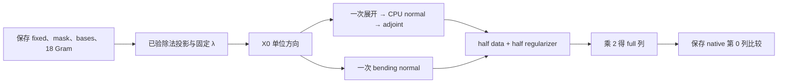

# FNIRT CPU：保存状态的 X0 单列控制

## 1. 功能简介

本报告在已接受的真实 solve3 保存状态上，只选择系数 X 的第 0 个单位方向，比较 FNIT 成熟 CPU normal 路径生成的一列与原软件保存的 `H_before_nudge` 第 0 列。它延续[投影除法控制](../projection_division_v1/README.md)和[对角控制](../diagonal_only_v2/README.md)，没有重新配准。

196 个合同门通过，原始文本、源码、输入、provider 和进程资源均完成闭合。整列仍有 **59/1177 个不同位词**，相对 L2 为 **2.942873864217762×10⁻¹⁵**。这不是逐位一致。

这条边界方向的**候选数据项为 1177 个正零词**；候选 half 列与候选 regularizer half 列逐字节相同。因此，本列结果不能证明非零数据 normal 或完整 H 的精度。原软件没有分别保存 data/regularizer 组件，本报告不据组合列反推它们。



## 2. Python 调用、输入和输出

这是独立诊断记录。正式 FNIRT 默认入口、GPU 路径和当前源码均未因此修改。附带的 [normal_source_control.py](normal_source_control.py)只提取成熟源码的 AST 和函数定义；它不是完整配准入口。

| 输入 | 格式和结构 | 含义 |
|---|---|---|
| 保存 `fixed` | Float32 `[24,28,24]` | 同状态参考图，不重新解码原始图像 |
| 保存 `state_mask` | Boolean `[24,28,24]` | 已通过输入门的有效体素 mask，count 固定为 14341 |
| 三个 `basis` | Float64 `[24,7]`、`[28,8]`、`[24,7]` | 原保存的分离 B-spline 设计矩阵，恢复原字节 strides |
| 保存 `bending_diagonal` | Float64 `[7,8,7]` | 与已接受对角控制核验身份，本轮不重算对角 |
| 18 个保存 Gram | 六项各三个 Float64 方阵 | bending normal 的原缓存，不重新构建 Gram |
| 已验除法投影 | Float32 `[3,24,28,24]` | 同真实采样梯度的一次源定义 Float32 除法结果，48384 词及 signed zero 门此前已过 |
| λ | Python Double 标量 `9049.463427795125` | 保存 cf-derived λ，不按 partial SSD 更新 |
| 单位方向 | Float64 `[1177]` | 第 0 词为 1，其余为 0；scale 为 Double 0，仍保留 `fit_scale=True` 全部运算 |
| 保存原 H | little-endian Float64，row-major `[1177,1177]` | 只解码第 0 列的 1177 个词，整文件仅做字节身份核验 |
| 保存加扰对角 | Float64 `[1177]` | 只读首词；直接比较，不逆除 1.001 |

**输出**为候选 data half 列、regularizer half 列、合并 half 列、full 列，以及加扰后的首对角标量。四列均为 Float64 `[1177]`，按 X/Y/Z 各 392 个系数、scale 1 个排列；加扰首词为 `[1]`。公开 manifest 保存逐块误差、调用数与时钟；图像数组和原始矩阵未发布。

源码审计调用示例：

```python
from pathlib import Path
import json
from normal_source_control import bindings

registration_source_path = Path("FNIT_checkout/src/fnit/fnirt/registration.py")  # 实际待核验源码
spline_source_path = Path("FNIT_checkout/src/fnit/fnirt/spline.py")  # 实际待核验 spline 源码
public_manifest_path = Path("manifest.public.json")  # 本报告的去敏聚合记录
public_manifest = json.loads(public_manifest_path.read_text(encoding="utf-8"))
actual_source_ast = bindings(registration_source_path, spline_source_path)  # 仅 stdlib 源码读取
assert actual_source_ast == public_manifest["source_AST"]
column_metrics = public_manifest["metrics"]["full_column_vs_native_H_before_nudge"]
print(column_metrics["full"])
```

`bindings(registration_path, spline_path)` 的两个参数均为实际源码路径，返回八项 AST SHA；不调用函数体。`compiled(registration_path, spline_path, environment)` 进一步返回权重构造函数、pack/unpack/expand/adjoint/bending 定义及 callback factory；`environment` 是调用方明确提供的模块/函数字典。它只构造定义，执行算术须由调用方另行明确调用。本报告不提供重跑私密数据的命令。

## 3. 命令行调用

查看公开聚合记录：

```bash
python -m json.tool manifest.public.json
```

这条命令只格式化 JSON。完整配准的[成熟功能入口](../../../docs/fnirt/README.md)保持原状；本次控制没有创建新的产品 CLI 或运行完整 pipeline。

## 4. 原软件调用和实现对应

原软件完整配准入口示例：

```bash
fnirt --in=moving_image.nii.gz --ref=reference_image.nii.gz \
  --aff=initial_affine.mat --config=registration_config.cnf \
  --cout=warp_coefficients.nii.gz --iout=registered_image.nii.gz
```

`--in`、`--ref` 是 moving/reference 图；`--aff` 为初始仿射；`--config` 为配准配置；`--cout`、`--iout` 分别输出形变系数和配准图。本次没有重跑该命令，而是只读此前原软件保存的第 0 列及首对角词。

FNIT 当前成熟 `registration.py` 的 weight setup 和 `data_normal`/`bend_normal` callback、`spline.py` 的展开/adjoint/缓存 bending normal 均按已绑定 AST 复用。权重保留 Float32 mask×gradient×gradient 后转 Double 的顺序，cross 和 scale 运算也保留原顺序。native 参考是保存的组合 full H，不是新编译的 SDK 参考；原 SDK 源码未复制发布。

## 5. 精度、时间和资源结果

| 比较范围 | 不同位词 | maxabs | relative L2 |
|---|---:|---:|---:|
| full 列 | 59/1177 | 5.421010862427522e−19 | 2.942873864217762e−15 |
| X 块 | 59/392 | 同上 | 同上 |
| Y 块 | 0/392 | 0 | 未定义：参考 norm 为 0 |
| Z 块 | 0/392 | 0 | 未定义：参考 norm 为 0 |
| scale | 0/1 | 0 | 未定义：参考 norm 为 0 |
| 首词 vs 已接受候选 direct diagonal | 0/1 | 0 | 0 |
| 加扰首词 vs 保存 native post diagonal | 1/1 | 5.421010862427522e−19 | 2.739768722355558e−15 |

所有输出有限，signed-zero 不同词为 0。首差均在系数 X 的第 0 词。这里只对首对角标量乘 Double 1.001，没有把整列乘 1.001，也没有从保存的加扰对角逆推出原值。

| 已记录时钟 | 秒 | 范围 |
|---|---:|---|
| data 列：展开、normal、adjoint | 1.3617645744234324 | 含首次 cold JIT |
| 其中 normal 冷调用 | 1.357232696376741 | 与上一行重叠；含 JIT，不能当暖态纯数学时间 |
| regularizer 列 | 0.0010313279926776886 | 6 个保存 Gram 项、18 个 einsum |
| worker | 88.43667914159596 | 导入、恢复、检查、source/provider 哈希、算术和输出 |
| supervisor | 88.9140394916758 | 有限资源监督 |
| outer | 88.96671930979937 | 独立 OS timeout 外层 |

扣除互不重叠的 data/bending 已计时区间，worker 剩余 **87.07388323917985 秒**没有再细分。它包含导入、身份核验、provider/source 哈希、构造和输出等工作；不能把该差额全部归为哈希时间。纯 JIT 编译成本与暖态 normal 数学时间均未单独测量。这些是诊断时钟，不是 API 或端到端 benchmark，没有速度收益声明。

CPU8、Torch intra8/interop96，显式 OMP8 隔离约束；未改线程全局变量或 GPU flags。新私密 Numba cache 的唯一 `_flat_parallel` 签名为 1 次 miss、0 hit，2 个 cache 文件，共 69719 B。实际 loaded provider 从 108 项到 120 项，均在 124 项明确身份列表内；公开文件不含 provider 路径。峰值 RSS 为 427126784 B。4 个被监督 PID/start 身份退出，FD 关闭，共同锁释放，六 INDEX 锁仅闭合 own key，peer 保留。

本次没有产生新分割图、形变图或脑图，也没有新 native/SSD/g/坐标/采样/完整 H/PCG/full/GPU 调用。真实数据来源和已保存图像的相关说明见[先前坐标与 RHS 控制](../affine_coordinate_v3/README.md)；本报告只展示已保存状态的矩阵诊断。

## 6. 版本和 benchmark 记录

- 先前投影控制：Float32 source-defined 除法 48384 词含 signed zero 一致；固定 λ 的 FSL-order 正 g 近 Double 机器精度，仍有尾差。
- 先前对角控制：full/nudged 各 1166/1177 不同词，逐块误差已记录；未据此宣称完整 H 一致。
- 本次源码准备 v1：独立审发现 scalar JSON 键错误，上传和数学调用均为 0，原包保留。
- 修正版 v2：只将两处键改为 `checkpoint.state_scalars`，其余数学、PLAN、资源和旧失败保持。实际唯一组 1 次、重试 0。
- 当前 X0：59 个尾差；候选 data 零方向的范围限制已明确。原件回传超终端大小上限后只分四个小包读取，没有重跑闭合或科学。

旧 49/53 次 PCG 的 λ/count 与 native 69 次相同，但旧投影、对角和 H 状态不同；旧 X0 bit0 门比较的是旧 FNIT H。迭代次数不能定位原求解器缺陷。下一步仍需原始输入自产 frame/callstate、非零 data normal、同连续 level/RHS/PCG 和完整 CPU/GPU 保护验收；本报告没有默认接入。

## 7. 参考文献和原实现

- [FNIT](https://github.com/weikanggong1/Fudan-Neuroimaging-toolkit)：成熟 PyTorch 实现及项目环境。
- [FSL FNIRT 文档](https://fsl.fmrib.ox.ac.uk/fsl/docs/registration/fnirt/index.html)：完整配准参数和方法。
- [FSL fnirt 源码库](https://git.fmrib.ox.ac.uk/fsl/fnirt)与[basisfield 源码库](https://git.fmrib.ox.ac.uk/fsl/basisfield)：cost、spline 场和 Hessian 语义。
- [Numba 文档](https://numba.readthedocs.io/en/stable/user/threading-layer.html)：线程池与 JIT 环境。
- Andersson, Jenkinson and Smith, *Non-linear registration, aka Spatial normalisation*, FMRIB technical report TR07JA2, 2007。
