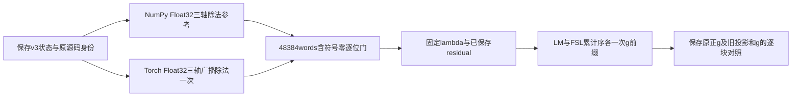

# FNIRT CPU 保存状态除法投影控制（projection division v1）

## 1. 功能与流程

本轮在已匹配真实目标坐标和原采样输出的保存状态上，隔离比较导数投影的 Float32 除法与旧倒数乘法，再复用两种成熟梯度累计前缀。NumPy 源定义参考与一个 Torch 广播实现的48,384个words逐位相同，包含符号零；FSL累计序的正梯度接近机器精度，仍有1,170个Float64 words不同。候选未接入默认实现，生产、测试及GPU代码未改。



源类型证据是Float梯度元素除以Float参数后存回Float。Torch使用形状为`[3,1,1,1]`的Float32除数张量；代码中的`/`本身不证明ATen机器指令，这轮以独立参考逐位门验证这个固定方法。原采样delegate返回导数的trace已存在，原FNIRT投影后导数的内部binary trace未捕获，两者分列。

## 2. Python调用、输入与输出

本叶的[自有Torch helper](projection_source_control.py)仅用于这个固定保存状态，函数数学体与私密冻结版本AST相同，只有docstring不同。下面示例使用使用者自己已核验的保存导数，不生成模拟数据：

```python
from pathlib import Path
import runpy
import nibabel as nib
import numpy as np
import torch

# 在FNIT仓库根目录运行。两个文件是使用者自己的已核验真实输入。
saved_voxel_gradient_path = Path("saved_voxel_gradient.npy")
moving_volume_path = Path("moving_volume.nii.gz")
helper_path = Path(
    "validation/fnirt_cpu_sampler_case_20261006/projection_division_v1/projection_source_control.py"
)
project_source_float_division = runpy.run_path(str(helper_path))["project_source_float_division"]
# 文件必须含CPU Float32三轴梯度，shape为[3,24,28,24]，单位为intensity/source voxel。
gradient_voxels_cpu = torch.from_numpy(np.load(saved_voxel_gradient_path, allow_pickle=False))
# 源图像header的三个正有限体素尺寸；调用前须另核保存状态与header身份。
voxel_sizes_mm = tuple(float(value) for value in nib.load(str(moving_volume_path)).header.get_zooms()[:3])
projected_gradient_cpu = project_source_float_division(torch, gradient_voxels_cpu, voxel_sizes_mm)
# 输出是CPU Float32同shape梯度，单位为intensity/mm；本调用不生成配准图或运行solver。
```

| 参数或输入 | 格式、意义及作用 |
| --- | --- |
| `torch` | 项目已有PyTorch模块；新增依赖0 |
| `voxel_gradient` | CPU Float32 `[3,24,28,24]`张量，三通道分别为源体素x/y/z导数；`requires_grad=False` |
| `voxel_sizes` | 长度3的正有限header尺寸，转为Float32 `[3,1,1,1]`；禁止0维除数或另换方法 |
| 原保存状态 | 只恢复25个成员：coefficients、scale、fixed、mask、3个basis及18个bending Gram；其余只验header/字节 |
| 已保存v3导数、residual及旧projection/g | 前轮原raw/masked候选值与三轴导数bit0、97门通过；本轮不重采样、不重算residual、旧projection/g仅作对照 |
| lambda | 固定原保存值`9049.463427795125`，不从本轮SSD或cost重算 |
| 返回值 | CPU Float32 `[3,24,28,24]`投影导数；完整诊断另私密保存NumPy/Torch投影及两序正g、负RHS |

正梯度约定为`g=2×FNIT half-gradient`；负RHS为`-g`。每种g含三个392word系数块和一个全局scale。公开manifest只含聚合统计与源码/回执身份，没有图像、坐标、矩阵原word或私密输入路径。

## 3. 命令行调用

在仓库根目录查看去敏结果：

```bash
python -m json.tool validation/fnirt_cpu_sampler_case_20261006/projection_division_v1/manifest.public.json
```

这是保存状态诊断，没有新增生产CLI。本轮源码读取不恢复数组；实际唯一控制由有限监督包执行，未再次调用完整配准入口。

## 4. 原软件对应

对应原FNIRT `RobjDeriv`的三轴体素尺寸除法，以及后续梯度累计。原`ObjVxs`返回double，但`volume<float>::operator/=(float)`先把参数转换为Float，元素算术按Float/Float存储。该源语义与安装DSO内部指令的证据范围不同。

本轮原软件新调用为0；复用[原自然采样捕获](../../fnirt_natural_sampler_capture_20261006/README.md)和[affine v3同目标控制](../affine_coordinate_v3/README.md)。原完整入口示例仅说明功能对应，未在本轮执行：

```bash
# 下列变量是使用者自己的moving/reference/affine/config/输出路径。
fnirt --in="$moving_volume" --ref="$reference_volume" \
  --aff="$affine_matrix" --config="$config_file" --iout="$registered_volume"
```

原`cf→grad`可能把缓存warped从plain更新为partial，且gradient不会更新latestSSD。本轮固定lambda，没有验证生产dynamic lambda/cost缓存等价；后续CPU整合须核该调用时序，GPU保留原调用路径。

## 5. 真实精度、耗时与可视化

### 投影及执行门

| 比较或门 | 实际结果 |
| --- | --- |
| NumPy源定义参考与Torch广播 | 48,384/48,384 words逐位相同；符号零差0，maxabs0 |
| 新投影与v3候选倒数乘法 | 1,585个不同words；maxabs1.9073486e−6，relative L2 2.6694433e−8 |
| 其中gx/gy/gz不同words | 871 / 418 / 296 |
| 原身份、成员及上下文 | 157门全过；25成员、58项source/input前后、保存和派生数组及runtime保持一致 |
| 唯一实际调用 | NumPy三轴除法3；Torch广播1；bending normal1、缓存读取2；LM及FSL累计序各1 |
| 未执行范围 | coords、sampler/API/JIT、旧projection/g重算、residual、scale、SSD、native、H/diag、PCG/full、GPU均0 |

### 正梯度与保存原g

| 同固定点累计序 | 不同words/1177 | maxabs | relative L2 |
| --- | ---: | ---: | ---: |
| LM序 | 1,176 | 3.7817380e−7 | 3.6211932e−8 |
| FSL累计序 | 1,170 | 5.5067062e−14 | 5.2676616e−15 |

| FSL累计序分块 | 不同words | maxabs | relative L2 |
| --- | ---: | ---: | ---: |
| 系数X（392） | 390 | 1.1275703e−16 | 3.1434838e−15 |
| 系数Y（392） | 391 | 7.6327833e−17 | 1.4684677e−15 |
| 系数Z（392） | 388 | 1.3183898e−16 | 2.1610022e−15 |
| 全局scale（1） | 1 | 5.5067062e−14 | 5.2685504e−15 |

LM序三个系数块relative L2分别为1.3172012e−7、6.6360834e−8、8.1545300e−8；scale maxabs3.7817380e−7。两种顺序的全部分块、旧g对照与符号零统计保留在manifest。总norm约10.45由scale主导，不能只用总体指标代表三个系数块，也不能称整组逐位相等。

| 冷保存状态诊断时钟范围 | 秒 |
| --- | ---: |
| NumPy三轴除法参考 | 0.00003825 |
| Torch广播投影 | 0.00089532 |
| LM / FSL累计序前缀 | 0.00085242 / 0.00039678 |
| worker / supervisor / outer | 3.061226 / 3.357991 / 3.420211 |

worker包含冷导入及检查，导入时间未单独细分；本轮没有JIT或warm重测，不提供端到端速度倍率。owned tree峰值RSS342,519,808B；CPU8，AS8GB/RSS4GB上限。Torch intra8/interop96、TF32、默认dtype和grad状态前后保持，CUDA未初始化，没有加载原软件DSO。

15份原文本size/SHA核验，真实PID/start进程树退出、共同CPU锁释放、六索引锁仅闭合本任务且保留peer。复用保存状态没有产生新脑图；[原完整CPU比较及脑图](../../../docs/fnirt/README.md#5-最新精度和运行时间)仍属于原版本。本轮只把固定点投影与g前缀的差异缩小，不能据此证明历史2,425word差异完全由算术造成或完整FNIRT已等价。

## 6. 更新及benchmark记录

- 原coordinate v1和frame v2的失败收据保留，不重跑。
- affine v3建立本轮同目标坐标、顺序输出、mask、fixed及129,024角点身份，候选raw/masked采样值和导数bit0；旧倒数乘法下FSL累计序g relative L2为8.7144863e−10。
- 2026-10-06 projection division v1：唯一NumPy源参考与Torch广播控制bit0后复用g前缀；FSL累计序relative L2为5.2676616e−15，仍有1,170words尾差；LM序未改为FSL累计序。
- 后续先核同状态H/diag、basis/reduction及CPU专用latestSSD缓存，再进行原始输入完整CPU配准、Tensor语义兼容和GPU保护验收。本helper尚未进入默认实现。

## 7. 原实现、许可与参考文献

- [FSL NEWIMAGE源码](https://git.fmrib.ox.ac.uk/fsl/newimage)、[FSL FNIRT源码](https://git.fmrib.ox.ac.uk/fsl/fnirt)。原SDK文本仅用于私密源审查，本报告不发布原代码；FNIT改写遵循[FSL6.0许可](../../../licenses/FSL-6.0.txt)。
- Andersson, Jenkinson & Smith. *Non-linear registration, aka spatial normalisation*. FMRIB Technical Report TR07JA2 (2007), [原文](https://www.fmrib.ox.ac.uk/datasets/techrep/tr07ja2/tr07ja2.pdf)。
