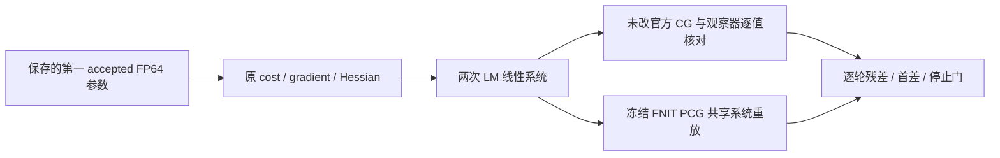
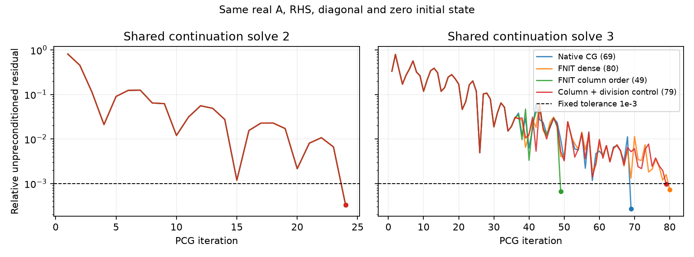

# FNIRT 共享状态 PCG 有限定位（2026-10-04）

## 1. 功能与范围

本次只诊断真实 GM 配准的线性求解。复用此前保存的第一组官方 accepted FP64 参数，在最粗层按官方 LM 成功后的 damping `0.1 / 10 = 0.01` 开始，两次求解后结束。每次保存完全相同的 Hessian、右端项、lambda、零初值和对角预条件器，再比较已安装官方 CG 与冻结 FNIT PCG 的每轮残差。

**结论：在这两个共享系统中，浮点计算顺序足以产生第三次求解的迭代分叉；未发现停止判据或容差语义错误。** 第二次各臂均 24 步；第三次官方 69 步、FNIT Torch dense 80 步、严格列序乘法配 FNIT reciprocal 49 步。它们都满足同一个 `||r||₂ / ||b||₂ <= 1e-3`。第三次的末端参数仍有明显差异，因此“都收敛”不能称为参数等价。

原始完整配准的第二、第三次 H/RHS/逐轮状态没有归档。本次是从已保存参数重新评估 cost 后的**有限续跑**，不能声称恢复原始 stock 第三次轨迹，也不能给完整配准误差划分归因比例。未重跑完整 registration/VBM，未改生产 FNIRT、SynthSR、CUDA 或原验收门；没有 GPU 作业。



## 2. Python 调用、输入与输出

```python
from pathlib import Path
import numpy as np
import torch
from fnit.fnirt.optimizer import preconditioned_conjugate_gradient

shared_oracle_directory = Path("/private/new_probe/oracle")
parameter_count = 1177  # 7×8×7×3 个形变系数，加一个强度 scale
shared_system_matrix = np.fromfile(
    shared_oracle_directory / "solve3_A.f64", dtype=np.float64,
).reshape(parameter_count, parameter_count)  # 行优先、native FP64 值
shared_right_hand_side = np.fromfile(
    shared_oracle_directory / "solve3_rhs.f64", dtype=np.float64,
)
shared_preconditioner_diagonal = np.fromfile(
    shared_oracle_directory / "solve3_diagonal.f64", dtype=np.float64,
)
shared_system_tensor = torch.from_numpy(shared_system_matrix)
shared_solution, shared_solver_report = preconditioned_conjugate_gradient(
    lambda direction: shared_system_tensor @ direction,
    torch.from_numpy(shared_right_hand_side),
    diagonal=torch.from_numpy(shared_preconditioner_diagonal),
    tolerance=1e-3,  # 原固定相对残差门
    max_iterations=500,  # 原固定迭代上限
)
```

这里向量 RHS 是官方正 gradient，官方 LM 更新为 `parameters - solution`。FNIT 生产使用负 gradient 和成对的 half-H/half-gradient 约定，本次不重新构建其 matrix-free H；只隔离同一线性系统中的求解行为。预条件器的数学意义相同，均为对角的逆；实际除法/倒数乘法的 FP64 算术差异单独记录。

私密输入保留在服务器统一 runs：`H_before_nudge`、实际带 LM damping 的 `A`、RHS、diagonal、x0、共享参数，以及逐轮 `r/z/p/q/r_after`，均为 FP64 binary。两矩阵都是 `1177×1177`，保存为行优先，每个 `11,082,632 B`；每个向量 `9,416 B`。官方 Hessian 参数默认 `--numprec=double`。强度 scale 与形变系数单位不同；以下 solution max/RMSE 是混合参数向量度量，不把全部数值标为毫米。

公开输出仅含匿名逐轮标量、差异统计和 SHA：

- [comparison.public.json](reports/comparison.public.json)：H/RHS/diagonal/x0/轨迹身份；官方与 FNIT 各臂结果；相同 native p 上的乘法核对。
- [native_vectors.public.json](reports/native_vectors.public.json)：同一 native 向量的预条件、dot、更新、范数；停止门和独立 Cholesky 检查。
- [solve2_residuals.csv](reports/solve2_residuals.csv)、[solve3_residuals.csv](reports/solve3_residuals.csv)：逐轮相对残差，已停止后的单元格留空。
- [binding.public.json](reports/binding.public.json)：实际 source/object/library/program/input SHA、资源和有限探针时钟。
- [arithmetic_source.public.json](reports/arithmetic_source.public.json)：现场 Armadillo/NEWMAT 算术 header 和 FP64 默认值身份。

没有提交影像、参数、矩阵、模型、license 文件或凭据。

## 3. 诊断命令行

```bash
# 原始 source prefix 保持冻结；仅此验证脚本调用共享系统。
export PYTHONPATH="$FNIT_FROZEN_SOURCE/src"
export OMP_NUM_THREADS=8 MKL_NUM_THREADS=8 OPENBLAS_NUM_THREADS=8 NUMBA_NUM_THREADS=8
export CUDA_VISIBLE_DEVICES=
python replay_shared.py --oracle "$SHARED_ORACLE_DIRECTORY" --output "$NEW_REPLAY_DIRECTORY"
python analyze_native_vectors.py --run "$SHARED_PROBE_RUN_DIRECTORY"
```

`--oracle` 是含 `state.json` 和共享 binary 的目录；`--output` 接收匿名 JSON 与私密 NumPy solution；`--run` 指向含 `oracle/` 与 `replay/` 的 probe 根。线程为 8，interop 为 1。[replay_shared.py](replay_shared.py) 调用冻结 FNIT 函数，通过 matvec 回调观察原求解循环，并断言重建的末端残差与其 report 完全相同。自有 NumBa CSC 累加使用 `fastmath=False`；另一个小循环只用于一次 division/reciprocal 的诊断控制，不进入生产。

[run_shared.sh](run_shared.sh) 给出实际输入、核组和锁；在 nodecw7 的 `0,4,8,12,16,20,24,28` 八个物理核上顺序运行，取得 `nodecw7.synth.cpu8.lock`。重新运行时必须改为新的 workspace/run 名称，不能覆盖这次冻结产物。[build.sh](build.sh) 只在 headcw 编译自有参考包装并复用此前四个已绑定对象；nodecw7 不安装 compiler，不移动 Conda prefix。

## 4. 对应原软件与状态约定

GM recipe 的原软件命令示例是：

```bash
fnirt --in="$PUBLIC_GM_IMAGE" --ref="$GM_TEMPLATE_IMAGE" --aff="$PUBLIC_FLIRT_MATRIX" \
  --refmask="$REFERENCE_MASK_IMAGE" --config="$FSL_REFERENCE_ROOT/etc/flirtsch/GM_2_MNI152GM_2mm.cnf" \
  --cout="$NEW_COEFFICIENT_IMAGE" --logout="$NEW_FNIRT_LOG"
```

上面是功能映射，本轮没有执行完整 `fnirt`。实际执行 [official_shared.cpp](official_shared.cpp) 的独立参考包装，使用同配置和 `--miter=1,0,0,0` 解析完整 schedule，仅手写两次最粗层 continuation。没有调用完整 `nonlin` 优化；没有写 MRI 输出或重新配准。

官方已安装 `nonlin.cpp:409–453` 的成功分支重新计算 g/H；拒绝分支复用 g/H、提高 damping。对角 nudge 为 `((1 + damping)/(1 + old_damping)) * diagonal`；解 `A x = +g` 后取负 step。当前两 trial 均成功，第二/第三状态的 LM damping 为 `0.01/0.001`、SSD 加权 regularization lambda 为 `10963.90819906025/9049.463427795125`。这不是拒绝重试案例。

官方 `SpMat::SolveForx` 默认零初值、对角预条件、未预条件残差相对 RHS 范数，门 `<=1e-3`、上限 500；已安装 `cg.h` 未修改。包装观察器在两个实际系统上的 solution 与 `SolveForx` **逐值相同**，observer max 均为零。它观察每轮真实向量而非另写一个“官方近似求解器”。

## 5. 真实结果、首差与时钟

输入沿用此前真实公开 GM、FLIRT affine、GM template 和 mask。第一 accepted vector SHA `83a3999f0fb3436056be7bb7c86c495565bbcb4051f9623fd2f1cec5e7869b42`；实际四个 object、安装源码和四个主库的 SHA 均重新核对，与此前 nonzero 报告相同。没有下载新权重/模板或改变资源许可边界。

| 共享状态 | 官方 CG | FNIT Torch dense | FNIT 严格列序 | 列序+除法控制 |
|---|---:|---:|---:|---:|
| solve2 步数 | 24 | 24 | 24 | 24 |
| solve2 最后相对残差 | 0.00033284539397 | 0.00033284539507 | 0.00033284539507 | 0.00033284539493 |
| solve3 步数 | 69 | 80 | 49 | 79 |
| solve3 最后相对残差 | 0.00027178676716 | 0.00072039557927 | 0.00066757613714 | 0.00096624573570 |



曲线仅使用上面的匿名 CSV；[plot_residuals.py](plot_residuals.py) 可重绘。它展示同一停止门下的轨迹与停止轮次，没有影像输入或配准脑图。

**首差与传播：**

- 相同 native p 上，全部 `24+69` 次自有严格列序 q **逐值同官方**；Torch dense q 的最大差分别 `8.53e-14/6.75e-14`。列序仅替换这一诊断 matvec，不改变矩阵数值。
- 相同 native r 上，`r / diagonal` 的 z 全部逐值同官方；FNIT `reciprocal(diagonal) * r` 的第一轮 z 分别 335/338 个元素不同，最大差 `3.55e-15/8.88e-16`。
- 使用相同实际 native 向量，Torch rho/den dot 最多差 3 ULP，alpha 最多差 5 ULP，相对范数最多差 2 ULP。官方 DotProduct 包装转发到安装的 Armadillo；没有凭某个相似数学公式猜测其累计顺序。
- 固定 native alpha 后，Torch 的 `r - alpha*q` 全部逐值同 native `r_after`。因此未见向量更新公式错误。
- solve2 的 dense/native solution max 差 `2.47e-11`；solve3 的 dense/native max/RMSE 为 `0.485632/0.110994`，列序/native 为 `2.117060/0.386612`。同一容差门允许不同参数停止点。

**停止门：**全部官方、dense、列序路径在停止前每次相对残差 `>1e-3`，最后 `<=1e-3`。重新计算 `b-Ax` 的真实相对残差与递推残差相差约 `1e-15`，没有残差虚假收敛；全部 denominator 有限且为正、rho 大于 tiny，对角 floor 触发次数零。官方与 FNIT 这里都没有使用预条件残差或不同上限。

canonical A 两次均严格对称，独立谱分解的最小特征值 `3.86e-5/2.44e-5`、最大值 `5016.47/5137.83`，原始矩阵条件数约 `1.30e8/2.10e8`（这是原单位下的 A，不是预条件后的条件数）。独立 Cholesky 的真实残差为 `1.53e-16/1.02e-15`；它只核对系统和残差敏感性，不替代官方 PCG，不改变 benchmark oracle 或门槛。solve3 官方/dense/列序的 solution 相对 Cholesky 误差分别 `0.0787/0.0575/0.1806`。

两个官方 trial cost 从 `73.4298866156 → 61.8192438022 → 60.4804331797`，均 accepted。初次 cost 与此前 shared nonzero probe 相同；原 cost 缓存重复评估已有尾差，故这里仍不称 stock 原轨迹。

本队列 `22:23:32–22:24:05 +0800`，exit 0。官方有限探针 GNU wall `28.66 s`、RSS `420,104 KiB`；FNIT 共享重放 `3.92 s`、RSS `427,152 KiB`。两者包含不同的状态构建、观察与保存内容，**不是官方与 FNIT 端到端速度对照**；没有完整配准时间或脑图更新。loadavg 前后 `20.63/21.10/21.88` 与 `21.96/21.39/21.95`，源码/状态记录均保留。

## 6. 更新、失败记录与未测范围

- 前序 first-diff：第一 accepted 及 regrid 有限状态；非零共享 H 尚未保存。
- 前序 CPU orientation：完整候选形变误差变大，未接入；其第三次 PCG `80/49` 是不同参数/系统上的旧记录。
- 前序 nonzero：固定第一 accepted 参数下比较 g/H 子算子；没有第二/第三次轨迹。
- 本轮：两个重新评估的真实 shared continuation 系统、官方观察器逐值核对、每轮残差、原 FNIT PCG 重放及浮点控制；仅 diagnostic 交付。

构建 v1 的自有 `Trace` 类型与 NEWMAT 名称冲突，修正为 `IterationTrace`；v1 log 保留。v2 初始链接使用了不存在的三个库名，已核对 `ldd` 并改为现场 `libfsl-meshclass`、`libfsl-NewNifti` 等实际库；失败链接 log 与成功 log 分开保留，没有重编四个原对象。另一个 metadata 查找递归扫描 header/NFS 达到 180 s relay timeout，没有阻止独立构建和运行，也没有当作科学推理时间。

没有测原始 stock 第二/第三次的完整内部缓存状态、拒绝 LM 路径、后续分辨率层或最终形变输出。本次不证明生产 H/gradient assembly 与官方完全等价，不支持 Gram、regularizer 或停止容差生产补丁。保存的相同系统足以证明浮点尾差放大是一个实际机制，不能证明它是所有完整配准误差的唯一来源。

## 7. 原实现与参考

- [FNIRT 官方源码](https://git.fmrib.ox.ac.uk/fsl/fnirt)、[MISCMATHS](https://git.fmrib.ox.ac.uk/fsl/miscmaths)、[basisfield](https://git.fmrib.ox.ac.uk/fsl/basisfield)。本轮使用现场 FSL `6.0.7.4` 的原始 source/header/library，以实际 SHA 绑定。
- Andersson JL, Jenkinson M, Smith S. *Non-linear registration, aka spatial normalisation*. FMRIB Technical Report TR07JA2, 2007。
- 生产继续使用成熟 PyTorch FNIRT；独立 C++ 参考仅属于 validation，未复制发布官方源码或二进制，也没有新增生产依赖。
