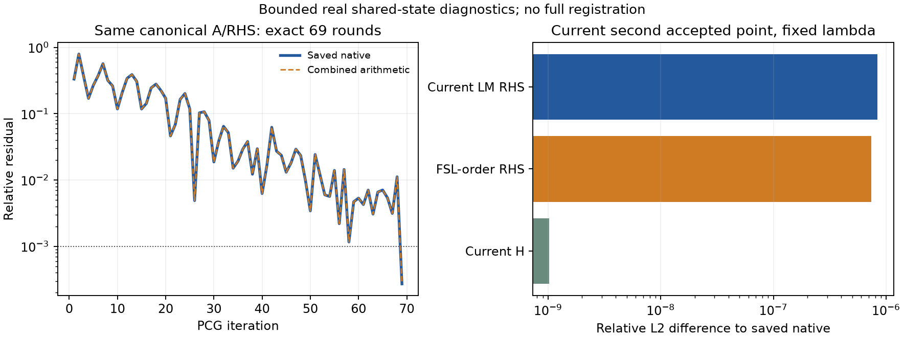

# FNIRT CPU：共享系统算术恢复与当前第二 accepted 点组装（2026-10-06）

## 1. 功能与结论

本轮只做两个有限诊断，生产源码没有改动，没有运行完整配准、MRI 网络、topology 或最终重采样。

1. 对已保存的真实 solve3 矩阵使用自有严格 CSC、直接除法及独立原生算术进程，**自然停止于 69 轮**。每轮已有官方 r/z/p/q/r_after、rho/denominator/alpha/相对范数和最终 1177 个 FP64 解均逐位相同。这恢复了该共享系统的算术轨迹，尚未修复整个 CPU 优化器。
2. 在已保存的第二 accepted 参数上，当前 CPU `2*g/2*H` 与固定原生状态比较。H 相对 L2 为 `1.0285e−9`；RHS 为 `8.3642e−7`。只调整 Jte 顺序后 RHS 为 `7.3657e−7`，改善约 12%，仍有未解释的组装差异。

这里的第二 accepted 点来自此前 fresh shared continuation，未取得原 stock 第二次迭代的内部缓存状态。

源码冻结于 `6f62404023fb566fcfa9e2c20d77c2c7e79796e5`。`registration.py` SHA `caab8ffccfd47225018d15803e0acee70c05b0212a22a4b720b034454c75e4da` 已包含 d63 的 CPU 优化；它不同于早期 first-diff 冻结源码。`optimizer.py` SHA `903d5031058c96aa9e5fdc29736619fe636b62422cd2646b527df49011d173fd` 与前序 PCG 报告一致。每个 attempt 的 503 项源/输入绑定全部通过，完整冻结 Python 源清单也保留。

原始矩阵、向量、完整 MRI 和本轮私有 H/RHS 留在服务器；公开目录只有自有代码、匿名标量、哈希、CSV 和图。不发布原生可执行文件、`.so`、官方源码或许可证。

## 2. Python 调用、输入和输出

成功算术入口为 [pcg_arithmetic_cli.py](source/pcg_arithmetic_cli.py)。第二点入口为 [assembly_shared_v2.py](source/assembly_shared_v2.py)。两者均使用已有公开 GM/FLIRT/template/mask 和前序有限共享状态，输入数据未重新生成。

| 入口/参数 | 输入意义与格式 | 输出 |
|---|---|---|
| 算术 `--oracle` | 既有 oracle 目录。小端 FP64 `solve3_A.f64` 为 `1177×1177` 行序矩阵；RHS/diag/x0/solution 为 1177 向量；另有 solve2 的 24 轮、solve3 的 69 轮向量及 CSV | 93 轮算术合同、动态逐轮比较 JSON/CSV、私有解 |
| 算术 `--library` | 成功 attempt 中接收自有 `arithmetic_cli` 可执行文件；该进程链接现场官方 benchmark 依赖，与 NumPy 父进程隔离 | 编译身份、BLAS integer 为 4 字节、double 为 8 字节 |
| 算术 `--output` | 必须不存在的新输出目录 | `contracts.public.json`、`summary.public.json`、`residuals.csv`；`solution.private.f64` 不公开 |
| 组装 `--oracle` | 同目录内第二 accepted 的 `solve3_parameters.f64`、native full RHS/H/A 和 `state.json` | 当前完整 `1177×1177 H`、RHS/diag 及指标 |
| 组装 `--gm` | 已保存官方 FAST GM NIfTI，`224×288×288`，不重跑 FAST | 捕获最粗层当前 FNIT system |
| 组装 `--template` | 已用 GM template NIfTI，`91×109×91`、2 mm | 保留真实 header/affine |
| 组装 `--mask` | 既有参考 mask NIfTI；使用原配置的各层 mask 规则 | 当前有效体素数 14,341 |
| 组装 `--affine` | 已保存 FLIRT `4×4` 文本矩阵；经成熟坐标 helper 转为 world affine | 保留原坐标约定 |
| 组装 `--output` | 必须不存在的新输出目录 | 当前/控制组标量和私有 H/gradient/diagonal；不输出新配准 MRI |

1177 个参数由 `3×7×8×7` 位移系数与一个 global-linear intensity scale 组成，不能把所有参数差都标为 mm。系数、solver 和 H/RHS 为 FP64；实测 derivative/residual/Jte product 为 FP32，adjoint input/output 为 FP64。没有 autocast 或 GPU 初始化。

普通 Python 使用 `main()` 的命令行入口即可；它们是 validation harness，不加入 FNIT 公共 API。

## 3. 命令行复现与所有控制

完整已执行调度见 [run_arithmetic_cli.sh](source/run_arithmetic_cli.sh)、[run_probe_v3.sh](source/run_probe_v3.sh)。服务器固定目录、环境 prefix 和已有冻结目录保持原位。重新运行必须另取新目录；代码中的历史 runner 保存原命令，不应覆盖已有测量。

```bash
# 下面变量分别指向已绑定的当前源码、原共享状态和独立原生算术程序。
export PYTHONPATH="$FNIT_CURRENT_FROZEN_SOURCE"
export FNIT_NATIVE_ARITH_LIBRARY_PATH="$FSL_REFERENCE_ROOT/lib"
export OMP_NUM_THREADS=8 OPENBLAS_NUM_THREADS=8 MKL_NUM_THREADS=8 NUMBA_NUM_THREADS=8
export CUDA_VISIBLE_DEVICES=

# 首先对93轮既有向量过原生算术门，再运行一臂动态PCG。
python source/pcg_arithmetic_cli.py \
  --oracle "$FNIT_SAVED_NATIVE_ORACLE" \
  --library "$FNIT_ISOLATED_ARITHMETIC_EXECUTABLE" \
  --output "$FNIT_NEW_ARITHMETIC_OUTPUT"

# 只捕获最粗层并构建共享第二accepted点，不进入非线性优化器。
python source/assembly_shared_v2.py \
  --oracle "$FNIT_SAVED_NATIVE_ORACLE" \
  --gm "$FNIT_SAVED_OFFICIAL_GM" --template "$FNIT_GM_TEMPLATE" \
  --mask "$FNIT_REFERENCE_MASK" --affine "$FNIT_SAVED_FLIRT_AFFINE" \
  --output "$FNIT_NEW_SHARED_ASSEMBLY_OUTPUT"
```

实际运行在 nodecw7，affinity `32,36,40,44,48,52,56,60`，8 Torch/OMP/BLAS/Numba threads。先取得 `nodecw7.gems.cpu8.lock`，再取得本模块 inner lock。调度为 detached，总硬时限 900 s；算术 180 s、组装 600 s。算术 CPP 子进程继承相同 CPU affinity；生产 FNIT 和 GPU 均未运行。

PCG 保留零初值、FP64、未预条件 `norm(r)/norm(b) <= 1e−3`、上限 500。没有预设 69 轮、改变容差、用 Cholesky 替代或应用求出的配准 step。

组装固定存档 `effective_lambda=9049.463427795125`、LM damping `0.001`。native 解 `A*x=+g`，随后原软件取负 step；本轮比较 +g。生产 `linearize` 返回 half g/H，比较时乘 2；`gradient()` 已含因子 2，不再重复乘。lambda 只在私有 system 实例覆盖，capture 的 class 方法通过 `finally` 恢复。

## 4. 对应原软件与算术上下文

原软件为已绑定的 FSL 6.0.7.4 / FNIRT 2203。复用 [前序共享探针](../fnirt_pcg_shared_state_20261004/README.md) 的 A/RHS/diag、真实向量及观察器；**本轮未重新调用 FNIRT 配准或原生 cost function**。DotProduct/NormFrobenius 是内部算术，没有独立官方 CLI。

[build_arithmetic_cli.py](source/build_arithmetic_cli.py) 生成自有 C++ 转发/stdio 协议，包含原 observer 的现场 headers，并链接同四个冻结对象与 FSL 库。原生进程不导入 NumPy/Torch；父进程只传 FP64 向量并接收标量。生产不得依赖该程序或安装 FSL。

| 实际记录 | 普通 LOCAL shared bridge | 成功独立 C++ observer context |
|---|---|---|
| 编译 flags | C++17、`-O0 -fPIC -shared` | C++17、`-O0 -fPIC` 编译后链接 executable |
| 实测 `ARMA_USE_BLAS` | 开启，flags=1 | 开启，flags=1；BLAS integer 4 bytes |
| 直接 include | `armawrap/newmat.h` | `newimageall.h`、`nonlin.h`、`miscmaths.h`、`cg.h`、FNIRT 两个 headers |
| 链接 | BLAS/LAPACK/pthread | 原 observer 四个 frozen objects 和完整 FSL link 链 |
| BLAS 身份 | ddot_/dnrm2_ 的 dladdr 指向 FSL OpenBLAS，SHA `8aaf756b…` | 完整 link 身份保留；93 行合同实际逐值匹配 |
| 93 行 norm | 全部 exact | 全部 exact |
| 93 行 dot/alpha | rho 59、den 56、alpha 69 行有尾差 | 全部 exact |

[编译绑定](reports/build/native_cli.binding.public.json)、[原 LOCAL 绑定](reports/build/native_bridge.binding.public.json) 和 [ELF symbol 身份](reports/build/symbol_context.public.json) 保存了实际改变项。O0、BLAS 开关和 BLAS 文件 SHA 没有记录到变化；头文件/对象/完整链接及进程上下文作为组合改变。未做逐项拆分，**不能把成功归因于某个具体 flag、单个符号、NumPy 冲突或某个猜测的累加算法**。同 BLAS SHA 本身不足以证明完整算术上下文相同。

三者均有同名 weak `armawrap::DotProduct`、`arma::op_dot::direct_dot`、`arma::blas::dot` 及 imported `ddot_`；没有发现这些符号名改变。ELF 身份记录只约束上述事实，不证明共享库中的实际模板/符号执行上下文已与独立 executable 相同。

## 5. 真实有限结果、时钟和可视化

### 共享 canonical A 的完整算术组合

| solve3 臂 | 停止轮次 | 与 native 最终解 max 差 |
|---|---:|---:|
| 原 native | 69 | 0 |
| 前序 Torch dense | 80 | 0.485632 |
| 前序 strict CSC + reciprocal + Torch reductions | 49 | 2.117060 |
| 前序 strict CSC + division + Torch reductions | 79 | 见前序报告 |
| 本轮 strict CSC + division + 独立原生 reductions | **69** | **0，1177 项 bits 全同** |

当前臂最后 relative residual `0.0002717867671587692`；全部已有 native 逐轮向量与 scalar exact。记录见 [合同](reports/v3/arithmetic/contracts.public.json)、[完整逐轮 JSON](reports/v3/arithmetic/summary.public.json) 和 [CSV](reports/v3/arithmetic/residuals.csv)。前三种 FNIT 对照为历史共享系统记录，没有重新运行或改标源码；矩阵相同。



图使用匿名 scalar/CSV；左图为该共享系统，右图为另一个有限组装探针，没有新 MRI 或脑图。完整配准脑图仍见 [已拒 orientation 候选](../smri_cpu/fnirt_cpu_orientation_20261004/README.md)。

### 当前第二 accepted 点

| 对比 native full quantity | 相对 L2 | max abs |
|---|---:|---:|
| 当前 LM RHS | `8.3642e−7` | `8.7174e−6` |
| 当前 direct gradient | `7.5389e−7` | `7.8519e−6` |
| 仅 FSL 顺序 Jte RHS | `7.3657e−7` | `7.6699e−6` |
| 当前完整 H | `1.0285e−9` | `7.2372e−7` |
| 当前 diagonal | `8.6377e−12` | `1.1056e−8` |

H 当前对称尾差 max `3.3307e−16`。Jte 当前先在 FP32 两次除 `sqrt(N)`；控制先 FP32 `derivative×residual×mask`，再 FP64 adjoint/sum、除 N。只换 RHS 运算顺序，没有更换当前影像数组或 H。[组装 JSON](reports/v2/assembly/summary.public.json) 保存全部有限指标、实际 dtype 和七个存档方向上的 H 作用比较。

当前 count 为 14,341，SSD `60.329756040354546`；计算出的 SSD-weighted lambda `9049.463406053183` 与存档值仍有尾差，比较前已固定为存档值。此状态是当前 FNIT 的 fresh reconstruction，未恢复原 stock cache；没有把这些微差解释为完整误差的唯一原因。

组装 wall `8.2814 s` 包含预处理、完整 H materialization、保存及指标。算术 wall `1.9852 s` 包含93行合同、JIT、IPC和动态重放。内容不同，不作端到端速度比。全部数据、矩阵和参考沿用既有真实公共输入；同系数 Jacobian 通过与本轮线性系统恢复均不代表完整非线性估计通过。

## 6. 更新、失败记录与下一 CPU 方案

- 前序 first-diff / nonzero / PCG / rejected orientation 的测量与源码绑定保持原样。本轮没有重复平滑翻转、Jacobian、完整配准或原生优化。
- 首次 head 同步编译超过 TTY 25 s，编译组被终止；改为180 s detached 编译。失败记录在 [failed_request](reports/build/failed_request.public.json)。
- v1 `DEEPBIND` 在 CDLL load 阶段 segfault，exit139；v2 普通 LOCAL 不崩溃，但93标量门失败，未运行动态臂。四个极小 loader 合同证明普通 LOCAL 在 stdlib-only 和 NumPy/Numba/SciPy 已导入两种情况下都通过；DEEPBIND 两者都失败。日志均保留。
- v2 的组装先独立完成；v3 改用独立原 observer context 后 exit0，93门和69自然动态门均通过。没有重算已完成的 H/RHS。

**最小后续方向：**生产 CPU 求解器若要匹配该轨迹，应在 FNIT 自有运算或项目 Conda 可构建的独立实现中，配套实现严格 matvec、直接除法与匹配的 reductions；首先复用这93行及69轮门。不得让生产调用安装 FSL、链接本轮 benchmark 可执行文件或复制原生解。单独替换 reciprocal、单独更改 Jte、调整停止容差目前均缺乏充分依据。

另一个待解问题是当前 RHS 约 `7.4e−7` 的残差来源；本轮尚未分离当前 image/derivative/residual 尾差与 adjoint 组装。这一轮停止在有限诊断，不产生生产补丁，也不重新运行完整注册。

## 7. 原实现、参考和完整性

[FNIRT 官方源码](https://git.fmrib.ox.ac.uk/fsl/fnirt)、[basisfield](https://git.fmrib.ox.ac.uk/fsl/basisfield)、[miscmaths](https://git.fmrib.ox.ac.uk/fsl/miscmaths)、[NEWMAT/armawrap](https://git.fmrib.ox.ac.uk/fsl/armawrap)。使用现场固定版本的 benchmark headers/libraries，生产实现继续受 FNIT runtime 和资源许可规则约束。输入沿用 ds003138 v1.0.1 公共数据（CC0）及此前绑定的 GM template/mask；未下载或再分发新资源。

参考：Andersson JL, Jenkinson M, Smith S. *Non-linear registration, aka spatial normalisation*. FMRIB Technical Report TR07JA2, 2007。

[manifest.public.json](manifest.public.json) 记录本目录文件大小与 SHA；[summary.public.json](summary.public.json) 汇总科学门和未测范围。报告只包含 anonymous scalars/code identities；私有矩阵、cache、MRI、安装原软件的源/二进制和认证材料未公开。
