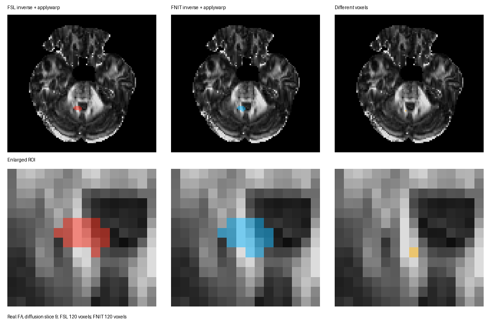
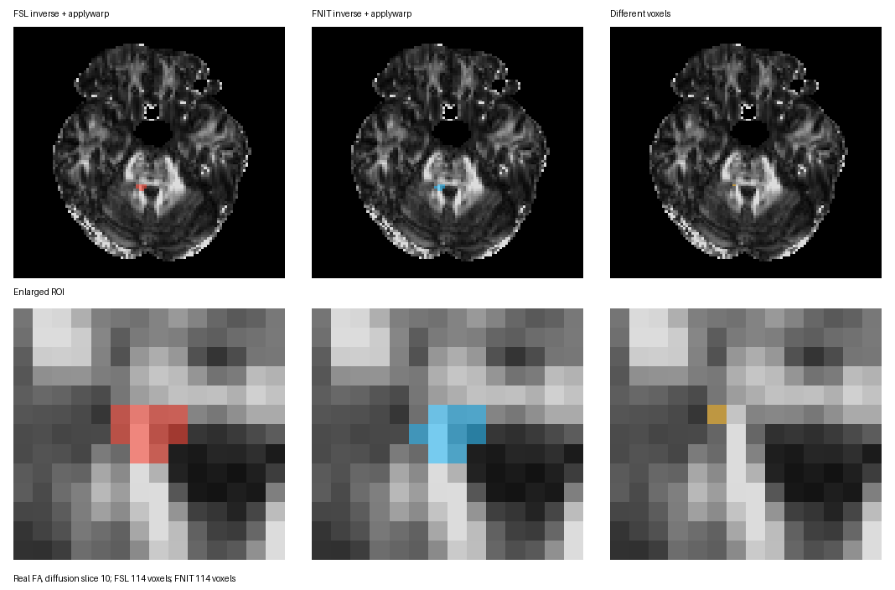

# 反场及 MNI 掩膜：真实 DWI 对照

[函数用法、参数和输出](../../docs/invwarp/README.md) · [组合场对照](../convertwarp/README.md) · [概率追踪 MNI seed 示例](../../docs/probtrackx/README.md)

## 默认 TBSS/MMORF 分支的同输入 FSL 对照

同一例真实 DWI、同一张 JHU 第 9 号 MNI 掩膜，分别读取本包 dMRI pipeline 实际保存的 TBSS 和 MMORF 配准结果。TBSS 直接用其已含 affine 的 FNIRT 系数分别运行 FSL/FNIT `convertwarp`，再对各自 dense 场求逆；MMORF 先用 FNIT 把其非 FSL 坐标场和 FLIRT 矩阵转换成 FSL dense 场，再把**同一张** dense 场分别交给 FSL/FNIT `invwarp`。两种逆场分别由各自 `applywarp` 最近邻映射同一张 MNI 掩膜。[TBSS 机器报告](report.pipeline_tbss_fsl.public.json)和[MMORF 机器报告](report.pipeline_mmorf_fsl.public.json)记录源码哈希及逐项指标。

| 分支 | 前向场 FSL/FNIT 分量 MAE | 反场脑内向量均差 / 95 百分位 | FSL/FNIT 掩膜体素、交集、Dice | FSL 完整命令：转换 / 求逆 / 应用 | FNIT Python 调用：转换 / 求逆 |
| --- | ---: | ---: | ---: | ---: | ---: |
| TBSS | 1.98×10⁻⁶ mm | 0.0058 / 0.0149 mm | 120/120、119、0.9917 | 49.73 / 110.82 / 4.55 s | 10.02 / 0.79 s |
| MMORF | FSL 不读取原 MMORF 场；转换后共用同一场 | 0.0670 / 0.1949 mm | 114/114、113、0.9912 | — / 137.49 / 4.81 s | 7.27 / 0.81 s |

这里的 FNIT Python 调用时间是在模块导入后测量；FSL 是包括启动、读写的完整命令，不能把两列相除作为加速比。反场全 diffusion 网格的向量均差约 1.40 mm，主要来自前向场覆盖范围外的求逆边界；脑内指标更适合评价掩膜应用区域。两套求逆方法仍不逐体素等价，1 个体素的掩膜差异已由图示保留。TBSS 的 `dti_FA_to_MNI_affine.mat` 没有作为额外 `premat`，因为系数已包含该 affine。





以下命令使用已保存的同一被试 pipeline 输出；MMORF 的 `--mmorf-warp` 为 FNIT 专有坐标转换，FSL 从转换后的 dense 场开始对照。

```bash
# TBSS：warp1 已含线性部分，不添加 premat。
convertwarp --ref="$TBSS/registration/standard/FA.nii.gz" \
  --warp1="$TBSS/registration/dti_FA_to_MNI_warp.nii.gz" \
  --out="$OUT/fsl_tbss_diff2mni.nii.gz" --relout
fnit convertwarp --ref "$TBSS/registration/standard/FA.nii.gz" \
  --warp1 "$TBSS/registration/dti_FA_to_MNI_warp.nii.gz" \
  --out "$OUT/fnit_tbss_diff2mni.nii.gz" --relout --device cuda:0

# MMORF：FA→MNI 矩阵与 MMORF 非线性场先换成 FSL dense 场。
fnit convertwarp --ref "$MMORF/registration/standard/FA.nii.gz" \
  --source "$MMORF/native/dti_FA.nii.gz" \
  --mmorf-warp "$MMORF/registration/mmorf_warp.nii.gz" \
  --premat "$MMORF/registration/dti_FA_to_MNI_affine.mat" \
  --out "$OUT/mmorf_diff2mni_FSL.nii.gz" --device cuda:0

# 对各自前向 dense 场，继续使用下面相同的逆场和掩膜命令。
invwarp --ref="$BED/nodif_brain_mask.nii.gz" --warp="$FORWARD" \
  --out="$OUT/fsl_mni2diff.nii.gz" --rel
fnit invwarp --ref "$BED/nodif_brain_mask.nii.gz" --warp "$FORWARD" \
  --out "$OUT/fnit_mni2diff.nii.gz" --rel --device cuda:0
applywarp --in="$MNI_MASK" --ref="$BED/nodif_brain_mask.nii.gz" \
  --warp="$OUT/fsl_mni2diff.nii.gz" --interp=nn --datatype=char \
  --out="$OUT/fsl_mask_diff.nii.gz"
fnit applywarp --in "$MNI_MASK" --ref "$BED/nodif_brain_mask.nii.gz" \
  --warp "$OUT/fnit_mni2diff.nii.gz" --interp nn --datatype char \
  --out "$OUT/fnit_mask_diff.nii.gz" --device cuda:0
```

`JHU_label9_MNI.nii.gz` 由 JHU-ICBM-labels-1mm 图像中等于 9 的体素得到。图示脚本为[plot_real.py](plot_real.py)，其 `--fa`、`--fsl-mask`、`--fnit-mask` 和 `--output` 分别指定 diffusion FA、两套掩膜与 PNG 输出。数值报告由[compare_pipeline_real.py](compare_pipeline_real.py)生成。原始 DWI 和逐体素结果保留在授权服务器；上述证据限于一例和一个小 ROI，不代表所有解剖位置的求逆精度。
