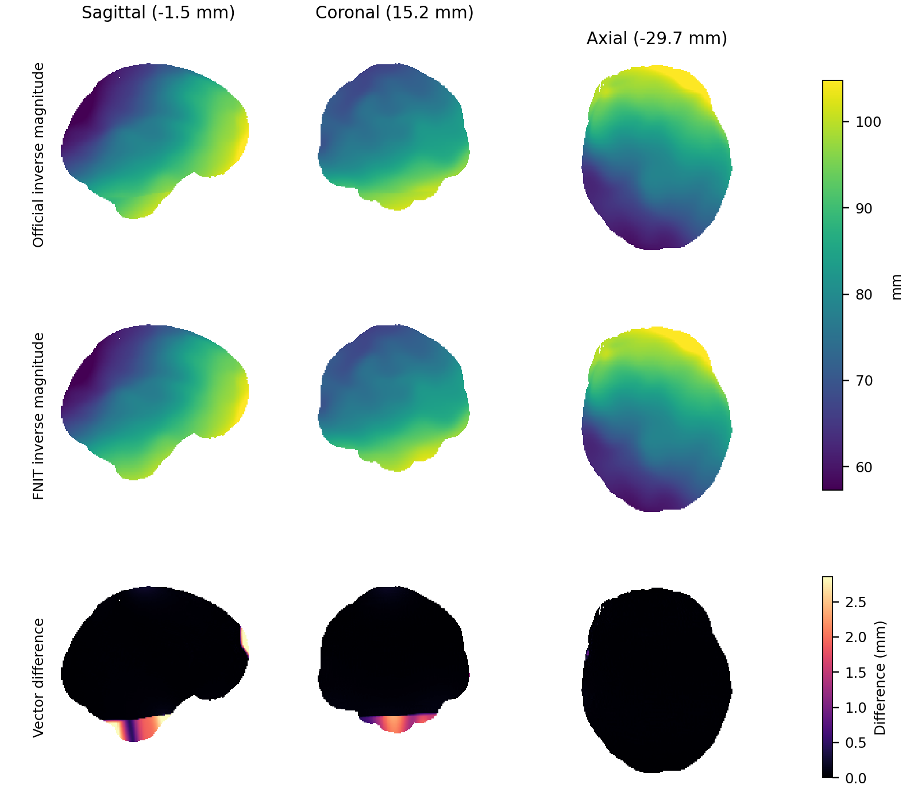

<!-- 原正文完整归档；基线 140c3739ac6c7a6826bf9421202ef59bec7ffe67；只修复迁移后的相对链接。 -->

# TorchInvWarp：在指定网格上反转 FSL 位移场

[返回首页](../../README.md) · [CPU 同线程官方 benchmark](../../docs/invwarp/CPU_BENCHMARK.md)

## 1. 功能简介

`TorchInvWarp` 将一个 FSL pull 场求逆，并在指定原始影像网格上保存反场。例如，DWI→MNI 的场定义在 MNI 网格、指向 DWI；求逆后的 MNI→DWI 场定义在 DWI 网格、指向 MNI。反场可交给 `TorchApplyWarp`，将标准空间掩膜或标量图重采样到个体空间。

支持 FSL dense 相对/绝对场及 intent-2007 FNIRT 三次样条系数。计算使用 PyTorch；生产 API 不启动 FSL。先从前向场估计全局仿射，再执行固定点修正。坐标与关键计算保持 float64，保存的 NIfTI 是 float32，不使用 FP16/BF16。CUDA 分支保持既有运算，遵循 FNIT 的 TF32 设置。

## 2. Python 调用、输入输出与参数

```python
from fnit import TorchInvWarp

native_reference_path = "/absolute/path/native_T1w.nii.gz"  # 输入：决定反场的完整 3D 网格
forward_warp_path = "/absolute/path/T1w_to_MNI_coeff.nii.gz"  # 输入：MNI 网格上的前向 pull 场/系数
inverse_warp_path = "/absolute/path/MNI_to_T1w_warp.nii.gz"  # 输出：native 网格上的反场

inverse_result = TorchInvWarp(device="cuda:0").run(
    reference=native_reference_path,
    warp=forward_warp_path,
    output=inverse_warp_path,
    warp_convention="auto",  # FNIRT 系数自动解释为相对位移；dense 场建议显式指定
    output_convention="relative",  # 保存相对位移，单位为 FSL scaled-mm
    iterations=30,  # 固定点修正的最大次数
    tolerance_mm=0.01,  # 全网格修正分量的最大绝对值小于该值时提前停止
)
print(inverse_result.image.shape, inverse_result.valid_fraction, inverse_result.qc)
```

仅计算、不保存时调用 `TorchInvWarp(...)(reference, warp, ...)`；也可 `from fnit.invwarp import invwarp`，再用 `invwarp(reference, warp, device="cpu", ...)` 调用同样的函数接口。

| 参数 | 类型、默认值 | 输入或作用 |
|---|---|---|
| `device` | `"cpu"`、`"cuda"` 或 `"cuda:N"`；默认 `"cpu"` | 构造计算设备；不更改调用方的 CPU 线程设置。 |
| `reference` | NIfTI 路径或 nibabel NIfTI 对象 | 3D 原始空间影像；只使用其输出网格和几何。 |
| `warp` | NIfTI 路径或 nibabel NIfTI 对象 | 前向 dense 场 `[X,Y,Z,3]`，或 intent-2007 三次样条系数；可包含初始 affine。 |
| `warp_convention` | `"auto"`（默认）、`"relative"`、`"absolute"` | dense 场的值是位移或绝对坐标。系数始终按相对位移解释；无明确 intent 的 dense 场建议显式指定约定。 |
| `output_convention` | `"relative"`（默认）或 `"absolute"` | 输出位移或绝对采样坐标，均为 FSL scaled-mm，而非 world-RAS 分量。 |
| `iterations` | 正整数，默认 `30` | 最大固定点修正次数；不是 FSL 原生求解器的迭代参数。 |
| `tolerance_mm` | 有限正数，默认 `0.01` | 最大修正分量的停止阈值，单位 mm；不是最终每个体素都达到该残差的保证。 |
| `output` | 路径；仅 `run` 必需 | 将反场保存为 4D NIfTI；Python 保存会替换同名输出，独立 CLI 默认保护已有文件。 |

结果为 `WarpFieldResult`：

| 字段 | 输出结构与含义 |
|---|---|
| `image` | float32 NIfTI，shape=`reference.shape + (3,)`；affine、qform、sform 沿用 reference。相对场 intent=2006，绝对场 intent=0。 |
| `valid_fraction` | 全输出网格中，最终采样坐标落在前向场有效网格内的比例。 |
| `qc` | 设备、输入/输出约定、最大次数 `iterations`、实际次数 `iterations_used`、`converged`、阈值及有效场内中位残差。 |

场外采样使用边界值；场外反场不具有保证的解剖意义。固定点法对大变形或折叠场可能不收敛，需同时查看 `converged`、场内残差和有效覆盖，不能只检查文件成功保存。

## 3. 命令行调用

```bash
# --ref：反场的完整 native 输出网格；--warp：前向 pull 场或 FNIRT 系数。
# --rel：dense 输入及输出均使用相对位移；--out：保存 4D 反场。
# --niter：FNIT 固定点修正最大次数；--device：运行设备。
fnit invwarp --ref /absolute/path/native_T1w.nii.gz \
  --warp /absolute/path/T1w_to_MNI_coeff.nii.gz \
  --out /absolute/path/MNI_to_T1w_warp.nii.gz \
  --rel --niter 30 --device cpu
```

独立入口 `fnit-invwarp` 接受相同参数。省略 `--rel/--abs` 时输入约定为 `auto`、输出为 relative；`--abs` 选择 absolute dense 输入和输出，系数输入仍按 relative 解释。`--overwrite` 允许替换已有输出；CLI 只暴露默认 `tolerance_mm=0.01`，需要更改阈值或混合输入/输出约定时用 Python。

## 4. 原软件调用与对应范围

```bash
# FSL 仅用于独立 benchmark：保持相同前向场及输出网格。
invwarp --ref=/absolute/path/native_T1w.nii.gz \
  --warp=/absolute/path/T1w_to_MNI_coeff.nii.gz \
  --out=/absolute/path/fsl_MNI_to_T1w_warp.nii.gz --rel
```

2026-10-04 在 CPU评测节点 实测的 FSL 6.0.7.4 `invwarp` 不接受 `--niter`，也没有显式 CPU 线程选项；FNIT 的 `--niter` 只控制自己的固定点求解。官方 benchmark 保留原程序内部默认停止设置。双方使用相同 CPU 亲和性和线程上限，实际 CPU 利用率另列；不能称原程序实际使用了 8 线程。

FSL 使用其原生求逆算法和 Jacobian 约束；FNIT 尚未提供 `regularise/jmin/jmax/noconstraint` 对应选项。现场 FSL 6.0.7.4 的 `--rel/--abs` 指定 dense 输入约定，保存的反场始终为 relative；系数输入忽略 dense 约定。部分官方网页将这些 flag 描述为输入与输出约定，本页采用实际源码和输出验证的行为。

需要 absolute 输出时，原版参照追加以下转换，两个完整进程及读写均计时；absolute 输入、relative 输出直接使用 `invwarp --abs`。相同输入和输出契约不表示两套求解器数值等价。

```bash
# invwarp 先保存 relative 反场；明确转换为 absolute 输出。
convertwarp --ref=/absolute/path/native_T1w.nii.gz \
  --warp1=/absolute/path/fsl_MNI_to_T1w_warp.nii.gz \
  --out=/absolute/path/fsl_MNI_to_T1w_absolute.nii.gz --rel --absout
```

## 5. 最新真实数据精度、耗时与脑图

### 源 v28：最新 CPU 与 GPU 完整对照

CPU prepared FP64 系数取样使用 fresh-base 两步加法，停止检查减少整卷临时数组；公开参数和 CUDA 运算保持既有路径。[实现范围、CPU评测节点 完整 1/8 核门槛及独立阶段时钟](../../docs/invwarp/CPU_ALLOCATION_20261004.md)记录全部文件、QC 和 30 次实际停止一致。CPU评测节点 新官方配对的完整进程中位数为 35.878/50.899 s（原版/FNIT，1 核）与 36.679/21.661 s（8 核）；单核目标仍未达到。

当前 Inv/Convert/Apply/normalizer 的 runtime SHA 与这份正式配对相同。CPU 完整进程包含启动、导入和全量读写；完整 pair warmup 后保留三次交替配对，API 另做完整 warmup 和三次全量求逆及保存。

| CPU 上限 | FSL 完整进程中位数 | FNIT 完整进程中位数 | FNIT 热 API 中位数（含读写） |
|---|---:|---:|---:|
| 1 | 35.878 s | 50.899 s | 48.571 s |
| 8 | 36.679 s | 21.661 s | 18.441 s |

原版实际平均约一核，8 表示双方的资源上限；CPU1 仍慢于官方，CPU8 达本病例速度目标。脑掩膜内向量差 mean/median/p95/max 为 0.01723/0.01008/0.03361/7.31428 mm，全网格分量 max 为 7.02610 mm；两套求解器尚不数值等价。[正式记录](../../docs/invwarp/assets/cpu-allocation-v2-node8-official-20261004.public.json)保留全部重复、精度与源码核对。

| H100 完整操作，源 v28 | 起始 FNIT API 两组中位数 | v28 API 两组中位数 | 对应调用 peak allocation（B） |
|---|---:|---:|---:|
| 本例完整系数反场 | 4.298 / 4.094 s | 3.870 / 3.993 s | 1,275,725,824；16 次均相同。 |
| 同期 FNIRT 完整六层、三阶段 TBSS | 14.866 / 13.365 s | 14.854 / 14.102 s | warmup 3,564,715,520；测量 3,565,562,368；旧新对应调用相同。 |

[源 v28 H100 公报](../multimodal_cpu_20261004/gpu_cpu_final_v28_ready_retry_20261004.public.json)包含两例各四进程，每进程完整 warmup 一次及三次测量，共 32 次保存。反场全部 18,808,200 值，TBSS 的 cout、iout、jout 与完整 pull Jacobian，以及所有 header/extensions/affine，均与起始 FNIT `1d31e7b` 逐位一致。GPU API 包含读取、计算和保存，排除启动与入口导入，函数内惰性导入计入；同 UUID、TF32、20 GB 上限及前后源码/输入 SHA 均核对。共享时钟不作稳定速度结论；TBSS 的 CPU 对照见 [FNIRT 功能页](../../docs/fnirt/README.md)。

### 源 v26：CPU 采样优化与历史官方配对

最新实现将 CPU 插值源布局准备一次，迭代中跳过丢弃的有效域标志；最终有效域完整计算。内部 FP64 坐标归一化按原逐步乘除顺序融合；源 v26 另对满足条件的静态对角坐标使用保序 CPU 分支。完整输出、实际停止次数和覆盖率与原路径一致，CUDA 求解器保持原路径。固定完整真实 T1 系数反场、原始网格及未压缩 NIfTI 输出，每个线程预算先完整 warmup，再交替运行三对；[源码 v26 官方报告](../../docs/applywarp/cpu_static_diagonal_all26_official_20261004.public.json)分别记录完整进程及热 API。两方使用 `35,39,43,47,51,55,59,63` 同一核组，CPU1 取 35。

| 线程上限 | 原版完整进程中位数 | FNIT 完整进程中位数 | FNIT 热 API 中位数（含读写） |
|---|---:|---:|---:|
| 1 | 35.583 s | 55.584 s | 53.733 s |
| 8 | 35.732 s | 16.542 s | 14.259 s |

CPU1 的完整进程仍慢于原版，CPU8 更快；这是共享节点上的同预算配对结果。指定脑掩膜内向量差 median/p95 为 0.01008/0.03361 mm、max 为 7.314 mm；全网格坐标分量 max 为 7.026 mm，统计范围分别保留。原有 fixed-point 与 FSL 算法差异保留。此前 [v23 配对](../../docs/applywarp/cpu_normalization_all23_official_20261004.public.json)和下面 v17 的全部功能矩阵分别保留源码与计时来源，没有改写成 v26 时钟。

### 公开 T1 示例与完整功能矩阵

公开对照使用已核对 CC0 许可与 SHA-256 的 [ds000114 去面部 T1 示例](../../examples/README.md)，两方固定同一官方前向系数，输出完整 `256×156×256×3` 反场。1/8 线程预算各为一次完整观察，包含导入、读取、求逆和 gzip NIfTI 保存；不称稳定中位数。此轮 CPU1 使用优化前 v9，CPU8 使用 CPU 缓冲实现 v17，源码及全部输出 SHA 见[CPU1 报告](../../docs/invwarp/assets/public-cpu1-v9-20261004.public.json)与[CPU8 报告](../../docs/invwarp/assets/public-cpu8-v17-20261004.public.json)。这套公开脑图和下述完整功能矩阵绑定报告内的固定源码版本。

| 线程上限 | 原版完整进程 | FNIT 完整进程 | FNIT 已导入 API（含读写） |
|---|---:|---:|---:|
| 1 | 933.72 s | 81.75 s | 79.37 s |
| 8 | 879.99 s | 35.22 s | 33.47 s |

8 线程预算下，原版实际 CPU 利用约 1.00 核，FNIT 约 4.48 核；两方亲和性与线程上限相同。原版使用内部求逆和约束，FNIT 使用最大 30 次固定点修正、阈值 0.01 mm，两种停止规则不同。

相对原版，去面部 T1 正值前景内的向量差 mean/median/p95 为 **0.10691/0.02116/0.11476 mm**，最大 10.887 mm。该前景含邻近颅骨，不称脑掩膜。全输出网格的坐标分量 MAE/RMSE 为 **0.97493/1.70144 mm**，差异主要集中于覆盖边界；原版与 FNIT 的有效场覆盖分别为 96.124%/96.181%。场内 composition 残差在报告中单列，不能替代与原版的向量差。

另用真实 T1/TBSS 完成 14 个功能分支、各 1/8 线程，共 28 个完整记录，其中 18 项有新官方配对、10 项仅复用已核验的精度参照：[逐项精度与时间表](../../docs/invwarp/CPU_BENCHMARK.md#14-项真实功能的完整-18-线程结果) · [聚合报告](../../docs/invwarp/assets/cpu-functional-v17-corrected-v2-20261004.public.json)。系数分支的指定脑区 p95 向量差约 0.03361 / 0.00659 mm；T1 dense 分支约 1.78 mm，最大 311.44 mm，尚不能称数值等价。CPU1 relative 系数及未压缩输出仍存在速度差距；复用精度参照的分支没有新原版时钟，未计算速度比。



图为 CPU8 最后一对保存结果，按各向异性体素物理尺寸显示。上两行共用模长标尺，末行为向量差（mm）；显示范围与文件 SHA 见[绘图来源记录](../../docs/fnirt/assets/figures-v17-20261004.public.json)，完整误差以数值报告为准。[PDF](../../docs/invwarp/assets/invwarp_displacement.pdf)。其余真实 T1/TBSS dense、系数、输出约定和迭代分支的范围见 [CPU benchmark](../../docs/invwarp/CPU_BENCHMARK.md)。

最新 CUDA 完整对照见本节开头的源 v28 表和[32 次保存公报](../multimodal_cpu_20261004/gpu_cpu_final_v28_ready_retry_20261004.public.json)。GPU 函数时钟与 CPU 完整进程分别报告；[源 v26 回归](../multimodal_cpu_20261004/gpu_inv_mni_v26_20261004.public.json)与 [v23 回归](../multimodal_cpu_20261004/gpu_final_v23_20261004.public.json)保留历史来源。

## 6. 最近版本与 benchmark 记录

| 日期 | 更新与真实验证范围 |
|---|---|
| 2026-10-04，源 v28 | prepared CPU FP64 两步 fresh-base 加法和标量停止减少临时分配；CPU评测节点 完整官方 CPU1 仍慢于原版，CPU8 更快。H100 完整反场与三阶段 TBSS 共 32 次保存的全部输出及对应显存峰值一致。 |
| 2026-10-04，源 v26 | CPU prepared-source 的严格静态对角坐标分支保持 FP64；1/8 线程的完整文件、30 次实际停止和 QC 与旧版一致。新官方 warm+3 配对的 CPU1 仍慢于原版，CPU8 更快；完整 GPU 16 次保存及峰值显存一致。 |
| 2026-10-04 | CPU 复用 FP64 残差/矩阵乘缓冲并就地更新；CUDA 分支保留原算式。拒绝非正整数 iterations 和非有限/非正 tolerance，新增实际停止次数和收敛字段。完整旧循环回归逐位核对 dense、系数、输出约定及停止状态；CPU 官方配对结果独立记录。 |
| 2026-10-04 参照修正 | 现场发现原版保存 relative 反场；修正 absolute 输出的隔离参照为完整 `invwarp + convertwarp --rel --absout` 链。旧错误约定比较保留失败/无效原因，不作为误差或速度结论。生产求逆算法未因此改动。 |
| 既有真实 DWI 对照 | 同一前向场的 TBSS/MMORF 反场脑内平均向量差为 0.0058/0.0670 mm，掩膜 Dice 为 0.9917/0.9912；FNIT GPU API 单次 0.79/0.81 s，FSL 完整命令 110.82/137.49 s。两侧计时范围不同，不计算速度倍数。该历史结果绑定原源码，不代替本次 CPU 验收，详见[历史报告](README.md)。 |

本次 CPU 优化保留既有合法调用的数值轨迹；与优化前逐位一致不能代替与 FSL 的独立精度比较。

## 7. 参考文献、原实现与许可

- Andersson, Jenkinson & Smith, *Non-linear registration, aka spatial normalisation*, FMRIB Technical Report TR07JA2 (2007)，[原文](https://www.fmrib.ox.ac.uk/datasets/techrep/tr07ja2/tr07ja2.pdf)。`invwarp` 无单独的方法论文。
- [FSL FNIRT 原实现（含 invwarp）](https://git.fmrib.ox.ac.uk/fsl/fnirt)及[官方参数说明](https://fsl.fmrib.ox.ac.uk/fsl/docs/registration/fnirt/user_guide.html#invwarp)。具体可接受选项以实测二进制解析为准。
- 派生实现受 [FSL Software Licence 6.0](../../licenses/FSL-6.0.txt)约束；官方程序只用于隔离参考，不是 FNIT 生产依赖。
- 公开示例来源、CC0 元数据、去面部处理及逐文件 SHA-256 见 [SOURCES.json](../../examples/data/SOURCES.json)。公开 brain figure 不使用本轮私有病例。
