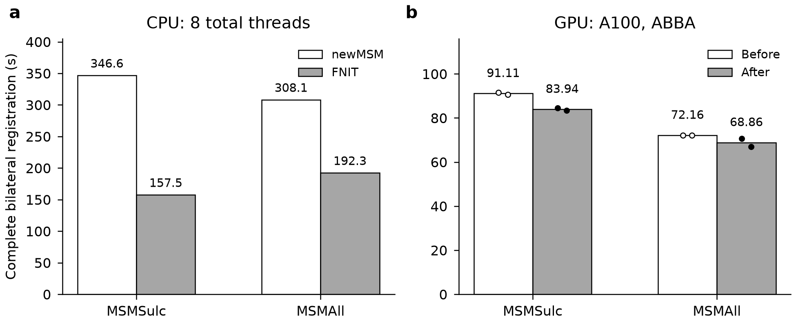
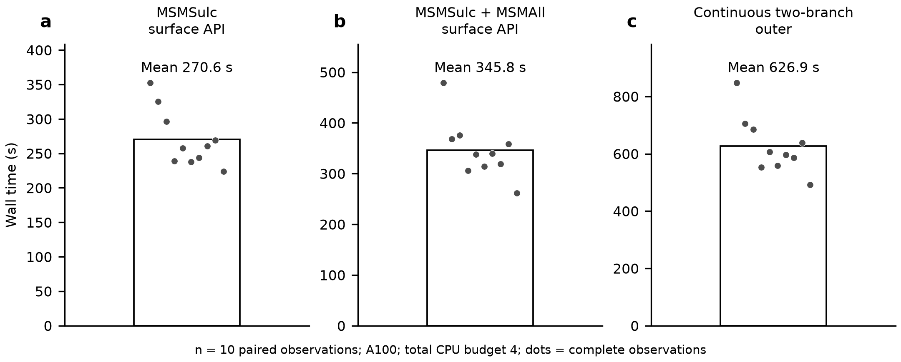

# 2026-10-09：A100 与同线程 CPU 配准验证

## 当前冻结修复版配准核心

| 完整双侧 API / s | 原版 CPU8 | FNIT CPU8 | 观测原版/FNIT | A100，CPU 总预算 8 | 对严格官方 CPU1 保存精度 |
|---|---:|---:|---:|---:|---|
| MSMSulc，默认四级，`report` | 507.392 | 347.914 | 1.458 | 130.669 | 两侧 float32 坐标、有序 faces 逐位一致 |
| MSMAll，固定 21C、三级 λ=0.05 | 507.310 | 312.104 | 1.625 | 97.685 | 两侧 float32 坐标、有序 faces 逐位一致 |

同预算 CPU 复测按原版→FNIT 顺序执行，均固定 0–7 核，总预算 8、左右各 4，并行双侧、串行两项 API；CUDA 未初始化。墙钟包括读入、完整求解、球面/报告保存，排除导入、哈希、离线比较和资源监测。上表比值仅描述这一次共享节点配对。A100 核心为另一次观察，TF32 开启、几何/成本 float64、保存 float32，allocator 上限 20 GB；峰值 allocation 2.241/2.266 GB，reserved 最大 7.376 GB。核心不含新特征、native 合成、BOLD 投影或 CIFTI。

FNIT CPU8 和 GPU 四侧对严格原版 CPU1 的角差、弦差均为 0。此次原版 CPU8 本身相对严格 CPU1 有差异：MSMSulc 右侧平均/最大角差 **0.120077/0.935965°**，MSMAll 左侧 **0.032034/0.807579°**，其余两侧相同；FNIT 对新原版 CPU8 的差异等于该原版自身的单/多线程差异。数值精度参照与同预算速度参照分别保留。MSMSulc 默认 `report` 与严格原版同为左右 2/0 翻折；显式 native 修复在完整 surface 单独验收。MSMAll 0/0 属于 solver QC。

最初未配对的 FNIT CPU8 观察为 489.870/479.163 s，保留在原报告中；最新 CPU 比值使用上述新配对。旁路资源记录覆盖部分原版 MSMAll 和 FNIT 记录期，记录内内存失败/CPU throttle 增量为 0，不能单凭该窗口确定跨时段时差原因。GPU 实际加载/编译的 22 个源码依赖与保守误差界版相同，默认 report 未调用新增 native 修复模块。见[最新同预算 CPU 配对](final_cpu8_matched.public.json)、[完整 GPU](final_gpu8.public.json)、[实际源码一致性](clear_to_final_code_identity.public.json)及[逐步骤/历史验证](README.md)。

此前缓存优化的同输入 A/B 完整 GPU 观察为 MSMSulc 均值 91.109→83.939 s、MSMAll 72.162→68.859 s，迭代轨迹和保存坐标不变；历史 CPU8 为 157.476/192.269 s。历史与本轮各按实际源码、输入和时段记录。

### 最终修复版配准分步骤

| 阶段 / s | CPU8 左 | CPU8 右 | A100 左 | A100 右 |
|---|---:|---:|---:|---:|
| MSMSulc 刚性初始化/准备 | 22.864 | 25.628 | 15.060 | 16.097 |
| MSMSulc 离散第 1 级 | 22.023 | 14.154 | 15.764 | 13.918 |
| MSMSulc 离散第 2 级 | 60.804 | 53.071 | 21.886 | 17.271 |
| MSMSulc 离散第 3 级 | 144.754 | 252.919 | 49.062 | 80.037 |
| MSMSulc 每侧完整调用 | 253.204 | 347.910 | 104.686 | 130.514 |
| MSMAll 离散第 1 级 | 10.002 | 11.553 | 11.670 | 10.351 |
| MSMAll 离散第 2 级 | 33.617 | 68.769 | 13.972 | 23.799 |
| MSMAll 离散第 3 级 | 210.624 | 231.188 | 63.292 | 62.709 |
| MSMAll 每侧完整调用 | 254.771 | 312.095 | 89.680 | 97.661 |

CPU 为最新配对复测，GPU 为上表所列最终冻结核心的独立观察。左右并行，不能把两侧时间相加为双侧 API；层级时钟包含准备、采样、成本、融合、warp 和展开，不是 GPU kernel 时钟。CPU/GPU 每层迭代数相同，source/control unfold 更新均为 0，未删减计算轮数。原版本轮只测完整命令墙钟，未独立记录层级时钟。见[CPU 分层](final_cpu8_phases.public.json)、[GPU 分层](final_gpu8_phases.public.json)。

## 历史缓存版本：真实输入、原版与计时范围

输入为公开 T1w/rest-fMRI 配对基准的一例；完整 MSMSulc 使用同一 native 球面、脑沟、初始旋转和参考，MSMAll 使用每侧 32,492 顶点、64,980 面、20 个 DR 连接特征加 medial-wall 共 21 列，三级 λ=0.05，无额外初始球面。C-only 验证不需要 T2w/FLAIR，不代表 HCP 完整 CA/CAT 特征流程。两项是独立完整配准核心；完整 surface 另行测量。 配准核心的 21C 为此前已准备并冻结的特征；下文完整 surface 从本次 Stage A 时序重新生成 21C。两批特征的哈希分别保存，旧输入的核心精度不能替代新输入的官方比较。

原版为固定 newMSM 1.0 h442c261_5，binary SHA-256 `af5c04246cfeea19233232168acbc1f31266f28b1a7cb6779b8f1bfa32eb9615`。原版仅在隔离的对照进程调用；FNIT 配准未加载官方 helper 或 FSL 运行库。Workbench 2.1.0 用于后续 surface 投影。

CPU：Xeon Platinum 8369B、8 个固定逻辑核、总预算 8、左右各 4 并行，CUDA 未初始化。GPU：同一 A100-SXM4-80GB、CPU 总预算 8、左右各 4，PyTorch 2.5.1+cu118、NumPy 1.26.4、TF32 开启，几何/成本 float64、保存 float32，allocator 上限 20,000,000,000 字节。原生扩展在本平台以 C++17、`-fno-fast-math -ffp-contract=off` 编译，SHA-256 为 `ed1541e222ff306bd1ac974b3f4c945b298d2fe2e8b2ae8078766b3465e08123`。

墙钟包括读取、完整求解和球面/报告保存。FNIT API 排除导入、CUDA 初始化、输入/源码校验及离线精度比较；原版包括命令启动。特征生成、native composition、BOLD 投影、CIFTI、前序 volume 与 recon-all 都不属于这些核心时钟。

## 历史缓存版本的完整双侧速度

| 功能 / s | 原版 CPU8 | FNIT CPU8 | GPU A1 | GPU B1 | GPU B2 | GPU A2 |
|---|---:|---:|---:|---:|---:|---:|
| MSMSulc，默认四级，report | 346.568 | 157.476 | 91.600 | 84.554 | 83.324 | 90.618 |
| MSMAll，21C、三级 λ=0.05 | 308.102 | 192.269 | 72.112 | 70.675 | 67.044 | 72.212 |

GPU A1/B1/B2/A2 在同卡顺序运行，每版本两次。优化前/后均值为 MSMSulc 91.109/83.939 s、MSMAll 72.162/68.859 s，分别减少 7.87%/4.58%。CPU 为每软件一次观察，原版/FNIT 比值分别 2.201/1.602；不同设备或线程预算的时间不作为上述比值。

优化将固定三角形边/法向缓存并合并三边计算。全部四次输出坐标、有序 faces、每轮决策、迭代数和迭代能量相同，最大能量差为 0，未减少计算轮数。每项为实际完整调用；文件系统缓存未清空，GPU 未人为独占，不外推稳定倍率。

图只含聚合墙钟；点为真实完整 API，CPU 每软件一次，GPU 每版本两次，轴从零开始。

### 分阶段

| 阶段 / s | FNIT CPU8 左 | FNIT CPU8 右 | A100 B2 左 | A100 B2 右 |
|---|---:|---:|---:|---:|
| MSMSulc 刚性初始化及准备 | 11.825 | 11.908 | 7.023 | 7.087 |
| MSMSulc 离散第 1 级 | 9.892 | 7.522 | 8.508 | 7.499 |
| MSMSulc 离散第 2 级 | 26.393 | 21.543 | 16.077 | 11.864 |
| MSMSulc 离散第 3 级 | 66.090 | 115.131 | 35.156 | 55.630 |
| MSMSulc 每侧完整调用 | 115.362 | 157.470 | 67.834 | 83.270 |
| MSMAll 离散第 1 级 | 8.670 | 8.649 | 5.190 | 5.298 |
| MSMAll 离散第 2 级 | 22.847 | 40.584 | 9.315 | 17.061 |
| MSMAll 离散第 3 级 | 145.062 | 142.648 | 46.794 | 44.333 |
| MSMAll 每侧完整调用 | 176.948 | 192.262 | 61.651 | 67.038 |

刚性时间包含相应网格/特征准备和归一化；各离散层包括其网格预处理、采样、融合求解、能量检查、warp 和 unfold。左右同时运行，不能相加得到双侧墙钟；各层也不包含全部输入/输出开销。原版本轮没有独立层级时钟，其每侧完整时钟见 [CPU8 报告](official_cpu8.public.json)，不以 FNIT 分层时间替代。

## 新生成 21C 的展开精度修复

本次完整 surface 自产的 21C 暴露了旧冻结特征未触发的差异：第 2 级第 7 次 DATA 展开中，原 Python 写法改变了乘法和标量归约顺序。8 个顶点的 float64 最大差仅为 1.862×10⁻¹² mm，但后续离散决策将其放大。相同更新次数不能证明坐标相同。

独立 C++ 展开实现保留固定 newMSM 的运算顺序；真实首次分歧处的 4,645 次更新后，全部 float64 坐标逐位一致。右侧完整 CPU1 重放为 365.810 s，实际保存的 float32 坐标和有序 faces 对严格官方参照逐位一致，改变顶点数为 0。该 CPU 重放使用先前的固定阈值快速检查；展开数学相同，后续更保守的误差界检查另由完整 GPU 调用验证。

后续完整双侧 GPU 调用使用误差界快速检查、CPU 总预算 8、左右各 4、A100、TF32 和 20 GB allocator 上限：MSMSulc 为 103.578 s，MSMAll 为 75.563 s，峰值 allocation 分别为 2.337、2.278 GB。两项双侧坐标与有序 faces 均和严格官方参照逐位一致；默认 `report` 的 MSMSulc 仍与原版共同保留 2/0 翻折，MSMAll 的 32k solver 为 0/0。这里没有运行 native 修复、特征生成或 BOLD 投影；不是完整 surface 外链验收，也不与不同负载时段的旧观测计算速度变化。

依据见[真实分歧处展开](source_unfold_primitive.public.json)、[右侧完整 CPU1](fresh_case01_r_source_unfold_cpu1.public.json)和[误差界检查的完整双侧 GPU](safe_unfold_gpu8_strict.public.json)。后者沿用旧完整 surface 首例生成的 21C；最终修复版本重新生成的特征需按其 SHA 另外核对。

## 展开快速检查的配对回归

误差界快速检查与先前固定阈值检查使用同一原生展开数学、相同输入和原生扩展。两组各完成 A/B 或 B/A 顺序的完整双侧调用，默认 `report` 不加载 native 修复。四次保存坐标、有序 faces、每轮更新/展开数量和能量均相同，最大记录能量差为 0；峰值 allocation 不超过 2.390 GB。

| 独立观察块 / s | MSMSulc A | MSMSulc B | MSMAll A | MSMAll B |
|---|---:|---:|---:|---:|
| A→B | 101.718 | 102.074 | 77.526 | 71.900 |
| B→A | 106.769 | 87.337 | 83.308 | 64.796 |

A→B 块的 MSMSulc 增加 0.35%，MSMAll 减少 7.26%。两块间隔 1,555.241 s，期间共享内存失败计数增长；这些计数不能单独证明本任务被 OOM 杀死。不同背景下的两块分别呈现，不合并成稳定加速均值。该回归检查误差界判断的精度及完整调用开销，完整修复版 surface 另行验收。见[配对回归的标量报告](clear_gate_pair_blocks.public.json)。

## 真实薄面网格的 native 修复验收

一个真实失败病例的原始球面已有 14 个反向极薄面，闭合流形和三角拓扑检查通过；已配准 native 坐标在保存精度下为 21 个绝对翻折。仅按每个输入面的方向比较会遗漏输入自身的反向面，因此最终验收改用参考网格的多数方向，同时保留旧相对计数和输入异常记录。

最终修复模块先做局部梯度和联合 float32 量化；仍未通过时，从未经修复的已配准 native 坐标重启小区域调和修复，再联合检查相邻 float32 坐标。该真实输入完成 `21→6` 的局部修复、`21→1` 的原坐标调和重启及 `1→0` 的最终量化。小区域边界固定，最终改变 392 个顶点，球面坐标最大弦距 2.394 mm，全网格平均弦距 0.001921 mm；这是半径 100 mm 注册球面的坐标变化，不是皮层解剖位移。

| 完整 helper 入口 | API / s | API 加实际 GIFTI 写盘 / s | 保存后绝对翻折 | 新增正常面翻折 |
|---|---:|---:|---:|---:|
| CPU，总预算 4 | 31.106 | 31.559 | 0 | 0 |
| CUDA，总预算 4 | 29.635 | 30.229 | 0 | 0 |

API 时钟包含线程预算设置、输入校验、完整修复及报告构建；导入、预置输入读取、设备初始化和独立落盘后 QC 在该时钟外。几何修复为有界 CPU 运算，两种入口保存的 float32 坐标逐位相同；CUDA 入口峰值 allocation/reserved 为 0.0108/0.0231 GB。独立重读实际 GIFTI 后，有限值、半径、原有拓扑及新翻折检查全部通过。未修复球面的官方数值精度、修复模块和完整 surface 各有独立验收。见[真实 native 修复报告](final_native_repair.public.json)。

本地 MSM/surface 相关测试为 496 passed、44 skipped；跳过项属于本地 CUDA 或可选资源条件，另见[本地测试回执](final_local_tests.public.json)。同一冻结源码的 CFFF focused CUDA 测试另已完成 110 passed、0 skipped，覆盖 9 个 CUDA 案例，见[GPU 测试回执](final_focused_cuda.public.json)。

## 最终修复版完整 surface

统一冻结源码完成 **10/10** 例，两分支都从头重新运行：MSMSulc-only 完整 API→自产 d20/21C→完整 MSMSulc+MSMAll API。CPU 总预算 4、左右各 2，A100、TF32、20 GB allocator 上限，两个 native 策略均为 repair；输入为已完成 volume 与提供的重建。C-only 不需要 T2w/FLAIR；完整 HCP CA/CAT 还需要其对应特征。

| 匿名观察序号 | Stage A API / s | 新特征 / s | Stage B API / s | 连续外层 / s | allocated / GB | reserved / GB |
|---|---:|---:|---:|---:|---:|---:|
| 01 | 352.201 | 12.183 | 478.690 | 846.974 | 2.276 | 11.044 |
| 02 | 325.315 | 9.842 | 367.933 | 705.489 | 2.276 | 10.578 |
| 03 | 296.253 | 10.596 | 375.492 | 684.412 | 2.270 | 10.591 |
| 04 | 239.047 | 5.259 | 306.152 | 552.579 | 2.272 | 10.662 |
| 05 | 257.786 | 7.874 | 338.198 | 607.014 | 2.282 | 10.666 |
| 06 | 237.566 | 5.607 | 313.757 | 558.904 | 2.390 | 10.641 |
| 07 | 243.892 | 11.061 | 339.256 | 596.696 | 2.313 | 10.838 |
| 08 | 260.581 | 5.475 | 318.857 | 586.782 | 2.382 | 10.737 |
| 09 | 268.892 | 8.271 | 358.432 | 638.011 | 2.348 | 10.666 |
| 10 | 224.083 | 4.968 | 261.365 | 492.216 | 2.388 | 10.578 |

十例各阶段实际保存球面左右绝对翻折均 0/0，原本正常面的新增翻折为 0；双侧 GIFTI 和 91k CIFTI 全部 180 帧 finite。实际投影使用的球面与发布球面数组相同，源码、native、模板、输入和新特征前后审计通过。困难薄面病例也完成两分支完整运行。

Stage A API 均值/中位数为 **270.562/259.184 s**，Stage B 为 **345.813/338.727 s**。连续外层均值/中位数 **626.908/601.855 s**、范围 **492.216–846.974 s**；最大 allocated/reserved **2.390/11.044 GB**。每例是共享资源下的一次完整观察，不把病例时间相加当作群体墙钟，也不推断稳定加速比。

白柱为描述性均值，点为十次完整观察，仅绘制匿名标量。连续外层含两次 API、特征、阶段准备、实际输入捕获和输出 QC/保存；导入、CUDA 初始化及独立前后置哈希审计在外层时钟外。前序 volume/recon-all 不在本轮范围。峰值是单个共享进程实测，不把左右相加。

### 十例分步骤

| 阶段 / s | Stage A 均值 | Stage A 最小–最大 | Stage B 均值 | Stage B 最小–最大 |
|---|---:|---:|---:|---:|
| native 表面准备 | 6.940 | 4.766–13.545 | 6.996 | 4.431–10.215 |
| volume 状态核验 | 6.236 | 4.908–8.175 | 6.471 | 5.025–8.048 |
| 重建适配/读取 | 0.618 | 0.412–1.002 | 0.877 | 0.613–1.211 |
| atlas 面积表面 | 2.278 | 1.494–3.572 | 1.708 | 0.945–3.056 |
| MSMSulc 准备＋配准/修复 | 101.372 | 83.605–147.456 | 104.481 | 78.419–154.910 |
| MSMAll 配准＋native 合成/修复 | 0.000 | 0.000–0.000 | 89.510 | 68.288–129.011 |
| 左右投影 | 136.584 | 107.144–159.825 | 122.663 | 81.931–163.489 |
| CIFTI 组装/保存 | 9.852 | 6.731–13.404 | 8.488 | 6.662–12.859 |

分阶段是实际 API 内部时钟。左右 Workbench 同时运行，其每侧时间不相加成双侧墙钟；阶段未覆盖的序列化、发布、捕获等开销仍计入完整 API。逐例 L/R ribbon、dilation、native mask、resample、atlas mask 明细，以及 DR 和特征准备时钟均在[十例标量报告](final_surface10.public.json)。首例 Workbench dilation 每侧约 111–117 s，是该次明显耗时项。

首例独立重读保存球面再确认两分支 0/0，最小绝对方向比为正，见[独立 native 检查](final_case01_independent_native_qc.public.json)。新生成的 source_features 与此前固定核心基准不同，因此另行重算[实际新特征官方 CPU1/1](final_case01_official_cpu1.public.json)并作[完整 GPU 重放](final_case01_actual_gpu_precision.public.json)：两侧保存 float32 坐标和面序对严格官方完全相同，角差/弦差全为 0，solver 0/0。GPU API 139.522 s、allocation 2.275 GB；启动时共享 GPU 已有其他负载，作为单次观察。官方严格 CPU1/1 共两线程、1082.345 s，只作精度参照。

此前缓存版完成八例、第九例停在绝对几何 QC，另保留一次 SIGBUS 失败。上述十例全部使用最终修复版重新运行，不合并旧八例；先前阶段性进度表由最终报告替代。运行时源码由[80 个实际依赖](final_surface_publication_binding.public.json)绑定。

## 两分支实际球面的独立官方投影对照

首例两分支均用本次完整运行捕获的实际 T1w/MNI 时序、white/pial、面积、ROI 和最终保存球面，独立调用固定 Workbench 2.1.0 及原 NiWorkflows CIFTI 源函数，覆盖全部 180 帧。左右 GIFTI 与 91k CIFTI 共 **56,255,760** 个值逐位一致，MAE、RMSE 和最大绝对误差均为 0；时间/脑结构轴、intent、科学元数据及 540 字节 NIfTI 头一致。

完整 CIFTI XML 字节不同：`Volume` 子节点在 FNIT 中位于两个皮层节点之后，原函数中位于全部 21 个 BrainModel 之后；所有属性、文本及 BrainModel 顺序/内容一致。GIFTI 图像级字段仅 `Provenance`、`ParentProvenance`、`WorkingDirectory` 不同，记录各自命令路径；逐帧元数据相同。

原版仅采样与 CIFTI 组装的 CPU4（左右各2）墙钟分别为 **85.654 / 88.394 s**；该单次对照不含配准、新特征、native 修复或离线比较，不能与完整 surface 的总耗时计算加速比。见[实际球面官方投影报告](matched_sphere_sampler.public.json)。

### 原版独立投影的分步骤

| 原版算子 / s | MSMSulc 左 | MSMSulc 右 | MSMAll 左 | MSMAll 右 |
|---|---:|---:|---:|---:|
| ribbon 采样 | 14.378 | 14.791 | 14.392 | 14.874 |
| 10 mm dilation | 53.651 | 54.272 | 55.276 | 56.319 |
| native ROI | 5.706 | 6.003 | 5.570 | 5.751 |
| ADAP_BARY_AREA 重采样 | 4.158 | 4.279 | 4.317 | 4.814 |
| atlas ROI | 1.314 | 1.303 | 1.320 | 1.388 |

双侧并行投影为 80.648/83.146 s，原 CIFTI 组装为 5.006/5.248 s。算子单次包含读写，不含 preflight 和离线比较；FNIT 完整运行与本次独立原版采样处于不同时段，各自实测分开记录。末端完整时序逐值一致；中间算子的数值未单独比较。

## 历史缓存版本：保存坐标精度与几何

- FNIT CPU8 与四次 GPU 的 MSMSulc 左右保存坐标、有序 faces 对固定官方严格参照全部逐位一致，角差和弦差统计全为 0。原版同机 CPU4/4 输出亦与先前 CPU1 相同。
- MSMAll 的同机严格原版 CPU1/1 重新运行完成，双侧保存坐标和文件 SHA 与先前 CPU1 相同。FNIT CPU8、GPU A1/B1/B2/A2 对该严格参照全部逐位相同，角差和弦差全为 0。
- 同机官方 MSMAll CPU4/4 相对 CPU1/1：左侧相同，右侧 61/32,492 个顶点不同，平均角差 0.000179786486°、p95=0、最大 0.250057613°。严格精度参照与同预算速度参照分别报告。官方 CPU1/1 双侧总预算为 2，只作精度检查，不作 CPU8 速度分母。
- MSMSulc report 的原版和 FNIT 均为左/右翻折 2/0，属于几何 warning。显式 repair 会改变坐标，修复后的 QC 与原版数值精度分开报告。MSMAll 0/0 仅属于 32k solver，不能代替最终 native composition 检查。

来源为固定 newMSM Pearson 初始化；fMRIPrep 25.2.4 所带 2019 版 MSM 的 NMI 初始化是另一目标，本结果不声称两版本整链相同。

## 历史缓存版本显存

| 功能 | A 两次最大 allocated / GB | B 两次最大 allocated / GB | A 最大 reserved / GB | B 最大 reserved / GB |
|---|---:|---:|---:|---:|
| MSMSulc | 1.759 | 2.331 | 2.374 | 2.938 |
| MSMAll | 1.790 | 2.265 | 6.765 | 7.376 |

GB 为十进制。allocation/reserved 是每次 API 前 reset 后的两侧共享进程峰值，reserved 可含前次 API 缓存；RSS 是进程累计峰值。缓存增加 allocation，仍在 20 GB 上限内。源码、原生扩展、输入、配置和参照运行前后逐项 SHA 不变。

上述缓存版的源码和原生扩展由[历史绑定](publication_runtime.public.json)记录，不作为最终修复版的源码凭据。

## 最终修复版源码与打包

[完整 surface 的实际源码绑定](final_surface_publication_binding.public.json)核对了 80 个实际 Python、原生编译依赖及构建入口；[配准核心绑定](final_core_publication_binding.public.json)另外核对核心实际依赖。文件 SHA 均与当前待发布工作树相同。测量使用 CFFF 独立编译的 native 扩展，SHA-256 为 `4cc610b811d0f63d5095b88640cb351665e1eb77d96e86261b491f8891e20290`，编译选项为 C++17、`-fno-fast-math -ffp-contract=off`；本地 WSL 的独立二进制不作为同一 binary。

[源码包检查](packaging.public.json)确认八个关键运行时及许可文件存在并与工作树一致，已替代的 `_sphere_cpu.py` 不在包内。当前 Git 基线只说明开发背景；实际测量与待发布源码通过上述逐文件 SHA 绑定，发布后再记录远端提交。

## 可复核文件

- [GPU AB/BA 汇总](gpu_abba.public.json)、[B1 全部阶段](gpu_b1.public.json)、[B2 全部阶段](gpu_b2.public.json)。
- [FNIT CPU8](fnit_cpu8.public.json)、[同预算官方 CPU8](official_cpu8.public.json)。
- 冻结配准核心输入：[官方严格 CPU1/1](official_msmall_cpu1.public.json)、[原版单/多线程差异](official_thread_precision.public.json)、[GPU 对同机重新运行的官方参照](gpu_fresh_official_precision.public.json)。
- [源码包收录检查](packaging.public.json)：新增原生头文件、C++ 实现和许可文件均存在且与工作树 SHA 相同，已替代的 `_sphere_cpu.py` 不在包内。
- 本次自产 21C：[新输入官方严格 CPU1/1](final_case01_official_cpu1.public.json)、[完整 GPU 配准与严格精度](final_case01_actual_gpu_precision.public.json)。
- 两分支完整 surface：[10/10 最终报告](final_surface10.public.json)、[实际球面的独立官方全帧投影](matched_sphere_sampler.public.json)。

公开文件只有匿名标量指标、参数及程序源码哈希，不附新生成个体影像。已有公开 HCP 参考脑图及许可见 [MSM 验证首页](../README.md#原版范围与图像公开范围)。功能输入、参数和示例见 [MSMSulc](../../../../docs/msm/README.md)、[MSMAll](../../../../docs/msm/msmall.md)及 [surface pipeline](../../../../docs/fmri/surface.md)。
