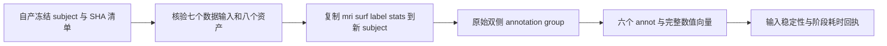

# 自产检查点的 annotation 阶段重放

`replay_annotation_stage.py`从已经生成的 FNIT subject 复制输入，在新目录运行双侧 annotation，保存六套逐顶点标签和计时回执。它用于比较冻结基线与候选启动调度；其结果是单阶段评估。原始 T1 整例、连续链与官方等效需要各自的验证。

本脚本复用现有 `run_hemisphere_group`、`_hemisphere_operation` 和 `label_surface`，没有新增分类算法。候选的有限启动等待用于处理已界定的启动失败，不能单凭阶段成功证明 CUDA driver 的底层 OOM 原因已修复。



## 输入、输出和参数

| 参数 | 输入及默认值 | 用途 |
| --- | --- | --- |
| `--checkpoint` | 必填，FNIT 自产冻结 subject 目录 | 包含 `mri`、`surf`、`label`、`stats`；原目录只读 |
| `--input-manifest` | 必填，JSON | `replay_files` 前15项是数据/资产的路径、字节数和 SHA-256；后5项历史源码仅作为来源记录 |
| `--assets` | 必填，已经核查许可的资产目录 | 六个固定 GCS 图谱及 `ic4.tri`、`ic7.tri`，不重新下载或再分发 |
| `--output` | 必填，不存在的新目录 | 与 checkpoint 和 assets 分离，保存独立副本和回执 |
| `--gpu-uuid` | 默认 `GPU-26e41f63-1a65-6b3e-5370-fa9a2934ca8e`（原 GPU0） | 只接受完整物理 GPU UUID；必须与外层唯一 `CUDA_VISIBLE_DEVICES` 完全一致，脚本不修改设备环境 |
| `--initialized-parent` | 默认关闭 | 在父进程保留一个 FP32 标量并同步，只复现 API 已初始化；不重建历史父进程约1.95 GB驻留状态 |
| `--startup-wait-seconds` | 默认不传入 group；候选可显式设30 | 仅候选源码支持的 `startup_wait_seconds` 参数；签名不支持就报错，不回退或重试 |

七个影像输入是 `mri/aseg.presurf.mgz`、左右 `smoothwm`、`sphere.reg` 和 `cortex.label`。网格使用 surface RAS，单位毫米；顶点和有序面拓扑来自同一冻结网格。`manifest.subject_checkpoint`与资产原路径提供相对路径映射，实际参数路径须匹配同样的 SHA。另一个被试应使用自己的同结构清单。

每半球输出 `aparc`、`aparc.a2009s`、`aparc.DKTatlas` 三套 `.annot`。新副本中已有的这六个目标文件先移除，避免把旧 FNIT 结果当作本轮新输出。其余输入复制保留，原目录不写入。

| 产物 | 内容 |
| --- | --- |
| `subject/` | 四目录副本、新 `.annot`、worker 日志及 group 回执 |
| `annotation.stage.json` | 原/复制输入 SHA、实际导入 FNIT 源码 SHA、解释器和库版本、精度/设备/线程、执行状态、计时 |
| `annotation.group.json` | group 成功或异常自带的原始报告；worker 缺失回执仍由既有调度明确报告 |
| `annotation_semantics/*.npz` | 完整顶点索引、原始 annotation ID、色表行索引、色表矩阵和原始名称字节；仅成功后生成 |

NPZ 中的 `original_annotation_ids`、`label_table_indices`、`vertex_indices` 是长度为网格顶点数的一维整型数组；`color_table` 是色表矩阵，`names` 是按行对应的字节字符串。JSON 同时记录这些数值数组的 SHA、逐标签数量和名称/色表含义；NPZ 文件 SHA 用于产物完整性，配对数值比较应读取数组。脚本验证 `.annot` 原始记录顶点顺序为 `0..nvertices-1`，并验证输入网格的原始文件、坐标及有序面未改变。

## Python 复用入口

以下入口必须针对已经准备好的新副本，且外层调度已经持有共享 GPU 锁并负责监测和清理全部自有子孙进程。

```python
from fnit.recon_all.hemisphere_parallel import run_hemisphere_group

# 经过同输入 SHA 校验的新 FNIT 自产副本，不能传原始冻结检查点。
subject_directory = "/path/to/new_stage_run/subject"
# 已核验六个图谱和两个 ico 的资产根目录。
assets_directory = "/path/to/fnit_assets"
annotation_group_report = run_hemisphere_group(
    subject=subject_directory,  # surface RAS 网格与自产 aseg、cortex.label。
    operation="annotation",  # 每半球依次计算三套图谱。
    device="cuda:0",  # 仅可见固定 UUID 的逻辑设备。
    threads=4,  # 总预算；两个 exec worker 各2线程。
    workers=2,  # 双侧私有目录，成功屏障后发布。
    profile_stages=True,  # 保留同步及分步骤计时。
    kwargs={"assets": assets_directory},  # annotation 分支所需资产。
    startup_wait_seconds=30,  # 仅候选源码；冻结基线调用完全省略此行。
)
```

## 命令行调用

以下是传给现有 `run_monitored`、共享锁及 owned-tree 清理调度器的子命令载荷。脚本本身不获取锁。外层必须设置固定 GPU UUID、缓存禁用及六个原生线程变量为4；必须使用冻结的既有 Conda 解释器和实际 baseline/candidate 的 `PYTHONPATH`。每个 backend 使用独立 `NUMBA_CACHE_DIR`，首次阶段与后续缓存阶段分别记录。

```bash
# baseline：不传新增启动参数。
"$FNIT_PYTHON" replay_annotation_stage.py \
  --checkpoint "$FNIT_SAVED_SUBJECT" \
  --input-manifest "$FNIT_STAGE_MANIFEST" \
  --assets "$FNIT_ASSETS" \
  --gpu-uuid "$FNIT_STAGE_GPU_UUID" \
  --output "$FNIT_BASELINE_STAGE_OUTPUT"

# candidate：同一个自产检查点与资产，输出使用另一新目录。
"$FNIT_PYTHON" replay_annotation_stage.py \
  --checkpoint "$FNIT_SAVED_SUBJECT" \
  --input-manifest "$FNIT_STAGE_MANIFEST" \
  --assets "$FNIT_ASSETS" \
  --gpu-uuid "$FNIT_STAGE_GPU_UUID" \
  --output "$FNIT_CANDIDATE_STAGE_OUTPUT" \
  --startup-wait-seconds 30
```

`FNIT_STAGE_GPU_UUID`是外层已指定并锁定的完整物理 GPU UUID（默认原 GPU0）；两臂必须使用同一卡。脚本核验成功 worker 的实际 UUID，允许 Torch 回执省略 `GPU-` 前缀；缺失、缩写或不匹配均不能标为阶段完成。启用父初始化时也核验父设备。

`FNIT_PYTHON`是既有 Conda Python，`FNIT_SAVED_SUBJECT`是自产检查点，`FNIT_STAGE_MANIFEST`是该被试的15项数据/资产清单，`FNIT_ASSETS`是已核验资产根目录，两项 `*_STAGE_OUTPUT`必须不存在。需要对照已初始化父 API 时，两侧同时增加 `--initialized-parent`；这仍不复制整例历史驻留量。

## 原软件对应步骤

annotation 算法对应 `mris_ca_label`。原软件参数格式如下；它不是 FNIT 运行时命令，启动等待调度没有对应的官方“重启”命令。[官方参数说明](https://surfer.nmr.mgh.harvard.edu/fswiki/mris_ca_label)列出 subject、半球、注册球面、GCS 分类器和输出文件。

```bash
# 独立原软件 benchmark 的算法调用格式；本脚本不会执行此命令。
mris_ca_label [固定 benchmark 的选项] \
  SUBJECT_ID lh sphere.reg \
  ASSET_ROOT/average/lh.DKaparc.atlas.acfb40.noaparc.i12.2016-08-02.gcs \
  SUBJECTS_DIR/SUBJECT_ID/label/lh.aparc.annot
```

另外两套图谱使用 `CDaparc`、`DKTaparc`，右侧使用 `rh`。冻结原软件版本、完整原参数及旧的同输入验证边界见[已有 annotation 说明](../python_gpu_port/MRIS_CA_LABEL_STATUS.md)；旧的官方输入 CPU 验证不能代替本次自产检查点 GPU 调度评估。

## 本版验证、版本记录及评估边界

2026-10-04新增本阶段脚本和回执结构，复用成熟 annotation 子函数。基线与候选的15项数据/资产须一致，五项历史源码 SHA 不作为候选准入条件，实际运行源码另行记录并检查运行期间漂移。

显式指定 GPU1 仅用于阶段诊断，外层须使用该卡独立锁并保持两臂同卡、总线程4。若原 GPU0 整例同时运行，两任务合计线程预算8；同期墙钟只能作为观测，不用于加速结论。默认 GPU0 行为保持原约定。

本地 CPU 检查包括语法、CLI、清单分类/拒绝非法数据、保护原输入路径以及失败 JSON。真实 GPU 阶段尚待协调者运行；本页不填写未测的精度、速度或脑图。实际运行后应逐半球/图谱比较完整标签向量、色表与文件 SHA，列出同机配对组墙钟、各分步骤、同期父子显存与外部负载，并附真实 annotation 脑图。首次 JIT 与后续缓存测量分列，不从本阶段推导整例加速。

脚本的墙钟从校验入口开始，包含数据核验、复制、导入、阶段、语义向量和最终摘要首次写入。外层 `run_monitored` 墙钟另外覆盖解释器启动和全部退出写入。缓存禁用时 PyTorch 的零统计记录为 unavailable；同期显存以 group/外层监测为准。

`stage_complete`只表示阶段执行、六项输出和输入稳定性检查完成；官方等效仍为 `not_assessed`。失败原始 group 报告与 worker 日志保留，不读取官方结果补齐输出。

## 原实现和参考文献

- [FreeSurfer 固定版本的 mris_ca_label.cpp](https://github.com/freesurfer/freesurfer/blob/d932c45b7941662ea380a05efef580568b98d41a/mris_ca_label/mris_ca_label.cpp)。
- [FNIT 现有 annotation 同输入记录](../python_gpu_port/MRIS_CA_LABEL_STATUS.md)。
- [CUDA 启动诊断和界限](CUDA_BOOTSTRAP_DIAGNOSIS.md)。
- Fischl et al. Automatically Parcellating the Human Cerebral Cortex. *Cerebral Cortex* 14, 11–22 (2004)，见上述官方说明的参考文献链接。
