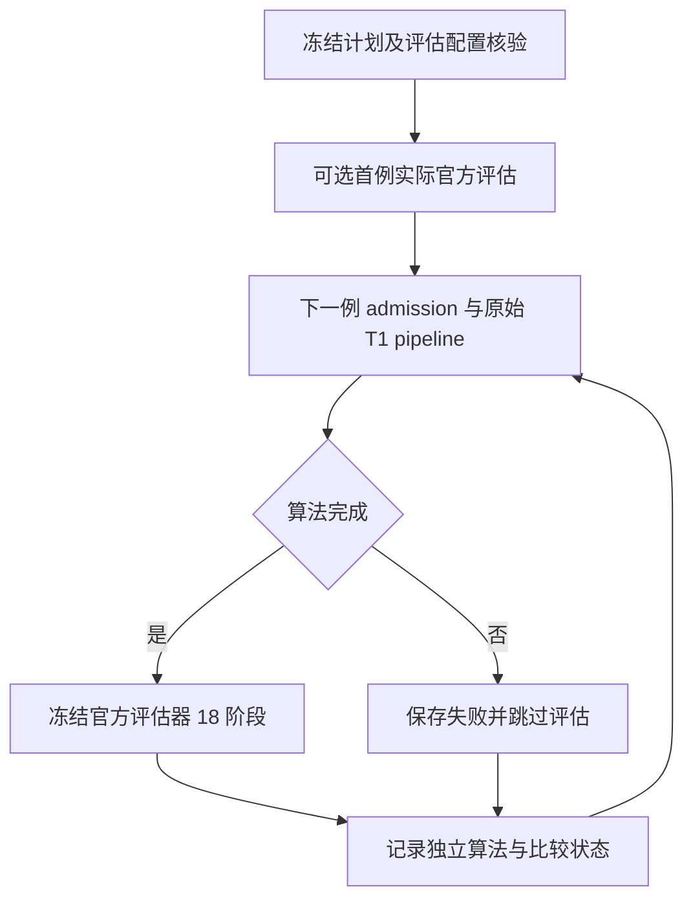
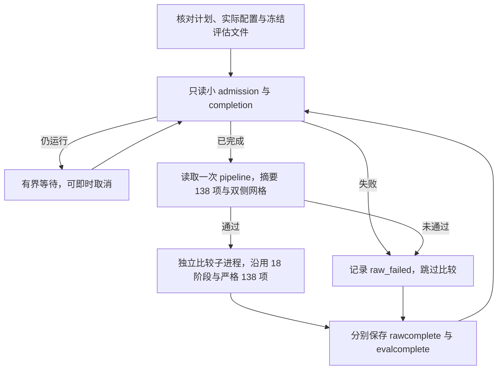

# 精度候选顺序整例与官方评估队列

## 功能与执行顺序

复用 `run_resource_replay_queue.py`：可先评估已经真实完成的首例，再逐例执行原始 T1 整例，只有算法完成后才运行冻结的官方评估器。每个子进程退出后才创建下一进程，总线程预算保持 4；原 admission 的资源等待、锁及清理不变，评估器每阶段使用同一个共享锁。此工具只编排，不修改影像算子、候选源码或比较门槛。



## 输入参数与结构

CLI 为 `python run_resource_replay_queue.py --plan PLAN.json --report NEW_QUEUE.json`。两个参数都是具名文件路径；report 必须不存在。没有独立影像 Python API或对应的原软件单步命令；算法仍由实际 pipeline 执行，官方参考对应 `recon-all -all`。

旧计划不传 `execution_role`，默认为 `baseline`，保持原 schema `fnit-original-baseline-resource-replays-v1`、旧字段和流程。`execution_role="precision_candidate"` 使用独立 schema `fnit-precision-candidate-sequential-validation-v1`。`execution_role="precision_evaluation_only"` 仅读取已有整例并运行独立评估，见下节。其他 role 拒绝；baseline 不接受评估选项。

原字段：`python` 为既有环境解释器；`admission_script` 与 `admission_script_sha256` 绑定资源运行器；`shared_lock` 为原共享锁；非空 `cases` 中各 `id` 唯一，`original_config` 为可信准备配置、`retry_root` 为新独立 attempt 目录、`admission_report` 为新 admission 回执。各例仍按原配置的设备、精度、输入、资产和四线程执行。

新增每例可选 `post_evaluation`：

| 字段 | 含义 |
| --- | --- |
| `script` / `script_sha256` | 实际 `evaluate_pair.py` 路径与冻结 SHA-256 |
| `config` / `config_sha256` | 实际 evaluator JSON 路径与冻结 SHA-256 |

评估 JSON 必须显式 `evaluated_role="precision_candidate"`、case 与本例一致，`evaluated_config` 必须指向此例实际 `retry_root/retry_config.json`，`lock` 必须等于 shared_lock，`output` 必须与 attempt 目录独立且尚不存在，各例评估 output 不重复。评估器继续核对真实 completion、输入、源码归档、资产清单等绑定；队列不伪造 completion。

可选顶层 `initial_evaluation` 在 cases 之前执行，包含同样四项冻结字段，并增加 `id` 和 `actual_config`（已经执行的实际 retry_config）。首例真实完成状态由 evaluator 检查；未完成则评估失败，记录后继续 cases，不增加算法成功数。初始与后续评估不复用既有 output/checkpoint。

## 配置示例

以下路径与 SHA 都必须替换为已核验现场值，不代表这些文件已经执行：

```python
import hashlib
import json
from pathlib import Path

# 使用已有环境与当前冻结评估器；不变更 Conda prefix。
python_executable = "/path/to/fnit_env/bin/python"
admission_script = Path("/path/to/resource_admission.py")
evaluation_script = Path("/path/to/evaluate_pair.py")
evaluation_config = Path("/path/to/sub07.evaluation.json")
shared_lock = "/tmp/fnit-shared-benchmark.lock"
plan = {
    "execution_role": "precision_candidate",  # 独立角色，不能改标 baseline
    "python": python_executable,
    "admission_script": str(admission_script),
    "admission_script_sha256": hashlib.sha256(admission_script.read_bytes()).hexdigest(),
    "shared_lock": shared_lock,
    "cases": [{
        "id": "ds000114_sub-07",
        "original_config": "/path/to/sub07.prepared.config.json",
        "retry_root": "/path/to/sub07/attempt_01",  # 新 attempt
        "admission_report": "/path/to/sub07/admission.json",
        "post_evaluation": {
            "script": str(evaluation_script),
            "script_sha256": hashlib.sha256(evaluation_script.read_bytes()).hexdigest(),
            "config": str(evaluation_config),  # evaluated_config 指向上方 attempt_01/retry_config.json
            "config_sha256": hashlib.sha256(evaluation_config.read_bytes()).hexdigest(),
        },
    }],
}
Path("candidate.queue.plan.json").write_text(json.dumps(plan, indent=2))
```

## 输出、失败与取消

算法与比较分别记录：旧 `successful`、`failed_or_not_admitted`、`all_cases_succeeded` 仅计算 cases 算法；新增 `initial_evaluations`、每例 `evaluation`、`evaluations_succeeded`、`evaluations_failed_or_skipped`、`all_evaluations_succeeded` 计算实际申请的比较任务。未配置评估不计作完成评估。`queue_finished` 仅表示遍历结束。全部算法和申请的评估成功时 exit=0；失败 exit=1；取消 exit=130。

比较成功要求实际 evaluator exit=0，冻结 script/config 未漂移，checkpoint case/role/script/config SHA 正确，18 个阶段全部 complete，strict checked 恰好为整数 138，`passed` 必须存在且为 0–138 的严格整数（拒绝 bool、浮点和越界）。这些检查只验证报告完整性，不要求 `passed=138`。`passed` 只报告，不按文件通过数阻断，不表示整体等效。算法失败不启动 evaluator；比较失败保留日志并继续下一例，不改变算法成功状态。评估日志为 `<config文件名>.queue-evaluation.log`，独占创建以免覆盖。

SIGINT/SIGTERM 对 admission 保持原清理协议；评估取消发送至自有进程组并等退出后结束队列。没有新增算法重试或并行线程。原 benchmark 与候选真实结果由各自原始回执记录，本工具 CPU fixture 只检验控制流，不能替代真实脑影像 benchmark。

## 验证与参考

纯 CPU 回归覆盖默认兼容、角色/路径拒绝、script/config 漂移、算法失败跳过、比较失败继续、首例未完成拒绝和算法/比较独立计数。现有比较器、锁和 138 项门槛保持。

- 本项目 `cohort/pair/evaluate_pair.py` 与 `evaluated_role_bindings.py`
- [FreeSurfer recon-all 流程](https://surfer.nmr.mgh.harvard.edu/fswiki/recon-all)


## 实际队列状态持久化修正（2026-10-04）

旧冻结工具SHA `681201b6606e31e5d008c0edb7f2611bb479a3059520b281dcee1d1b9ada10f3` 在raw completion核验后只更新内存，随后同步等待官方评估，直到评估结束才写磁盘queue。sub-07于14:52:32 UTC真正完成138项及网格检查，但15:16评估运行时旧queue仍显示admission_or_execution、execution_succeeded=false。这是持久化滞后，不是算法失败；实际记录见runtime/sub07_3a_status_20261004_v1，源码和原queue SHA保留。

本地新工具在post-evaluation之前先保存原始整例完成状态，并在评估子进程启动后保存独立evaluation.status=running及pid。完成/失败/继续下一例与严格比较数量规则保持原语义。真实CPU子进程测试将评估阻塞在显式文件屏障，核验此时磁盘row已complete且execution_succeeded=true、evaluation仍running，解除屏障后队列正常完成；不执行影像或GPU计算。

服务器正在运行的冻结队列不修改；下次新冻结工具才使用本修正。当前实时状态以admission、diagnostics/completion和实际评估checkpoint分别判断，不能只看旧queue行。priority guard的父T态只是排序，guard completion确认恢复和/proc实际状态另核对，不等同诊断成功。


## 2026-10-05：已有 API 整例的独立比较队列

`precision_evaluation_only` 用于已经由 API 启动的原始 T1 整例。队列依次等候已有完成回执，确认 138 项输出与双侧网格验证通过，再运行独立 `evaluate_pair.py`。它不会启动资源准入或 raw pipeline，也不会改写已有 config、admission、completion 或 pipeline。原 baseline 与 precision_candidate 流程保留。



### Python 调用与输入

该工具是 CPU 编排 CLI；Python 使用 `subprocess.run` 调用同一入口。输入仍是已授权真实数据的执行回执与评估配置，没有新增影像数组接口。以下具名变量需要替换成现场核验的绝对路径，不表示示例已经执行：

```python
import hashlib
import json
import subprocess
from pathlib import Path

python_executable = "/path/to/existing/fnit_env/bin/python"  # 已有环境，不迁移 prefix
queue_script = Path("/path/to/run_resource_replay_queue.py")
actual_raw_config = Path("/path/to/existing-api-run/retry_config.json")  # 已启动整例的配置
raw_admission_report = Path("/path/to/existing-api-run/admission.json")  # 已有准入回执
independent_evaluation_script = Path("/path/to/evaluate_pair.py")  # 新冻结工具入口
independent_evaluation_config = Path("/path/to/new-comparison/sub07.json")  # 新配置、新 output
queue_plan_path = Path("/path/to/new-comparison/evaluation-only.plan.json")
queue_report_path = Path("/path/to/new-comparison/evaluation-only.report.json")  # 必须不存在
shared_benchmark_lock = "/tmp/fnit-shared-benchmark.lock"  # 与评估配置 lock 一致

queue_plan = {
    "execution_role": "precision_evaluation_only",
    "python": python_executable,
    "shared_lock": shared_benchmark_lock,
    "poll_seconds": 30,  # 小回执轮询间隔，有限正数且不超过 60 秒
    "maximum_wait_seconds": 86400,  # 每例等 raw 完成的上限
    "evaluation_timeout_seconds": 86400,  # 每例比较子进程的上限
    "cases": [{  # 五例按同样结构列入，id 和比较 output 均须唯一
        "id": "ds000114_sub-07",
        "actual_config": str(actual_raw_config),
        "actual_config_sha256": hashlib.sha256(actual_raw_config.read_bytes()).hexdigest(),
        "admission_report": str(raw_admission_report),
        "post_evaluation": {
            "script": str(independent_evaluation_script),
            "script_sha256": hashlib.sha256(independent_evaluation_script.read_bytes()).hexdigest(),
            "config": str(independent_evaluation_config),
            "config_sha256": hashlib.sha256(independent_evaluation_config.read_bytes()).hexdigest(),
        },
    }],
}
queue_plan_path.write_text(json.dumps(queue_plan, ensure_ascii=False, indent=2) + "\n")
queue_command = [python_executable, str(queue_script),
                 "--plan", str(queue_plan_path), "--report", str(queue_report_path)]
completed_queue = subprocess.run(queue_command, check=False)  # 0 完成，1 失败，130 取消
print(completed_queue.returncode)
```

实际 raw config 中 `diagnostic_root` 指向已有 diagnostics 目录，`output` 指向已有 subject 目录，`input` 为原始 T1 路径。队列从前者读取 `completion.json`，从后者读取 `fnit-native-free-run.json`。每例 `actual_config_sha256` 固定实际配置；`admission_report` 必须与评估 JSON 的 `evaluated_resources` 指向同一路径。评估 JSON 的 case、role、actual config、lock 及独立 output 仍按前文验证，output 必须全新。此模式不接受 `initial_evaluation`，每个已有整例都作为一个 case；不需要 `admission_script`、`original_config`、`retry_root`。

顶层 `poll_seconds`、`maximum_wait_seconds`、`evaluation_timeout_seconds` 默认分别为 30、86400、86400 秒，均须为有限正数；poll 不超过 60 秒。等待用可唤醒事件实现，即使 poll 为 60 秒，SIGTERM/SIGINT 也立即结束等待。小回执尚未写完时继续等待；raw 或 admission 已失败则立即跳过比较。小回执成功须 admission complete/exit 0，以及 completion execution/pipeline complete、exit 与 child_exit 均为严格整数 0。

成功后只解析一次 pipeline；检查其输入、subject 与实际 config 一致，pipeline complete，138 项 expected/present 均为整数 138、missing 为空，completion 的 output_validation 与其一致，mesh_validation 总体与 lh/rh 均 passed。队列报告只持久化文件路径、SHA-256、字节数、状态、138 项计数和网格状态摘要，不复制巨大嵌套阶段。独立评估器继续执行完整的源代码、资源、API 调用与数值比较绑定；队列保存 raw 证据前后哈希，漂移会使本次比较失败。

### 命令行、输出及取消

```bash
/path/to/existing/fnit_env/bin/python /path/to/run_resource_replay_queue.py \
  --plan /path/to/new-comparison/evaluation-only.plan.json \
  --report /path/to/new-comparison/evaluation-only.report.json
```

独立 schema 为 `fnit-precision-evaluation-only-v1`。`raw_started_by_queue=false` 表示本工具没有启动 raw。每例 `rawcomplete`/`execution_succeeded` 表示已有整例回执与 138/mesh 检查通过；`evalcomplete`/`evaluation.evaluation_succeeded` 表示独立比较完成。`raw_failed`、`raw_wait_timeout`、`raw_evidence_failed`、`evaluation_failed`、`evaluation_complete` 和 `interrupted` 分别记录原始失败、等待超时、证据错误、比较失败、比较完成和取消。`queue_finished` 仅表示遍历完计划，`all_cases_succeeded` 与 `all_evaluations_succeeded` 分别汇总 raw 和比较。

raw 失败记 `skipped_algorithm_not_complete`；等待超时记 `skipped_raw_wait_timeout`。比较失败仍保留 rawcomplete，继续下一例。strict checked 必须为 138，strict passed 可以为 0–138 的整数，低 passed 数不阻断比较完成，也不表示整体等效。退出码 0 要求所有申请的比较完成；失败或跳过为 1，取消为 130。

取消或比较超时只向本队列 `start_new_session=True` 创建的评估进程组发 TERM，5 秒仍存活则 KILL。它不会向已有 raw、admission 或其他任务进程发信号。比较日志仍独占写入 `<evaluation-config>.queue-evaluation.log`。

### 原软件、验证和版本记录

官方参考整例对应 `recon-all -all`，本编排模式无原软件独立命令；它复用既有官方结果，不调用生产影像算子。本次恢复增加 CPU 真实子进程控制流测试：等候、禁止启动 raw、失败跳过、138/mesh 失败、超时、文件漂移、60 秒 poll 的取消唤醒、自有评估组 TERM→KILL 及无关进程保留、巨大 pipeline 摘要。CPU fixture 不代表影像精度或运行时间 benchmark；五例服务器官方比较及脑图仍须实际执行后单独交付。

恢复验收绑定耐久目录里的当前脚本 SHA-256与本次测试结果，不能引用已丢失临时目录的旧 SHA 或旧测试数。此前 precision_candidate 顺序 raw+评估的记录继续由原版本回执保存。原实现与参考仍见本页上方 FreeSurfer recon-all 链接及本项目 `cohort/pair/evaluate_pair.py`。


### 实际配置尚未生成时的安排

本模式在启动时冻结并预检全部 `actual_config`；不存在的 `retry_config.json` 会产生 `queue_wrapper_failed`，不启动任何 raw 或评估子进程。这与等待 completion/admission 尚未生成不同：实际配置必须已经存在，后两种小回执可以等待。

先只把现场已存在、读取完整并核验 SHA 的实际配置列入一份计划。剩余 API 整例由原有队列继续运行；待其 admission 生成实际 retry_config 后，重新现场读取、核验并为该子集创建另一份计划、全新队列 report、全新评估 config/output。不要修改正在运行的冻结计划，不要用 prepared `whole.config.json` 或预测配置的 SHA 替代 actual 配置，不预先创建 raw 的配置文件。

`runtime/evaluation_only_recovery_20261005/existing_config_plan.template.json` 仅基于耐久归档中实际存在的 sub10159/sub07 配置提供结构模板，保留 canonical 服务器路径与归档 SHA；它并未证明服务器当前状态。独立评估工具和新配置路径是待填写项，模板不用于直接启动。协调者先现场核验每个 actual 路径与 SHA，删去尚未生成的 case，再填写新冻结工具/config 的路径及 SHA。已有部分比较 output 不复用。原 22 项测试证据保留为 `receipt.json`/`tests.log`；本轮审查后的源码与回归另存，避免旧证据改标。

取消对队列 PID 发送 `SIGTERM` 即可；不要向 raw PID 或 admission PID 发信号。等待阶段事件即时唤醒；评估阶段只处理队列创建的自有进程组，TERM 后最多等待 5 秒再 KILL。一次取消/超时只执行一次清理，避免重复等待后代退出。
