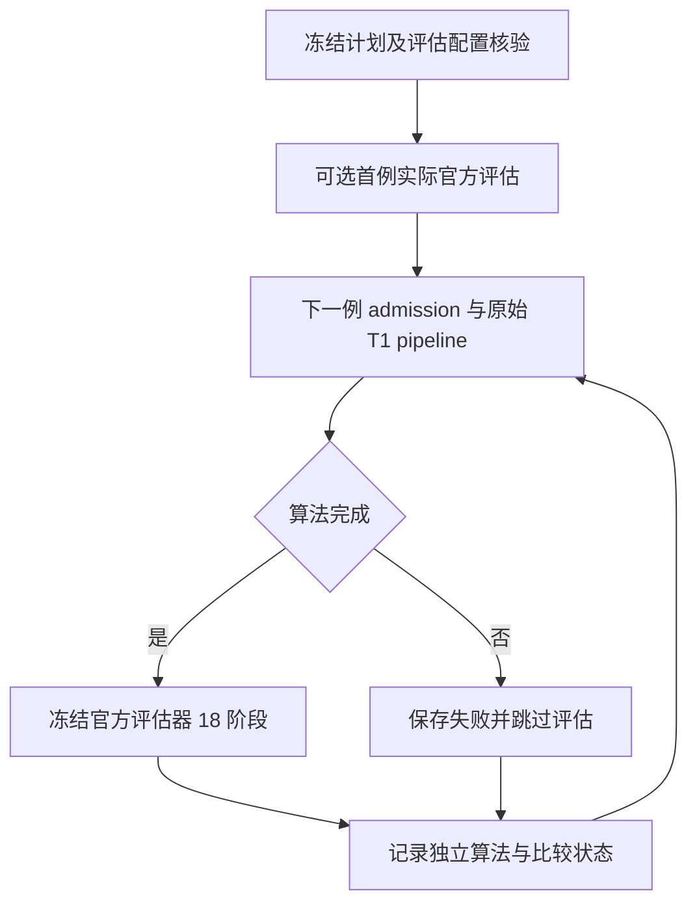

# 精度候选顺序整例与官方评估队列

## 功能与执行顺序

复用 `run_resource_replay_queue.py`：可先评估已经真实完成的首例，再逐例执行原始 T1 整例，只有算法完成后才运行冻结的官方评估器。每个子进程退出后才创建下一进程，总线程预算保持 4；原 admission 的资源等待、锁及清理不变，评估器每阶段使用同一个共享锁。此工具只编排，不修改影像算子、候选源码或比较门槛。



## 输入参数与结构

CLI 为 `python run_resource_replay_queue.py --plan PLAN.json --report NEW_QUEUE.json`。两个参数都是具名文件路径；report 必须不存在。没有独立影像 Python API或对应的原软件单步命令；算法仍由实际 pipeline 执行，官方参考对应 `recon-all -all`。

旧计划不传 `execution_role`，默认为 `baseline`，保持原 schema `fnit-original-baseline-resource-replays-v1`、旧字段和流程。`execution_role="precision_candidate"` 使用独立 schema `fnit-precision-candidate-sequential-validation-v1`。其他 role 拒绝；baseline 不接受评估选项。

原字段：`python` 为既有环境解释器；`admission_script` 与 `admission_script_sha256` 绑定资源运行器；`shared_lock` 为原共享锁；非空 `cases` 中各 `id` 唯一，`original_config` 为可信准备配置、`retry_root` 为新独立 attempt 目录、`admission_report` 为新 admission 回执。各例仍按原配置的设备、精度、输入、资产和四线程执行。

新增每例可选 `post_evaluation`：

| 字段 | 含义 |
| --- | --- |
| `script` / `script_sha256` | 实际 `evaluate_pair.py` 路径与冻结 SHA-256 |
| `config` / `config_sha256` | 实际 evaluator JSON 路径与冻结 SHA-256 |

评估 JSON 必须显式 `evaluated_role="precision_candidate"`、case 与本例一致，`evaluated_config` 必须指向此例实际 `retry_root/retry_config.json`，`lock` 必须等于 shared_lock，`output` 必须与 attempt 目录独立且尚不存在，各例评估 output 不重复。评估器继续核对真实 completion、输入、源码归档、资产清单等绑定；队列不伪造 completion。

可选顶层 `initial_evaluation` 在 cases 之前执行，包含同样四项冻结字段，并增加 `id` 和 `actual_config`（已经执行的实际 retry_config）。首例真实完成状态由 evaluator 检查；未完成则评估失败，记录后继续 cases，不增加算法成功数。初始与后续评估不复用既有 output/checkpoint。

## 配置示例

以下路径与 SHA 都必须替换为已核验现场值，不代表这些文件已经执行：

```python
import hashlib
import json
from pathlib import Path

# 使用已有环境与当前冻结评估器；不变更 Conda prefix。
python_executable = "/path/to/fnit_env/bin/python"
admission_script = Path("/path/to/resource_admission.py")
evaluation_script = Path("/path/to/evaluate_pair.py")
evaluation_config = Path("/path/to/sub07.evaluation.json")
shared_lock = "/tmp/fnit-shared-benchmark.lock"
plan = {
    "execution_role": "precision_candidate",  # 独立角色，不能改标 baseline
    "python": python_executable,
    "admission_script": str(admission_script),
    "admission_script_sha256": hashlib.sha256(admission_script.read_bytes()).hexdigest(),
    "shared_lock": shared_lock,
    "cases": [{
        "id": "ds000114_sub-07",
        "original_config": "/path/to/sub07.prepared.config.json",
        "retry_root": "/path/to/sub07/attempt_01",  # 新 attempt
        "admission_report": "/path/to/sub07/admission.json",
        "post_evaluation": {
            "script": str(evaluation_script),
            "script_sha256": hashlib.sha256(evaluation_script.read_bytes()).hexdigest(),
            "config": str(evaluation_config),  # evaluated_config 指向上方 attempt_01/retry_config.json
            "config_sha256": hashlib.sha256(evaluation_config.read_bytes()).hexdigest(),
        },
    }],
}
Path("candidate.queue.plan.json").write_text(json.dumps(plan, indent=2))
```

## 输出、失败与取消

算法与比较分别记录：旧 `successful`、`failed_or_not_admitted`、`all_cases_succeeded` 仅计算 cases 算法；新增 `initial_evaluations`、每例 `evaluation`、`evaluations_succeeded`、`evaluations_failed_or_skipped`、`all_evaluations_succeeded` 计算实际申请的比较任务。未配置评估不计作完成评估。`queue_finished` 仅表示遍历结束。全部算法和申请的评估成功时 exit=0；失败 exit=1；取消 exit=130。

比较成功要求实际 evaluator exit=0，冻结 script/config 未漂移，checkpoint case/role/script/config SHA 正确，18 个阶段全部 complete，strict checked 恰好为整数 138，`passed` 必须存在且为 0–138 的严格整数（拒绝 bool、浮点和越界）。这些检查只验证报告完整性，不要求 `passed=138`。`passed` 只报告，不按文件通过数阻断，不表示整体等效。算法失败不启动 evaluator；比较失败保留日志并继续下一例，不改变算法成功状态。评估日志为 `<config文件名>.queue-evaluation.log`，独占创建以免覆盖。

SIGINT/SIGTERM 对 admission 保持原清理协议；评估取消发送至自有进程组并等退出后结束队列。没有新增算法重试或并行线程。原 benchmark 与候选真实结果由各自原始回执记录，本工具 CPU fixture 只检验控制流，不能替代真实脑影像 benchmark。

## 验证与参考

纯 CPU 回归覆盖默认兼容、角色/路径拒绝、script/config 漂移、算法失败跳过、比较失败继续、首例未完成拒绝和算法/比较独立计数。现有比较器、锁和 138 项门槛保持。

- 本项目 `cohort/pair/evaluate_pair.py` 与 `evaluated_role_bindings.py`
- [FreeSurfer recon-all 流程](https://surfer.nmr.mgh.harvard.edu/fswiki/recon-all)


## 实际队列状态持久化修正（2026-10-04）

旧冻结工具SHA `681201b6606e31e5d008c0edb7f2611bb479a3059520b281dcee1d1b9ada10f3` 在raw completion核验后只更新内存，随后同步等待官方评估，直到评估结束才写磁盘queue。sub-07于14:52:32 UTC真正完成138项及网格检查，但15:16评估运行时旧queue仍显示admission_or_execution、execution_succeeded=false。这是持久化滞后，不是算法失败；实际记录见runtime/sub07_3a_status_20261004_v1，源码和原queue SHA保留。

本地新工具在post-evaluation之前先保存原始整例完成状态，并在评估子进程启动后保存独立evaluation.status=running及pid。完成/失败/继续下一例与严格比较数量规则保持原语义。真实CPU子进程测试将评估阻塞在显式文件屏障，核验此时磁盘row已complete且execution_succeeded=true、evaluation仍running，解除屏障后队列正常完成；不执行影像或GPU计算。

服务器正在运行的冻结队列不修改；下次新冻结工具才使用本修正。当前实时状态以admission、diagnostics/completion和实际评估checkpoint分别判断，不能只看旧queue行。priority guard的父T态只是排序，guard completion确认恢复和/proc实际状态另核对，不等同诊断成功。
