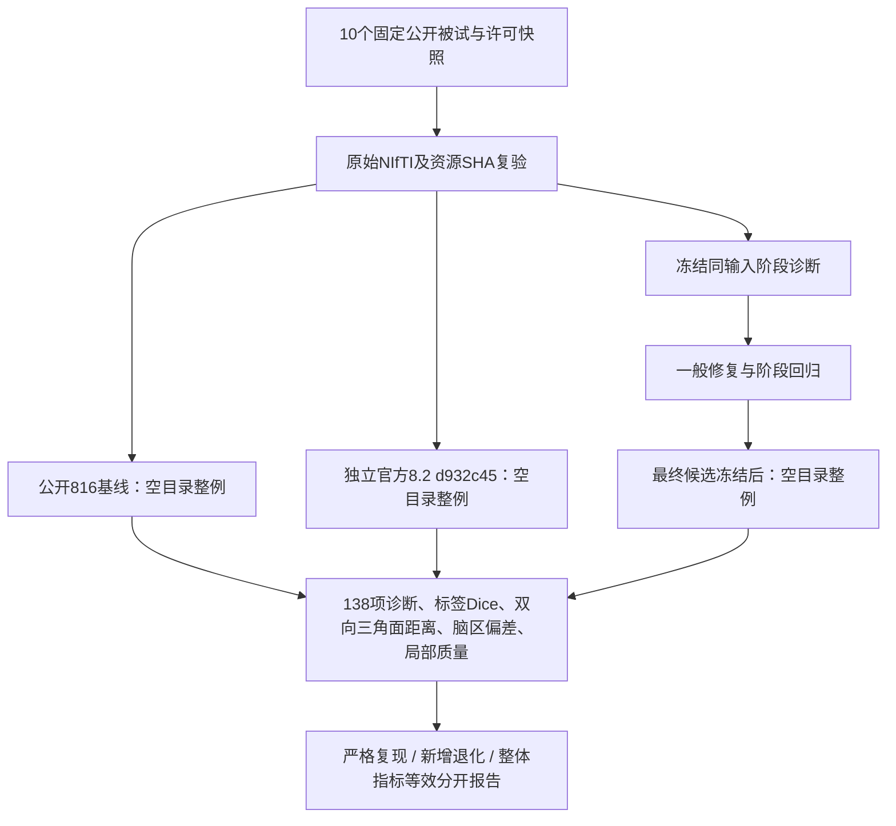

# 十例真实T1的精度优化验证

本轮提高与官方recon-all的一致性，保留已接入的GPU和双半球并行实现。初始源码固定为`816e5610417a4c587caf321049438a9554139016`。最终候选尚未冻结，十例整例结果尚未完成；两例历史结果不改标成本轮结果。

## 流程及数据



数据来自两个固定OpenNeuro Git快照，各5个不同被试，均为CC0。清单在[cohort](cohort/README.md)，原影像仅保存在服务器私有验证目录。每例NIfTI记录shape、dtype、scanner affine、qform/sform和SHA。不能以重测扫描增加被试数，也不能根据输出剔除失败者。

## 配置工具：输入、输出及失败行为

`prepare_baseline.prepare(manifest_path=..., bindings_path=..., output_directory=...)`只生成配置，不执行重建。

| 参数 | 数据结构与用途 |
| --- | --- |
| `manifest_path` | 已复验JSON，`cases`必须包含10个不同被试；每项有`id/dataset/subject/server_input/sha256/download_status`。路径为原始3D T1，空间不改动。 |
| `bindings_path` | 私有JSON；`python/code_root/code_commit/source_archive_sha256/weights/assets/native_bin_dir/fs_license/gpu_uuid/server_root/official_home`均须提供。许可证字段只有路径，不保存内容。 |
| `output_directory` | 新配置目录；已存在即抛`FileExistsError`。每例输出baseline与official两份JSON，另有`plan.json`。 |

函数返回计划字典。缺参数、下载未完成、重复被试或非固定816基线抛`ValueError`；不生成候选配置。前5例使用预初始化CUDA的Python API，后5例使用CLI，最终候选沿用每例方式。

```python
from validation.recon_all.accuracy_20261003.prepare_baseline import prepare

plan = prepare(
    manifest_path="/data/validation/cohort_verified.json",  # 十例校验后的固定清单
    bindings_path="/private/validation/baseline_bindings.json",  # 已核验程序与资源路径；仅私有保存
    output_directory="/data/validation/configs_v1",  # 必须为新目录
)
# plan["cases"]逐例列出配置、调用方式和prepared_not_run状态。
```

```bash
python validation/recon_all/accuracy_20261003/prepare_baseline.py \
  --manifest /data/validation/cohort_verified.json \
  --bindings /private/validation/baseline_bindings.json \
  --output-directory /data/validation/configs_v1
```

没有候选提交时不要调用cohort的`prepare_evaluation.py`填一个虚构版本；候选通过阶段回归、提交并冻结后再生成三方正式配置。

## 官方参考

`capture_official.capture(fs_home=..., names_path=..., output_path=...)`读取安装的官方参考版本，流式计算SHA。`names_path`的`program_names/assets/weight_names`来自该固定版本的已记录整例命令及当前声明资源。返回/输出JSON包含`programs`（绝对路径→SHA）、`resources`（路径→SHA/bytes）、报告版本、主机、缺失资源及采集秒数。程序缺失或路径不可读时抛异常；输出存在时拒绝覆盖。此清单仍需在实际命令出现新增程序时补录，不代表动态库或物理隔离已经验证。

`run_official_case.run(config_path=...)`读取一例官方JSON。固定CPU预算4、ITK线程1、随机种子1234；显式禁止参考调用GPU。校验原始T1与程序SHA、确认输出为空、加载官方环境并复核版本，随后执行：

```bash
# 仅独立benchmark环境；不在FNIT生产环境执行。
recon-all -all \
  -i /data/raw/sub_T1w.nii.gz \
  -s public_case \
  -sd /data/benchmark/official/subjects \
  -openmp 4 \
  -itkthreads 1 \
  -rng-seed 1234
```

```python
from validation.recon_all.accuracy_20261003.capture_official import capture
from validation.recon_all.accuracy_20261003.run_official_case import run

manifest = capture(
    fs_home="/reference/FreeSurfer-8.2",  # 官方参考安装目录，不是FNIT生产依赖
    names_path="/data/validation/official_resource_names.json",  # 公开程序及资源名列表
    output_path="/data/validation/official_program_manifest.json",  # 新清单文件
)
completion = run(
    config_path="/data/validation/configs_v1/official_public_case.json",  # 一例固定官方配置
)
```

```bash
python validation/recon_all/accuracy_20261003/capture_official.py \
  --fs-home /reference/FreeSurfer-8.2 \
  --names /data/validation/official_resource_names.json \
  --output /data/validation/official_program_manifest.json
python validation/recon_all/accuracy_20261003/run_official_case.py \
  --config /data/validation/configs_v1/official_public_case.json
```

配置含原始T1路径/SHA、case、subjects_dir、diagnostic_root、fs_home、个人fs_license路径、program_manifest、threads/itk_threads/seed和code_version。成功输出`launch.json/command.log/completion.json`，并绑定实际`recon-all.done/log`哈希；失败保留`completion.json`和异常，非零退出。诊断目录或被试目录已存在时拒绝重跑。完成报告只表示程序执行结束，输出/网格/严格复现/指标等效要另外检查。此包装器没有独立等价官方CLI，它执行上列完整官方命令。

## 队列、时间与显存

复用已经验证的`optimizations/20261002_parallel/run_whole_queue.py`、`execute_whole_case.py`及`python_gpu_port/run_monitored.py`。十例FNIT基线与十例官方分别持久排队，每例独立取得服务器本地`/tmp/fnit-shared-benchmark.lock`。阶段诊断同样每stage释放锁；不要以队列存在或进程存活宣称开始计算。

FNIT总线程4、双半球各2；目标GPU明确为H100 GPU0的物理UUID。CPU官方与GPU FNIT的后端差异明确记录。GPU阶段剖析同步`cuda:0`，整例外层计时包含校验、导入、模型加载、传输、计算和读写；锁等待另列，嵌套阶段不能相加当墙钟。CLI/API保留实际allocator策略，默认TF32及已验证FP32例外，无半精度。

NVML按请求2秒采样，报告实际最大间隔、查询失败及同一查询父子进程合计。目标预算为20,000,000,000字节；采样峰值不能当连续峰值保证，PyTorch allocated/reserved不可用时不能填零。比较前后时间同时查看共享主机/GPU负载及AB/BA波动，不自行设定5%等未授权性能门槛。

阶段回归尚未结束时，可在Linux主线程调用`prioritize_diagnostics.prioritize(launches=..., watch_pids=..., output_directory=..., timeout_seconds=21600)`暂缓本轮两个整例队列父调度器。`launches`为其启动凭据JSON路径列表；`watch_pids`为明确诊断父进程整数PID列表；`output_directory`须为新目录；`timeout_seconds`为正秒数，默认6小时。它验证PID、进程启动tick、完整命令和独立session后，仅STOP/CONT队列父进程，当前子计算继续，不操作诊断进程或共享锁。返回/输出状态字典及`launch/status/completion.json`；被观察进程退出或超时会自动恢复队列，退出不表示验证通过。SIGTERM/SIGINT会在清理时恢复；身份不符/路径已有/超时参数无效会抛异常。调度暂停产生的父wrapper elapsed必须单列，不影响子命令monitor墙钟。它不是算法，没有官方等价CLI。

```python
from validation.recon_all.accuracy_20261003.prioritize_diagnostics import prioritize

status = prioritize(
    launches=["/data/validation/baseline_queue_launch.json",  # 本轮基线父队列凭据
              "/data/validation/official_queue_launch.json"],  # 本轮官方父队列凭据
    watch_pids=[12345, 23456],  # 实际已启动的阶段诊断PID；示例须替换
    output_directory="/data/validation/priority_v1",  # 新调度记录目录
    timeout_seconds=21600,  # 优先窗口最多6小时，不是计算超时
)
```

```bash
python validation/recon_all/accuracy_20261003/prioritize_diagnostics.py \
  --launches /data/validation/baseline_queue_launch.json /data/validation/official_queue_launch.json \
  --watch-pids 12345 23456 \
  --output /data/validation/priority_v1 \
  --timeout-seconds 21600
```

`runtime/`保存本轮源码、程序、资源与启动凭据；`coordination_status.json`记录采集时状态。候选commit未知时保持未知。新增验证工具均使用Python标准库；生产修复复用主页Conda既有nibabel/PyTorch，不增加运行依赖。当前gpucw1有官方软件用于参考，物理无预装软件的隔离整例尚未验证。

## 当前证据与验收口径

实时阶段记录见`task_02`至`task_05`；旧两例冻结输入诊断和十例连续链分别注明。十例原始T1的最终候选整例尚未完成，不能发布整例误差改善或提速。

保留原138项逐文件门槛。标签使用逐标签Dice；同网格才比较同索引，异拓扑报告双向点到三角面距离。分别给出厚度/面积/体积脑区绝对与相对误差、max/P99和局部异常；检查非流形、连通、自相交、white/pial穿越与球面翻折。官方重复运行的稳定性和跨环境差异分开。整体等效阈值尚未正式确认，统一`not_assessed`。

最新进展在[中文结果页](../../../docs/recon_all/ACCURACY_10_T1_20261003.md)；每份checkpoint显示仍未执行的项目。

## 原实现及参考

- [固定FreeSurfer recon-all及源码](https://github.com/freesurfer/freesurfer/tree/d932c45b7941662ea380a05efef580568b98d41a)。
- Fischl B. FreeSurfer. *NeuroImage*. 2012;62:774–781. [doi:10.1016/j.neuroimage.2012.01.021](https://doi.org/10.1016/j.neuroimage.2012.01.021)。
- 数据快照、许可和原始资源来源见[cohort记录](cohort/README.md)；影像、权重和许可证不提交仓库。
