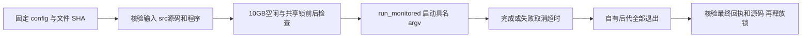

# 阶段 benchmark 外层调度

`stage_benchmark_controller.py`使用明确的 JSON 配置和 argv，核验冻结输入和源码，再以至少10 GB空闲显存与共享锁的双重检查启动阶段。它复用 `run_monitored.py`，每0.5秒请求显存采样，定期登记自有后代。成功、失败、取消和超时都先回收自有计算，再释放锁。

该入口仅用于 annotation 单阶段或 CUDA 启动标量诊断。整例继续使用既有20 GB准入协议。它不改变 FNIT 算法、精度、GPU或系统策略，不重试算法，也不执行 shell/eval。



## 配置、Python入口与输入输出

| 必填字段 | 格式 | 含义 |
| --- | --- | --- |
| `benchmark_kind` | `annotation_stage` 或 `startup_scalar` | 声明单阶段范围，不接受整例 |
| `python` | 绝对文件路径 | 既有冻结 Conda 解释器，不重建环境 |
| `source` | 绝对目录路径，包含 `src` | 实际使用的 baseline/candidate 源码根目录 |
| `script` | 绝对 `.py` 文件路径 | 被测单阶段脚本 |
| `args` | 字符串列表 | 完整具名 argv；恰好一个 `--output` 或 `--output=...`，须等于配置的 output |
| `manifest_files` | `{path,size_bytes,sha256}`对象列表 | 本轮声明的输入/资产/程序文件，逐一核验；不包含许可证内容 |
| `output` | 不存在的新绝对目录路径 | 由被测阶段脚本创建；不覆盖旧产物 |
| `diagnostic_root` | 另一个不存在的新绝对目录路径 | 外层回执、监测和独立缓存目录；与 output 分离 |
| `lock` | 绝对文件路径 | 现有 `/tmp/fnit-shared-benchmark.lock` |
| `gpu_uuid` | 单个完整 `GPU-...` | 准入、CUDA可见设备及监测均使用相同物理GPU |
| `minimum_free_bytes` | 整数，至少 `10000000000` | 单阶段准入预算；10 GB约9.31 GiB |
| `threads` | 整数 `4` | 父环境六个原生线程变量为4，双侧group再各分配2 |

| 可选字段 | 默认及用途 |
| --- | --- |
| `monitor_script` | `source/validation/recon_all/python_gpu_port/run_monitored.py`；可显式指定既有固定监控脚本 |
| `maximum_wait_seconds` | `3600`；资源/锁等待上限，不计为算法时间 |
| `timeout_seconds` | `3600`；监测进程启动后的阶段总超时，超时不重试 |
| `query_timeout_seconds` | `5`，范围0.1–60；单次GPU查询上限 |
| `env` | 许可的显式字符串环境变量；见下文 |
| `checkpoint`、`assets`、`protected_paths` | 额外只读保护根目录；用于防止新输出与原输入/资产树重叠，不改变目标argv |

许可的 `env` 字段为 CUDA_VISIBLE_DEVICES、PYTHONDONTWRITEBYTECODE、PYTORCH_NO_CUDA_MEMORY_CACHING、六个线程变量、NUMBA_CACHE_DIR、PYTHONPATH、TORCH_SHOW_CPP_STACKTRACES、FS_LICENSE、FREESURFER_HOME。GPU UUID、缓存禁用、线程4、禁止bytecode写入及 `PYTHONPATH=source/src:script父目录`由外层按配置统一设置。许可证只传路径，不读取内容。继承的 `LD_PRELOAD`非空则拒绝正规 benchmark，诊断 hook 的结果应另列。

NUMBA_CACHE_DIR未显式配置时，固定使用本轮 `diagnostic_root/numba_cache`，不继承父进程的共用缓存。需要暖缓存配对时，显式声明对应 backend 的已知缓存目录并保留首次/后续运行区别。

自动 inventory只包含 `source/src` 下的全部 `.py`及解释器、target、monitor、controller和自有进程清理helper；另加 `manifest_files`声明文件。它不会扫描全部权重、资产或历史 validation。对于 annotation，输入清单使用原清单前15项；五项历史源码不放入候选输入准入清单，候选源码由自动 inventory另行核验。

```python
from pathlib import Path
from stage_benchmark_controller import run

# 配置绑定真实数据和新产物；run执行资源准入及被测阶段。
benchmark_config_path = Path("/path/to/annotation_candidate_stage_config.json")
benchmark_exit_code = run(config_path=benchmark_config_path)
# 0表示目标/monitor完成、产物存在、inventory稳定及后代退出；
# 不表示原始T1整例或官方等效。实际阶段结论读取target自己的回执。
```

## 生成配置与命令行

以下示例只生成配置。实际路径从 FNIT 固定索引定位，不移动冻结源码或现有 Conda prefix。基线与候选分别使用各自的 `source`、新 output和diagnostic_root；同一个真实被试使用同一15项数据/资产清单。

```python
import json
from pathlib import Path

# 这些变量应由本轮已核验的真实路径填写。
python_interpreter = "/absolute/frozen_conda/bin/python"
candidate_source_directory = "/absolute/frozen_candidate_source"
annotation_stage_script = "/absolute/replay_annotation_stage.py"
checkpoint_directory = "/absolute/fnit_produced_subject"
assets_directory = "/absolute/verified_assets"
input_manifest_path = "/absolute/sub06_annotation_replay_readonly_20261004.json"
stage_output_directory = "/absolute/FNIT/runs/new_stage_candidate"
diagnostic_directory = "/absolute/FNIT/runs/new_stage_candidate_monitor"
config_output_path = Path("/absolute/new_candidate_stage_config.json")

input_manifest = json.loads(Path(input_manifest_path).read_text())
config = {
    "benchmark_kind": "annotation_stage",  # 只评估单阶段。
    "python": python_interpreter,
    "source": candidate_source_directory,
    "script": annotation_stage_script,
    "args": [
        "--checkpoint", checkpoint_directory,
        "--input-manifest", input_manifest_path,
        "--assets", assets_directory,
        "--output", stage_output_directory,
        "--startup-wait-seconds", "30",  # 基线完整省略这两个argv元素。
    ],
    "manifest_files": input_manifest["replay_files"][:15],  # 自产7数据+8资产。
    "output": stage_output_directory,
    "diagnostic_root": diagnostic_directory,
    "checkpoint": checkpoint_directory,
    "assets": assets_directory,
    "lock": "/tmp/fnit-shared-benchmark.lock",
    "gpu_uuid": "GPU-26e41f63-1a65-6b3e-5370-fa9a2934ca8e",
    "minimum_free_bytes": 10_000_000_000,
    "threads": 4,
    "timeout_seconds": 3600,
    "env": {},  # 默认使用这轮独立Numba缓存；可显式传许可证路径。
}
# 不覆盖现有配置。
with config_output_path.open("x") as stream:
    json.dump(config, stream, indent=2)
```

```bash
# 使用既有冻结解释器；外层自身持有共享锁和自有进程清理职责。
"$FNIT_PYTHON" stage_benchmark_controller.py \
  --config "$FNIT_STAGE_BENCHMARK_CONFIG"
```

`FNIT_PYTHON`是原实体路径的既有 Conda Python，`FNIT_STAGE_BENCHMARK_CONFIG`是上面写出的完整配置。被测命令实际构造成 `python run_monitored.py --gpu-uuid ... --output 新monitor目录 --interval 0.5 --query-timeout 5 -- python script args`，用 `Popen(...,start_new_session=True)`启动。

`diagnostic_root`保存 `inventory.json`、`controller.json`、`monitor_launcher.log`及 `monitor/command.log`、`monitor/gpu_samples.csv`、`monitor/monitor.json`。target的实际输出和 annotation NPZ仍在 `output`内。

## 生命周期与计时

配置和原清单在任何GPU查询前核验。接近准入时、锁内启动前和最终退出时分别核验inventory，避免计算过程中混用源码。空闲显存查询在取锁前后各做一次；共享锁只协调遵守同一锁的任务，后续外部负载由实际监测记录。

控制器每0.1秒请求登记后代身份；清理复用 PID/starttime及pidfd身份保护，仅处理本轮自有树。信号处理先记录取消标志，保证新进程已启动后不会跳过登记。直接monitor已成功退出而仍存在自有计算时，回收残留并标记 `residual_owned_terminated`；不写成complete。D态等未退出计算仍存在时继续持锁。

`complete`要求 target/monitor退出码0、monitor线程结束、声明输出目录存在、最终inventory一致及已登记后代全部退出。它不替代target的六个annotation、输入稳定性或科学等效检查。`command_failed`、`interrupted`、`timed_out`、`completion_unverified`均保留原结论，清理成功不能把它们升级为complete。

回执分别记录资源等待、monitor进程墙钟、清理及全外层墙钟，并记录CPU self/reaped-children用量和限制。显存CSV记录请求/实际采样间隔、查询失败、父子同期采样峰值；峰值不是连续峰值，失败样本不补零。外层CPU用量也不是连续完整进程树profile。

## 本版验证、benchmark与原实现

2026-10-04新增阶段外层入口，复用既有监测和进程清理helper。本地仅验证语法、CLI、纯CPU配置/输出保护及inventory拒绝漂移；真实GPU阶段和耗时比较由协调者随后执行，未测数字不填入本页。

本包装器没有独立原软件等价命令。annotation对应算法、固定原软件版本/命令链接、六套语义向量及本轮阶段评估范围见[annotation阶段重放](ANNOTATION_STAGE_REPLAY.md)。真实脑图、同输入精度及分步/端到端耗时应随实际stage回执更新，单阶段结果不推广为整例性能。

相关代码：[既有监测](../python_gpu_port/run_monitored.py)、[既有资源与清理](resource_admission.py)、[成熟 annotation 记录](../python_gpu_port/MRIS_CA_LABEL_STATUS.md)。原算法出处为[FreeSurfer mris_ca_label](https://surfer.nmr.mgh.harvard.edu/fswiki/mris_ca_label)，参考 Fischl et al., *Cerebral Cortex* 14, 11–22 (2004)。
