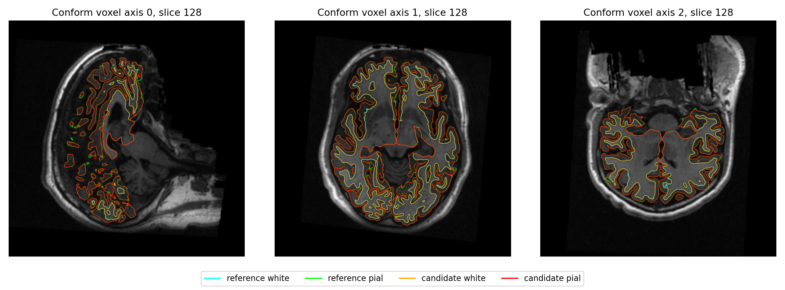
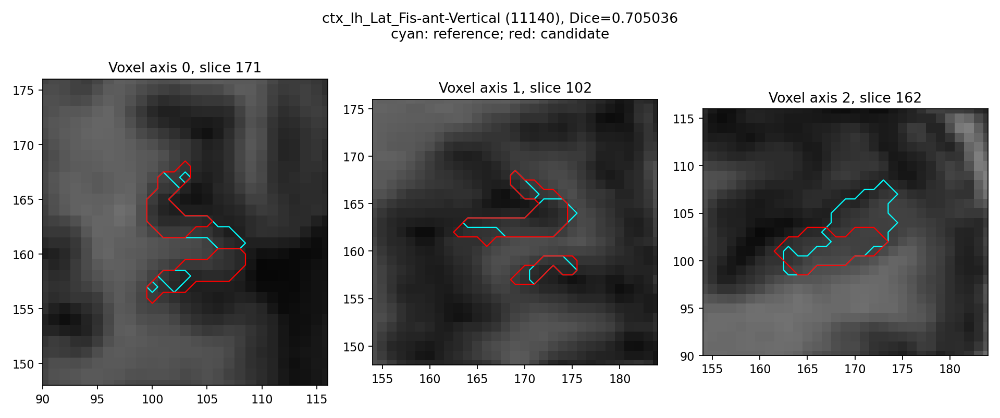

# 九例现存 recon-all 完整比较（2026-10-07）

本次恢复连接后，只读取回九例现存的完整18阶段比较；没有重新运行原始T1。原始重建仍绑定 `3a0c9aba6321b4981fd8174b4b191515459aa38b`，源码归档SHA `03cc806fb449a8620c8caa78b1af86dfaff6b64ab9e9e7c5210cf12184aa7f31`（完整准确值以JSON为准）。新四例API评估用ed16工具；其余五例保留当时实际evaluator/helper SHA，不能重标为当前合并工作分支。

原始整例执行及生产网格通过 **9/10**；十例均生成138项输出；官方完整比较 **9/10**。sub-10206左侧white与pial各有16个独立相交面，原执行失败且未进入正式完整比较。严格复现、是否引入退化和整体指标等效分别报告；整体等效阈值尚未确认，仍为 `not_assessed`。

## 原始整例耗时与同期采样显存

双方原始T1 SHA、运行主机和声明GPU相同，每例总线程4。墙钟包含入口、校验、加载、搬运、计算与读写；准入等待和事后比较不计入。没有新的ABBA或独占负载实验，以下比值描述原记录，不是新整例提速验收。GB按10⁹字节。

| 病例 | FNIT秒 | 官方秒 | 官方/FNIT | 自身同期采样峰GB | 严格诊断通过/138 |
|---|---:|---:|---:|---:|---:|
| ds000114_sub-06 | 2948.559 | 5735.363 | 1.945 | 13.571 | 6 |
| ds000114_sub-07 | 2656.930 | 6138.304 | 2.310 | 12.027 | 7 |
| ds000114_sub-04 | 2571.814 | 6095.087 | 2.370 | 6.143 | 7 |
| ds000114_sub-05 | 2588.626 | 5948.523 | 2.298 | 12.027 | 8 |
| ds000114_sub-08 | 2597.888 | 5839.091 | 2.248 | 10.947 | 5 |
| ds000030_sub-10159 | 2769.720 | 5811.069 | 2.098 | 10.947 | 2 |
| ds000030_sub-10171 | 2669.520 | 5507.656 | 2.063 | 10.945 | 2 |
| ds000030_sub-10189 | 2691.730 | 5552.061 | 2.063 | 10.949 | 2 |
| ds000030_sub-10193 | 2988.228 | 7846.549 | 2.626 | 13.571 | 2 |

成功九例FNIT中位数 **2669.520秒**，官方中位数 **5839.091秒**；逐例耗时比中位数 2.248。这不是同一病例两版FNIT的受控优化比较。采样峰为 6,142,558,208–13,570,670,592字节，均在预算以内；连续峰未验证。API预初始化情况下PyTorch分配器统计为不可判定，未用零计数代替进程树采样。

## 68区aparc统计误差

MAE按双方相同名称的68区匹配；厚度单位mm、面积mm²、灰质体积mm³，曲率1/mm。GrayVol沿用原stats定义；no-th3在JSON中另列，未互相替代。

| 病例 | 厚度MAE / 最大差mm | 面积MAE / 最大差mm² | 体积MAE / 最大差mm³ | 曲率MAE 1/mm |
|---|---:|---:|---:|---:|
| ds000114_sub-06 | 0.036015 / 0.176 | 31.705882 / 165.000 | 109.808824 / 483.000 | 0.001794 |
| ds000114_sub-07 | 0.019676 / 0.101 | 30.117647 / 169.000 | 79.838235 / 425.000 | 0.001265 |
| ds000114_sub-04 | 0.013397 / 0.124 | 28.352941 / 210.000 | 76.691176 / 549.000 | 0.001500 |
| ds000114_sub-05 | 0.019603 / 0.085 | 21.794118 / 87.000 | 68.161765 / 258.000 | 0.001162 |
| ds000114_sub-08 | 0.013515 / 0.050 | 28.852941 / 128.000 | 75.544118 / 305.000 | 0.001176 |
| ds000030_sub-10159 | 0.039662 / 0.221 | 45.426471 / 231.000 | 159.308824 / 792.000 | 0.003132 |
| ds000030_sub-10171 | 0.015221 / 0.094 | 19.911765 / 79.000 | 58.955882 / 220.000 | 0.001721 |
| ds000030_sub-10189 | 0.021529 / 0.170 | 34.455882 / 364.000 | 88.808824 / 616.000 | 0.001574 |
| ds000030_sub-10193 | 0.029338 / 0.123 | 46.235294 / 263.000 | 153.794118 / 924.000 | 0.002132 |

逐脑区正负差、最大差所在脑区、相对误差及四套图谱统计保留在[完整JSON](public_summary.json)，没有剔除低一致性区。

## 分区Dice与局部表面差异

| 病例 | aparc最小 / P05 / 中位Dice | a2009s最小Dice | white最差P99 / 最大mm | pial最差P99 / 最大mm |
|---|---:|---:|---:|---:|
| ds000114_sub-06 | 0.85355 / 0.90370 / 0.95195 | 0.71191 | 0.42906 / 3.17434 | 0.67847 / 5.23317 |
| ds000114_sub-07 | 0.89368 / 0.91978 / 0.96326 | 0.70504 | 0.28420 / 5.99673 | 0.51031 / 3.10306 |
| ds000114_sub-04 | 0.90187 / 0.92725 / 0.96891 | 0.74979 | 0.23299 / 2.07369 | 0.45371 / 2.92686 |
| ds000114_sub-05 | 0.92162 / 0.93487 / 0.97018 | 0.73377 | 0.30272 / 2.08401 | 0.43554 / 2.45126 |
| ds000114_sub-08 | 0.87342 / 0.93016 / 0.96748 | 0.78804 | 0.26148 / 2.45771 | 0.45371 / 3.15511 |
| ds000030_sub-10159 | 0.79413 / 0.86390 / 0.92638 | 0.67547 | 0.81013 / 4.35594 | 1.19835 / 4.39785 |
| ds000030_sub-10171 | 0.90445 / 0.92542 / 0.96725 | 0.68371 | 0.27793 / 1.83811 | 0.54052 / 4.49071 |
| ds000030_sub-10189 | 0.91306 / 0.93534 / 0.97089 | 0.70694 | 0.22976 / 2.76205 | 0.42097 / 3.33020 |
| ds000030_sub-10193 | 0.86493 / 0.89293 / 0.94508 | 0.64692 | 0.59759 / 5.92534 | 0.78083 / 4.16448 |

距离为双向顶点到完整三角面的采样距离，取双侧双向中最差P99和最大值；不是连续Hausdorff或逐顶点一致性。双方网格不对应时不做同索引比较，局部顶点图报告保持未评估。分区Dice逐标签、拓扑、vertex-link、white/pial穿越及sphere/sphere.reg翻折都保留。sub-07候选左侧球面/配准球面负面积面49/56，官方左侧58/26；原生产网格passed不能代替全部几何质量检查。

## 已有真实脑图示例

以下图像是冻结3a与原官方结果的既有比较，不是本次重跑或新合并源码的输出。





## 工具、绑定与复现

`collect_existing_comparisons.py`只读已有JSON及固定索引，返回白名单数值与原件SHA/大小，不运行模型、MRI处理或官方命令。参数`--fnit-root`为已有固定布局根目录，必需；`--excluded-program-root`可重复，默认不检查目录引用，只核对元数据引用，不能证明运行时或动态库隔离。输出为stdout JSON，任一complete/source/config/18阶段/138项绑定失败即抛错退出，不补造unknown的必需证据。缺失的非必需历史报告（monitor、all_regions或no-th3）可以为空或unknown，必需绑定不会这样处理。没有独立原软件CLI，属于事后证据采集。

```bash
# 填写本机已有验证数据根目录；原记录和影像保持原样。
python collect_existing_comparisons.py --fnit-root /data/FNIT > /data/nine_cases.public.json
```

新四例的参考依然是原 `recon-all -i T1w -s subject -all -openmp 4` 完整记录；没有把比较器运行时间计入原整例。本次本地整合工作树的API门控/队列49项回归通过；另有四臂runner合同测试，均不是MRI benchmark。未执行新版合并源码整例、干净环境隔离或连续显存峰验证。

[当前原始冻结候选说明](../../../../../docs/recon_all/PRECISION_CANDIDATE_BENCHMARK_20261004.md) · [同输入四臂工具](../../prewhite_same_input.md) · [FreeSurfer固定源码](https://github.com/freesurfer/freesurfer/tree/d932c45b7941662ea380a05efef580568b98d41a)

更新记录：2026-10-05五例摘要保留为历史快照；2026-10-07新增四例API比较和04/05/08详细指标，所有原件数值和SHA在补标签名的再次读取中保持不变。
