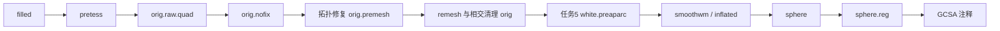

# 网格、拓扑、球面与皮层注释精度检查

本目录是2026-10-03任务4的隔离验证工具和第一阶段实测。生产算法尚未修改。基线源码是 `816e5610417a4c587caf321049438a9554139016`，旧两例保存输出来自 `8d750e25d4d067a43edb788a96b2086a1c031ba0`；它们用于定位，不能替代新10例。整体等效为 `not_assessed`。

## 1. 功能与流程

工具逐阶段检查 `filled`、四边形网格、主连通分量、拓扑修复、重网格、球面展开、球面配准和注释。只有顶点数和有序面完全相同才报告同索引距离。不同拓扑的距离使用闭合三角面，而非最近顶点。



目前已保存的链表明 `filled` 和 `orig.nofix` 都存在差异；同一 `pretess` 输入的第一项官方回放则与 FNIT 四边形几何一致。这一区分决定下一步应修复的输入或算子，避免将不同输入的结果当作算子误差。

## 2. Python 调用、输入和输出

这些工具是验证脚本，没有新增生产 Python API。可以用 `subprocess.run` 逐项具名调用：

```python
import subprocess
from pathlib import Path

python_executable = Path("/path/to/fnit/conda/env/bin/python")  # FNIT 的 Conda Python
validation_script = Path("validation/recon_all/accuracy_20261003/task_04/audit_mesh_chain.py")
candidate_subject_directory = Path("/private/candidate_subject")  # 自产 subject
reference_subject_directory = Path("/private/benchmark/reference_subject")  # 隔离官方 subject
baseline_source_directory = Path("/private/baseline_runtime_816e5610")  # 固定基线源码
report_json_file = Path("/private/reports/saved_chain.json")  # 机器可读报告
subprocess.run(
    [str(python_executable), str(validation_script),
     "--candidate", str(candidate_subject_directory),
     "--reference", str(reference_subject_directory),
     "--source-root", str(baseline_source_directory),
     "--code-commit", "816e5610417a4c587caf321049438a9554139016",
     "--output", str(report_json_file)],
    check=True,
)
```

输入为标准 subject 目录，包含 `mri/*.mgz`、`surf/lh.*`、`surf/rh.*` 和 `label/*.annot`。MGZ 读原始 dtype 和仿射，表面坐标是 surface RAS、单位 mm；标签用 FreeSurfer annotation ID，不把标签编号当连续量。

输出为 JSON。保存链报告列出输入 SHA-256、体素误差、顶点/面数、有序面、坐标误差、连通性、Euler 数、边界边、非流形边、重复或退化索引面，以及球面径向朝内/零面积面。后两项不能代替自相交检查；自相交和顶点 link 的全量检查仍待后续回归。缺失文件保留 `exists`，不筛除失败被试。

异拓扑工具另外生成 NPZ：`distance_mm` 为每个源顶点的最近三角面距离，`triangle_id` 为目标面编号，`barycentric` 为最近点在该面上的三项权重。注释取最大权重角点的离散标签；权重相等取第一个角点，等距面按面编号取首面。Dice 分别在参考网格和候选网格域计算；面积权重取各自 `orig` 的每面面积三等分。这是**投射后 Dice**，不证明同索引对应，也不能当成原生顶点 Dice。每个方向的前64个真实输入点还与现有独立精确距离实现核对，事先固定绝对误差限 `1e-9 mm`，该限只验证评估算子。

参数与限制：

| 脚本 | 参数 | 默认值、含义与失败行为 |
| --- | --- | --- |
| `audit_mesh_chain.py` | `--candidate`, `--reference` | 必填，自产/隔离官方 subject；只读 |
| 同上 | `--source-root` | 必填，基线源码根目录，复用其拓扑检查函数 |
| 同上 | `--code-commit` | 必填，比较所用源码基线；不是旧输入输出的生成提交 |
| 同上 | `--output` | 必填，JSON 输出文件；自动创建父目录 |
| 同上 | `--distance-helper` | 默认省略；指定现有距离模块则对不同拓扑补精确距离；否则明确 pending |
| `assess_different_meshes.py` | `--candidate`, `--reference`, `--output-root`, `--code-commit` | 必填，目录和源码基线；无对应文件明确 missing |
| 同上 | `--stages` | 默认 `orig.nofix orig.premesh orig sphere sphere.reg`；按此顺序执行 |
| 同上 | `--lock` | 默认 `/tmp/fnit-shared-benchmark.lock`；每一阶段取得/释放共享锁 |
| 同上 | `--reference-distance-helper` | 默认省略；应指定 `reference_surface_distance.py`，验证前64个真实点 |
| `collect_frozen.py` | `--root`, `--output` | 必填，服务器任务4根目录、JSON输出；只收集已存在结果，pending单列 |
| `run_frozen_queue.py` | 环境 `FS_LICENSE` | 无默认值，必须指向已有私有许可证；脚本只检查存在性，不读取内容 |
| 同上 | 路径与线程 | 冻结本轮 `BASE/ROOT/PYTHON/SOURCE/FS/CHECKPOINTS` 常量，总线程4、GPU0；移植时显式更新常量 |
| `plot_mesh_errors.py` | `--candidate`, `--assessment-root`, `--output` | 必填，candidate、异拓扑 NPZ目录和PNG文件；缺少距离结果报错 |
| 同上 | `--stage` | 默认 orig，改为 orig.nofix 可展示首差；未完成的半球在图中明确标出 |
| 同上 | `--font`, `--subject-label` | 必填，运行环境已有字体路径和图题被试名；PNG需中文字体，SVG可由查看器中文字体渲染。字体不进入Git |

`run_stage.py` 与 `run_reference.py` 逐字复用上一轮同输入阶段工具：前者需要 `--source-root --checkpoint --output-root --assets --commit --stage --hemisphere --gpu-uuid`；`--stage` 是 remesh/sphere/register，`--hemisphere` 是 lh/rh，`--device` 默认 cuda:0，`--threads` 默认4，`--dirty-sha256` 默认空。后者需要 `--checkpoint --reference-home --assets --output-root --hemisphere --stage`，将所有受控输入复制至私有上下文，避免官方程序写回源 checkpoint。程序 SHA、输入 SHA、实际 dtype/TF32、耗时、采样显存和退出状态保存在阶段 JSON。采样0不视为已证明显存为0。

## 3. 命令行复现

```bash
# 在服务器任务4私有目录执行，只收集，不触发计算。
"$fnit_python" collect_frozen.py --root "$task_four_directory" --output "$frozen_comparison_file"

# 不同拓扑的距离和注释，按阶段释放公共锁；GPU/CPU总体线程预算4。
OMP_NUM_THREADS=4 OPENBLAS_NUM_THREADS=4 NUMBA_NUM_THREADS=4 \
"$fnit_python" assess_different_meshes.py \
  --reference "$official_subject_directory" \
  --candidate "$candidate_subject_directory" \
  --output-root "$different_meshes_report_directory" \
  --code-commit 816e5610417a4c587caf321049438a9554139016 \
  --reference-distance-helper reference_surface_distance.py

# 在装有matplotlib的环境中绘真实距离图；中文字体从本机提供。
"$fnit_python" plot_mesh_errors.py \
  --candidate "$candidate_subject_directory" \
  --assessment-root "$different_meshes_report_directory" \
  --font "$existing_chinese_font_file" --subject-label "$subject_label" \
  --output "$local_error_brain_png"
```

依赖复用 FNIT 主页 Conda 的 NumPy、SciPy、Numba、nibabel、PyTorch；脑图绘制用现有 matplotlib，仅验证工具使用，没有新增生产依赖。生产调度、安装、白/软膜放置、法向和指标未改动。

## 4. 对应原软件调用

下列命令仅在隔离 benchmark 执行，使用 FreeSurfer 8.2.0 `d932c45`，程序 SHA 进入 receipt：

```bash
mri_tessellate "$same_pretess_mgz" 255 "$private_lh_raw_quad"
mris_extract_main_component "$private_lh_raw_quad" "$private_lh_orig_nofix"
mris_remesh --remesh --iters 3 --input "$same_orig_premesh" --output "$private_orig"
mris_sphere -threads 4 -seed 1234 "$same_inflated" "$private_sphere"
mris_register -threads 4 "$same_sphere" "$declared_folding_atlas" "$private_sphere_reg"
```

右半球 tessellation 的标签为127。GCSA 与拓扑修复的冻结同输入回放仍待完成，不能据本轮启动状态声称其准确度。

## 5. 本轮实测与待完成项

| 旧例 | filled 不同体素 | 首保存网格差异 | 官方/FNIT LH orig.nofix 顶点 | 官方/FNIT RH orig.nofix 顶点 |
| --- | ---: | --- | --- | --- |
| sub01 | 4,844 | orig.nofix | 102,764 / 102,016 | 101,454 / 100,878 |
| sub02 | 112 | orig.nofix | 114,758 / 114,782 | 113,878 / 113,882 |

四半球 `sphere`/`sphere.reg` 的径向朝内面和零符号面均为0。所有后续网格有序面不同，因此本轮没有报告同索引皮层 Dice 或表面误差。

sub01 LH `orig.nofix` 的异拓扑实测：候选→官方三角面 mean/P99/max 为 0.021496/1.0/3.162278 mm，官方→候选为 0.028786/1.0/2.449490 mm；每方向前64个真实点与独立精确距离实现完全相同。初步中文三视图见 `sub01_orig_nofix_error.svg`，尚待右侧时图中明确标出。SVG保留中文文本，由查看器本机字体渲染；不分发字体。

sub01 LH 在**相同 FNIT pretess 输入**上的官方 tessellation 输出102,016顶点、102,032个quad；与保存 FNIT raw逐坐标和真实quad序完全相同，max/P99位移均0。进一步同输入 `mris_extract_main_component` 也与保存 `orig.nofix` 坐标及有序三角面完全相同。两个文件 SHA 不同，不能称文件字节复现。`tessellate_gpu.py` 和 `extract_main_component_python.py` 在保存候选提交至本轮基线之间无代码diff。

本轮已完成 sub01 LH 同输入 remesh、sphere 和 register；sphere 的输入字节一致但种子未匹配，见下表。其余半球/旧例、GCSA、其余双向三角面距离/投射Dice及自相交仍待完成。sub01 双侧 orig 距离图已更新为 `sub01_orig_error.svg`。10例从原始T1空目录的官方、基线、最终候选由协调者统一排队；本任务等自产网格后做受影响回归。真实速度、GPU峰值与完整链指标不从保存链推断。`queue_status.json` 和 `checkpoint.json` 明确记录 pending、实际PID和失败。

官方第一次 tessellation 因未传已有私有许可证路径失败，退出255；失败receipt和日志保留在 `queue_license_missing.json` 及服务器 `frozen/`。补环境后全部写新空目录 `frozen_v2/`，不将重试覆盖后结果标成第一次成功。

## 6. 更新与 benchmark 历史

2026-10-03：新增保存链首差审计、冻结同输入队列、异拓扑精确距离与双向投射Dice；新增图脚本。没有经证据确认的成熟网格子函数bug，因此没有发布算法修复。

2026-10-02 的速度优化与同输入精度实测见 `validation/recon_all/optimizations/20261002_parallel/task_04/README.md`，绑定各自旧提交/主机/GPU。2026-09-27 另一个冻结checkpoint曾定位第一张不等几何于 `white.preaparc`；本轮重新检查当前保存输出得到 `orig.nofix`，两次结果使用不同上游输入，不能沿用旧结论。

## 7. 原实现与参考

固定源代码：[FreeSurfer d932c45](https://github.com/freesurfer/freesurfer/tree/d932c45b7941662ea380a05efef580568b98d41a)，涉及 `mri_tessellate`、`mris_extract_main_component`、`mris_remesh`、`mris_sphere`、`mris_register`、`utils/mrisurf_defect.cpp` 和 GCSA。生产仍复用 FNIT 已有 PyTorch/Numba及固定源码独立Conda组件，保留 Gauss–Seidel、有序边、原目标/梯度、平均顺序、接受拒绝和终止规则。

Fischl, Sereno & Dale (1999), Cortical Surface-Based Analysis II, NeuroImage 9:195–207；Fischl et al. (1999), High-resolution intersubject averaging and a coordinate system for the cortical surface, Human Brain Mapping 8:272–284；Fischl et al. (2001), Automated manifold surgery, IEEE Transactions on Medical Imaging 20:70–80。

## 8. 2026-10-03 已完成阶段增量与种子契约

本次只收集原队列已有输出，并按协调者授权新增两次隔离官方固定种子球面回放。没有修改生产算法或旧运行队列。原 FNIT 阶段报告中的全部源码 SHA 与当前部署基线逐项匹配；三项官方二进制 SHA 现场复验匹配；私有 sphere 上下文中每份保存的 `lh.*` 表面均与冻结源文件字节相同。完整证据在 `completed_stage_evidence.json`，CSV列出逐项数字。

| sub01 LH 同输入阶段 | 顶点/有序三角面 | 坐标误差 mean/P99/max mm | 官方命令 s | FNIT命令/API s | 解释 |
| --- | --- | --- | ---: | --- | --- |
| remesh | 105,598 / 211,192，序相同 | 0 / 0 / 0 | 16.754 | 83.349 / 80.662 | 几何严格相同，文件字节不同 |
| sphere，未匹配seed | 105,598 / 211,192，序相同 | 4.376211 / 6.876318 / 8.295745 | 191.259 | 139.202 / 136.897 | 所有输入字节匹配，种子契约不匹配；不能由此认定生产算法失败 |
| register | 105,598 / 211,192，序相同 | 0 / 0 / 0 | 175.738 | 146.792 / 144.228 | 几何严格相同，文件字节不同 |

官方未匹配种子的 sphere 日志保存在 `sphere_unseeded_official.log`。实际命令省略 `-seed`，日志给出 `randomSeed 0`、seed-not-set 警告和末尾种子 `-1791003502`。FNIT 的 `sample_standard_metric_matrix` 默认 `seed=1234`。固定上游源码 `mris_sphere.cpp` 默认目标表面为 smoothwm，`-seed` 调用 `setRandomSeed`；`utils.cpp` 在未指定 CLI seed 或环境 FREESURFER_SEED 时用时间初始化 RNG，之后距离邻域采样消费该序列。最早已证实的契约差异位于原距离邻域采样之前；要判断它能否解释全部坐标差，需要匹配种子的实际回放。

新版 `run_seeded_sphere_reference.py` 显式用 `-seed 1234` 和 `FREESURFER_SEED=1234`，每次复制私有上下文，核对 inflated/smoothwm SHA 与已有 FNIT报告一致，逐命令取得/释放锁，比较既有 FNIT seed1234 结果，并做两次官方重复性。它不调用 FNIT pipeline，生产没有增加官方依赖。

参数：`--checkpoint --reference-home --output-root --fnit-report --fnit-sphere --hemisphere` 必填，依次是冻结subject、官方安装根、新空输出目录、已有FNIT阶段JSON、已有FNIT球面以及lh/rh。`--seed` 默认1234，本工具只接受已有FNIT回放实际使用的1234；`--threads` 默认4；`--repetitions` 默认2且至少2；`--lock` 默认 `/tmp/fnit-shared-benchmark.lock`；已有私有 `FS_LICENSE` 必须存在但工具不读取内容。输出 `receipt.json` 记录脚本/程序/输入/日志SHA、CLI与环境seed、子PID、退出码、时间及两种几何比较；已存在的输出目录报错，保留旧结果。当前独立回放输出为 `seeded_sphere_sub01_lh_v1`，PID见 `seeded_sphere_checkpoint.json`，未结束时明确 pending。

```bash
# 已有冻结结果作为FNIT对照；本命令只回放官方sphere。
"$fnit_python" run_seeded_sphere_reference.py \
  --checkpoint "$frozen_candidate_subject_directory" \
  --reference-home "$official_freesurfer_directory" \
  --output-root "$new_seeded_sphere_report_directory" \
  --fnit-report "$existing_fnit_sphere_report_json" \
  --fnit-sphere "$existing_fnit_sphere_file" \
  --hemisphere lh --seed 1234 --threads 4 --repetitions 2
```

原始 remesh/sphere/register 命令只是单次阶段观察，不是本轮算法改动的性能前后对比。sphere种子不匹配也使其耗时不能用于等价工作量速度结论；FNIT sphere采样报告同时记录外部GPU占用77.17 GB、最大采样间隔13.45 s，实际进程显存峰值不能由这份间断采样推成连续峰值。

已保存旧 sub01 双侧 orig 的候选→官方三角面距离，LH mean/P99/max 为 0.064575/0.470967/1.452338 mm，RH为 0.067821/0.476208/1.772225 mm；官方→候选分别为0.075588/0.619225/5.065022和0.071614/0.552289/2.014958 mm。这里比较的是不同上游保存链，不能作为固定输入算子误差。sphere及sphere.reg都覆盖半径100 mm球面，最近三角面距离很小仍不能代表顶点角度或分区对应。

投射Dice全表见 `projected_annotation_dice.csv`，包含所有已测标签。LH a2009s的 `S_interm_prim-Jensen`（ID1326221）在官方仅3顶点、1.886730 mm²，在候选59顶点、35.865159 mm²；orig域双向面积加权Dice分别0.032647与0.035095。RH最低a2009s区域为 `S_orbital_lateral`，双向为0.641077与0.643686。保留这些局部异常，不据此认定同输入GCSA失败；需要在同完整自产输入上隔离GCSA。

新十例首个官方 `ds000030_sub-10159` 的实际 recon-all.log中，LH/RH sphere命令均明确 `-seed 1234`，LH第5038行也记录 `randomSeed 1234`。固定 recon-all源码的 `-rng-seed` 设置RngSeed并开启NoRandomness，sphere调用再加 `-seed $RngSeed`。整例其他阶段出现的 `randomSeed 0` 不应混作sphere设置。该整例仍见 mri_edit_wm_wit 与 mri_label2vol seed-not-set警告，所以未宣称控制全部随机源。
