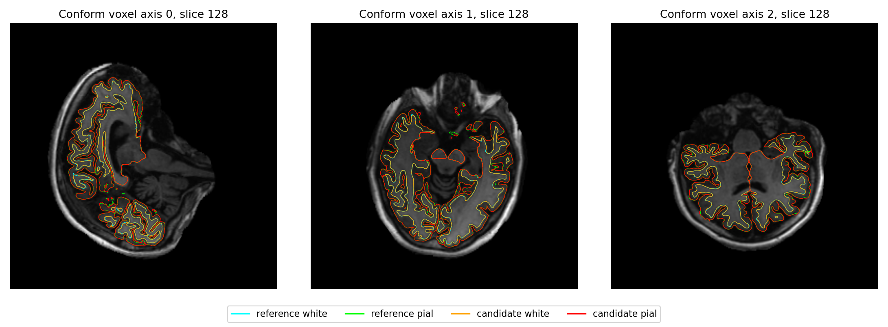
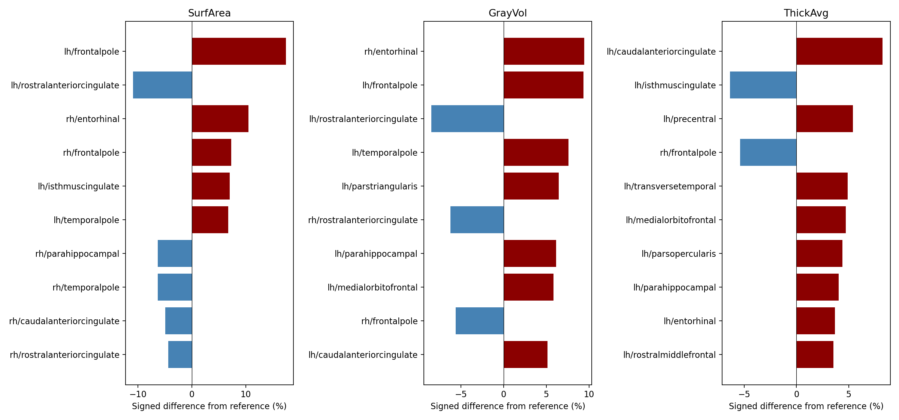
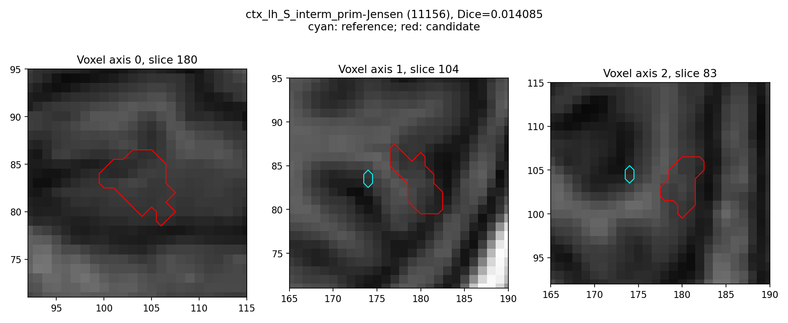
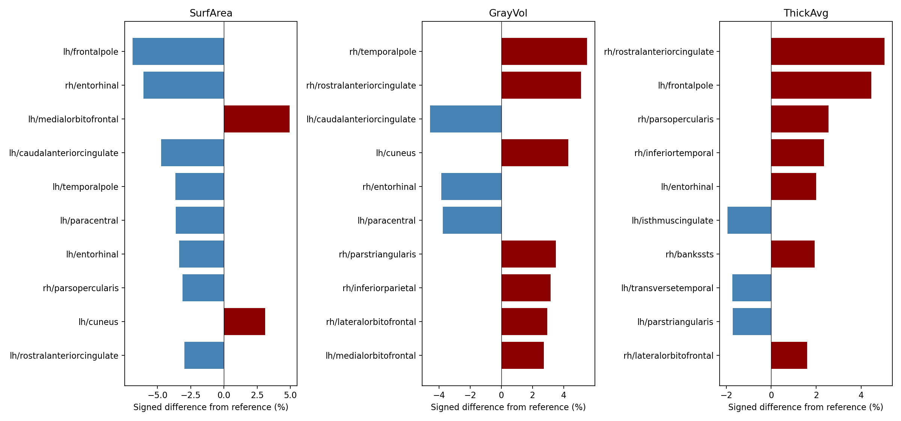
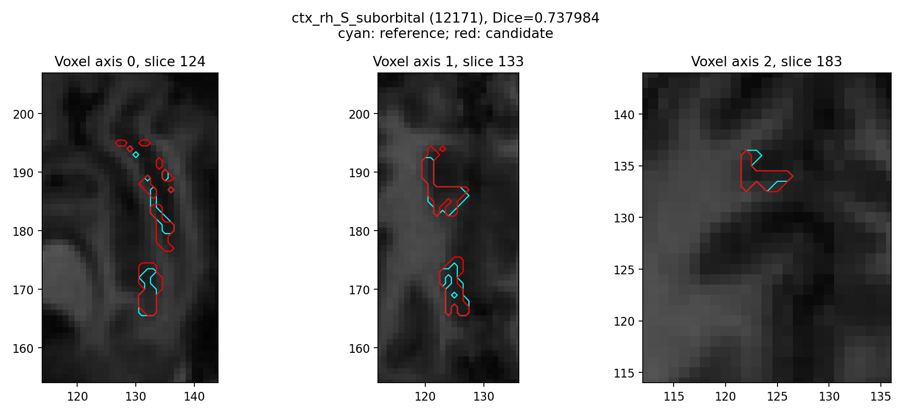

# 五阶段优化：当前两例整例验证

实际计算源码：`ff372d73f106e850b999fbc95ae0b324cd315cbf`。最终文档提交不改写这一版本记录。
两例均从原始 T1 和空目录运行；sub-01 使用已初始化 CUDA 的 Python API，sub-02 使用 CLI。
H100、gpucw1、目标 GPU UUID 与线程预算 4 固定；单次共享服务器观察，未测稳定吞吐。
[完整机器报告](final_whole_summary.json)、[精简指标](final_metric_summary.json)及原始文件保留 SHA-256。
整体指标等效没有已确认阈值，保持 `not_assessed`；严格138比较继续用于排错。

## 实际修改与误差原因

1. 复用自有GPU Synth网络，设备选择与精度策略分开；构造后施加策略并记录实际前向。辅助卷积局部FP32消除了TF32造成的少量标签差异及后续表面位移，其他作用域继续TF32。
2. 有序归一化复用已有PyTorch/Triton：65项高斯卷积使用双缓冲，减少禁用缓存时的临时分配；两例冻结输入归一化输出逐位相同，加载、传输、写出都计入阶段回归。
3. 球面保留已有有序CUDA平均，Numba SSE按行并行、双精度串行求和；静态CSR缓存关联与原面积。两例双侧完整几何和轨迹相同，拓扑GA的顺序依赖未强行并行。
4. N4补齐拟合/重建线程与子步骤剖析、修复GPFS构建再配置循环。真实拟合约占98%，重建增加线程没有整阶段收益，默认重建1线程保留。
5. Python pial复用空间桶与编译碰撞谓词，保留候选扩展及顺序更新规则。首例左侧完整同输入1453.060→1232.634秒、几何不变，仍慢于原生组件，生产继续使用Conda C++。
MNI仿射的GPU matmul局部FP32减小几何量化误差；非线性链仍计算两个反对称前向，仅移除没有被消费的逆场计算。最终原生逆场仍有全域局部残差，见后文。
完整修改及各函数参数、坐标、失败行为和具名示例见[串行优化说明](../../../../docs/recon_all/SERIAL_OPTIMIZATION.md)与[复现步骤](REPRODUCE.md)。

## 端到端耗时与显存

| 真实 T1 | 优化前完整命令 s | 当前完整命令 s | 时间减少 | 当前父子同时采样峰值 GB / GiB | 输出 |
| --- | ---: | ---: | ---: | ---: | --- |
| sub01 | 4242.884 | 3453.936 | 18.595% | 10.922 / 10.172 | 138/138 |
| sub02 | 4043.589 | 3712.568 | 8.186% | 10.895 / 10.146 | 138/138 |

完整命令边界包含启动、校验、加载、传输、计算和读写，排除事后比较与画图；函数和内部步骤耗时另列，不能重复相加。首例复用源码相同的既有基线，第二例基线本轮新跑。主机相同不等于共享负载相同。
NVML 显存为同次查询的候选父子进程合计，未把不同时间的峰值相加；关闭分配缓存时 PyTorch allocated/reserved 不可用，不能解释为零显存。

| 病例 | 请求间隔 s | 最大实际间隔 s | 查询失败数 | 连续峰值 |
| --- | ---: | ---: | ---: | --- |
| sub01 | 1 | 3.916 | 0 | 未验证 |
| sub02 | 1 | 6.143 | 0 | 未验证 |

## 严格复现与优化前后退化检查

| 病例 | 对优化前138严格诊断 | 对官方138严格诊断 | 对优化前标签Dice最低值 | 对优化前68区厚度/面积/体积 MAE |
| --- | ---: | ---: | ---: | --- |
| sub01 | 135/138 | 6/138 | 1.000000000 | 0 mm / 0 mm² / 0 mm³ |
| sub02 | 135/138 | 2/138 | 1.000000000 | 0 mm / 0 mm² / 0 mm³ |

sub01 对优化前仍失败的路径：`mri/transforms/synthmorph.1.0mm.1.0mm/test.nii.gz`、`mri/transforms/synthmorph.1.0mm.1.0mm/warp.to.mni152.1.0mm.1.0mm.inv.nii.gz`、`mri/transforms/synthmorph.1.0mm.1.0mm/warp.to.mni152.1.0mm.1.0mm.nii.gz`。

sub02 对优化前仍失败的路径：`mri/transforms/synthmorph.1.0mm.1.0mm/test.nii.gz`、`mri/transforms/synthmorph.1.0mm.1.0mm/warp.to.mni152.1.0mm.1.0mm.inv.nii.gz`、`mri/transforms/synthmorph.1.0mm.1.0mm/warp.to.mni152.1.0mm.1.0mm.nii.gz`。

严格比较保留原门槛；其通过数不能代表算法完成比例。同网格比较要求顶点数及有序面成立；对官方网格不同时只报告双向点到三角面距离。

## 最终指标相对官方

| 病例 | 68区厚度 MAE / 最大 mm | 面积中位 / P90 相对绝对误差 | 灰质体积中位 / P90 相对绝对误差 | 皮层总体积有符号差 |
| --- | ---: | ---: | ---: | ---: |
| sub01 | 0.041838 / 0.185000 | 1.350% / 6.279% | 2.181% / 5.951% | +1.161% |
| sub02 | 0.021691 / 0.121000 | 1.060% / 3.201% | 1.183% / 3.264% | +0.535% |

| 病例 / 分区 | Dice中位数 | 最低Dice | 最差标签 |
| --- | ---: | ---: | --- |
| sub01 / aseg.mgz | 1.000000 | 0.965926 | 3 Left-Cerebral-Cortex, 42 Right-Cerebral-Cortex, 2 Left-Cerebral-White-Matter |
| sub01 / aparc+aseg.mgz | 0.949290 | 0.853896 | 1032 ctx-lh-frontalpole, 2032 ctx-rh-frontalpole, 1026 ctx-lh-rostralanteriorcingulate |
| sub01 / aparc.a2009s+aseg.mgz | 0.911315 | 0.014085 | 11156 ctx_lh_S_interm_prim-Jensen, 12160 ctx_rh_S_occipital_ant, 12163 ctx_rh_S_orbital_lateral |
| sub01 / aparc.DKTatlas+aseg.mgz | 0.952167 | 0.891363 | 2014 ctx-rh-medialorbitofrontal, 1021 ctx-lh-pericalcarine, 2006 ctx-rh-entorhinal |
| sub01 / wmparc.mgz | 0.946758 | 0.853896 | 1032 ctx-lh-frontalpole, 3032 wm-lh-frontalpole, 4032 wm-rh-frontalpole |
| sub01 / ribbon.mgz | 0.976072 | 0.958525 | 3 Left-Cerebral-Cortex, 42 Right-Cerebral-Cortex, 2 Left-Cerebral-White-Matter |
| sub01 / filled.mgz | 0.993947 | 0.993611 | 255 Left-Hemisphere-Fill, 127 Right-Hemisphere-Fill |
| sub02 / aseg.mgz | 1.000000 | 0.980490 | 42 Right-Cerebral-Cortex, 3 Left-Cerebral-Cortex, 41 Right-Cerebral-White-Matter |
| sub02 / aparc+aseg.mgz | 0.964191 | 0.873358 | 2033 ctx-rh-temporalpole, 2006 ctx-rh-entorhinal, 2032 ctx-rh-frontalpole |
| sub02 / aparc.a2009s+aseg.mgz | 0.935199 | 0.737984 | 12171 ctx_rh_S_suborbital, 11140 ctx_lh_Lat_Fis-ant-Vertical, 11139 ctx_lh_Lat_Fis-ant-Horizont |
| sub02 / aparc.DKTatlas+aseg.mgz | 0.970236 | 0.919361 | 2006 ctx-rh-entorhinal, 1026 ctx-lh-rostralanteriorcingulate, 1021 ctx-lh-pericalcarine |
| sub02 / wmparc.mgz | 0.960018 | 0.873358 | 2033 ctx-rh-temporalpole, 3032 wm-lh-frontalpole, 2006 ctx-rh-entorhinal |
| sub02 / ribbon.mgz | 0.987265 | 0.976930 | 42 Right-Cerebral-Cortex, 3 Left-Cerebral-Cortex, 41 Right-Cerebral-White-Matter |
| sub02 / filled.mgz | 0.999887 | 0.999847 | 255 Left-Hemisphere-Fill, 127 Right-Hemisphere-Fill |

最差脑区继续单列，不用均值替代局部偏差：

| 病例 / 指标 | 相对偏差最差脑区 | 当前−官方有符号差 | 相对官方百分比 |
| --- | --- | ---: | ---: |
| sub01/SurfArea | lh/frontalpole | +50 mm² | +17.422% |
| sub01/SurfArea | lh/rostralanteriorcingulate | -68 mm² | -10.880% |
| sub01/SurfArea | rh/entorhinal | +30 mm² | +10.526% |
| sub01/GrayVol | rh/entorhinal | +111 mm³ | +9.439% |
| sub01/GrayVol | lh/frontalpole | +87 mm³ | +9.375% |
| sub01/GrayVol | lh/rostralanteriorcingulate | -154 mm³ | -8.438% |
| sub01/ThickAvg | lh/caudalanteriorcingulate | +0.185 mm | +8.244% |
| sub01/ThickAvg | lh/isthmuscingulate | -0.14 mm | -6.384% |
| sub01/ThickAvg | lh/precentral | +0.124 mm | +5.403% |
| sub01/MeanCurv | lh/rostralanteriorcingulate | +0.017 mm⁻¹ | +14.286% |
| sub01/MeanCurv | lh/frontalpole | +0.025 mm⁻¹ | +12.195% |
| sub01/MeanCurv | lh/temporalpole | +0.01 mm⁻¹ | +7.143% |
| sub02/SurfArea | lh/frontalpole | -19 mm² | -6.884% |
| sub02/SurfArea | rh/entorhinal | -23 mm² | -6.053% |
| sub02/SurfArea | lh/medialorbitofrontal | +89 mm² | +4.928% |
| sub02/GrayVol | rh/temporalpole | +101 mm³ | +5.492% |
| sub02/GrayVol | rh/rostralanteriorcingulate | +66 mm³ | +5.104% |
| sub02/GrayVol | lh/caudalanteriorcingulate | -59 mm³ | -4.574% |
| sub02/ThickAvg | rh/rostralanteriorcingulate | +0.114 mm | +5.033% |
| sub02/ThickAvg | lh/frontalpole | +0.121 mm | +4.447% |
| sub02/ThickAvg | rh/parsopercularis | +0.056 mm | +2.547% |
| sub02/MeanCurv | lh/rostralanteriorcingulate | -0.01 mm⁻¹ | -8.065% |
| sub02/MeanCurv | rh/temporalpole | +0.008 mm⁻¹ | +5.882% |
| sub02/MeanCurv | rh/entorhinal | -0.006 mm⁻¹ | -5.660% |

| 病例 / 半球 / 表面 | 当前→官方均值 / P99 / 最大 mm | 官方→当前均值 / P99 / 最大 mm |
| --- | ---: | ---: |
| sub01/lh/white | 0.079439/0.496176/2.290687 | 0.086156/0.504868/5.513039 |
| sub01/lh/pial | 0.109427/0.643212/2.723711 | 0.106288/0.669908/3.998039 |
| sub01/rh/white | 0.070583/0.410062/2.277738 | 0.071051/0.423405/2.010153 |
| sub01/rh/pial | 0.079974/0.563344/3.422756 | 0.080745/0.541439/3.168682 |
| sub02/lh/white | 0.035094/0.220900/1.473474 | 0.034972/0.219795/1.815254 |
| sub02/lh/pial | 0.059842/0.418747/2.592405 | 0.059717/0.423822/2.365826 |
| sub02/rh/white | 0.041209/0.285011/2.899514 | 0.039418/0.253334/1.185417 |
| sub02/rh/pial | 0.072585/0.477399/2.675207 | 0.070938/0.462943/3.184583 |

## 网格质量与局部异常

| 病例 / 来源 / 半球 | white/pial穿越面配对 | 双面全在cortex内的配对 | sphere / sphere.reg负面积面 |
| --- | ---: | ---: | ---: |
| sub01/quality/lh | 147 | 124 | 0 / 0 |
| sub01/quality/rh | 197 | 171 | 0 / 0 |
| sub01/quality_baseline/lh | 147 | 124 | 0 / 0 |
| sub01/quality_baseline/rh | 197 | 171 | 0 / 0 |
| sub01/quality_official/lh | 175 | 131 | 0 / 0 |
| sub01/quality_official/rh | 496 | 456 | 0 / 0 |
| sub02/quality/lh | 92 | 67 | 0 / 0 |
| sub02/quality/rh | 119 | 75 | 0 / 0 |
| sub02/quality_baseline/lh | 92 | 67 | 0 / 0 |
| sub02/quality_baseline/rh | 119 | 75 | 0 / 0 |
| sub02/quality_official/lh | 142 | 61 | 0 / 0 |
| sub02/quality_official/rh | 197 | 130 | 0 / 0 |

穿越数量为当前固定严格横穿谓词的三角面配对数，并非穿越顶点数或体积。端点接触、重合内侧壁与严格横穿分别记录；各自无自相交不能替代二者互不穿越。
连通性、非流形边、顶点链接、顶点顺序和语义控制见完整质量JSON。本次同时复核优化前和官方；历史阳性不被平均误差掩盖。

## 原始T1连续链：当前对优化前

| 病例 / 体积 | 不同体素数 | 最大 / P99绝对差 | dtype相同 | affine / header |
| --- | ---: | ---: | --- | --- |
| sub01/orig | 0 | 0 / 0 | True | True / True |
| sub01/synthstrip | 0 | 0 / 0 | True | True / True |
| sub01/nu | 0 | 0 / 0 | True | True / True |
| sub01/T1 | 0 | 0 / 0 | True | True / True |
| sub01/brainmask | 0 | 0 / 0 | True | True / True |
| sub01/norm | 0 | 0 / 0 | True | True / True |
| sub01/brain | 0 | 0 / 0 | True | True / True |
| sub01/wm.seg | 0 | 0 / 0 | True | True / True |
| sub01/wm.asegedit | 0 | 0 / 0 | True | True / True |
| sub01/wm | 0 | 0 / 0 | True | True / True |
| sub01/filled | 0 | 0 / 0 | True | True / True |
| sub01/aseg.presurf | 0 | 0 / 0 | True | True / True |
| sub01/entowm | 0 | 0 / 0 | True | True / True |
| sub01/mca-dura | 0 | 0 / 0 | True | True / True |
| sub01/vsinus | 0 | 0 / 0 | True | True / True |
| sub01/brain.finalsurfs | 0 | 0 / 0 | True | True / True |
| sub02/orig | 0 | 0 / 0 | True | True / True |
| sub02/synthstrip | 0 | 0 / 0 | True | True / True |
| sub02/nu | 0 | 0 / 0 | True | True / True |
| sub02/T1 | 0 | 0 / 0 | True | True / True |
| sub02/brainmask | 0 | 0 / 0 | True | True / True |
| sub02/norm | 0 | 0 / 0 | True | True / True |
| sub02/brain | 0 | 0 / 0 | True | True / True |
| sub02/wm.seg | 0 | 0 / 0 | True | True / True |
| sub02/wm.asegedit | 0 | 0 / 0 | True | True / True |
| sub02/wm | 0 | 0 / 0 | True | True / True |
| sub02/filled | 0 | 0 / 0 | True | True / True |
| sub02/aseg.presurf | 0 | 0 / 0 | True | True / True |
| sub02/entowm | 0 | 0 / 0 | True | True / True |
| sub02/mca-dura | 0 | 0 / 0 | True | True / True |
| sub02/vsinus | 0 | 0 / 0 | True | True / True |
| sub02/brain.finalsurfs | 0 | 0 / 0 | True | True / True |

LTA矩阵、orig.nofix→orig.premesh→orig→white.preaparc有序网格、自动强度参数和逐文件SHA见[连续链诊断](whole/integrated_main/volume_mesh_drift_ff372d7.json)。标签 Dice 在上一节另列；标签数值相关性不作为分割一致性。

## 全部阶段耗时与实现来源

| 阶段 | sub01 优化前→当前 s | sub02 优化前→当前 s | 当前实现 |
| --- | ---: | ---: | --- |
| input_talairach | 46.807→20.580 | 21.684→19.230 | FNIT PyTorch/IO；FS模型权重复用 |
| n4 | 122.619→123.111 | 123.370→123.018 | FNIT C++封装＋ITK N4，CPU |
| nu | 1.304→1.396 | 1.449→1.437 | FNIT NumPy；FS wrapper规则移植 |
| T1_normalize | 219.296→45.012 | 52.300→44.730 | FNIT PyTorch/Triton CUDA; NumPy/Numba CPU控制点 |
| brainmask | 1.069→0.993 | 1.136→0.989 | FNIT PyTorch；FS mask规则移植 |
| SynthSeg | 47.973→8.843 | 23.060→8.739 | FNIT PyTorch；官方网络和权重复用 |
| mri_em_register | 220.340→218.186 | 183.615→176.667 | 固定FS源码Conda C++，CPU |
| mri_ca_normalize | 27.566→26.694 | 29.160→27.390 | FNIT NumPy/Numba；FS算法移植，CPU |
| mri_cc | 18.900→17.755 | 11.427→11.144 | FNIT Python/SciPy；FS算法移植，CPU |
| brain_second_normalize | 181.624→56.486 | 74.919→65.700 | FNIT PyTorch/Triton CUDA; NumPy/Numba CPU控制点 |
| entowm | 7.423→1.109 | 8.499→1.286 | FNIT PyTorch CUDA;上游网络权重复用;CPU影像读写/后处理 |
| ants_denoise | 20.779→21.815 | 22.751→22.112 | FNIT NumPy/Numba，CPU；ITK/ANTs算法移植 |
| mri_segment | 47.975→49.061 | 50.325→49.937 | 固定FS源码Conda C++，CPU |
| mri_edit_wm_with_aseg | 25.880→26.506 | 26.378→25.486 | 固定FS源码Conda C++，CPU |
| wm_pretess | 5.092→5.174 | 5.203→5.342 | FNIT NumPy；FS算法移植，CPU |
| wm_fix_ento | 1.602→1.628 | 1.784→1.722 | FNIT Python/NumPy；FS规则移植，CPU |
| wm_fix_acj | 2.629→2.654 | 2.721→2.763 | FNIT Python/NumPy；FS规则移植，CPU |
| mri_fill | 50.436→50.927 | 57.339→57.468 | FNIT Python/SciPy；FS算法移植，CPU |
| filled_auto_checkpoint | 0.004→0.004 | 0.004→0.006 | FNIT标准检查点文件复制 |
| mni_aux | 24.581→4.788 | 25.958→5.464 | FNIT PyTorch CUDA;上游网络权重复用;CPU影像读写/后处理 |
| mni_nonlinear | 282.159→128.052 | 202.839→141.110 | FNIT PyTorch＋固定FS源码Conda warp/逆变换/重采样 |
| brain_finalsurfs | 6.348→6.527 | 6.886→6.976 | FNIT NumPy/PyTorch；FS编辑规则移植，默认CPU |
| surface_lh | 771.333→654.534 | 826.556→696.984 | 混合: FNIT NumPy/Numba remesh和标准球面;标准球面CUDA平均;Conda源码构建拓扑/inflate/whitepre/defects |
| surface_rh | 732.976→668.952 | 771.440→727.497 | 混合: FNIT NumPy/Numba remesh和标准球面;标准球面CUDA平均;Conda源码构建拓扑/inflate/whitepre/defects |
| register_lh | 133.654→133.705 | 144.364→135.827 | FNIT Python/Numba CPU objective and line search; ordered PyTorch/Triton CUDA gradient averaging; Numba CPU atlas blur |
| avg_curv_lh | 0.543→0.591 | 0.890→0.723 | 固定FS源码Conda mrisp_paint，CPU |
| register_rh | 113.826→124.368 | 134.009→127.252 | FNIT Python/Numba CPU objective and line search; ordered PyTorch/Triton CUDA gradient averaging; Numba CPU atlas blur |
| avg_curv_rh | 0.593→0.610 | 0.870→0.705 | 固定FS源码Conda mrisp_paint，CPU |
| annot_lh_aparc | 35.236→28.868 | 31.481→31.238 | FNIT FS-GCSA移植；特征部分GPU，分类/Gibbs主体CPU |
| annot_lh_aparc.a2009s | 40.973→35.114 | 39.467→37.291 | FNIT FS-GCSA移植；特征部分GPU，分类/Gibbs主体CPU |
| annot_lh_aparc.DKTatlas | 41.506→31.092 | 34.292→33.383 | FNIT FS-GCSA移植；特征部分GPU，分类/Gibbs主体CPU |
| annot_rh_aparc | 31.982→27.103 | 29.918→28.737 | FNIT FS-GCSA移植；特征部分GPU，分类/Gibbs主体CPU |
| annot_rh_aparc.a2009s | 44.005→34.762 | 38.758→37.007 | FNIT FS-GCSA移植；特征部分GPU，分类/Gibbs主体CPU |
| annot_rh_aparc.DKTatlas | 41.768→32.487 | 31.860→31.892 | FNIT FS-GCSA移植；特征部分GPU，分类/Gibbs主体CPU |
| finish_surface_lh | 376.245→362.000 | 434.851→436.252 | 混合：FS Conda white/pial；CUDA五指标FNIT PyTorch，CPU五指标FS Conda；mid-area/TH3为FNIT |
| finish_surface_rh | 350.904→346.480 | 431.643→428.017 | 混合：FS Conda white/pial；CUDA五指标FNIT PyTorch，CPU五指标FS Conda；mid-area/TH3为FNIT |
| exvivo_annotations | 2.371→2.172 | 2.956→2.428 | FNIT Python标签映射；FS定义移植，CPU |
| jacobian_lh | 0.037→0.037 | 0.049→0.043 | FNIT PyTorch；FS面积比定义，默认CPU |
| contrast_lh | 1.024→0.937 | 1.211→1.180 | FNIT Python/PyTorch；FS采样定义，默认CPU |
| jacobian_rh | 0.024→0.041 | 0.026→0.028 | FNIT PyTorch；FS面积比定义，默认CPU |
| contrast_rh | 1.031→0.968 | 1.127→1.136 | FNIT Python/PyTorch；FS采样定义，默认CPU |
| ribbon | 3.850→3.926 | 4.186→4.272 | FNIT NumPy/Numba；FS定义移植，CPU |
| relabel_hypointensities | 4.071→4.078 | 4.388→4.310 | FNIT NumPy；FS规则移植，CPU |
| aseg_ribbon_fix | 5.662→5.759 | 6.016→6.030 | FNIT Python；FS规则移植，CPU |
| project_aparc_volumes | 13.917→14.574 | 15.038→15.429 | FNIT Python；FS cortical投射定义移植，CPU |
| project_wmparc | 4.298→4.346 | 4.567→4.704 | FNIT Python；FS WM投射定义移植，CPU |
| brain_volume_stats | 2.488→2.496 | 2.525→2.681 | FNIT NumPy；FS统计定义移植，CPU |
| aseg_stats | 12.803→12.799 | 13.646→14.254 | FNIT NumPy；FS统计定义移植，CPU |
| wmparc_stats | 10.026→10.335 | 11.995→11.609 | FNIT NumPy/Numba；FS统计定义移植，CPU |
| stats_lh_aparc | 3.190→1.658 | 0.600→0.540 | FNIT统计缓存/PyTorch＋FS统计定义移植；CPU/GPU混合 |
| stats_lh_aparc.a2009s | 0.256→0.090 | 0.080→0.062 | FNIT统计缓存/PyTorch＋FS统计定义移植；CPU/GPU混合 |
| stats_lh_aparc.DKTatlas | 0.108→0.052 | 0.036→0.038 | FNIT统计缓存/PyTorch＋FS统计定义移植；CPU/GPU混合 |
| stats_lh_aparc.pial | 4.293→1.436 | 0.441→0.535 | FNIT统计缓存/PyTorch＋FS统计定义移植；CPU/GPU混合 |
| stats_lh_BA_exvivo | 0.050→0.026 | 0.020→0.026 | FNIT统计缓存/PyTorch＋FS统计定义移植；CPU/GPU混合 |
| stats_lh_BA_exvivo.thresh | 0.048→0.022 | 0.018→0.018 | FNIT统计缓存/PyTorch＋FS统计定义移植；CPU/GPU混合 |
| stats_lh_w-g.pct | 0.032→0.024 | 0.028→0.041 | FNIT NumPy；FS SNR定义移植，CPU |
| stats_lh_curv | 1.793→1.774 | 2.326→2.462 | 固定FS源码Conda mris_curvature_stats，CPU |
| stats_rh_aparc | 6.132→2.716 | 0.669→1.352 | FNIT统计缓存/PyTorch＋FS统计定义移植；CPU/GPU混合 |
| stats_rh_aparc.a2009s | 0.295→0.093 | 0.068→0.065 | FNIT统计缓存/PyTorch＋FS统计定义移植；CPU/GPU混合 |
| stats_rh_aparc.DKTatlas | 0.121→0.056 | 0.036→0.037 | FNIT统计缓存/PyTorch＋FS统计定义移植；CPU/GPU混合 |
| stats_rh_aparc.pial | 5.355→2.690 | 0.442→0.504 | FNIT统计缓存/PyTorch＋FS统计定义移植；CPU/GPU混合 |
| stats_rh_BA_exvivo | 0.054→0.029 | 0.024→0.019 | FNIT统计缓存/PyTorch＋FS统计定义移植；CPU/GPU混合 |
| stats_rh_BA_exvivo.thresh | 0.050→0.024 | 0.019→0.018 | FNIT统计缓存/PyTorch＋FS统计定义移植；CPU/GPU混合 |
| stats_rh_w-g.pct | 0.024→0.033 | 0.025→0.028 | FNIT NumPy；FS SNR定义移植，CPU |
| stats_rh_curv | 1.919→1.972 | 2.316→2.102 | 固定FS源码Conda mris_curvature_stats，CPU |
| mesh_validation | 68.438→69.571 | 70.385→73.947 | FNIT Python质量检查，CPU |

父级surface/finish阶段包含下列内部时间，不另外加到总时间。各阶段源文件及内部完整报告见机器JSON。

## 官方归档耗时口径

官方只在独立benchmark目录运行。下表复用已有日志的 e=墙钟秒，不使用 U/S CPU秒代替；程序、日志、时间字段定义及SHA保留在[归档提取](whole/integrated_main/reports/official_runtime_archived_v2.json)。官方参考整例在不同日期、部分双侧并行，不能与本轮候选组成受控速度比，也不能把嵌套/并行时间相加。

| 病例 | 归档官方整例秒（时间戳分辨率1s） |
| --- | ---: |
| sub01 | 6790 |
| sub02 | 4143 |

下列官方时间来自各自自产上游，候选时间来自本轮完整运行。边界相近的命令可并排定位瓶颈；它们不是冻结同输入的算法速度比。

| 病例 / 阶段 | FNIT 当前秒 | 官方归档 e 秒 | FNIT实现 |
| --- | ---: | ---: | --- |
| sub01/T1_normalize | 45.012 | 83.230 | FNIT PyTorch/Triton CUDA; NumPy/Numba CPU控制点 |
| sub01/SynthSeg | 8.843 | 192.320 | FNIT PyTorch；官方网络和权重复用 |
| sub01/mri_em_register | 218.186 | 251.750 | 固定FS源码Conda C++，CPU |
| sub01/brain_second_normalize | 56.486 | 119.740 | FNIT PyTorch/Triton CUDA; NumPy/Numba CPU控制点 |
| sub01/mri_ca_normalize | 26.694 | 65.960 | FNIT NumPy/Numba；FS算法移植，CPU |
| sub01/mri_segment | 49.061 | 64.380 | 固定FS源码Conda C++，CPU |
| sub01/mri_edit_wm_with_aseg | 26.506 | 0.980 / 1.060 / 28.420 / 0.920 / 0.970 | 固定FS源码Conda C++，CPU |
| sub01/mri_fill | 50.927 | 92.910 | FNIT Python/SciPy；FS算法移植，CPU |
| sub01/lh/white.preaparc | 201.133 | 242.650 | 固定FS源码Conda C++ CPU |
| sub01/lh/standard sphere | 143.730 | 未单独记录 | 自有Numba CPU优化器＋有序PyTorch CUDA平均 |
| sub01/lh/sphere registration | 133.704 | 455.120 | 自有Numba CPU优化器＋有序PyTorch CUDA平均 |
| sub01/lh/final white | 188.215 | 225.850 | 固定FS源码Conda C++ CPU |
| sub01/lh/pial | 170.140 | 231.410 | 固定FS源码Conda C++ CPU |
| sub01/lh/thickness | 2.914 | 36.510 | 自有PyTorch CUDA |
| sub01/lh/area | 0.016 | 1.480 | 自有PyTorch CUDA |
| sub01/lh/area.pial | 0.013 | 1.550 | 自有PyTorch CUDA |
| sub01/lh/curv | 0.313 | 2.470 | 自有PyTorch CUDA |
| sub01/lh/curv.pial | 0.318 | 3.620 | 自有PyTorch CUDA |
| sub01/rh/white.preaparc | 194.789 | 250.390 | 固定FS源码Conda C++ CPU |
| sub01/rh/standard sphere | 118.856 | 未单独记录 | 自有Numba CPU优化器＋有序PyTorch CUDA平均 |
| sub01/rh/sphere registration | 124.367 | 377.980 | 自有Numba CPU优化器＋有序PyTorch CUDA平均 |
| sub01/rh/final white | 166.250 | 243.810 | 固定FS源码Conda C++ CPU |
| sub01/rh/pial | 173.374 | 220.810 | 固定FS源码Conda C++ CPU |
| sub01/rh/thickness | 2.731 | 37.270 | 自有PyTorch CUDA |
| sub01/rh/area | 0.151 | 1.320 | 自有PyTorch CUDA |
| sub01/rh/area.pial | 0.016 | 1.160 | 自有PyTorch CUDA |
| sub01/rh/curv | 1.938 | 2.410 | 自有PyTorch CUDA |
| sub01/rh/curv.pial | 1.940 | 2.870 | 自有PyTorch CUDA |
| sub02/T1_normalize | 44.730 | 70.640 | FNIT PyTorch/Triton CUDA; NumPy/Numba CPU控制点 |
| sub02/SynthSeg | 8.739 | 295.580 | FNIT PyTorch；官方网络和权重复用 |
| sub02/mri_em_register | 176.667 | 196.830 | 固定FS源码Conda C++，CPU |
| sub02/brain_second_normalize | 65.700 | 107.480 | FNIT PyTorch/Triton CUDA; NumPy/Numba CPU控制点 |
| sub02/mri_ca_normalize | 27.390 | 54.680 | FNIT NumPy/Numba；FS算法移植，CPU |
| sub02/mri_segment | 49.937 | 63.130 | 固定FS源码Conda C++，CPU |
| sub02/mri_edit_wm_with_aseg | 25.486 | 1.100 / 0.880 / 25.590 / 0.890 / 0.700 | 固定FS源码Conda C++，CPU |
| sub02/mri_fill | 57.468 | 55.820 | FNIT Python/SciPy；FS算法移植，CPU |
| sub02/lh/white.preaparc | 236.410 | 139.360 | 固定FS源码Conda C++ CPU |
| sub02/lh/standard sphere | 121.756 | 未单独记录 | 自有Numba CPU优化器＋有序PyTorch CUDA平均 |
| sub02/lh/sphere registration | 135.827 | 203.080 | 自有Numba CPU优化器＋有序PyTorch CUDA平均 |
| sub02/lh/final white | 230.794 | 115.900 | 固定FS源码Conda C++ CPU |
| sub02/lh/pial | 200.906 | 134.810 | 固定FS源码Conda C++ CPU |
| sub02/lh/thickness | 3.311 | 20.840 | 自有PyTorch CUDA |
| sub02/lh/area | 0.017 | 0.500 | 自有PyTorch CUDA |
| sub02/lh/area.pial | 0.015 | 0.480 | 自有PyTorch CUDA |
| sub02/lh/curv | 0.368 | 1.320 | 自有PyTorch CUDA |
| sub02/lh/curv.pial | 0.768 | 1.320 | 自有PyTorch CUDA |
| sub02/rh/white.preaparc | 261.376 | 138.310 | 固定FS源码Conda C++ CPU |
| sub02/rh/standard sphere | 108.077 | 未单独记录 | 自有Numba CPU优化器＋有序PyTorch CUDA平均 |
| sub02/rh/sphere registration | 127.252 | 196.490 | 自有Numba CPU优化器＋有序PyTorch CUDA平均 |
| sub02/rh/final white | 219.315 | 128.550 | 固定FS源码Conda C++ CPU |
| sub02/rh/pial | 204.801 | 123.980 | 固定FS源码Conda C++ CPU |
| sub02/rh/thickness | 2.552 | 21.500 | 自有PyTorch CUDA |
| sub02/rh/area | 0.022 | 0.520 | 自有PyTorch CUDA |
| sub02/rh/area.pial | 0.019 | 0.480 | 自有PyTorch CUDA |
| sub02/rh/curv | 0.449 | 1.360 | 自有PyTorch CUDA |
| sub02/rh/curv.pial | 0.636 | 1.310 | 自有PyTorch CUDA |

拓扑/remesh等官方双侧并行记录可能存在交错，完整原始命令保留，未把无法确认归属的 e 值强行分配给某半球。官方未单独记录某命令的 e 值时留空说明，不用联合阶段窗口冒充单步计时。

## 当前脑图

### sub01

### sub02

## 安装、限制与下一步

本轮在已有主页 Conda 环境构建 wheel、编译自有 FastPD 扩展、安装到独立目标目录并验证 API 导入和 CLI 帮助；新版 N4 从源码重新构建并回归，其他13个原生组件复用已记录的固定源码构建产物。无新增生产依赖；不是全新 Conda 或物理无预装软件隔离整例。
旧Synth控制误用cuDNN flags默认enabled=False，不能用其超高显存推断生产缓存策略。当前整例低显存策略保留；连续NVML峰值和无预装软件隔离部署未验证。Python完整pial仅首例左侧跑完整同输入三方对照，右侧/第二例覆盖内核回归但未跑完整Python pial。官方全流程重复性本轮未重新测，不能将所有差异归因于随机性。
MNI逆场全域局部大差异与brainmask内部残差分开报告，未宣布变换等效。
下一步优先对原生逆变换的全域残差做固定输入定位；需要受控重复实验才可报告稳定吞吐。

## 同生产cuDNN策略的缓存控制

旧控制只传allow_tf32=False，实际还关闭cuDNN及确定性；51/31个去颅骨差异和超高显存属于该独立控制。修正测试显式enabled=True、benchmark=False、deterministic=True、allow_tf32=False，在整例计时全部结束后测，避免污染整例墙钟。缓存开启/关闭均不改变精度。阶段含额外mask/SDT写入，不能直接代表整例提速；CLI和预初始化API的缓存开启完整整例尚未验证。

| 病例 / 缓存 | Strip / Seg 秒 | 对优化前Strip / Seg不同体素 | 同时采样显存GB | allocated / reserved GB |
| --- | ---: | ---: | ---: | ---: |
| sub01/enabled | 4.611 / 7.559 | 0 / 0 | 17.146 | 13.073 / 16.584 |
| sub01/disabled | 4.761 / 8.973 | 0 / 0 | 13.638 | unavailable / unavailable |
| sub02/enabled | 4.358 / 7.770 | 0 / 0 | 16.752 | 13.073 / 16.190 |
| sub02/disabled | 4.559 / 9.495 | 0 / 0 | 13.638 | unavailable / unavailable |

## MNI逆场残差

前向/逆向位移采用NIfTI displacement-vector和mm单位。下表为向量距离，区别于严格报告中的逐分量最大误差。0.1mm只作诊断分箱，未作为接受阈值。脑内残差小不等于全域变换通过；所有最大值仍保留。

| 病例 | 全域最大 / P99 mm | 基线brainmask内最大 / P99 mm | 全域最大是否脑内 |
| --- | ---: | ---: | --- |
| sub01 | 1.736284 / 0.004247 | 0.000567 / 0.000098 | False |
| sub02 | 1.276046 / 0.029304 | 0.001619 / 0.000313 | False |

## 推送源码与整例源码的对应

整例实测源码保持ff372d7。保留main更新后，ece5e23的Talairach/MNI受影响阶段用两例冻结自产输入回归，六类矩阵/warp/检查图全部逐位相同。db479a0仅追加cuDNN enabled、benchmark、deterministic日志字段，97项相关测试通过；随后d4cba29修复自产LTA的多空格读取，六个真实矩阵差0，最终100项测试通过。
这些补充验证不称为新源码的原始T1整例，完整源码范围见[绑定记录](whole/integrated_main/source_after_main_merge.json)。
首次比较封装暴露共享LTA读者的空格兼容bug，随后已修复并做六文件真实回归；cuDNN-on控制与生产仿射后端不一致。两者原始日志及validity.json均保留，修正后以新目录完成同后端回归。

图示说明：叠加图青/绿为官方white/pial，橙/红为候选white/pial；脑区误差图表示相对官方的有符号百分比，蓝为负、红为正；局部标签图青为官方、红为候选，轴为conform网格体素索引。参考值为零的百分比不定义，完整JSON保留差值。
下一条性能验证命令见[复现说明](REPRODUCE.md#下一条性能验证)。当前缓存开启只完成同输入Synth阶段；需先验证其完整CLI，再验证预初始化API，默认低显存策略继续保留。
