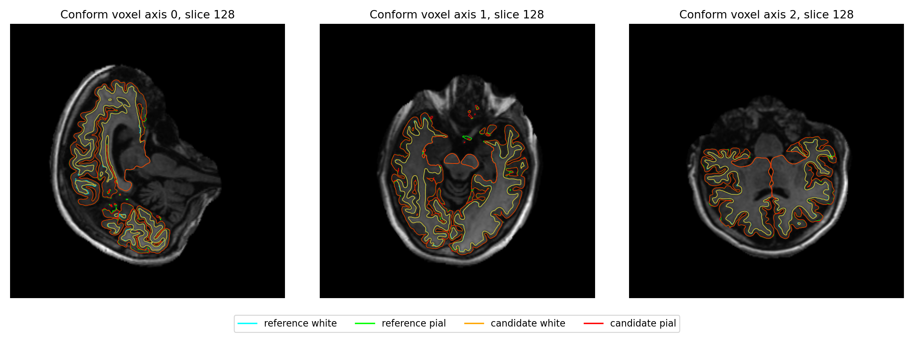
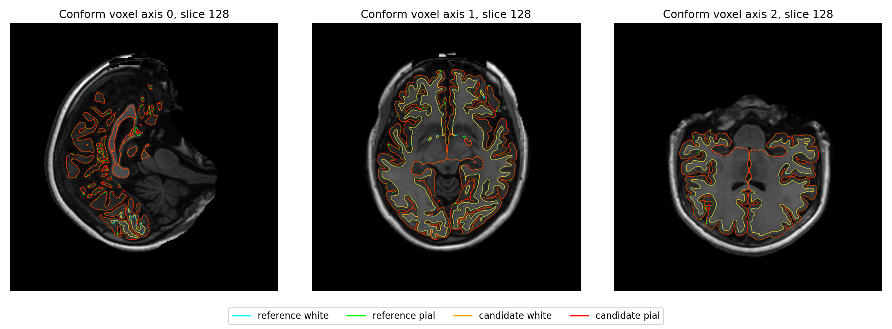

# 61926c7五阶段优化整例与差异定位

本页为历史差异定位；[当前两例整例结果](FINAL_RESULTS.md)另列，不用本页通过数或耗时代替当前版本。

本页测试候选为 `61926c7dceae2f9097fa296e306cf1efa0a09191`，源码归档 SHA-256 为
`6d231caff2f394b5f40eaf4119bcbc1a45e42a7387c90436c6ef8114ba9fc705`。
这些结果属于61926c7，不能作为后续辅助精度修复版本的整例结果。后续3faa938保留GPU并增加经阶段验证的局部卷积FP32例外，其整例验证另列。
两例及完整只读比较已完成。全量机器可读记录见[whole_summary.json](whole_summary.json)，66阶段计时见[sub-01](whole/sub01/timing.csv)与[sub-02](whole/sub02/timing.csv)。

## 整例墙钟与范围

所有新运行从原始T1和空输出目录开始，主机gpucw1，指定同一H100 PCIe的GPU UUID，
Torch intraop、Numba与OpenMP/BLAS预算为4；API调用方既有interop设置保留。
计时采用相同监控命令边界，包含导入、前置校验、模型、传输、计算和读写。
各内部步骤已包含在父阶段，不能重复累加。

| 输入与调用 | 旧版完整命令 | 候选完整命令 | 时间减少 | 输出 |
| --- | ---: | ---: | ---: | --- |
| sub-01，已初始化CUDA的Python API | 4242.884 s | 3557.969 s | 684.915 s，16.143%，1.193倍 | 66阶段完成，138/138存在 |
| sub-02，GPU CLI | 4043.589 s | 3910.801 s | 132.788 s，3.284%，1.034倍 | 66阶段完成，138/138存在 |

sub-01复用此前完成的 `c248520` GPU API基线；其生产src树与本轮起点 `0c8ab32`
完全相同，见[源码身份](baseline_source_identity.json)。这不是本轮新测基线，共享负载
和缓存可能不同。sub-02另测同GPU的旧版CLI，不能用此前CPU运行作为GPU基线。
单次共享主机观察不代表稳定吞吐。首例完整原始记录见[完整汇总](whole_summary.json)、
[旧运行](whole/sub01/baseline_run.json)、[候选运行](whole/sub01/candidate_run.json)。

本页整例提速相对FNIT优化前基线。官方整例参考没有在本轮重新计时，因此没有据旧官方日志发布新的全程速度比；同输入官方/Conda/Python pial计时单列在阶段回归中。
第二例双侧surface共减少107.232秒、辅助链减少20.212秒；T1归一化52.300→50.182秒、第二轮归一化74.919→70.277秒。
第一例对应归一化为219.296→44.854秒、181.624→59.067秒。阶段冻结测试的大幅收益没有替代整例计时；未修改的原生步骤也有负载波动，不能把每一秒收益都归因于新内核。

## 两例当前瓶颈

以下为当前原始T1整例实测，单位秒。括号中的内部耗时包含在外层阶段。

| 部分 | sub-01 LH／单阶段 | sub-01 RH | sub-02 LH／单阶段 | sub-02 RH | 实际实现 |
| --- | ---: | ---: | ---: | ---: | --- |
| N4 | 123.02 | — | 123.70 | — | 自有C++封装、ITK N4，独立Conda构建，CPU |
| GCA注册 | 215.73 | — | 186.03 | — | 固定FreeSurfer源码的Conda C++，CPU |
| MNI非线性 | 196.10 | — | 188.42 | — | 自有PyTorch CUDA网络＋Conda源码构建的warp/数值求逆 |
| 表面生成合计 | 683.58 | 639.51 | 756.03 | 734.73 | 自有Numba/PyTorch与Conda C++混合 |
| 其中remesh | 120.54 | 111.59 | 146.06 | 141.71 | 自有NumPy/Numba，CPU，保持动态拓扑和有序更新 |
| 其中white.preaparc放置 | 204.92 | 187.89 | 249.20 | 223.59 | 固定源码Conda C++，CPU |
| 其中标准球面 | 156.85 | 105.35 | 143.34 | 122.07 | 自有Numba目标函数＋既有PyTorch CUDA平均 |
| 球面配准 | 135.38 | 110.70 | 145.23 | 133.90 | 自有Numba/PyTorch CUDA，未更改已验证算法 |
| 最终表面合计 | 394.27 | 356.26 | 439.16 | 433.12 | Conda white/pial＋自有PyTorch GPU指标 |
| 其中最终white | 198.59 | 170.69 | 203.64 | 231.48 | 固定源码Conda C++，CPU |
| 其中pial | 191.94 | 182.16 | 229.24 | 197.84 | 固定源码Conda C++，CPU |

厚度、面积和曲率继续使用已有GPU实现：LH/RH厚度2.893/2.566 s，单张面积
0.011–0.025 s，单张曲率0.311–0.415 s。本轮没有重复实现它们。

## 阶段回归与数值状态

五阶段的冻结同输入回归见[串行说明](../../../../docs/recon_all/SERIAL_OPTIMIZATION.md)。
这些结果不能代替整例比较：

- 辅助模型旧GPU与新GPU输出相同；CPU迁往GPU的少量标签差异单列。
- 两例T1与第二轮brain归一化保存文件SHA相同；传播和平滑的有序规则不变。
- 两例双侧标准球面的有序坐标、面及完整优化轨迹相同。
- N4浮点和量化输出相同；拟合约120 s，重建约1 s。四线程重建没有实质提速，保留默认1线程。
- 完整Python pial仅sub-01 LH配对：1453.060→1232.634 s，减少15.170%，完整文件及41步/清理轨迹相同。
  同输入Python与官方坐标一致；当前Conda程序相对官方P99为0.2253 mm、最大1.4822 mm，原因尚未定位。
  Python仍慢于Conda的176.787 s，生产保留Conda默认，不将这次Python提速计入整例收益。

| 验收项 | 当前状态 |
| --- | --- |
| 执行完成与138项完整性 | 两例66阶段完成，各138/138存在 |
| 相对优化前严格138诊断 | sub-01为23/138；sub-02为84/138，未调整容差 |
| 优化是否引入退化 | 已量化新增变化，尚未完成接受判定；第一例RH穿越增加63对 |
| 与官方严格复现 | sub-01为4/138；sub-02为2/138，尚未通过 |
| 整体指标等效 | not_assessed，尚无正式确认的整例门槛 |
| 连通性、非流形、球面翻折、white/pial穿越 | 三组均完成；连通/非流形/球面检查通过，穿越仍存在，见下表 |

官方参考只用于独立比较，不进入生产输入。顶点对应不成立时使用双向点到三角面
距离，不将最近顶点距离称为逐顶点一致。脑区Dice、厚度/面积/体积及局部异常将
已随当前版本比较图一并保存，不根据结果调整门槛。

## 当前整例数值与局部变化

这些是本轮61926c7的实测，原始参考只在只读比较阶段使用。严格138是仓库现有容差的逐文件诊断，不等于文件字节SHA全部相同；gzip元信息及表面来源路径也可能改变文件SHA。
整体等效没有已确认门槛，保持not_assessed；不得据这些结果调整阈值。

### 前段与首次差异

[自产链诊断](whole/volume_mesh_drift.json)补查138之外的WM中间文件。两例orig、nu、T1、brainmask、norm、brain、wm.seg与filled均零体素变化，dtype/几何相同。
sub-01 EntoWM改变1体素，wm.asegedit/wm各1体素相差5；vsinus改变4体素，brain.finalsurfs改变5体素。
sub-02 EntoWM和WM一致，vsinus与brain.finalsurfs各改变4体素。标签差异不是用标签值Pearson描述。
两例orig.nofix、orig.premesh、orig有序面和坐标相同，首次网格差异不在拓扑/remesh。
第一例white.preaparc的目标white_std从9.937037变为9.936990；右侧首个几何差异最大2.474 mm。
第二例white.preaparc、sphere、sphere.reg双侧相同，差异主要出现在最终white/pial。
四组同输入白质诊断及GPU精度对照另列，不把输入变化归因于C++随机性。

#### 实际交叉诊断

同gpucw1、同程序哈希、4线程，对第一例RH交叉MRI/WM组与自动目标强度统计；检查点复制不在阶段计时中，进程/写出计入。

| MRI/WM组 | 统计组 | 与旧表面最大距离 mm | 与新表面最大距离 mm | 阶段秒 |
| --- | --- | ---: | ---: | ---: |
| 旧 | 旧 | 0 | 2.473626 | 201.987 |
| 新 | 新 | 2.473626 | 0 | 186.493 |
| 旧 | 新 | 0 | 2.473626 | 205.182 |
| 新 | 旧 | 2.473626 | 0 | 185.709 |

旧、新输入各自重复运行逐坐标重现。此次交换white_std等参数的尾差没有改变表面，变化由MRI/WM输入组决定；尚未分离brain.finalsurfs与WM各自的贡献。
[完整命令、输入/程序哈希与距离](whole/diagnostics/white_preaparc_drift/report.json)。

首次GPU精度对照无效：脚本要求关闭cuDNN/matmul TF32，但实际EntoWM/MCA-dura/vsinus前向仍记录cuDNN TF32=True。
原因是`segment_sclimbic_image`内部固定`allow_tf32=True`，覆盖调用方设置。该记录不能用于判断FP32是否消除CPU/GPU差异。
原始报告保留为排错证据；后续修复改为继承调用方cuDNN TF32设置，生产默认TF32保持不变。
修复后的阶段回归与整例须绑定新的源码版本，不能将61926c7整例作为修复后结果。
[失效对照原始报告及实际前向设置](whole/diagnostics/aux_fp32/summary.json)。

### 68脑区指标

下表的MAE为各脑区绝对误差均值；相对误差取各区绝对百分比，中位数和P90都保留。厚度mm、面积mm²、体积mm³、曲率mm⁻¹。逐区值及最差区域完整保存在paired/region_vs_*.json。

| 对照 | 例 | 厚度MAE / 最大误差 mm | 面积相对中位数 / P90 % | 体积相对中位数 / P90 % | 曲率MAE mm⁻¹ |
| --- | --- | ---: | ---: | ---: | ---: |
| 优化前 | sub01 | 0.011029 / 0.140 | 0.889 / 2.587 | 0.697 / 2.605 | 0.001279 |
| 优化前 | sub02 | 0.001632 / 0.010 | 0.000 / 0.000 | 0.009 / 0.202 | 0.000000 |
| 官方 | sub01 | 0.040074 / 0.180 | 1.109 / 3.832 | 2.181 / 5.818 | 0.002985 |
| 官方 | sub02 | 0.021853 / 0.121 | 1.060 / 3.201 | 1.116 / 2.946 | 0.001735 |

### 分区Dice

以下为非零标签逐区Dice中位数 / 最低值；标签体积与交集也随报告保存。其他aseg、DKT、wmparc、ribbon和filled组见完整JSON。

| 对照 | 例 | aparc+aseg | a2009s+aseg |
| --- | --- | ---: | ---: |
| 优化前 | sub01 | 0.983657 / 0.929593 | 0.954383 / 0.709596 |
| 优化前 | sub02 | 1.000000 / 0.986028 | 1.000000 / 0.968594 |
| 官方 | sub01 | 0.949218 / 0.867441 | 0.911634 / 0.000000 |
| 官方 | sub02 | 0.964322 / 0.872067 | 0.936174 / 0.737984 |

第一例相对优化前最差a2009s区域为ctx_rh_S_suborbital，350→442体素、交集281、Dice0.709596；这不是只有浮点格式变化。
相对官方最低Dice0对应ctx_lh_S_interm_prim-Jensen，官方4体素、候选113体素且交集0；仍完整报告，不删除小区域。

### 表面距离与质量

优化前后有序面/顶点对应成立，报告同索引距离；官方与FNIT网格不同，使用双向点到三角面距离。距离单位mm。

| 例/半球 | 对优化前white：均值/P99/最大 | 对优化前pial：均值/P99/最大 |
| --- | ---: | ---: |
| sub01/lh | 0.000355 / 0.007628 / 0.441280 | 0.021440 / 0.308815 / 2.284583 |
| sub01/rh | 0.038615 / 0.341464 / 2.289098 | 0.130535 / 0.826082 / 4.287749 |
| sub02/lh | 0.000000 / 0.000000 / 0.000000 | 0.001331 / 0.041933 / 0.885150 |
| sub02/rh | 0.000023 / 0.000007 / 0.093053 | 0.040539 / 0.298206 / 1.982997 |

第一例RH pial相对基线有43,681顶点位移>0.1 mm，最大4.288 mm。不能凭脑区均值接近就称无退化。

| 例/半球 | 对官方white：候选→参考均值/P99/最大；参考→候选均值/P99/最大 | 对官方pial：同样两方向 |
| --- | --- | --- |
| sub01/lh | 0.0794/0.4962/2.2907；0.0862/0.5049/5.5130 | 0.1089/0.6378/2.6935；0.1058/0.6676/3.8726 |
| sub01/rh | 0.0695/0.4104/2.3683；0.0717/0.4427/1.9615 | 0.0795/0.5435/5.0377；0.0814/0.5623/3.1511 |
| sub02/lh | 0.0351/0.2209/1.4735；0.0350/0.2198/1.8153 | 0.0599/0.4195/2.5924；0.0597/0.4228/2.3658 |
| sub02/rh | 0.0412/0.2850/2.8995；0.0394/0.2533/1.1854 | 0.0722/0.4739/2.7532；0.0704/0.4582/3.1746 |

所有三组质量检查均完整执行：每侧一个连通分量、Euler=2、无非流形边/顶点、无球面/sphere.reg翻折；生产检查white/pial各自无自交。
跨white/pial的真穿越独立统计，不将端点接触或重合内侧壁计入真穿越；180秒/侧预算此次均完成。

| 例 | 基线LH/RH真穿越对 | 候选LH/RH | 官方LH/RH |
| --- | ---: | ---: | ---: |
| sub01 | 147 / 197 | 116 / 260 | 175 / 496 |
| sub02 | 92 / 119 | 92 / 54 | 142 / 197 |

官方也有穿越不代表候选通过“无穿越”。第一例RH增加63对；整体优化尚不能宣布无不可接受退化或指标等效。

### 当前版本脑图

中央T1切片叠加：青/绿为官方white/pial，橙/红为候选white/pial；全部转换到候选conform体素网格。




[第一例脑区误差图](whole/sub01/figures/region_errors.png)、[异常分区边界](whole/sub01/figures/local_region_boundary.png)；
[第二例脑区误差图](whole/sub02/figures/region_errors.png)、[异常分区边界](whole/sub02/figures/local_region_boundary.png)。
每图的输入/脚本/代码哈希见对应figures/provenance.json。

## 显存、安装与失败尝试

sub-01候选父子进程同次查询合计最大采样值为 **16,185,819,136字节**，即16.186 GB、
15.074 GiB；旧基线为14,508,097,536字节。新运行请求1 s，3037个样本，最大间隔
3.557 s，失败查询0。低于20,000,000,000字节的是观察最大值，连续峰值未验证。
[原始采样](whole/sub01/candidate_gpu_samples.csv)、[监控摘要](whole/sub01/candidate_monitor.json)。
sub-02候选同次合计最大采样同为16,185,819,136字节，3128个样本、最大间隔4.658秒、失败查询0；基线14,508,097,536字节。
API包装器侧车确认在CUDA初始化前设置disabled，并保留4字节张量；
重建函数不追溯调用方初始化过程，入口状态记录为preserved_preinitialized_unknown。
这两个记录范围分别保留。PyTorch allocated/reserved不可用时不填零；
CLI实际在初始化前设置disabled；不据此声称该策略速度最优。

TF32默认保留。实际SynthSeg前向在cuda:0、float32、cuDNN TF32关闭、autocast关闭；
其他已验证FP32例外保持。所有实际Synth及辅助网络调用使用FNIT GPU实现，未用半精度。

新N4在现有主页Conda依赖内从源码构建，生产使用14项独立程序束；
[程序清单](native_bundle_manifest.json)和[当前资源指纹](runtime_fingerprints_61926c7.json)
保留大小、SHA及主机版本。无新增生产依赖。全新环境安装和没有预装脑影像软件的
隔离整例未在本轮验证，不能凭PATH或ldd宣布通过。

sub-01 API与sub-02 CLI各有一次Talairach子进程CUDA模型分配失败，分别在28.709秒
和37.254秒监控命令墙钟后退出；不计入成功整例或提速。两次采样没有显示目标GPU
耗尽，但没有排除未采到的瞬时峰值。失败后GPU仍有约80GB空闲，主机内存大部分为
可回收文件缓存；没有证据把OOM确定归因于GPU容量、主机内存或某个初始化操作。

sub-01同配置新空目录已完整成功；sub-02保持61926c7、设备、精度与allocator配置，
在新空目录retry2完整完成。两例原输入链另做六次监控重放（原入口3次、子进程提前CUDA
初始化3次），均成功，orig/SynthStrip数组、dtype、几何和LTA矩阵均零差异。
对照没有复现失败，因此没有将提前初始化作为已证实修复接入生产。
失败证据见[sub-01](whole_failed_attempt1/)与[sub-02](whole_failed_sub02_attempt1/)，
[六次诊断](cuda_bootstrap_diag/summary.json)。执行稳定性尚未通过；未改用CPU、
半精度或更换GPU，也没有自动隐藏失败重试。

## 复现

配置中的input为原始T1，output和diagnostic_root必须改为新目录。完整入口、空间、
返回值及失败行为见[recon-all说明](../../../../docs/recon_all/README.md)。

```bash
python validation/recon_all/python_gpu_port/run_full_hotspots_launcher.py \
  --config /bench/whole_sub01_candidate_retry1.json  # GPU API、代码归档、原始T1、资源和4线程
python validation/recon_all/python_gpu_port/run_full_hotspots_launcher.py \
  --config /bench/whole_sub02_baseline_retry1.json  # 同GPU旧版CLI基线，新的空输出目录
python validation/recon_all/python_gpu_port/run_full_hotspots_launcher.py \
  --config /bench/whole_sub02_candidate_retry2.json  # 同GPU候选CLI，新的空输出目录
python validation/recon_all/python_gpu_port/collect_hotspot_whole_comparison.py \
  --config /bench/whole_comparison_retry2_config.json  # 仅在整例完成后只读比较
# 两例完整原始报告和比较结果收回后汇总；输出路径必须不存在。
python validation/recon_all/optimizations/20261001_serial/summarize_whole.py \
  --reports validation/recon_all/optimizations/20261001_serial \
  --output /bench/serial_whole_summary.json  # 绑定输入、程序、代码及所有报告SHA
```

脚本为benchmark控制，没有独立官方等价CLI。对应单T1官方流程为
`recon-all -i T1w.nii.gz -s subject -all -openmp 4`，仅在参考路径使用官方程序。
各算法原源码和文献见[串行说明](../../../../docs/recon_all/SERIAL_OPTIMIZATION.md)。

| 版本 | 本轮记录 |
| --- | --- |
| 8302bdc | 全部辅助网络GPU及生命周期，阶段回归 |
| 198c309 | 有序归一化CUDA内核与两例相同文件回归 |
| 74ae022 | 标准球面CSR/SSE及复用GPU平均，四半球完整回归 |
| 3b5b104 | N4内部计时、线程能力及两例浮点/量化回归 |
| 61926c7 | pial完整候选批查询及编译碰撞；当前整例生产快照 |
