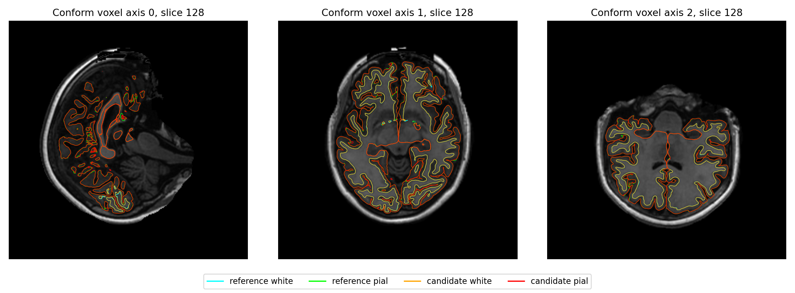

# 五任务优化：两例原始 T1 整例结果

实际运行源码为 `8d750e25d4d067a43edb788a96b2086a1c031ba0`，配对基线为 `6f67cc06ee8c5108ef3640cbfc289f3e5a742f65`。后续报告与文档提交保留这两个计算版本。两例都从原始公开去面部 T1 和新空目录连续运行：sub01 使用已初始化 CUDA 的 Python API，sub02 使用 CLI。

[机器可读耗时、显存与源码绑定](whole/performance/report.json)与两份完整阶段 CSV 保存全部步骤；严格复现、优化后的变化和整体指标等效分别报告。整体等效没有已确认的门槛，保持 `not_assessed`。

## 完整命令墙钟与显存

| 真实 T1 / 调用 | 基线 s | 候选 s | 时间减少 | 加速倍数 | 候选同期显存采样峰值 GB / GiB | 输出 |
| --- | ---: | ---: | ---: | ---: | ---: | --- |
| sub01 / 已初始化 CUDA API | 3440.429 | 2248.712 | 34.639% | 1.5300× | 8.749 / 8.148 | 138/138 |
| sub02 / CLI | 3668.963 | 2322.500 | 36.699% | 1.5797× | 10.897 / 10.148 | 138/138 |

两例成功整例耗时合计 7109.392→4571.212 秒，减少 35.702%；这是配对单次观察，不是重复测量的稳定吞吐。完整墙钟来自同一监控器，包含校验、导入、模型加载、传输、计算、私有复制/发布及读写，排除排队、失败尝试、诊断和事后比较。pipeline、入口与监控器时间分别保存，不互相替代。

gpucw1、Xeon Gold 6430、同一 H100 80 GiB（UUID `GPU-e25cac06-0ce8-a833-abf9-09ab18c9c9ba`）、相同原始 T1/11项模型及标签资源/102项资产及运算线程预算4；候选显式 `hemisphere_workers=2`，各worker2线程、interop1。库的默认半球worker仍为1。sub01 API父进程保留调用者interop64，intraop和Numba mask为4；不宣称操作系统总线程数量只有4。两版本资源环境绑定检查通过。

CUDA默认TF32、没有FP16/BF16或autocast；SynthStrip/SynthSeg/辅助卷积、Talairach与MNI affine矩阵乘法、MNI deform矩阵乘法与cuDNN保留已验证的FP32例外。实际前向配置在原始报告中。MNI外层调用记录不能冒充两个内部前向的逐层hook；任务5另有同输入hook证据。

## 分阶段耗时与实现归属

以下为相同范围的父阶段墙钟。双侧组包含私有复制与确定性发布，表面组另包含共享defects的串行累计，最终放置组另包含串行GPU指标。worker、内部原生命令和父组存在嵌套，不能重复求和。全部步骤见[sub01 CSV](whole/performance/sub01_stage_timing.csv)和[sub02 CSV](whole/performance/sub02_stage_timing.csv)。

| 阶段 | sub01 基线→候选 s | sub02 基线→候选 s | 实际实现 |
| --- | ---: | ---: | --- |
| 双侧表面生成与defects | 1317.514→674.643 | 1406.142→702.986 | FNIT NumPy/Numba CPU remesh/sphere；PyTorch/Triton GPU有序平均及特征；固定FS源码Conda C++ CPU拓扑/white.preaparc/inflate/相交/defects |
| 双侧sphere.reg与avg_curv | 238.834→225.557 | 280.104→236.279 | FNIT Python/Numba CPU目标函数和线搜索；PyTorch/Triton GPU有序梯度平均；固定FS源码Conda C++ CPU avg_curv绘制 |
| 双侧三套图谱标注 | 177.568→114.219 | 203.534→128.676 | FNIT FS-GCSA移植，PyTorch GPU特征与CPU分类/Gibbs；三图谱仅在各半球内部顺序执行 |
| 双侧最终white/pial与指标 | 744.955→354.311 | 827.604→398.713 | 固定FS源码Conda C++ CPU最终white/pial；FNIT GPU厚度距离/法线与CPU cKDTree/Numba可达性，PyTorch GPU面积/曲率/中层面积/TH3顶点体积 |
| N4 | 123.418→122.861 | 123.719→124.184 | FNIT C++封装＋ITK N4，CPU |
| GCA完整注册 | 215.220→201.441 | 182.679→152.884 | 固定FS源码Conda C++完整优化器，CPU；候选FNIT缓存评分 |
| MNI非线性完整链 | 126.497→46.024 | 129.062→58.258 | FNIT SynthMorph PyTorch GPU；基线Conda后处理，候选PyTorch/Triton GPU后处理 |
| EntoWM后编辑 | 1.645→1.190 | 1.859→1.421 | 基线FNIT NumPy CPU，候选已有FNIT PyTorch GPU |
| ACJ后编辑 | 2.647→1.359 | 2.893→2.039 | 基线FNIT NumPy CPU，候选已有FNIT PyTorch GPU |

余下超过100秒的父阶段是双侧表面、最终放置、球面配准、GCA、N4和双侧标注。组时间不能归到某一个算法；内部worker与原生计时另存原始报告。GCA保留完整Conda C++优化器，缓存重复评分；white省去未消费的面哈希表，pial保留原程序。完整Python pial仍较慢，实验GPU评分或white首轮诊断未冒充完整默认实现。N4拟合是既有ITK热点，本轮没有改变算法。

五任务的阶段回归分别见[半球并行](task_01/RESULTS.md)、[white/pial](task_02/INTEGRATION.md)、[GCA/WM/N4](task_03/RESULTS.md)、[网格与球面](task_04/README.md)、[MNI GPU后处理](task_05/README.md)。这里优先复用已有PyTorch WM后编辑、Synth网络、完整warp求逆和指标，以及已有Numba有序几何。没有将Gauss–Seidel改成同时更新或省略必要步骤。

## 生产基本网格检查

| 真实 T1 / 半球 | 顶点 / 面数 | Euler | white / pial 自相交面 |
| --- | ---: | ---: | ---: |
| sub01 / lh | 105598 / 211192 | 2 | 0 / 0 |
| sub01 / rh | 104619 / 209234 | 2 | 0 / 0 |
| sub02 / lh | 119363 / 238722 | 2 | 0 / 0 |
| sub02 / rh | 118303 / 236602 | 2 | 0 / 0 |

上述是绑定整例的生产网格检查，不能替代white/pial相互穿越、sphere/reg局部翻折及官方表面的扩展质量检查。

## 严格复现与优化引入的变化

两例三方完整比较均已结束；[原始结果](whole_comparison/results_retry_v5/progress.json)和[73份文件的双端SHA收据](whole_comparison/collected_comparison_v2.json)绑定运行源码8d750e2、比较器源码SHA和输入。138项原有门槛、全部失败项及局部零容差诊断均保留。

| 真实T1 | 候选相对基线 | 候选相对官方 | 基线相对官方 | 原138项严格失败新增 |
| --- | ---: | ---: | ---: | ---: |
| sub01 | 135/138 | 6/138 | 6/138 | 0 |
| sub02 | 135/138 | 2/138 | 2/138 | 0 |

两例相对基线：最终双侧white/pial坐标和有序面相同，同索引及两个方向的三角面距离为0；7份标签分割体积全部体素值相同、所有标签Dice=1；12份annotation相同；68区厚度/面积/GrayVol/曲率、aseg/wmparc统计，以及三套同公式no-TH3脑区体积差为0。相对官方的分区Dice、脑区绝对误差及质量计数亦没有变化。[sub01差量](whole_comparison/results_retry_v5/sub01/changes.json)、[sub02差量](whole_comparison/results_retry_v5/sub02/changes.json)保存每个脑区和标签。

两例各3项相对基线的严格失败均为MNI输出NIfTI头字节不同：`test.nii.gz` 未使用的 `pixdim[4]`、生产者 `descrip` 和四元数负零，以及两份warp的 `descrip` / 四元数负零。三者体素、dtype、affine、qform/sform矩阵、intent和空间单位均相同；三维scalar图的 `pixdim[4]` 不对应时间轴。FNIT保留自己的生产者描述，不通过写入FreeSurfer字样制造严格文件通过。[sub01头字段](whole_comparison/comparison_launch_v5/whole_sub01_mni_header_difference_v5.json)与[sub02头字段](whole_comparison/comparison_launch_v5/whole_sub02_mni_header_difference_v5.json)独立记录实际字节差异。

顶点图并非全部逐位相同，下面是相对基线的最大绝对差；全部通过原有算子门槛。脑区统计写出值相同不意味着所有未量化的顶点量相同。

| 顶点量 | sub01最大绝对差 | sub02最大绝对差 |
| --- | ---: | ---: |
| 面积 mm²（white/pial/mid最大） | 9.537×10⁻⁷ | 4.768×10⁻⁷ |
| TH3顶点体积 mm³ | 1.907×10⁻⁶ | 1.907×10⁻⁶ |
| pial曲率LH / RH mm⁻¹ | 1.679×10⁻⁴ / 1.020×10⁻⁴ | 2.638×10⁻⁵ / 1.255×10⁻⁴ |
| white.preaparc.K mm⁻²（双侧最大） | 3.052×10⁻⁵ | 9.613×10⁻⁴ |

厚度顶点图相同。其余H/K/curv图的最大、P99、差异顶点数及截断标记见两例 `local_candidate_vs_baseline.json`；额外零容差的“failed”只表示存在精确差异，不能混作原算子门槛失败。“优化是否引入退化”报告实测差量；统一的整体退化门槛尚未预先确认，正式状态为 `not_assessed`。这些观察不替代整体指标等效验收。

## 相对官方的最终指标与局部异常

下面均为当前两例完整比较，相对官方的差异已存在于基线。每个aparc统计均匹配68区；绝对相对差不对零参考值硬除，完整零值清单保存于原始报告。

| 真实T1 / aparc统计 | MAE | 绝对相对差中位数 / P90 | 最大绝对差 |
| --- | ---: | ---: | ---: |
| sub01 / 厚度 mm | 0.041838 | 1.209% / 4.147% | 0.185000 |
| sub01 / 面积 mm² | 28.735294 | 1.350% / 6.279% | 106.000000 |
| sub01 / GrayVol mm³ | 112.470588 | 2.181% / 5.951% | 596.000000 |
| sub01 / 平均曲率 mm⁻¹ | 0.002765 | 1.434% / 3.911% | 0.025000 |
| sub02 / 厚度 mm | 0.021691 | 0.637% / 1.792% | 0.121000 |
| sub02 / 面积 mm² | 25.691176 | 1.060% / 3.201% | 106.000000 |
| sub02 / GrayVol mm³ | 75.750000 | 1.183% / 3.264% | 518.000000 |
| sub02 / 平均曲率 mm⁻¹ | 0.001735 | 0.897% / 3.191% | 0.010000 |

| 真实T1 / 体积统计 | MAE mm³ | 绝对相对差中位数 / P90 | 最大绝对差 mm³ |
| --- | ---: | ---: | ---: |
| sub01 / aseg | 16.3844 | 0.143% / 0.664% | 566.5000 |
| sub01 / wmparc | 87.1286 | 1.829% / 6.027% | 355.3000 |
| sub02 / aseg | 10.9978 | 0.035% / 0.153% | 363.7000 |
| sub02 / wmparc | 80.4814 | 1.397% / 4.154% | 310.8000 |

官方8份皮层stats明确 `-no-th3`；FNIT基线/候选头未写命令，绑定的生产源码明确使用no-TH3。不能把上述GrayVol差异归因于TH3/no-TH3定义不同。对三方自产white/pial/thickness/annotation再使用同一FNIT no-TH3公式，保留各自输入SHA和逐脑区结果。TH3顶点体积单独报告，未替代no-TH3脑区体积。

| 真实T1 / 同公式no-TH3体积 | 匹配脑区 | MAE mm³ | 最大绝对差 mm³ |
| --- | ---: | ---: | ---: |
| sub01 / aparc | 68 | 112.4487 | 595.7223 |
| sub01 / aparc.DKTatlas | 62 | 122.6568 | 573.2514 |
| sub01 / aparc.a2009s | 148 | 85.1812 | 408.7101 |
| sub02 / aparc | 68 | 75.7091 | 517.5769 |
| sub02 / aparc.DKTatlas | 62 | 69.5964 | 397.9879 |
| sub02 / aparc.a2009s | 148 | 84.2116 | 425.1394 |

| 真实T1 / 标签分割 | 不同体素 | 标签Dice最小 / P05 / 中位数 |
| --- | ---: | --- |
| sub01 / aseg.mgz | 22100 | 0.96593 / 0.98197 / 1.00000 |
| sub01 / aparc+aseg.mgz | 30699 | 0.85390 / 0.90283 / 0.94929 |
| sub01 / aparc.a2009s+aseg.mgz | 43571 | 0.01408 / 0.78599 / 0.91131 |
| sub01 / aparc.DKTatlas+aseg.mgz | 29349 | 0.89136 / 0.91415 / 0.95217 |
| sub01 / wmparc.mgz | 42270 | 0.85390 / 0.89036 / 0.94676 |
| sub01 / ribbon.mgz | 27440 | 0.95853 / 0.95957 / 0.97607 |
| sub01 / filled.mgz | 4844 | 0.99361 / 0.99364 / 0.99395 |
| sub02 / aseg.mgz | 14456 | 0.98049 / 0.99192 / 1.00000 |
| sub02 / aparc+aseg.mgz | 23289 | 0.87336 / 0.92145 / 0.96419 |
| sub02 / aparc.a2009s+aseg.mgz | 35065 | 0.73798 / 0.83391 / 0.93520 |
| sub02 / aparc.DKTatlas+aseg.mgz | 21366 | 0.91936 / 0.93489 / 0.97024 |
| sub02 / wmparc.mgz | 35295 | 0.87336 / 0.90978 / 0.96002 |
| sub02 / ribbon.mgz | 17836 | 0.97693 / 0.97747 / 0.98726 |
| sub02 / filled.mgz | 112 | 0.99985 / 0.99985 / 0.99989 |

分割读取保留存储dtype：aseg、aparc及wmparc官方为int32、FNIT为float32整数标签；ribbon/filled均uint8。这是基线已有的存储型差异，标签语义和逐标签Dice单独检查，不能以标签值Pearson r代替一致性。

sub01最低Dice为 `11156 ctx_lh_S_interm_prim-Jensen`：官方4体素、FNIT138体素、交集1，Dice0.0140845；对应同公式no-TH3体积3.3242→141.7532 mm³。RH `S_occipital_ant` 为官方879/FNIT587/交集514体素，Dice0.70123，体积935.8186→615.6378 mm³。厚度最差LH caudalanteriorcingulate为2.244→2.429 mm。aparc体积最大差在LH superiorfrontal，595.7223 mm³。

sub02最低Dice为 `12171 ctx_rh_S_suborbital`：官方263/FNIT382/交集238体素，Dice0.7379845，同公式体积278.1855→414.0501 mm³（+48.840%）。aparc RH temporalpole Dice0.87336（1731/1846/1562体素），体积1839.3114→1939.9400 mm³；厚度最大差LH frontalpole为2.721→2.842 mm。aparc体积最大差在RH inferiorparietal，517.5769 mm³。局部差异不因脑区小或全脑相关性高而省略。

官方与FNIT网格顶点数及有序面不同，没有进行同索引误差判定。以下使用完整目标三角面，距离采样覆盖全部源顶点，单位mm；它不是连续表面的Hausdorff距离。

| 真实T1 / 表面 | FNIT→官方 均值 / P99 / 最大 | 官方→FNIT 均值 / P99 / 最大 |
| --- | --- | --- |
| sub01 / LH white | 0.0794 / 0.4962 / 2.2907 | 0.0862 / 0.5049 / 5.5130 |
| sub01 / LH pial | 0.1094 / 0.6432 / 2.7237 | 0.1063 / 0.6699 / 3.9980 |
| sub01 / RH white | 0.0706 / 0.4101 / 2.2777 | 0.0711 / 0.4234 / 2.0102 |
| sub01 / RH pial | 0.0800 / 0.5633 / 3.4228 | 0.0807 / 0.5414 / 3.1687 |
| sub02 / LH white | 0.0351 / 0.2209 / 1.4735 | 0.0350 / 0.2198 / 1.8153 |
| sub02 / LH pial | 0.0598 / 0.4187 / 2.5924 | 0.0597 / 0.4238 / 2.3658 |
| sub02 / RH white | 0.0412 / 0.2850 / 2.8995 | 0.0394 / 0.2533 / 1.1854 |
| sub02 / RH pial | 0.0726 / 0.4774 / 2.6752 | 0.0709 / 0.4629 / 3.1846 |

## 扩展网格质量

两例三方扫描完整，没有超时或候选预算截断。最终双侧均为单连通分量、Euler=2；边界/非流形/退化索引/重复面、顶点link异常、white/pial零面积面，以及sphere/sphere.reg负面/零面积/非有限计数均0。拓扑修复前的 `orig.nofix` 不能声称已满足最终genus-zero条件。

| 真实T1 / 来源 | LH white↔pial proper穿越对 | RH white↔pial proper穿越对 |
| --- | ---: | ---: |
| sub01 / 基线 | 147 | 197 |
| sub01 / 候选 | 147 | 197 |
| sub01 / 官方 | 175 | 496 |
| sub02 / 基线 | 92 | 119 |
| sub02 / 候选 | 92 | 119 |
| sub02 / 官方 | 142 | 197 |

这些非零穿越计数保留为局部质量问题。`measured`表示扫描完成，不表示无穿越；生产white/pial自相交0不等于二者相互穿越0。官方生产自相交记录缺失，不写成0；非proper接触命中也不能解释为完整接触枚举或全局包含关系证明。每个穿越的局部面、深度、脑区、扫描面数和预算均在quality报告中。

## 当前脑图

图为公开去面部CC0 T1的脑内派生图，输入SHA、绘图脚本SHA及六张PNG的SHA与原始报告绑定。表面叠加中，官方white/pial为青色/绿色，FNIT white/pial为橙色/红色；局部标签边界为官方青色、FNIT红色。各图图例解释统计误差和边界，切片轴为conform体素轴。官方网格不对应时，没有绘制伪同索引顶点误差。

| sub01 T1表面叠加 | sub02 T1表面叠加 |
| --- | --- |
|  |  |

[sub01脑区误差图](whole_comparison/results_retry_v5/sub01/figures/region_errors.png) · [sub01最差标签边界](whole_comparison/results_retry_v5/sub01/figures/local_region_boundary.png) · [sub02脑区误差图](whole_comparison/results_retry_v5/sub02/figures/region_errors.png) · [sub02最差标签边界](whole_comparison/results_retry_v5/sub02/figures/local_region_boundary.png)

比较和绘图耗时sub01为1354.508秒、sub02为1389.829秒，均排除共同锁等待，且不计入生产整例墙钟。比较程序首次因真实MGH头shape中的NumPy int32不能JSON序列化而失败；仅将报告整数/布尔转为原生JSON类型，真实四份头及20张表面写读回归通过，生产源码和科学计算未改。失败v4、修复driver SHA及v5启动记录均留存于whole_comparison。

## 资源、安装与运行稳定性

| 真实 T1 | 请求采样间隔 s | 最大实际间隔 s | 样本数 | 失败查询 | 连续峰值 |
| --- | ---: | ---: | ---: | ---: | --- |
| sub01 | 2.0 | 3.913 | 1025 | 0 | 未验证 |
| sub02 | 2.0 | 2.956 | 1082 | 0 | 未验证 |

每个显存样本是目标GPU上当前父子进程同一时刻的合计，不是分量峰值相加。两例采样最大值均低于20,000,000,000字节，不能保证未采到的瞬时峰值。sub01已初始化API的allocator为 `preserved_preinitialized_unknown`；CLI保留既有低显存策略。缺失或零PyTorch统计不代表零显存。

实际wheel构建、私有target安装、CLI与API导入通过；171个recon-all Python源码SHA与8d完全一致。GCA/white专项能力查询及15个程序来源、SHA核验通过：GCA本轮有限重编，white复用任务2独立固定源码Conda构建，其余13个复用既有独立构建。完整新Conda创建、全量正向setup、全部15项从头重编和无预装脑影像软件的物理隔离没有本轮整例证据。详见[安装报告](root_install/REPORT.md)。新增入口与原生优化已纳入主页Conda安装脚本；不把私有安装冒称为全新环境验收。

sub02首次候选在新RH worker的首次CUDA分配失败，LH取消且组未发布；[失败原始报告](whole/candidate_sub02_failed_v1/monitor.json)保留，监控器墙钟742.839秒不混入成功整例。初始最小诊断single成功、pair失败，但没有完整worker的Numba导入上下文。随后按真实导入顺序做8批16个fresh worker、并行/实际context顺序初始化/分配暂存/缓存对照均成功；没有证明替代策略更可靠。生产精度、缓存和启动协议保持8d，实验ACK分支未采用。第二次整例从原始T1和新空目录完成，未手动补跑。故障原因仍未确定，不笼统归因于随机性或外部显存耗尽。

## 官方参考与复现

官方仅在独立benchmark目录生成参考。归档sub01在gpucw1为6790秒，sub02在nodecw10为4143秒；官方Synth使用CPU，双侧 `-parallel -openmp 4` 可能总8线程。它们不是本轮同资源配对时间，不能据此宣称本轮相对官方的整例倍数。[官方版本、程序哈希和逐命令时间](whole/official_reference_hashes_and_archived_timing.json)单列。既有white/sphere/pial同输入重复几何精确的记录只支持那些阶段；本轮未补测官方整例重复性。

[完整参数、坐标空间、失败行为和逐项中文注释示例](../../../../docs/recon_all/PERFORMANCE_INTEGRATION.md)及[复现脚本说明](RUN_VALIDATION.md)覆盖生产与诊断调用。输出MRI使用conform网格；表面使用surface RAS/mm，顶点图及annotation保持对应顶点顺序；面积mm²、体积mm³。原始T1网格不能与conform或surface RAS互换。

```bash
# 两例原始报告只读汇总；输出目录必须新建，保留实际版本和SHA。
python validation/recon_all/optimizations/20261002_parallel/summarize_performance.py \
  --reports validation/recon_all/optimizations/20261002_parallel/whole \
  --output /data/benchmark/new_performance_summary
```

原软件对应完整生成命令为 `recon-all -s SUBJECT -i T1 -all`；比较器、线程调度和缓存属于内部实现，没有独立等价官方CLI。原实现：[FreeSurfer固定d932源码](https://github.com/freesurfer/freesurfer/tree/d932c45b7941662ea380a05efef580568b98d41a)。参考：Dale et al., NeuroImage 1999；Fischl et al., NeuroImage 1999；Fischl & Dale, PNAS 2000；Desikan et al., NeuroImage 2006；Fischl, NeuroImage 2012。
