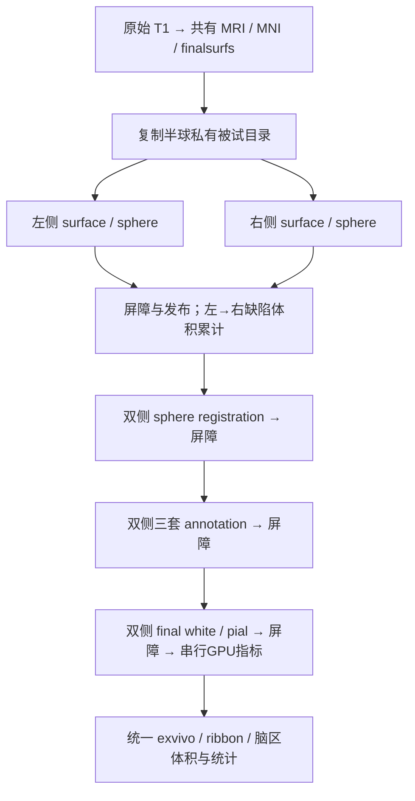
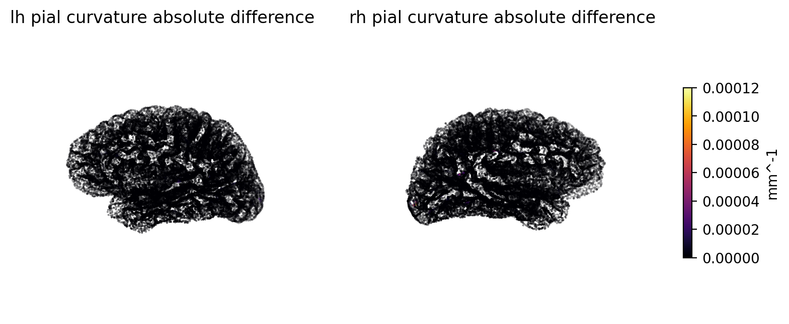

# FNIT 左右半球并行调度

## 1. 功能和流程

从单幅原始 T1 运行成熟 FNIT 重建链，左右半球独立计算的四组阶段可采用两个独立 Python exec 进程。每个阶段结束后统一发布双侧输出，再进入下一阶段。总计算线程预算默认4，双侧各2；topology 原生算法仍固定1线程。



共享文件审计见 [AUDIT.md](AUDIT.md)。私有复制、进程启动、GPU同步、输出发布和清理均包含在组墙钟，worker 耗时之和不能称为整例耗时。

## 2. Python 调用及输入输出

```python
from fnit.recon_all.native_free import run_recon_all_python

reconstruction_report = run_recon_all_python(
    t1="/data/sub-01_T1w.nii.gz",           # 原始3D T1，nibabel可读取的影像
    subject_dir="/results/sub-01",         # 空被试目录，禁止复用非空目录
    weights_dir="/resources/weights",      # 项目manifest校验的外置网络权重
    assets_dir="/resources/assets",        # 固定图谱/模板/标签，只读复用
    device="cuda:0",                       # CUDA_VISIBLE_DEVICES下的逻辑设备
    threads=4,                             # 总计算线程预算，双侧各2
    native_bin_dir="/conda/env/bin",        # 项目固定源码构建的必要组件
    profile_stages=True,                    # 记录阶段同步、父子CPU秒数
    cuda_allocator_cache="auto",           # 首次CUDA默认关缓存；已初始化API保留原状态
    hemisphere_workers=2,                  # 1=既有串行默认；2=双侧exec进程
)
```

输入参数：

| 参数 | 默认值及限制 |
| --- | --- |
| t1 | 必填，单幅原始3D结构像；生产不读取官方参考结果 |
| subject_dir | 必填，空目录；成功或失败报告写在此目录 |
| weights_dir / assets_dir | 必填，既有SHA-256/大小校验的资源；无明确再分发许可者仅从作者源获取 |
| device | cuda:0；无索引cuda在已初始化API取当前索引、冷进程取0后显式prime；worker使用固定索引；显式CPU接口用于兼容诊断；生产GPU运行不静默回退CPU |
| threads | 4；正整数，半球workers=2时至少2，奇数每侧向下取整 |
| native_bin_dir | None，当前Conda bin或FNIT_RECON_ALL_BIN_DIR；禁止系统预装脑影像程序 |
| profile_stages | False，生产不额外插入每子步骤同步；进程生命周期终点必须等待完成 |
| cuda_allocator_cache | auto；enabled/disabled只能在CUDA初始化前选择；worker按新进程环境明确选择enabled/disabled，已初始化父进程的实际缓存状态可为unknown |
| hemisphere_workers | 1或2，默认1；2要求调用者CPU/CUDA autocast均关闭，不启用FP16/BF16 |

输出结构保持既有138项清单：mri为1 mm conform网格，surf为surface RAS/mm，label为有对应顶点的标签/注释，stats为脑区统计。厚度单位mm，面积mm²，体积mm³，曲率mm⁻¹。半球共享的 `mrisps.wpa.mgz`、`mrisps.white.mgz` 最终保留右侧诊断；surface.defects按左侧生成、右侧累计。

主报告 `fnit-native-free-run.json` 新增 `hemisphere_scheduling`：workers、总预算、四个groups；每组包含values（双侧原函数结果）、workers（双侧独立报告）、group_wall_seconds、private_copy_seconds、publish_seconds、cleanup_seconds、worker_span_seconds、worker_sum_seconds、overlap_seconds，以及device_process_tree同期显存采样。所有秒数为墙钟或明确标注的CPU秒数，显存为字节。GPU UUID、最大采样间隔、失败采样及外部进程另列；短UUID通过已有context实际设备或唯一完整UUID匹配，歧义时unavailable；unavailable不能当作零显存。

每组独立报告位于 scripts/OPERATION.hemisphere-group.json，完整worker stdout/stderr位于 scripts/OPERATION.H.worker.log；原生其他日志加阶段及半球前缀，返回metadata映射到真实发布路径，保留固定文件名的来源。私有影像正常成功/失败均删除，不进入报告交付；清理自身失败则组状态failed并记录残留私有路径。最终报告采用临时元数据+replace；写出失败仍在内存主报告中标failed，保留原始worker异常与收尾错误，不产生成功的临时JSON。

失败行为：worker异常、未知共享写入、输入删除或不完整报告均失败，取消同组进程树，leader退出后仍对自有PGID中活跃的孙进程TERM、宽限3秒后KILL，不发布该组计算结果。逐文件发布遇到I/O错误则主报告明确failed并保留已发布路径，没有跨文件事务回滚。输入/资源/线程/allocator错误继续沿用原接口异常。默认串行接口兼容；并行调度要求Linux的/proc与POSIX进程组，Windows通过WSL或Linux服务器运行；完整整例只由协调者统一验证。

batch接口 `run_recon_all_python_batch(..., hemisphere_workers=2, threads=4)` 向每个设备独立被试进程传递相同参数。每设备同一时刻一个被试；threads是每被试总预算，多GPU的全机预算由调用者另行安排。

## 3. 命令行

```bash
fnit-recon-all /data/sub-01_T1w.nii.gz /results/sub-01 \
  --weights-dir /resources/weights --assets-dir /resources/assets \
  --native-bin-dir /conda/env/bin --device cuda:0 --threads 4 \
  --hemisphere-workers 2 --profile-stages --cuda-allocator-cache auto
```

## 4. 对应原软件调用

原软件串行对应 `recon-all -i T1.nii.gz -s subject -all -openmp 4`，双侧并行参考 `recon-all -i T1.nii.gz -s subject -all -parallel -openmp 2`（每侧2）；仅在隔离benchmark参考环境运行，不进入FNIT生产链。半球组为内部调度阶段，没有独立官方整体命令。现有各子模块文档保留其具体原命令和算法。

## 5. 实测和精度

专项CPU测试与真实配对结果在本目录保存。真实测试脚本 benchmark_hemi.py 接收 --checkpoint（冻结自产被试）、--output（新目录）、--assets、--binaries、--device、--operation、--order=AB/BA、--commit。输入、源码、程序SHA-256写入JSON；analyze_metrics.py通过--pair-ab/--pair-ba/--output复现14张图容差控制、串行重复及真实脑图；analyze_chain.py接收配对根目录，追加连通/闭合/自相交/球面翻折、全量cortex white/pial相交对和逐区no-th3体积诊断；严格零差异及正式数值容差在测量前记录。父CUDA先初始化，验证Python API已初始化时仍能exec worker。

冻结同输入阶段仅说明调度回归，不是原始T1整例验收。复制检查点中未重算的文件不得作为新版本成果。总体指标等效保持not_assessed；138项严格诊断与局部网格/脑区统计由相应专项和最终整例报告分别陈述。本目录已提供真实pial曲率差异脑图；两例空目录整例与最终端到端速度由协调者统一交付。

真实三套annotation同输入AB：串行4线程196.92秒，双侧各2线程116.39秒，1.692倍。六个annot文件逐字节一致、逐标签Dice=1；复制4.53秒、发布0.044秒、清理1.63秒，父子同期观测峰值5,924,454,400字节（5.924 GB / 5.518 GiB）；目标采样0.5秒，实际最大间隔4.35秒，1次采样失败均保留，不能作为连续显存上界。资源核验覆盖11个权重、102个资产、14个程序及2例原始T1，大小/哈希全部与冻结清单匹配；检查点保持不变。此为同输入annotation阶段结果，不能用作整例速度。

已有真实顶点指标AB/BA：串行14.13/13.14秒，双侧并行19.87/19.44秒（0.711/0.676倍）；私有复制4.77/4.39秒，清理1.85/2.12秒，同期父子峰值5,922,357,248/4,536,139,776字节。厚度严格一致，其他顶点图存在GPU浮点尾差，最大pial曲率差0.000114918 mm⁻¹；严格复现失败，不能删掉失败项。预声明的算子容差下，14张顶点图及串行重复对照均通过，整体指标等效仍not_assessed。此结果促使最终GPU指标在放置屏障后按左、右串行计算，白质/pial放置仍可双侧并行。



数值控制见 metrics_numeric_control.json，AB/BA完整源文件哈希、同期父子显存及外部负载见 metrics_AB.json / metrics_BA.json，组计时见 metrics_timing.csv。

## 6. 版本和benchmark记录

- f07cf59：本轮共同基线，双侧串行。
- e44451a：四组可选双侧exec，私有文件隔离、共享发布、失败传播和同期设备采样；专项CPU测试42项及14子测试通过。
- c457eae：固定worker候选源码路径，首次CUDA用显式FP32单元素分配再同步；AB/BA测试均完成，保留此前首同步失败。
- f9f570a：基于metrics真实配对，将指标从final放置worker移到父进程串行；接口兼容回归43项及14子测试通过。
- 42589db：清理、日志关闭、设备采样收尾、最终元数据失败保护；故障注入与回归46项及14子测试通过。成功路径计算算法未改，新增失败路径测试使用独立源码快照。
- a3681e0：无索引CUDA解析、leader退出后孙进程取消、日志发布路径、worker缓存继承、短GPU UUID采样边界修复；50项及14子测试通过，含真实自有孤儿孙进程取消与无关进程保留。
- 测量期间worker导入路径固定补丁见 measured_source_delta.patch；报告绑定基线commit与每个实际Python源码SHA-256，不能标为无改动e44451a运行。

## 7. 原实现和参考文献

FreeSurfer recon-all、mris_place_surface、mris_fix_topology、mris_register 源码与文档：[FreeSurfer源码](https://github.com/freesurfer/freesurfer)、[recon-all文档](https://surfer.nmr.mgh.harvard.edu/fswiki/recon-all)。FNIT现有子函数保留原论文引文；调度层无新的成像算法或外置资源。基础表面重建参考 Dale, Fischl & Sereno (1999), NeuroImage 9:179–194；Fischl, Sereno & Dale (1999), NeuroImage 9:195–207。本轮不改变原算法、坐标或数据许可。
