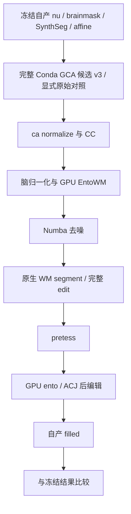

# GCA 注册评分与 WM 编辑：任务 3

本目录属于 2026-10-02 五会话优化的任务 3。输入是两例冻结的 FNIT 自产影像，不下载或发布真实影像、GCA、许可证。记录只包含哈希、计时、数值差异和复现程序。完整生产调度由任务 1 维护。

## 功能与状态

`GCASearchScorer` 将固定 T1 GCA 样本与强度体积驻留在指定 GPU，按候选矩阵和样本分块计算搜索似然。VNL 逆矩阵、源顺序的最终双精度规约仍在 CPU；矩阵坐标变换与坐标缓冲显式采用逐项 FP32 乘加，调用者默认 dtype 不改变此策略，不使用矩阵乘法或 autocast，不修改调用者 TF32 策略。它只替换搜索评分，保留候选次序、严格 `>` 接受条件、网格收缩及终止规则。

**完整注册保留 Conda 原生优化器。** 本轮另提供 `run_cached_em_register` 可选入口，只将稳定样本搜索的对数项与整数体素读取换为自有缓存热点；两例完整原生配对结果见结果文档。 当前 Python `register_t1` 只有首次 EM 方向，不包含原生稳定样本 EM 和最终全样本 EM 的完整优化循环，不能作为完整默认。本轮不修改这个入口，不把评分收益当作整段收益。

`fix_ento_wm_gpu` 是已有 FNIT `wm_edits_python.fix_ento_wm` 的 GPU 文件入口。它用于完整流程中 `wm_fix_ento` 与 `wm_fix_acj` 两个成熟步骤，保存原强度、空间、dtype 和 MGH 元数据。ACJ 保留边缘种子排除以及双侧邻域重叠时按 c/r/s 扫描最后遇到的标签。`mri_segment` 和完整 `mri_edit_wm_with_aseg` 仍用已固定源码独立构建的程序；当前完整 Python 编辑的单例哈希限制不移除。

N4 使用 ITK N4。当前源码已经将拟合固定为 1 线程，重建线程可配置且默认 1；已有两例实测表明拟合占约 98%。本轮核对现有实际 profile 后不改线程或算法，不使用 `n4_gpu.py` 的平滑残差替代 N4。

## Python 输入与输出

```python
import numpy as np
from fnit.recon_all.mri_em_register_score_gpu import GCASearchScorer
from fnit.recon_all.mri_em_register_translation_source import find_optimal_translation_source
from fnit.recon_all.wm_edits_gpu import fix_ento_wm_gpu

search_scorer = GCASearchScorer(
    samples=stable_samples,       # FNIT StableSamples；N×3 prior坐标，N个标签/均值/方差/先验
    source=scaled_source_volume,  # 3D uint8；source voxel x/y/z顺序；已按GCA白质峰缩放
    device="cuda:0",             # 显式指定目标GPU；不静默回退CPU
    candidate_chunk=64,           # 每批候选数；默认64，必须为正整数
    sample_chunk=8192,            # 每批样本数；默认8192，必须为正整数
)
candidate_scores = search_scorer.score_many(
    matrices=candidate_voxel_matrices,  # B×4×4 FP32 source voxel→atlas voxel齐次矩阵
)  # B个CPU FP32分数，保持输入次序；无world/RAS/mm变换
translated_matrix, translation_history = find_optimal_translation_source(
    samples=stable_samples, source=scaled_source_volume,
    base_transform=np.eye(4, dtype=np.float32),  # 起始voxel矩阵
    scorer=search_scorer,                       # 默认None仍用既有Numba评分
)
# 相同scorer也可传给find_optimal_linear_transform_source(..., scorer=search_scorer)。

edited_voxel_count = fix_ento_wm_gpu(
    input_file="subject/mri/wm.mgz",             # 3D WM强度；原网格与dtype保留
    label_file="subject/mri/aseg.presurf.mgz",   # ACJ使用aseg；ento步骤使用entowm.mgz
    output_file="subject/mri/wm.edited.mgz",     # 同网格MGH/MGZ；可原位写回
    level=3,                                   # 1=内嗅，2=下托/ACJ，3=两者
    left_value=255,                             # 左侧覆盖强度；按原dtype写入
    right_value=255,                            # 右侧覆盖强度
    device="cuda:0",                            # 必传目标CUDA设备
    acj=True,                                  # 默认False；True计算7030/7031交界标签
)
```

缓存对应单一 source/sample 快照；任一变化必须重建 scorer。固定评分只支持当前 2 voxel prior 间距的单通道 T1；其他图谱间距或多输入不支持。均值、方差、先验必须为现有 GCA 样本的 FP32 数组；方差、先验必须为正，坐标/密度有限且非空；候选必须为有限非奇异 affine。CPU 工作区为 `candidate_chunk × N × 8` 字节，GPU 主要工作区按两维分块控制。空间重采样不属于此接口。

MGH 多字节存储在上传前转换为本机字节序的连续副本，数值与输出 dtype 不变；已完成 WM v2 实测为 uint8。WM 输入与标签必须同一 3D 网格，affine 差异不超过既有 1e-4 mm 门槛；缺文件、网格错误、CUDA 故障直接报错。`amygdala_cortex_junction_gpu` 输入 3D 整数 CUDA 张量，返回同设备、同网格 int32 的 7030/7031 标签。WM 文件入口返回实际指定覆盖的体素数，读写使用 nibabel。

## 命令行与原软件

评分与 WM GPU 热点目前为内部 callable，没有新增生产 CLI。复现脚本的 `--help` 给出 `--root`（资源/冻结输入根）、`--output`（独占输出目录）、`--commit`（实际源码身份）；评分脚本 `--translation` 可额外验证整个平移搜索。

```bash
# 在声明的Conda环境和共用锁内运行；GPU UUID/线程预算由协调配置提供。
PYTHONPATH=src python validation/recon_all/optimizations/20261002_parallel/task_03/benchmark_gca.py \
  --root "$FNIT_RESOURCE_ROOT" --output "$FNIT_TASK_OUTPUT/gca" --commit "$FNIT_ACTUAL_COMMIT" --translation
PYTHONPATH=src python validation/recon_all/optimizations/20261002_parallel/task_03/benchmark_wm.py \
  --root "$FNIT_RESOURCE_ROOT" --output "$FNIT_TASK_OUTPUT/wm" --commit "$FNIT_ACTUAL_COMMIT"
PYTHONPATH=src python tests/recon_all/test_gca_score_batch.py
```

原软件对应完整步骤（仅隔离 benchmark 使用；生产不调用系统预装程序）：

```bash
mri_em_register -uns 3 -mask brainmask.mgz nu.mgz RB_all_2020-01-02.gca transforms/talairach.lta
mri_edit_wm_with_aseg -sa-fix-ento-wm wm.mgz entowm.mgz wm.mgz 3 255 255
mri_edit_wm_with_aseg -sa-fix-acj wm.mgz aseg.presurf.mgz wm.mgz 255 255
```

GCA 评分和 ACJ 邻域本身没有独立官方 CLI。`profile_native.py` 对已固定源码构建的完整 GCA 程序采样；输出 LTA 单列与冻结自产 LTA 比较，采样额外开销不作候选提速证据。

## 验证、版本和接入

见 `RESULTS.md` 与同目录 JSON/CSV。首轮已有评分尾差如实保存，后续修正另存新版本。整体指标等效维持 `not_assessed`；138 项严格诊断与两例原始 T1 空目录整例由协调者执行。完整 GCA 可选后端只替换原生搜索热点，全部后续优化循环保留；没有 N4 算法或分割核心替换。

任务 1 的接入方式：两次 `wm_fix_*` 调用用 `fix_ento_wm_gpu`，保持原参数并新增 `device=device`。当前 v3 GCA 缓存保持完整原生优化器，两例同构建注册耗时下降 14.6%／12.1%，矩阵零差异；两例自产连续链已运行到 filled，最终 filled 和当前 GPU／CPU WM 对照均零差异。首例 EntoWM／WM 相对冻结参考各有 1 个体素差异，详见 RESULTS；生产接入由协调者结合原始 T1 整例、138 项诊断和安装验收决定。旧 v1/v2 退化候选不启用。WM 核心和 N4 保持既有接口。无新增依赖；PyTorch、NumPy、nibabel、Numba 均为现有 Conda 安装依赖。

## 原代码与参考文献

- [FreeSurfer mri_em_register](https://github.com/freesurfer/freesurfer/blob/d932c45b7941662ea380a05efef580568b98d41a/mri_em_register/mri_em_register.cpp)、[GCA 概率与 EM](https://github.com/freesurfer/freesurfer/blob/d932c45b7941662ea380a05efef580568b98d41a/utils/gca.cpp)。实际构建固定版本与哈希见运行报告，链接用于定位算法。
- [FreeSurfer WM 编辑](https://github.com/freesurfer/freesurfer/blob/d932c45b7941662ea380a05efef580568b98d41a/mri_edit_wm_with_aseg/mri_edit_wm_with_aseg.cpp)。
- Fischl et al. Whole brain segmentation: automated labeling of neuroanatomical structures in the human brain. Neuron 33, 341–355 (2002).
- Tustison et al. N4ITK: improved N3 bias correction. IEEE Transactions on Medical Imaging 29, 1310–1320 (2010). [ITK N4 实现](https://github.com/InsightSoftwareConsortium/ITK/blob/master/Modules/Filtering/BiasCorrection/include/itkN4BiasFieldCorrectionImageFilter.hxx)。


## 完整原生缓存后端的构建与调用

`mri_em_register_native_build.build_native_search(source_root, build_root, output, *, ninja)` 以固定 SHA-256 的原生源码和已有 Conda Ninja 构建作为只读输入，独立编译一个 FNIT 热点调用对象，再链接既有固定源码对象/库。`source_root` 是固定源码根，`build_root` 是相应已完成构建的根，`output` 必须为不存在的专属输出目录，`ninja` 是 Conda 内 Ninja 可执行路径。输出为 `mri_em_register_fnit_cached`、构建哈希/命令 JSON 和自有编译中间文件。原始源码、原始对象、共享库和安装入口均不修改。源码哈希或命令形态不符合验证值时立即失败。

```python
from fnit.recon_all.mri_em_register_cached_conda import run_cached_em_register

lta_file = run_cached_em_register(
    binary=compiled_cached_binary,  # 专属Conda源码构建程序；不是预装软件复制件
    mri=subject_mri_directory,      # 含自产nu.mgz、brainmask.mgz；输出transforms/talairach.lta
    atlas=verified_gca_file,        # 已校验单通道T1 GCA资源
    assets=authorized_assets_root,  # 已授权资源目录
    binary_sha256=validated_binary_sha256,  # 本次已回归程序的完整SHA-256
)
```

调用前设置总预算 `OMP_NUM_THREADS=4`，其它 BLAS/Numba/ITK 线程按协调配置固定。许可证只从授权进程环境继承。能力查询变量只用于探测，实际执行环境清除 `FNIT_GCA_QUERY_CAPABILITIES`；本次原生输出写到独占临时 LTA，核验有限 4×4 矩阵后原子发布，失败保留已有输出，不以旧文件判断成功。接口输出 4×4 voxel LTA（附 source/destination 网格几何），参数无隐含默认；程序哈希不符、输入缺失、线程声明不符、子进程失败均抛异常。`FNIT_GCA_SCORER=cpu_cached` 由 callable 显式设置；多输入、非 uint8 或非普通概率模式仍走原生既有分支。缓存逐次检查实际方差和先验，样本指针复用不会使缓存失效判断出错，强度和样本坐标每次读取。该程序的静态原生上下文只支持同进程内串行评分，不支持同进程并发 scorer；每次 callable 启动独立 EM 进程，不对同一被试并发发布。当前 v3 使用上游已启用的 ROMP 可复现分块规约和线程许可级别；旧 v1/v2 普通 `fast` 规约有调度／规约偏离，相关失败结果保留且不允许默认启用。

构建调用属于内部安装 API，不添加生产 CLI。协调者需将 `.hpp` 加入发行包数据，并将固定源码构建补丁接入主页 Conda 安装；本轮只提供专属构建器，不修改共享安装入口。无新增计算依赖，Ninja/编译器沿用声明的 Conda 构建环境。

主页安装接入点（由协调者修改共享脚本）：`tools/build_recon_all_fs_cpp_conda.sh` 已核验上游源码并复制到 `$build_source` 后、首次 `cmake -S` 前，调用：

```bash
PYTHONPATH="$repo_root/src${PYTHONPATH:+:$PYTHONPATH}" "$CONDA_PREFIX/bin/python" \
  -m fnit.recon_all.mri_em_register_native_build --apply-source-root "$build_source"
# 安装后的能力查询不需要读取影像或许可证：
FNIT_GCA_QUERY_CAPABILITIES=1 "$CONDA_PREFIX/bin/mri_em_register"
```

有限补丁只改复制树内 `mri_em_register/emregisterutils.cpp`，增加一个 FNIT `.hpp` 和哈希清单。源文件必须匹配上游 `d932c45b7941662ea380a05efef580568b98d41a` 的固定 SHA-256；重复应用核对清单及 header 版本。CMake 仍用已有 Conda 工具链从源码构建全部目标，主页安装脚本继续执行安装、rpath 和动态依赖验证。补丁应用器源码与 header 的 SHA-256、补丁后的源码 SHA-256 均由清单记录。拒绝直接向原始源树/共享安装树应用；只在声明的构建副本中使用。

既有 NumPy/C++ 与 Numba 评分的细节差异：Numba 对 `float(np.float32)` 保留 FP32，随后 `sqrt/log` 也使用 FP32 重载。本轮诊断证明这一行为早已存在，GPU 缓存使用同一 Numba 对数项保持兼容，没有修改既有子函数或放宽评分门槛。完整原生缓存则保持原生双精度对数项与规约顺序。二者的参考不同，结果分别报告。


## 自产连续链复现

`benchmark_chain.py` 是验收脚本，生产调度仍由任务 1 维护。输入为 `--root` 内声明的冻结自产 nu、brainmask、SynthSeg 和 Talairach affine；`--case` 选择两例之一，`--output` 必须是新的独占目录，`--commit` 记录实际代码身份。诊断脚本 `--gca-backend` 默认 `cpu_cached`，选择当前 v3 完整候选；`original` 选择现有原生对照。`--gca-cached-binary` 和 `--gca-cached-sha256` 可指定已验证程序，否则从本任务 `native_cached_v3/` 构建清单读取并校验；生产默认始终是现有原生程序，脚本默认不改变生产配置。输出包括重新计算的 mri/、stats/、scripts/，以及包含阶段秒数、源/资产/输入/程序哈希、实际设备、精度、同期父子显存和逐体素/逐标签比较的 report.json。失败立即记录，不读取参考结果参与计算；所有参考比较在 filled 生成后执行。这里的整体墙钟是受影响链，不是原始 T1 整例。连续链从自己的 pretess 输出额外计算两个成熟 CPU 后编辑，和 GPU WM 逐体素比较；该诊断结果不进入生产计算。诊断耗时单列 `CPU_WM_point_validation_only`，包含在验收脚本总墙钟内。



```bash
PYTHONPATH=src python validation/recon_all/optimizations/20261002_parallel/task_03/benchmark_chain.py \
  --root "$FNIT_RESOURCE_ROOT" --output "$FNIT_TASK_OUTPUT/continuous_sub01" \
  --case whole_sub01_candidate_retry1 --commit "$FNIT_ACTUAL_COMMIT"
# 每例单独取得共享锁；运行前声明 GPU UUID、各线程预算与授权许可证环境。
```

连续链只使用项目成熟组件与固定源码 Conda 程序，对应原始 recon-all 的 `mri_em_register → mri_ca_normalize → mri_cc → mri_normalize → mri_entowm_seg → mri_segment → mri_edit_wm_with_aseg → mri_pretess → mri_fill` 部分。各程序参数保持当前生产调用图；本轮新增部分只有两个 WM GPU 后编辑入口。完整数据格式及逐步骤源码以现有子功能文档为准。

原生诊断可选环境 `FNIT_GCA_DIAGNOSTICS=1`，默认关闭；打印有限补丁入口的评分次数、样本数、密度刷新和 ROMP 许可级别，不改变评分值。最新原生能力版本为 2，`reduction=upstream_ROMP_partials`。统计对象和密度缓存仍只支持同进程串行调用。
