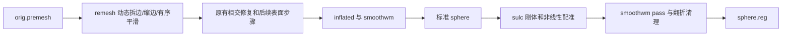

# 网格与球面几何优化（2026-10-02，任务4）

本轮复用 FNIT 的动态 remesh、标准球面和两 pass 配准实现。remesh 的整数索引改用 Numba 构建，仍按首次遇见的面和角点确定边号；只跳过没有接受缩边、也没有孤立点或空面的压缩重建。球面距离力、面几何与顶点法向按独立行并行，每行仍按原邻接或面序累计。刚体搜索在同一 beta/gamma 候选组内复用投影和采样几何，alpha 候选仍逐项计算、逐项接受，保留16分区累计。迭代次数、停止条件、边的同长排序、Gauss–Seidel平滑、线搜索及翻折修复沿用基线。

流水线：



## Python 调用、输入和输出

```python
from pathlib import Path
from fnit.recon_all.mris_remesh_python import remesh_surface
from fnit.recon_all.sphere_standard_run import run_standard_sphere
from fnit.recon_all.mris_register_run import run_register_sphere

surface_directory = Path("subject/surf")       # 自产表面目录
output_directory = Path("validation_output")  # 独立验证输出目录
output_directory.mkdir(exist_ok=True)
hemisphere = "lh"                             # 左半球；右半球为rh
atlas_file = Path("assets/average/lh.folding.atlas.acfb40.noaparc.i12.2016-08-02.tif")

remesh_surface(
    input_path=surface_directory / f"{hemisphere}.orig.premesh", # 拓扑修复后的原始网格
    output_path=output_directory / f"{hemisphere}.orig",       # 重划网格；顶点/面数可变化
    iterations=3,                                             # 完整三轮；默认3
)
sphere_report = run_standard_sphere(
    inflated=surface_directory / f"{hemisphere}.inflated", # 膨胀表面，surface RAS/mm
    smoothwm=surface_directory / f"{hemisphere}.smoothwm", # 原度量表面，须保持有序面对应
    output=output_directory / f"{hemisphere}.sphere",      # 半径100mm标准球面
    finish_device="cpu",                                  # 最后翻折清理；默认cpu
    averaging_device="cuda:0",                            # 原有有序平均；默认cpu；明确目标CUDA
)
registration_report = run_register_sphere(
    sphere=output_directory / f"{hemisphere}.sphere",      # 完整标准sphere输出
    smoothwm=surface_directory / f"{hemisphere}.smoothwm", # 与sphere顶点、面顺序相同
    sulc=surface_directory / f"{hemisphere}.sulc",          # 按顶点顺序存储的形态值
    atlas=atlas_file,                                      # 对应半球TIFF图谱，校验大小和SHA
    output=output_directory / f"{hemisphere}.sphere.reg",  # 两pass完整注册结果
    overlap_device="cpu",                                 # 最后翻折清理；默认cpu
    averaging_device="cuda:0",                            # 原有平均设备，默认cpu
)
```

1. FreeSurfer表面由 nibabel 读写，坐标数组为 `(N,3)`，有序三角面为 `(F,3)`，surface RAS，单位mm。remesh内部使用原有float64坐标，保存float32坐标/int32面。相交修复仍由调用链中的完整组件负责。
2. sphere 的 inflated/smoothwm 必须顶点、面顺序对应。输出坐标为float32，半径100mm；返回阶段耗时、每轮权重/平均次数/步长/耗时以及最终翻折计数。
3. registration 输入 sulc 是 `(N,)` 顶点值；TIFF图谱保持原帧顺序和float32位解释。返回输入/输出哈希、临时 sulc seed 哈希、两pass轨迹与耗时。临时seed随函数退出清理。
4. 未找到输入、图谱或明确CUDA设备执行失败时抛异常；面顺序不一致抛 `ValueError`，超出原收敛上限抛 `RuntimeError`。不通过减少迭代或改变停止条件返回结果。低精度不新增；本轮目标函数仍CPU float32/float64原精度，GPU平均仍原Triton float32。
5. remesh 参数 `iterations` 默认3、不能为负；固定目标边长为初始平均边长×0.8，拆边阈值×4/3，缩边阈值×4/5。动态拆缩边原位更新关联容器，接受顺序和边号决定同长边的tie-break。Numba编译失败会显式报错。

## 共享法向接口与任务1接入

`initial_vertex_normals(vertices, triangles, *, topology=None)` 保持签名和输出。`vertices` 为 `(N,3)`，`triangles` 为有序整数 `(F,3)`；返回 `(N,3)` float32单位法向，孤立点为零，退化边沿原归一化规则处理。可选 `topology` 使用 `FaceNormalTopology(triangles, nvertices)`，只缓存冻结面和整数CSR；每次 `evaluate(vertices)` 都按当前坐标重算法向。面顺序或顶点数不兼容抛 `ValueError`。`NORMAL_TOPOLOGY_API_VERSION=1` 标识接口；没有新增持久坐标缓存。

任务1直接调用现有三个阶段，无需改后端参数。新增Numba行并行沿用调用进程线程预算；半球并行时由任务1将总预算4分给各worker。本轮没有新增生产依赖，Numba、nibabel、PyTorch及Triton均已在既有Conda入口。任务2需在整轮white/pial更新后回归共享法向接口，单元测试覆盖缓存失效及独立行串行/并行精确一致。

## CLI

```bash
python -c 'from fnit.recon_all.mris_remesh_python import remesh_surface; remesh_surface(input_path="subject/surf/lh.orig.premesh", output_path="output/lh.orig", iterations=3)' 
python -m fnit.recon_all.sphere_standard_run subject/surf/lh.inflated subject/surf/lh.smoothwm output/lh.sphere --finish-device cpu --averaging-device cuda:0 --report output/sphere.json
python -m fnit.recon_all.mris_register_run output/lh.sphere subject/surf/lh.smoothwm subject/surf/lh.sulc assets/average/lh.folding.atlas.acfb40.noaparc.i12.2016-08-02.tif output/lh.sphere.reg --overlap-device cpu --averaging-device cuda:0 --report output/register.json
```

`initial_vertex_normals`、整数拓扑与刚体采样几何属于内部函数，没有独立官方CLI。remesh目前通过Python调用；这里用python -c从命令行执行同一函数。

## 官方对照命令

在隔离benchmark目录和官方参考环境运行，`SUBJECTS_DIR` 指向独立参考被试，图谱须对应半球：

```bash
mris_remesh --remesh --iters 3 --input subject/surf/lh.orig.premesh --output reference/lh.orig
mris_sphere -threads 4 subject/surf/lh.inflated reference/lh.sphere
mris_register -threads 4 subject/surf/lh.sphere assets/average/lh.folding.atlas.acfb40.noaparc.i12.2016-08-02.tif reference/lh.sphere.reg
```

生产调用 FNIT 自有阶段；保留完整Conda源码构建拓扑GA与相交修复。官方程序只用于隔离对照。

## 真实数据精度、耗时与记录

冻结基线 `f07cf59c7f51ae1393e2578f141b4d130ed7801a`，候选生产源码 `9f7bb7a5af72e7572fcb8de617575645f29f51d7`。两例真实FNIT自产检查点、四个半球完成24条配对阶段命令、12条隔离官方参考命令和4条自产sphere→register连续链。阶段输入SHA相同；完整迭代、精度、tie-break、停止条件、两pass注册及翻折清理保持原设置。全部计时在共用flock下，目标GPU UUID在Python导入前指定，总线程4。

结果索引：`measured/completed_summary/completion.json`；完整几何及轨迹：`comparison.json`；官方原始误差：`official.json`；连续输入传递：`chains.json`；计时：`timings.csv`。`source_manifest_verification.json`确认24次配对执行和4次链内注册记录的生产Python文件SHA逐一对应冻结Git提交，线程4、TF32开启且无autocast；没有生产源码漂移。每次执行的源码、脚本、输入、图谱、官方程序哈希、实际负载、同步结束和轨迹保存在 `measured/cold_pairs`、`measured/reference`、`measured/chains`。`metadata_manifest.json`逐文件记录原始JSON/CSV大小和SHA-256，不含影像、表面、许可证或编译缓存。

### 最新阶段冷启动配对

下表为完整Python进程时间，包含导入、空Numba缓存JIT、校验、完整阶段及IO；每次执行各用独立空缓存。AB顺序用于lh，BA用于rh，单次观察列出外部负载，不解释为统计置信区间或整例加速。12组坐标float32存储位、有序面、几何尾部及相应sphere/register轨迹全部精确一致。

| 输入 | 阶段 | 基线秒 | 候选秒 | 基线/候选 |
| --- | --- | ---: | ---: | ---: |
| sub01/lh | remesh | 130.530 | 89.434 | 1.460 |
| sub01/lh | sphere | 150.162 | 134.810 | 1.114 |
| sub01/lh | register | 146.708 | 131.655 | 1.114 |
| sub01/rh | remesh | 119.352 | 89.716 | 1.330 |
| sub01/rh | sphere | 115.599 | 105.948 | 1.091 |
| sub01/rh | register | 124.488 | 114.174 | 1.090 |
| sub02/lh | remesh | 134.908 | 102.895 | 1.311 |
| sub02/lh | sphere | 126.402 | 115.349 | 1.096 |
| sub02/lh | register | 153.352 | 138.777 | 1.105 |
| sub02/rh | remesh | 135.877 | 120.315 | 1.129 |
| sub02/rh | sphere | 116.284 | 105.624 | 1.101 |
| sub02/rh | register | 150.938 | 132.491 | 1.139 |

`complete_step_timings.csv`列出API总时间、sphere投影/度量/JIT/拓扑及GPU准备/更新/清理、注册两pass内各原始计时字段和逐轮更新时间之和。嵌套耗时不能相加；remesh正式测量只含完整API时间，初始cProfile用于定位子步骤，不冒充最终分步benchmark。

### 四半球几何检查

| 输入 | 顶点 | 面 | Euler | 连通分量 | 自相交标记面（remesh/sphere/register） | 翻折面（sphere/register） |
| --- | ---: | ---: | ---: | ---: | --- | --- |
| sub01/lh | 105598 | 211192 | 2 | 1 | 0/0/0 | 0/0 |
| sub01/rh | 104619 | 209234 | 2 | 1 | 0/0/0 | 0/0 |
| sub02/lh | 119363 | 238722 | 2 | 1 | 0/0/0 | 0/0 |
| sub02/rh | 118303 | 236602 | 2 | 1 | 0/0/0 | 0/0 |

全部阶段边界、非流形边、重复面、索引退化面和逐顶点link异常为0；sphere/register零面积面为0、半径最大偏差不超过5.68×10⁻⁶mm。自相交沿用FNIT检查规则，排除共享顶点的面、平面容差1e-6。坐标及拓扑精确相同时复用同一质量检查，并在JSON注明理由。最终float32表面检查和清理过程中的负面计数分别保留，不互相替代。

sub01/lh的remesh额外记录24个完整拆边pass、缩边pass和平滑后的float64坐标/有序面哈希，全部一致，最终float32一致，见 `trace/`；没有每条边操作的瞬时跟踪，该轨迹检查不计时。真实脑图例子保存于远端受控任务目录，公开仓库仅存图像及输入SHA元数据 `private_figure_metadata.json`；显示每12个面取一个，全部几何指标使用所有顶点和面。

### 官方同输入阶段

官方使用安装版FreeSurfer 8.2.0-1，仅在隔离benchmark运行；生产仍使用FNIT及既有固定源码Conda组件。以下分别列原程序CLI、FNIT API（完整阶段含IO）和FNIT完整Python进程，三种计时边界保持分开。距离单位为surface RAS mm，有序面对应后按同顶点索引比较；所有候选仍与冻结FNIT基线逐位一致。

| 输入/阶段 | 官方CLI秒 | FNIT API秒 | FNIT进程秒 | 位移均值/P99/最大mm |
| --- | ---: | ---: | ---: | --- |
| sub01/lh/remesh | 20.423 | 86.312 | 89.434 | 0.000/0.000/0.000 |
| sub01/lh/sphere | 157.435 | 131.044 | 134.810 | 3.104/8.934/12.154 |
| sub01/lh/register | 187.436 | 128.120 | 131.655 | 0.000/0.000/0.000 |
| sub01/rh/remesh | 18.940 | 86.168 | 89.716 | 0.000/0.000/0.000 |
| sub01/rh/sphere | 167.468 | 102.978 | 105.948 | 2.621/4.691/13.323 |
| sub01/rh/register | 175.816 | 111.188 | 114.174 | 0.000/0.000/0.000 |
| sub02/lh/remesh | 24.186 | 99.649 | 102.895 | 0.000/0.000/0.000 |
| sub02/lh/sphere | 164.699 | 111.674 | 115.349 | 1.272/3.534/6.360 |
| sub02/lh/register | 228.375 | 135.653 | 138.777 | 0.389/1.098/1.492 |
| sub02/rh/remesh | 21.859 | 117.377 | 120.315 | 0.000/0.000/0.000 |
| sub02/rh/sphere | 88.001 | 102.574 | 105.624 | 2.241/6.050/8.338 |
| sub02/rh/register | 198.701 | 129.296 | 132.491 | 0.000/0.000/0.000 |

四组remesh和三组register与官方有序面和float32坐标位精确一致；sub02/lh register位移均值0.389mm、P99=1.098mm、最大1.492mm。四组sphere和这组register差异均已存在于冻结FNIT基线，本轮优化未改变对应坐标；与原软件的整体等效为 `not_assessed`。原始差异不做后验阈值判定。sub01/lh附无平移/无缩放纯旋转诊断：原始均值3.104mm，旋转后2.994mm，说明差异不只是整体朝向；此诊断不替代原始比较或验收。官方内部子步骤没有统一API边界，本轮对照按上述三个完整CLI阶段测量，不将FNIT内部剖析时间与官方总时间混比。

### 自产连续链与整例边界

四条链均实际消费本候选新生成sphere，生产输出SHA=复制后的sphere SHA=register实际输入SHA；完整两pass注册和清理与正式同输入候选的坐标位、尾部、刚体分数/角度/评估次数及停止/清理轨迹一致。

| 输入 | 链内register完整进程秒 | sphere来源SHA与实际输入 | 输出/完整轨迹 |
| --- | ---: | --- | --- |
| sub01/lh | 133.691 | 一致 | 精确一致 |
| sub01/rh | 113.066 | 一致 | 精确一致 |
| sub02/lh | 133.424 | 一致 | 精确一致 |
| sub02/rh | 129.460 | 一致 | 精确一致 |

链内register时间另列，包含完整注册进程；已生成sphere的时间在阶段表中，输入复制和排队等待不纳入该列，不把它标为两阶段连续墙钟耗时，也不替代AB/BA配对计时。候选自身进程树GPU采样峰值492830720字节（约0.493GB），候选最大采样间隔4.203秒。外部GPU采样保留峰值、失败次数和最大间隔；它不构成连续显存峰值证明。Torch自身峰值另存各执行原始报告，运行精度保持原float32/float64及TF32，没有改float16。

65项CPU专项测试通过，日志 `final_cpu_tests.log`。真实lh sphere面几何/法向及非恒定目标刚体缓存分数、角度和评估次数精确一致。共享法向接口版本1和失效规则保留，white/pial完整消费回归归任务2。

本任务完成同输入阶段和受影响连续链验收。协调者负责两例原始T1从空输出目录运行的整例、138项严格诊断、逐区厚度/面积/体积和whole指标；整体等效仍为 `not_assessed`，没有将单阶段比值外推到整例。

### 最近版本与验证历史

早期 `7d5f69f` 混合缓存remesh 120.283→94.204秒，几何一致；该记录单独绑定旧源码，不改标为 `9f7bb7a`。初始无统一锁cProfile约189秒，初始拓扑20次66.6秒、rebuild17次87秒、面法向13次20.2秒为嵌套累计，只用于定位。

验证故障保留：GPFS旧锁ENOLCK时未执行；别名导入污染Numba缓存导致首轮sphere导入失败，改为每次空缓存后重跑；官方首轮remesh相对路径因cwd切换失败，改绝对路径后重跑，失败0.0128秒不纳入计时。刚体批处理试验曾产生约8.8×10⁻⁶分数差，超过预声明1e-9容差，已撤回；最终源码采用保持逐候选运算的缓存。早期内置GPU采样间隔49.7秒为已记录限制，正式测量改进程外采样，仍不声称连续峰值。历史部分报告留作版本与测量边界证据，现版结果以 `measured/completed_summary` 为准。

## 原生组件核查

完整组件清单及哈希见 `component_audit.json`。保留完整 `mris_fix_topology_fnit`，固定种子1234、控制器线程1；已有 `topology_first_candidate`、MRI match、评分合成/排序仅是局部算子，尚未组成完整GA。固定源码GA候选评分在同一MRIS/defect状态上恢复和重建网格，随机交叉/变异与最优候选更新沿串行顺序进行；没有已验证的状态隔离评分接口。本轮不声称GA提速。

`mri_label2vol --defects` 负责缺陷标签到conform网格的写入/合并，lh随后rh共享文件顺序由任务1维护；`mrisp_paint -a 5 atlas#6` 含完整图谱插值与平均；`mris_curvature_stats` 同时输出统计与多个曲率文件。现有自有采样/曲率函数还未覆盖这些完整输出契约。三者继续使用固定源码Conda构建程序。inflate保留已有低耗时组件。六项程序哈希及两半球TIFF资源与当前清单一致，不分发资源或许可证。

## 更新记录和参考

- `9f7bb7a`：按顶点重建整数邻接与角点CSR，保留重复顶点的首次角点及邻居插入顺序；65项CPU专项回归。
- `7d5f69f`：整数拓扑Numba构建；零变化压缩跳过；独立几何行并行；同旋转采样几何缓存；专项测试和复现脚本。
- `f07cf59`：本轮共同冻结起点和五会话规范；已有有序CUDA平均、CSR/原面积缓存和Numba图谱blur。
- 前版真实整例记录：`validation/recon_all/python_gpu_port/performance_hotspots_20261001/WHOLE_RESULTS.md`。该结果绑定旧版本，不改标为现版。

原代码：[FreeSurfer固定源码d932c45](https://github.com/freesurfer/freesurfer/tree/d932c45b7941662ea380a05efef580568b98d41a)，相关文件为 `mris_remesh`、`mris_sphere`、`mris_register` 和 `utils/mrisurf_defect.cpp`。参考：Fischl, Sereno & Dale (1999), [Cortical Surface-Based Analysis II](https://pubmed.ncbi.nlm.nih.gov/9931269/), NeuroImage 9:195–207；Fischl et al. (1999), [High-resolution intersubject averaging and a coordinate system for the cortical surface](https://pmc.ncbi.nlm.nih.gov/articles/PMC6873338/), Human Brain Mapping 8:272–284；Fischl et al. (2001), [Automated manifold surgery](https://pubmed.ncbi.nlm.nih.gov/11293693/), IEEE Transactions on Medical Imaging 20:70–80。
