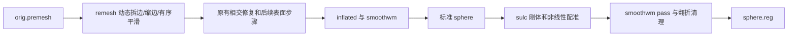

# 网格与球面几何优化（2026-10-02，任务4）

本轮复用 FNIT 的动态 remesh、标准球面和两 pass 配准实现。remesh 的整数索引改用 Numba 构建，仍按首次遇见的面和角点确定边号；只跳过没有接受缩边、也没有孤立点或空面的压缩重建。球面距离力、面几何与顶点法向按独立行并行，每行仍按原邻接或面序累计。刚体搜索在同一 beta/gamma 候选组内复用投影和采样几何，alpha 候选仍逐项计算、逐项接受，保留16分区累计。迭代次数、停止条件、边的同长排序、Gauss–Seidel平滑、线搜索及翻折修复沿用基线。

流水线：



## Python 调用、输入和输出

```python
from pathlib import Path
from fnit.recon_all.mris_remesh_python import remesh_surface
from fnit.recon_all.sphere_standard_run import run_standard_sphere
from fnit.recon_all.mris_register_run import run_register_sphere

surface_directory = Path("subject/surf")       # 自产表面目录
output_directory = Path("validation_output")  # 独立验证输出目录
output_directory.mkdir(exist_ok=True)
hemisphere = "lh"                             # 左半球；右半球为rh
atlas_file = Path("assets/average/lh.folding.atlas.acfb40.noaparc.i12.2016-08-02.tif")

remesh_surface(
    input_path=surface_directory / f"{hemisphere}.orig.premesh", # 拓扑修复后的原始网格
    output_path=output_directory / f"{hemisphere}.orig",       # 重划网格；顶点/面数可变化
    iterations=3,                                             # 完整三轮；默认3
)
sphere_report = run_standard_sphere(
    inflated=surface_directory / f"{hemisphere}.inflated", # 膨胀表面，surface RAS/mm
    smoothwm=surface_directory / f"{hemisphere}.smoothwm", # 原度量表面，须保持有序面对应
    output=output_directory / f"{hemisphere}.sphere",      # 半径100mm标准球面
    finish_device="cpu",                                  # 最后翻折清理；默认cpu
    averaging_device="cuda:0",                            # 原有有序平均；默认cpu；明确目标CUDA
)
registration_report = run_register_sphere(
    sphere=output_directory / f"{hemisphere}.sphere",      # 完整标准sphere输出
    smoothwm=surface_directory / f"{hemisphere}.smoothwm", # 与sphere顶点、面顺序相同
    sulc=surface_directory / f"{hemisphere}.sulc",          # 按顶点顺序存储的形态值
    atlas=atlas_file,                                      # 对应半球TIFF图谱，校验大小和SHA
    output=output_directory / f"{hemisphere}.sphere.reg",  # 两pass完整注册结果
    overlap_device="cpu",                                 # 最后翻折清理；默认cpu
    averaging_device="cuda:0",                            # 原有平均设备，默认cpu
)
```

1. FreeSurfer表面由 nibabel 读写，坐标数组为 `(N,3)`，有序三角面为 `(F,3)`，surface RAS，单位mm。remesh内部使用原有float64坐标，保存float32坐标/int32面。相交修复仍由调用链中的完整组件负责。
2. sphere 的 inflated/smoothwm 必须顶点、面顺序对应。输出坐标为float32，半径100mm；返回阶段耗时、每轮权重/平均次数/步长/耗时以及最终翻折计数。
3. registration 输入 sulc 是 `(N,)` 顶点值；TIFF图谱保持原帧顺序和float32位解释。返回输入/输出哈希、临时 sulc seed 哈希、两pass轨迹与耗时。临时seed随函数退出清理。
4. 未找到输入、图谱或明确CUDA设备执行失败时抛异常；面顺序不一致抛 `ValueError`，超出原收敛上限抛 `RuntimeError`。不通过减少迭代或改变停止条件返回结果。低精度不新增；本轮目标函数仍CPU float32/float64原精度，GPU平均仍原Triton float32。
5. remesh 参数 `iterations` 默认3、不能为负；固定目标边长为初始平均边长×0.8，拆边阈值×4/3，缩边阈值×4/5。动态拆缩边原位更新关联容器，接受顺序和边号决定同长边的tie-break。Numba编译失败会显式报错。

## 共享法向接口与任务1接入

`initial_vertex_normals(vertices, triangles, *, topology=None)` 保持签名和输出。`vertices` 为 `(N,3)`，`triangles` 为有序整数 `(F,3)`；返回 `(N,3)` float32单位法向，孤立点为零，退化边沿原归一化规则处理。可选 `topology` 使用 `FaceNormalTopology(triangles, nvertices)`，只缓存冻结面和整数CSR；每次 `evaluate(vertices)` 都按当前坐标重算法向。面顺序或顶点数不兼容抛 `ValueError`。`NORMAL_TOPOLOGY_API_VERSION=1` 标识接口；没有新增持久坐标缓存。

任务1直接调用现有三个阶段，无需改后端参数。新增Numba行并行沿用调用进程线程预算；半球并行时由任务1将总预算4分给各worker。本轮没有新增生产依赖，Numba、nibabel、PyTorch及Triton均已在既有Conda入口。任务2需在整轮white/pial更新后回归共享法向接口，单元测试覆盖缓存失效及独立行串行/并行精确一致。

## CLI

```bash
python -c 'from fnit.recon_all.mris_remesh_python import remesh_surface; remesh_surface(input_path="subject/surf/lh.orig.premesh", output_path="output/lh.orig", iterations=3)' 
python -m fnit.recon_all.sphere_standard_run subject/surf/lh.inflated subject/surf/lh.smoothwm output/lh.sphere --finish-device cpu --averaging-device cuda:0 --report output/sphere.json
python -m fnit.recon_all.mris_register_run output/lh.sphere subject/surf/lh.smoothwm subject/surf/lh.sulc assets/average/lh.folding.atlas.acfb40.noaparc.i12.2016-08-02.tif output/lh.sphere.reg --overlap-device cpu --averaging-device cuda:0 --report output/register.json
```

`initial_vertex_normals`、整数拓扑与刚体采样几何属于内部函数，没有独立官方CLI。remesh目前通过Python调用；这里用python -c从命令行执行同一函数。

## 官方对照命令

在隔离benchmark目录和官方参考环境运行，`SUBJECTS_DIR` 指向独立参考被试，图谱须对应半球：

```bash
mris_remesh --remesh --iters 3 --input subject/surf/lh.orig.premesh --output reference/lh.orig
mris_sphere subject/surf/lh.inflated reference/lh.sphere
mris_register reference/lh.sphere assets/average/lh.folding.atlas.acfb40.noaparc.i12.2016-08-02.tif reference/lh.sphere.reg
```

生产调用 FNIT 自有阶段；保留完整Conda源码构建拓扑GA与相交修复。官方程序只用于隔离对照。

## 真实数据精度、耗时与记录

本轮测量起点 `f07cf59c7f51ae1393e2578f141b4d130ed7801a`，生产源码候选 `7d5f69f7d812177b3ad9f02a2923d61c002d5c28`。冻结两例FNIT自产检查点仅作为同输入来源。配对结果写入 `comparison.json` 和 `timings.csv`；每条原始 `report.json` 包含源码/输入/图谱哈希、实际commit、线程/TF32/精度、同步结束、负载和分步轨迹。`run_stage.py`、`compare_stages.py` 是复现入口。

初始探索cProfile未经后来统一的共用锁，只用于定位：单例remesh约189秒（含剖析开销），20次初始边拓扑构建约66.6秒累计，17次rebuild约87秒累计，13次面法向约20.2秒累计；嵌套时间不相加。正式计时另列。GPFS旧锁返回ENOLCK的首轮没有执行，失败日志保留。修复后全部CPU/GPU计时使用远端本地共用flock。

64项CPU专项测试通过；真实lh sphere面几何与顶点法向逐元素一致，非恒定目标的缓存刚体分数/角度/评估次数精确一致。批处理刚体候选曾产生约8.8×10⁻⁶分数差，超过预声明1e-9容差，已撤回并保留诊断；现版采用不改逐候选运算的缓存。

本任务验收分列：同输入阶段、自产受影响连续链、协调者两例原T1空目录整例。保留138项严格诊断；整体指标等效为 `not_assessed`，最终逐区厚度/面积/体积及whole指标由协调者验收。真实脑图只保存为受控验证资产，不向公开仓库发布影像或表面数据。

## 原生组件核查

完整组件清单及哈希见 `component_audit.json`。保留完整 `mris_fix_topology_fnit`，固定种子1234、控制器线程1；已有 `topology_first_candidate`、MRI match、评分合成/排序仅是局部算子，尚未组成完整GA。固定源码GA候选评分在同一MRIS/defect状态上恢复和重建网格，随机交叉/变异与最优候选更新沿串行顺序进行；没有已验证的状态隔离评分接口。本轮不声称GA提速。

`mri_label2vol --defects` 负责缺陷标签到conform网格的写入/合并，lh随后rh共享文件顺序由任务1维护；`mrisp_paint -a 5 atlas#6` 含完整图谱插值与平均；`mris_curvature_stats` 同时输出统计与多个曲率文件。现有自有采样/曲率函数还未覆盖这些完整输出契约。三者继续使用固定源码Conda构建程序。inflate保留已有低耗时组件。六项程序哈希及两半球TIFF资源与当前清单一致，不分发资源或许可证。

## 更新记录和参考

- `7d5f69f`：整数拓扑Numba构建；零变化压缩跳过；独立几何行并行；同旋转采样几何缓存；专项测试和复现脚本。
- `f07cf59`：本轮共同冻结起点和五会话规范；已有有序CUDA平均、CSR/原面积缓存和Numba图谱blur。
- 前版真实整例记录：`validation/recon_all/python_gpu_port/performance_hotspots_20261001/WHOLE_RESULTS.md`。该结果绑定旧版本，不改标为现版。

原代码：[FreeSurfer固定源码d932c45](https://github.com/freesurfer/freesurfer/tree/d932c45b7941662ea380a05efef580568b98d41a)，相关文件为 `mris_remesh`、`mris_sphere`、`mris_register` 和 `utils/mrisurf_defect.cpp`。参考：Fischl, Sereno & Dale (1999), [Cortical Surface-Based Analysis II](https://pubmed.ncbi.nlm.nih.gov/9931269/), NeuroImage 9:195–207；Fischl et al. (1999), [High-resolution intersubject averaging and a coordinate system for the cortical surface](https://pmc.ncbi.nlm.nih.gov/articles/PMC6873338/), Human Brain Mapping 8:272–284；Fischl et al. (2001), [Automated manifold surgery](https://pubmed.ncbi.nlm.nih.gov/11293693/), IEEE Transactions on Medical Imaging 20:70–80。
