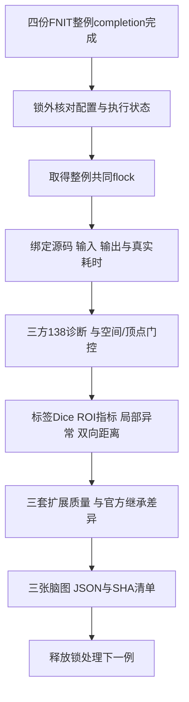

# 两例原始T1整例的三方比较

## 功能与流程

`compare_whole_cases.py`只读已完成的baseline `6f67cc0`、candidate `8d750e2`及两例官方归档输出，复用现有FNIT比较器生成JSON和脑图。candidate对baseline、candidate对官方、baseline对官方分别保留。138项既有严格诊断、优化后变化和整体指标等效分别报告；整体等效保持`not_assessed`，变化不自动判为科学退化。



## 输入、输出与参数

配置模板见`config.json`。所有路径指向受控服务器目录；配置只记录资源路径，不复制影像、权重或许可证。需要以下输入：

| 参数/配置字段 | 含义 |
| --- | --- |
| `--config` | 必需，UTF-8 JSON，含下列路径及两例列表 |
| `--output` | 必需，新诊断目录；存在时拒绝覆盖 |
| `--lock` | 必需，与整例相同的服务器本地锁，当前为`/tmp/fnit-recon-five-20261002-gongwk.gpu.lock` |
| `--wait` | 默认关闭；启用后每15秒在锁外等待所有FNIT completion；失败completion直接报错 |
| `--plan` | 默认关闭；只校验配置结构并打印计划，不读取影像、不运行数值算法、不创建结果目录 |
| `python` | 既有主页Conda Python绝对路径，driver也用此Python启动 |
| `code_root` | 已验证的候选源码根，比较子进程使用其`src`；本轮为`candidate_runtime_8d750e2` |
| `scripts_dir` | 下列六个既有比较/质量/绘图脚本所在目录 |
| `label_table` | 原有FreeSurferColorLUT路径；只读，报告记录SHA |
| `official_provenance` | 可选，官方归档时间/程序及日志SHA记录；不可当本轮配对计时 |
| `data_sources` | 可选，公开去面部CC0示例的`SOURCES.json`；脑图manifest记录其SHA |
| `threads` | 默认4，只允许4；OpenMP/BLAS/Numba/Torch各遵循此总预算，各比较串行执行 |
| `cases[].id` | 必需，唯一单层目录名，当前sub01/sub02 |
| `cases[].baseline_config` / `candidate_config` | 必需，实际整例启动配置JSON；由它读取subject、commit、源码archive、T1及diagnostic_root |
| `cases[].official` | 必需，对应官方整例被试目录，只读 |
| `cases[].official_code_version` | 必需，官方程序版本描述，当前8.2.0/d932c45归档 |

每例输出：

- `execution_binding.json`：实际completion/launch/run、原T1及生成源码SHA、输出完整性、pipeline与entry耗时、原始阶段时间。阶段嵌套时间不相加。
- `strict_{candidate_vs_baseline,candidate_vs_official,baseline_vs_official}.json`：复用`compare_complete_subject.py`的完整138项、既有门槛和所有失败；没有修改门槛。
- `geometry_*.json`：conform shape、scanner affine、`vox2ras_tkr`及表面volume_info（filename除外）、有限坐标/合法索引、有序面/顶点数、各输出内部对white的对应关系和零面积面数。
- `dice_*.json`：七种分割逐标签Dice、不同体素数及最差区域；label 0不纳入摘要，filled使用独立左右半球编码。只比较同conform网格，affine检查沿用既有1e-6，无重采样。
- `region_*.json`：同名ROI的原stats厚度、面积、GrayVol、曲率和aseg/wmparc体积；每区偏差、缺区及局部极值完整保留。
- `no_th3_inputs.json`、`no_th3_*.json`：复用`SurfaceStatsCache(device="cpu").roi_volumes`，对三套各自white/pial/thickness及三种annotation派生明确的no-th3体积。缓存惰性计算体积，不求主曲率。输入和算法源码SHA、每区体积及比较误差单列；同时记录stats中的`-th3/-no-th3/unspecified`。原stats GrayVol另存；不以`.volume`的TH3顶点图替代。
- `surface_*.json`：既有八步表面链诊断；有对应关系时报告同索引位移。拓扑不同则使用成熟全网格三角面距离工具；最终white/pial即便面序相同也报告两个方向。完全相同且闭合连通的网格可证明距离为零，并记录理由。距离是全体源顶点到目标三角面的采样结果，不是连续面Hausdorff。
- `distance_cache.json`：只在单例三方比较内，对source/target/faces各自的shape、dtype和完整C序字节SHA完全相同的请求复用距离数组；不按文件名或近似坐标复用。缓存输出只读，配对比较结束即释放。命中数、实际搜索次数、数组哈希与未命中搜索耗时分别记录；比较时间包含这些工作，不修改任何整例耗时或距离公式。
- `local_*.json`：有空间/有序面/顶点对应关系时，当前138profile实际morph名称的所有元素精确差异、bias/MAE/RMSE/P99/max及前100异常ID，annotation按packed颜色ID给逐标签Dice。跨拓扑时标`not_assessed_vertex_correspondence`。精确差异用于排错，不增设等效门槛；未直接调用使用旧`white.H/K`别名的52项CLI。
- `quality_{baseline,candidate,official}/report.json`：既有extended quality的连通性、边/vertex link、sphere/reg负面积/零面积/非有限面积及white/pial proper transverse穿越。穿越仍用既有每半球180秒、20,000,000 bbox pair预算；超预算或拓扑不对应属于partial，不能计零或宣称质量通过。FNIT自相交复用绑定的pipeline `mesh_validation`；官方缺少该记录时为`not_assessed`，不重算或推定无自相交。接触诊断非穷尽，也不证明pial完全包含white。
- `changes.json`：candidate-baseline失败文件、官方继承/新增/消除的严格失败，逐标签Dice变化、逐区官方绝对误差变化、质量计数变化；不把非零差异自动判为退化。
- `figures/`：复用既有绘图脚本的T1 white/pial叠加、指标误差、局部脑区边界三图及原工具provenance。`figure_manifest.json`绑定输入、许可元数据、脚本及图像SHA。只发布已核实CC0去面部示例的脑图。
- `commands.json`、`commands.log`、`summary.json`：每条实际命令、退出码、耗时及结果SHA；失败命令也保存。顶层`progress.json`保存等待/失败/完成状态及比较源码SHA。

## Python与命令行复现

driver为诊断编排器，没有独立科学计算API。Python可显式调用同一CLI：

```python
from pathlib import Path
import subprocess

python_executable = Path("/path/to/fnit_main_env/bin/python")  # 主页Conda Python
comparison_driver = Path("/path/to/coordinator/compare_whole_cases.py")
comparison_config = Path("/path/to/coordinator/whole_comparison_config.json")
comparison_output = Path("/path/to/parallel_20261002/whole_comparison_8d750e2")  # 必须新目录
common_resource_lock = Path("/tmp/fnit-recon-five-20261002-gongwk.gpu.lock")
subprocess.run([
    str(python_executable), str(comparison_driver),
    "--config", str(comparison_config), "--output", str(comparison_output),
    "--lock", str(common_resource_lock), "--wait",  # 在锁外等待四个整例完成
], check=True)
```

部署时保留候选源码路径，将本driver和config上传coordinator，把以下六个文件从`validation/recon_all/python_gpu_port/`原样放入配置的`scripts_dir`：

```text
compare_complete_subject.py
compare_surface_chain.py
compare_region_stats.py
compare_parcellation_dice.py
benchmark_surface_quality_extended.py
plot_recon_all_comparison.py
```

先确认参数计划，再启动持续任务：

```bash
python compare_whole_cases.py --config whole_comparison_config.json \
  --output /path/to/new_comparison --lock /tmp/fnit-recon-five-20261002-gongwk.gpu.lock --plan
python -u compare_whole_cases.py --config whole_comparison_config.json \
  --output /path/to/new_comparison --lock /tmp/fnit-recon-five-20261002-gongwk.gpu.lock --wait
```

driver自己取得共同锁，启动命令不要再外包同文件flock，以免重复持锁。数值导入也在锁内，CUDA不可见；没有服务器生产任务、球面完整regression或新的官方命令。比较和绘图耗时不计入整例时间。主程序失败保留已生成的报告和日志；重跑使用新输出目录。

## 原软件与当前实测状态

这是离线比较器，没有对应的官方生成命令；官方参考来自已归档的`recon-all -all -parallel -openmp 4 -itkthreads 1`。生产FNIT不调用官方程序。

官方sub01为2026-09-24的gpucw1归档，6790秒；sub02为2026-09-30的**nodecw10**归档，4143秒，与本轮FNIT的gpucw1跨主机。官方Synth在CPU，左右半球`openmp 4`并行可能总8线程，而本轮FNIT总预算4。官方时间用于归档上下文，不作本轮同资源配对提速；`execution_binding.json`完整保留逐例官方metadata与限制。

2026-10-02 baseline两例已完成：sub01 pipeline **3433.332秒**、entry **3440.348秒**；sub02 pipeline **3665.545秒**、entry **3668.889秒**，均138/138输出存在，绑定`6f67cc06ee8c5108ef3640cbfc289f3e5a742f65`。这只是baseline执行与完整性记录，尚无本轮candidate比较结果。candidate两例状态以协调者真实completion为准；本driver开发与诊断复审未执行正式数值比较。

时间安排依据旧两例的质量报告：每套双半球24–31秒，六套约2.5–3分钟，不包含导入、全网格双向距离和绘图。双向距离受网格差异影响，尚无本driver整套实测，先为两例预留10–40分钟；这不是性能结果或硬上界。穿越的每半球180秒限额只限制该步骤，不能作为整份比较的完成保证。

## 更新记录与引用

### 完成后回收原始报告

`../collect_completed_comparison.py`复用已有SSH/SCP连接脚本，先核对两例比较
确实完成，再逐文件收集JSON、CSV、日志和已核实许可的PNG脑图。输出目录必须
不存在；不复制MRI、表面、模型或许可证。收集前后在远端分别计算SHA-256，
本地逐字节核对；报告在收集中变化或哈希不符时抛异常，不覆盖已有目录。
数值单位与坐标空间沿用原报告，收集器不计算或修改影像指标。

```bash
# 下列连接脚本需复用已认证ControlMaster；本命令不新建服务器登录。
python validation/recon_all/optimizations/20261002_parallel/collect_completed_comparison.py \
  --remote-root /data/benchmark/whole_comparison_8d750e2_v2 \
  --output validation/recon_all/optimizations/20261002_parallel/whole_comparison/results_v2 \
  --ssh-wrapper /path/to/ssh_gpucw1.sh \
  --scp-wrapper /path/to/scp_gpucw1.sh
```

四个具名参数均必需：`remote-root`为已完成的远端比较目录；`output`为新本地
目录；`ssh-wrapper`接受一条远端命令；`scp-wrapper`接受来源与目标路径，目标
主机固定为本轮已授权的`gpucw1`。返回stdout计数，同时在输出目录旁写
`collected_comparison_v2.json`，包含原路径、每文件大小/SHA、收集器SHA和时间。
这是元数据回收工具，没有对应的官方软件命令或独立影像计算API；实际完成
情况以收集收据为准。

- 2026-10-02：新增三方整例driver；保留138项诊断，补显式空间/索引门控和成熟no-th3派生比较，复用质量与脑图工具；正式比较尚未执行。
- 同日编排回归：7项标准库控制测试覆盖锁互斥、失败记录、一次interop配置、失败completion、源码变化、partial质量及精确数组缓存；无MRI或GPU计算。重复数组距离缓存只改变比较driver耗时，不作为生产提速结果。
- 同日诊断复审：register scope纳入基线avg_curv，与实际worker一致；显存缺测/零记录不判预算通过，allocator分量峰值与同期进程树峰值分列；补监督失败归档、冻结安装入口断言和报告SHA。新监督检查须由新版进程执行，旧进程不会自动加载。正式候选结果仍以实际completion为准。
- 2026-10-01：既有`compare_performance_pair.py`与`collect_hotspot_whole_comparison.py`提供两方向整例报告；旧结果绑定各自源码，不重标为本轮实测。
- 基础实现：本仓库`compare_subject.py`、`surface_stats_cache.py`及上述六个比较脚本；无新增依赖。
- 原实现：[FreeSurfer d932c45](https://github.com/freesurfer/freesurfer/tree/d932c45)，[mris_anatomical_stats](https://github.com/freesurfer/freesurfer/blob/d932c45/mris_anatomical_stats/mris_anatomical_stats.cpp)。参考：Dale et al., NeuroImage 1999；Fischl et al., NeuroImage 1999；Fischl & Dale, PNAS 2000；Desikan et al., NeuroImage 2006。
