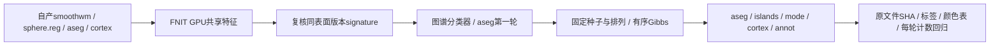

# GCSA缓存检查与有序Numba：两例双侧三图谱完整回归

## 1．功能与范围

本轮先修复成熟`GCSAFeatureCache.validate()`没有复核已有文件signature的接口bug，
再针对实测CPU有序Gibbs热点复用原模型和顶点排列，增加显式Numba后端。
GPU曲率、主方向、分区初始化、aseg修正、islands、mode和cortex输出不变；
已经存在的共享GPU几何没有重写。默认仍`python`，Numba是CPU有序内核，
不是纯GPU或recon-all的新默认。



固定公开ds000114 sub-06/sub-07的FNIT自产589e2749检查点，两例左右半球，
没有官方结果进入生产输入。守卫修复8个进程、Numba ABBA16个进程均正常
退出；两组分别通过5与10个合同。完整源码overlay按SHA绑定，不修改旧冻结树。

## 2．Python调用、完整输入输出

```python
from pathlib import Path
from fnit.recon_all.gcsa_label_python import GCSAFeatureCache, label_surface

subject_directory = Path("runs/fnit_subject")  # FNIT自产mri/surf/label
geometry_cache = GCSAFeatureCache(
    subject=subject_directory,  # 明确被试目录，不读官方参考
    hemi="lh",  # 两侧各自建立缓存，不能交换
    device="cuda:1",  # 显式GPU；当前GPU可以不同
)
annotation_report = label_surface(
    subject=subject_directory,  # 冻结同输入对照时四文件SHA固定
    hemi="lh",  # 与缓存相同
    atlas_file=Path("assets/average/lh.DKaparc.atlas.acfb40.noaparc.i12.2016-08-02.gcs"),  # 固定单特征图谱
    ico4_file=Path("assets/lib/bem/ic4.tri"),  # 分类器节点模板
    ico7_file=Path("assets/lib/bem/ic7.tri"),  # 先验节点模板
    output_file=Path("runs/fnit_subject/label/lh.aparc.annot"),  # 标准v2颜色表文件
    device="cuda:1",  # GPU特征沿既有TF32/float32；无半精度
    prepared=geometry_cache,  # 同表面版本共享；默认None独立准备
    gibbs_backend="numba",  # 显式候选；默认python
)
```

| 输入/参数 | 格式、意义和默认值 |
|---|---|
| subject、hemi | 必填目录和lh/rh；包含当前同顶点顺序的smoothwm、sphere.reg、aseg.presurf.mgz、cortex.label |
| smoothwm / sphere.reg | nibabel FreeSurfer表面，N×3坐标与F×3有序面，surface RAS/mm |
| aseg.presurf.mgz | conformed分割，保留MGH几何及标签；通过vox2ras_tkr采样，不混淆原始T1空间 |
| cortex.label | 同序皮层顶点索引，非体素mask |
| atlas / ico4 / ico7 | 固定单特征GCS概率表与ico节点模板，大小与SHA校验 |
| output_file | 显式路径，标准.annot同序RGB int32标签、v2颜色表和名称；父目录创建 |
| device | 默认cpu，显式cuda:N计算现有GPU特征，Numba概率评分仍CPU |
| prepared | 默认None；缓存须同被试、侧、设备以及四输入版本，否则报错 |
| gibbs_backend | 默认python；numba编译同一异步有序反馈，不进行Jacobi并行 |

完整返回值含vertices/device/backend、Gibbs与islands逐轮整数历史以及
prepare、classifier、aseg、Gibbs、islands、mode、cortex、write、total秒数。
缓存`feature`为N float32/mm⁻¹、principal为N×2×3切向方向、邻接按原顺序。
新CSR概率/高斯参数float64，索引int64；label/mark原位更新，保留固定seed=1234、
原permutation、严格`>`和停止条件。第一次JIT/缓存加载均计入实际阶段。

新内部`pack_model(model, atlas)`、`ordered_sweep(packed, permutation, mark,
feature, labels)`以及`neighborhood_likelihood(packed, vertex, candidate,
input_value, labels)`的参数、返回、失败行为见[GCSA功能页](../../../../docs/recon_all/GCSA_ANNOTATION_ACCELERATION_20261007.md)。
候选要求正方差/先验、非负邻居概率和两方向；零邻居概率保留原惩罚。
无效后端、概率、模板、设备或IO抛异常，不静默回退。

缓存version为解析路径/大小/ns-mtime，四输入变更或删除拒绝旧对象；不跨
white.preaparc、final white或其他网格版本。内容SHA另记于benchmark；
恶意保留大小与mtime的内容修改不在轻量缓存守卫的识别范围内。

## 3．命令行与机器报告复现

```bash
python -m fnit.recon_all.gcsa_label_python \
  --subject runs/fnit_subject --hemi lh --device cuda:1 \
  --atlas assets/average/lh.DKaparc.atlas.acfb40.noaparc.i12.2016-08-02.gcs \
  --ico4 assets/lib/bem/ic4.tri --ico7 assets/lib/bem/ic7.tri \
  --output runs/fnit_subject/label/lh.aparc.annot --gibbs-backend numba
```

完整三图谱同输入复现使用本目录`benchmark_annotation.py`。source/subject/assets/
output目录、hemi、device、threads、mode均须指定；guard模式另提供三份
明确候选文件。旧树只读，输出必须不存在，所有输入和实际overlay均记录SHA。

```bash
python benchmark_annotation.py \
  --source-directory frozen_589 --subject-directory runs/fnit_subject \
  --assets-directory resources/assets --output-directory runs/new_annotation \
  --hemi lh --device cuda:1 --threads 4 --mode guard --gibbs-backend numba \
  --candidate-module source/src/fnit/recon_all/gcsa_label_python.py \
  --candidate-reclassify-module source/src/fnit/recon_all/gcsa_reclassify.py \
  --candidate-gibbs-module source/src/fnit/recon_all/gcsa_gibbs_numba.py
```

`run_benchmark()`参数和CLI一一对应；失败保存partial JSON后抛异常。完整API
包括GPU同步、读写、CSR打包、JIT和CPU更新。controller整进程墙钟另含启动、
导入、校验和最后写出；内部process字段在最后JSON写出前测量，不能替代controller。

```python
from pathlib import Path
from summarize_results import summarize_results

regression_summary = summarize_results(
    reports_directory=Path("reports"),  # 服务器先脱敏后的固定JSON树
    output_directory=Path("new_summary"),  # 已创建且摘要文件不存在
)
```

汇总器不运行MRI，缺少完成状态、输入变更、标签/文件/每轮计数不同直接报错；
生成SUMMARY.json、48行完整图谱耗时和16行显存范围CSV。公开26原始JSON
先在服务器脱敏，18593个数字/布尔/null类型和值不变，原SHA保留；不下载
原始私有路径收据，不发布MRI、权重、许可证或凭据。

## 4．原软件调用

完整阶段对应FreeSurfer8.2.0 `mris_ca_label`。缓存守卫及单轮CSR内核属于
GCSAreclassifyUsingGibbsPriors内部步骤，无独立官方CLI。

```bash
mris_ca_label -aseg subject/mri/aseg.presurf.mgz \
  -l subject/label/lh.cortex.label subject lh subject/surf/lh.sphere.reg \
  assets/average/lh.DKaparc.atlas.acfb40.noaparc.i12.2016-08-02.gcs \
  subject/label/lh.aparc.annot
```

本轮不重新执行官方同输入命令；比较对象是当前自有Python与候选有序Numba，
这与证明官方整体等效分开。589/765实际整例与官方差异、统计量和扩展质量
分别见[589报告](../20261009_whole_inflate_a100_589e2749/README.md)、
[765报告](../20261009_whole_late_mni_a100_765c0fe9/README.md)。生产不调用原软件。

## 5．真实精度、速度、显存和脑图

守卫修复12份实际注释配对全部文件SHA、标签、颜色表、名称、每轮Gibbs/
islands计数一致。Numba16次完整三图谱ABBA的48份注释相对本半球A1也
全相同；没有降低数值门槛。真实每轮标签数组尚未采集，本轮只证明每轮
changed/examined等计数和最终全部标签一致；单元合同验证逐轮数组快照。

同A100 GPU1/CPU76–79，总四线程，每次只运行一个半球；ABBA为Python→
Numba→Numba→Python。下表两次A/B中位数，单位秒：

| 冻结输入 | 三图谱API含共享GPU几何 | API缩短 | 完整冷进程含全部启动/写出 | 有序重分类含CSR/JIT |
|---|---:|---:|---:|---:|
| sub06-lh | 139.304 → 77.939 | 44.05% | 150.759 → 89.887 | 69.535 → 18.734 |
| sub06-rh | 118.800 → 97.323 | 18.08% | 133.845 → 111.659 | 53.504 → 21.146 |
| sub07-lh | 106.397 → 62.185 | 41.55% | 116.017 → 71.484 | 49.569 → 14.179 |
| sub07-rh | 99.822 → 62.389 | 37.50% | 108.449 → 70.456 | 45.946 → 13.546 |

首个真实Numba B1的三图谱API81.850秒，首次JIT已经计入；B2为74.029秒。
合同编译缓存与真实运行缓存分开；后续进程可能复用同签名机器码，完整
冷进程并不意味着每次重新JIT。完整每个role和图谱时间保留于CSV/JSON。
共享负载使06LH A1/A2为120.345/158.263秒，06RH为130.944/106.656秒；
不能把当前1.22–1.79倍阶段观察外推到双侧各2线程的生产组或整例吞吐。

模型初始化2–4秒/图谱，有序重分类占主要CPU时间；原函数字典查找、
Python逐邻居概率评分和逐候选循环由CSR+无fastmath Numba内核执行。
原有控制顺序、候选标签重复项、邻接方向、当前label同分优先和mark反馈保留。
剩余模型初始化和cortex处理仍有成本，不把CPU有序算法伪称为GPU。

全部16次ABBA目标整卡采样最大30603739136字节，计算进程快照和最大
30589059072字节，包含其他共享负载；两种查询不同瞬间。归属无法解析，
本任务父子峰为null；名义0.5秒，最大实际间隔13.672秒，不能证明任务
连续显存低于20GB。关闭CUDA缓存时Torch counters不可用，不作零显存。
TF32、float32特征和原概率精度保持，无autocast/半精度。已有Numba、Torch
和nibabel依赖从主页Conda环境安装，无新增依赖；干净物理隔离未验收。

本轮没有新原始T1整例，10分钟目标未达到，官方整体等效仍未判定。
实际自产表面/统计误差与脑区图在对应生产版本：


这些脑图对应589实际生产输入，不冒充本次Gibbs替换的原始T1整例。

## 6．最近更新和benchmark

- 2026-10-10公开本轮实际回归：缓存守卫与性能候选分别计时/源SHA，ABBA
  完整48注释相同；默认Python保持，root维护后续生产显式接线。
- 2026-10-09实验冻结：守卫v1与Numba v2上传束分别绑定源SHA，候选有限
  概率假设、第一次JIT及共享负载单列；不覆盖589冻结树。
- 589e2749实际两例annotation组110.178/91.240秒，双侧并行各2线程；
  与本页每半球4线程实验不同，不直接相加比较。

## 7．参考文献和代码库

- [FreeSurfer固定d932c45源码](https://github.com/freesurfer/freesurfer/tree/d932c45b7941662ea380a05efef580568b98d41a)。
- [GCSA实现](https://github.com/freesurfer/freesurfer/blob/d932c45b7941662ea380a05efef580568b98d41a/utils/gcsa.cpp)、[mris_ca_label](https://github.com/freesurfer/freesurfer/tree/d932c45b7941662ea380a05efef580568b98d41a/mris_ca_label)。
- Fischl B, et al. Automatically parcellating the human cerebral cortex. Cerebral Cortex. 2004;14:11–22. DOI:10.1093/cercor/bhg087。
- [OpenNeuro ds000114](https://openneuro.org/datasets/ds000114)，公开原始T1和FNIT自产冻结阶段来源。
