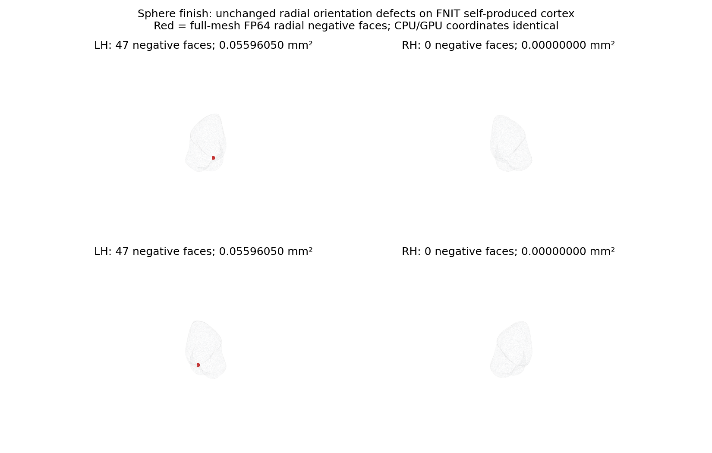

# 实际root接线：完整双侧standard sphere的CPU/GPU finish冷链

## 实际范围

使用公开ds000114 sub-07、803aec50原始T1候选自产smoothwm，重新从相同冻结双侧smoothwm运行实际生产叶函数与半球copy/exec/publish调度。根源码为765c0fe9加显式接线overlay；标准inflation均使用完整Torch实现，子分配缓存均enabled，唯一后端选择为真实`sphere_finish_backend=cpu/torch`。没有marked实现或设备猴补丁。

| 范围 | CPU finish，s | 完整dense GPU finish，s |
|---|---:|---:|
| 双侧完整组，含复制/exec/导入/JIT/传输/IO/发布 | 245.388585 | 173.390478 |
| LH inflation | 7.288094 | 5.363822 |
| LH完整sphere | 222.862722 | 154.304327 |
| RH inflation | 7.377300 | 5.381736 |
| RH完整sphere | 150.072260 | 147.172748 |

共享节点一次冷配对，完整组缩短29.34%，双方包含同样只读观察开销。上述子时间已包含在父组；不相加、不将局部差值称为recon-all整例提速，也不把173.39秒称600秒目标完成。

## 精度与质量

双侧inflated/sulc/sphere所有坐标、有序面、九项几何头严格相同，sphere整文件SHA相同。LH168步、RH189步unfold的每轮坐标、梯度、全部步长/SSE搜索相同；LH1001步、RH0步finish的每轮SOAP、negative/marked、全体投影、dt、扩张和停止状态相同，最大/P99误差0。

10/10父live张量、父cache-off策略、实际子cache-enabled、总4线程（各worker2线程）与TF32/无autocast合同通过。LH既有47个FP64径向负面/0.0559604954mm²面积保持；RH0。输出严格复现通过，未观察新增误差；本阶段未完成三维相交验收，整体指标等效未判定。

红色为全部完整网格的径向负面；绘图背景每八面显示一面，不用于数值计算。质控图是后处理，未计入阶段benchmark；绘图短控制查询20秒超时后，PNG已完成且经读取、SHA与视觉核查。真实算法两组均exit0，该控制超时不重标算法状态。

## 收据与源码

- `summary.json`：实际调度两组完整报告、每轮轨迹、结果比较与资源采样。
- `cpu/scripts/`、`torch/scripts/`：两个真实fresh worker的请求、报告、运行日志与球面优化报告。
- `SUMMARY_METRICS.csv`：双侧完整组和子阶段耗时、轮数、合同与资源；空字段为未测/未知。
- `controls/CONTROL_MANIFEST.json`、`SOURCE_PROVENANCE.json`：测试控制、base commit和实际root overlay源码/归档哈希。
- `controls/launch_v3.log`：真实两组完成日志。
- `PLOT_RECEIPT.json`：只读质控图的源码/PNG哈希和观察边界。
- `COLLECTION_MANIFEST.json`、`public_export_manifest.json`、`PUBLIC_RECEIPT.json`：原始/公开SHA映射；387,000个数值/布尔/null字段逐项保持，原始收据私有保留。

实际调度SHA`ee088f75b3f624f39a5fa5a676ba9be1ec7d167cf4c182d2f26b54a84eecf56a`；原dense finish源SHA`9ba0ce2e7dd6ab0a731a45266f3e7fd8e67b48a39ed7117c65d68cc2a74f9825`，root源包SHA`397859dec9dcf5a296841bfa9d8fd597f2d67f0e8509c2d60197f85cd8fb1890`。观察脚本SHA`7cadd697dcf283a85e9aee7c96c3be42552d5f0c27670c9997ee3871b6c8316c`。未将后来的源码或文字提交改标为本次运行。

## 显存与验证边界

同A100-SXM4-80GB、CPU64–67、总4线程，父CUDA预初始化并保留live张量，子缓存局部开启，默认TF32无半精度；共享节点。两组目标卡同期采样上界均2,290,089,984字节，全部计算进程上界均2,269,118,464字节。父子树归属未知为null。LH单worker阶段allocated/reserved为315,037,184/408,944,640字节，不能与RH峰值相加称同一时刻占用。

名义采样0.5秒；CPU实际最大间隔4.933216秒、零查询失败；GPU最大间隔8.411019秒、两次3秒查询超时完整保留。采样不保证连续峰值；这里没有物理无预装软件的整例隔离验收。

公开包含收据与质控图，不含MRI、surface/NPZ、模板、权重、许可证或凭据。全部参数和复现例见[七节说明](../../../../../../docs/recon_all/SPHERE_FINISH_TORCH_20261009.md)，[实际链脚本](../../benchmark_sphere_finish_group.py)。原始T1空目录新整例由协调者使用新冻结源另测。
