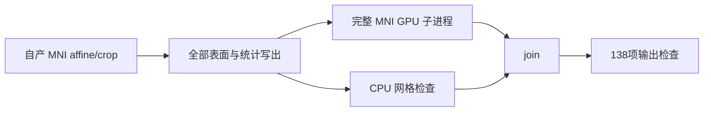

# 完整 MNI 末尾并行接线回归

## 1. 功能与范围

单 T1 recon-all 可显式选择 `mni_execution="parallel-late"`。保留 MNI affine/crop 和 finalsurfs 的原位置，仅将完整非线性链延后到所有半球、映射和统计写出之后，与现有 CPU 网格检查并行。两项 join 后才检查固定138项输出，不生成近似变换或占位文件。



## 2. Python 调用与输入输出

```python
from fnit.recon_all.native_free import run_recon_all_python

reconstruction_report = run_recon_all_python(
    t1="/data/public_T1w.nii.gz",  # 一幅真实原始T1影像，保留原始几何
    subject_dir="/data/recon/new_subject",  # 不存在或空的输出目录
    weights_dir="/data/fnit/weights",  # 已校验的声明权重
    assets_dir="/data/fnit/assets",  # 已校验的模板及图谱
    native_bin_dir="/data/fnit/native/bin",  # 独立源码构建程序；不是系统安装程序
    device="cuda:0",  # 显式GPU，所有实际Synth模型使用FNIT实现
    threads=4,  # 总预算；末尾父CPU和GPU子进程各2线程
    hemisphere_workers=2,  # 表面写出继续采用已有隔离双侧worker
    mni_execution="parallel-late",  # 完整MNI在末尾与网格检查并行
    profile_stages=True,  # 剖析前后同步指定GPU；计时包含加载、搬运和写出
)
```

参数和输出结构沿用[recon-all入口](../../../../docs/recon_all/README.md)。新增参数默认 `in-process`，保留原执行顺序；`parallel-late` 要求显式 `cuda:N`、整数 `threads≥2` 和关闭的 caller CPU/CUDA autocast。输入、体积 conform 网格、surface RAS/mm 及 MNI 变换语义不变，详细变换结构见[MNI功能页](../../../../docs/recon_all/MNI_MESH_PARALLEL.md)。返回完整 `mni_mesh_parallel` 报告、原 `mesh_validation`、`output_validation`、输出路径，并在 `mni_nonlinear.runtime` 保留实际网络精度和输出。非法组合在建目录和线程设置前报错；子任务或网格失败传播异常，保留阶段失败报告，不能返回 complete。

## 3. CLI 与复现

`fnit-recon-all` 的 `--mni-execution parallel-late` 对应同名 Python 参数；批量入口和 `tools/benchmark_recon_torch_end_to_end.py` 原样转发并在报告中记录。其余必须参数见主入口，不能省略原始T1或声明资源。

```bash
python validation/recon_all/optimizations/20261009_mni_execution_integration/run_contracts.py \
  --source-root /path/to/frozen/source \
  --code-version BASE_COMMIT_PLUS_SOURCE_HASHES \
  --output-report /path/to/new/contracts.json
```

`source-root` 指本次冻结 src/tests/tools；`code-version` 指实际提交及覆盖源码SHA，不能写成另一版本；`output-report` 必须是新 JSON。本脚本返回测试数、错误、逐项日志、Python/Torch及全部接线源码SHA。不执行模拟影像 benchmark；失败返回非零并保留报告。

## 4. 原软件对应

此次仅改变 FNIT 调度，复用完整 MNI GPU 算法和网格验证，没有新官方 CLI。对应 MNI 官方命令和原实现链接沿用[MNI功能页](../../../../docs/recon_all/MNI_MESH_PARALLEL.md)，未调用官方程序作为生产路径。

## 5. 本次验证

39项入口契约全部通过，实测2.332秒；这不是MRI精度或整例耗时。新增9项覆盖默认顺序、延后依赖、join先于存在性检查、失败传播、单半球父autocast拒绝，以及单例/批量/CLI/benchmark参数转发。

完整 helper 的两例八次 ABBA 已单独完成：sub06 160.421→94.287秒，sub07 142.240→72.892秒；全部正式变换及检查图体素、几何、文件SHA和原网格报告一致，见[带版本和图像的真实数据报告](../20261009_mni_mesh_parallel/README.md)。这些是同输入完整组结果，不能算作接线后原始T1整例收益。接线后的原始T1整例、干净Conda部署及同期20GB进程树门槛尚未在本报告判定；整体指标等效为 `not_assessed`。

独立安装范围：765c0fe9使用声明Conda编译器构建wheel14.126秒、安装到新私有目标3.223秒、实际安装包CLI2.994秒；9个相关模块字节与冻结源码相同，wheel SHA为`f00365dd866d779a1d4f2efdb97827c7000e6cd1861c1dd7b2f55c3c451f8483`。完整[安装报告](package/package_report.json)、[源码记录](package/package_source.json)和[复现工具](package/run_package_validation.py)单列。这没有新建Conda环境，也未在安装包路径执行MRI整例，不能宣布独立部署通过。

## 6. 版本与收据

测试基线为 `eae295116c9503699cbc175f7eed40005d17de64` 加本次根调度覆盖；实际SHA列于 [SOURCE_PROVENANCE.json](reports/SOURCE_PROVENANCE.json)，39项详细结果见 [contracts.json](reports/contracts.json)。报告的逐文件SHA与实际提交源码核对后再接入；不把后续提交号追写为已测试版本。

成熟子函数 `fill_inverse_fields` 的目标设备修复及真实完整回归由 `eeaaae1a` 提供；公式和迭代规则保持。新exec不继承caller autocast，因此接线新增前置拒绝；TF32默认和已验证FP32前向例外继续保留，不全局关闭TF32。

## 7. 参考

- [FNIT MNI功能、精度、输入输出与上游实现](../../../../docs/recon_all/MNI_MESH_PARALLEL.md)。
- [FNIT recon-all主说明与参考文献](../../../../docs/recon_all/README.md)。
