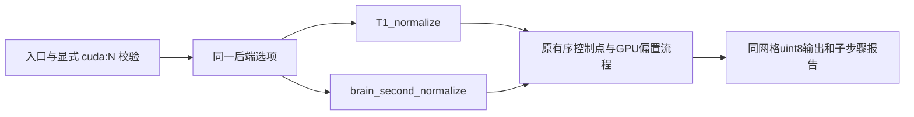

# 两轮归一化 GPU 邻域的 recon-all 接线验证

## 1. 功能简介

冻结 `b96e9447f28d47cf6fc14e3cfa79f2906a34c335` 将已有 `controls_neighbor_backend="torch"` 接入单例、批量、CLI 和整例测量脚本。公开选项为 `normalization_controls_backend`，默认 `cpu`；只迁移邻域统计和缓冲复用，原有序控制点选择、离群清理及其余偏置流程保持。



## 2. Python 调用与输入输出

```python
from pathlib import Path
from fnit.recon_all.native_free import run_recon_all_python

reconstruction_report = run_recon_all_python(
    t1=Path("input/T1w.nii.gz"),  # 原始三维单T1，不读取官方输出
    subject_dir=Path("output/subject"),  # 不存在或为空，连续重建标准输出
    weights_dir=Path("resources/weights"),  # 已校验模型权重
    assets_dir=Path("resources/assets"),  # 已声明模板、图谱和标签表
    native_bin_dir=Path("environment/bin"),  # 固定源码在Conda内独立构建的程序
    device="cuda:0",  # 显式目标设备，遵循CUDA_VISIBLE_DEVICES
    threads=4,  # 被试总CPU线程预算
    normalization_controls_backend="torch",  # 两轮复用GPU邻域，不改其他算子
    profile_stages=True,  # 阶段目标设备同步与完整墙钟；生产默认False
)
```

新增选项仅接受 `cpu` / `torch`；后者要求 `cuda:N`。非法组合在资源校验或创建输出前失败，设备名称解析错误沿 PyTorch 异常传播，不静默回退。完整入口参数见[主参数表](../../../../docs/recon_all/README.md)。本测试没有执行上述完整重建示例。

第一轮读自产 conform XYZ 网格的 `nu.mgz` 与 Talairach RAS/mm 变换，写同网格 uint8 `T1.mgz`；第二轮读同网格 `norm.mgz`、整数 `aseg.presurf.mgz`、脑掩膜，写 uint8 `brain.mgz`。不改变 scanner RAS affine 或标签语义。完整接口返回 `normalization_configuration`，记录实际路由选项、请求设备和保留的原规则；`stages[*].algorithm_substep_seconds` 保留原内部计时，不与父阶段重复相加。

`run_contracts.py` 输入为含 `src/tests/tools` 的冻结仓库根、实际 Git 版本和不存在的 JSON 路径。输出包括八份源码/测试 SHA-256、Python/Torch 版本、线程、24项结果、完整错误栈和测试墙钟；返回0表示契约通过。文件、导入或写出错误直接传播。没有影像输入、坐标、算法精度或整例速度含义。

## 3. 命令行调用

```bash
# 同一选项也可传给tools/benchmark_recon_torch_end_to_end.py。
python -m fnit.recon_all.native_free input/T1w.nii.gz output/subject \
  --weights-dir resources/weights \
  --assets-dir resources/assets \
  --native-bin-dir environment/bin \
  --device cuda:0 --threads 4 \
  --normalization-controls-backend torch --profile-stages

# 入口契约；不以其临时测试文件充当真实影像benchmark。
python validation/recon_all/optimizations/20261009_normalization_integration/run_contracts.py \
  --source-root frozen/b96e9447 \
  --code-version b96e9447 \
  --output-report runs/contracts.json
```

`source-root` / `code-version` / `output-report` 均必填；含义见上一节。测量脚本记录选项并传给真实生产 CLI，没有新增依赖，继续使用主页 Conda 环境的 PyTorch、Triton、Numba、SciPy 和 nibabel。

## 4. 原软件调用

```bash
mri_normalize -g 1 -seed 1234 -mprage nu.mgz T1.mgz
mri_normalize -seed 1234 -mprage -aseg aseg.presurf.mgz -mask brainmask.mgz norm.mgz brain.mgz
```

这些命令仅为独立 benchmark 参考。邻域缓存与入口路由属于命令内部步骤，没有独立官方 CLI。

## 5. 实际验证与范围

| 证据 | 本次结果 | 可以支持的结论 |
| --- | --- | --- |
| A100 环境 Python 3.11.16 / Torch 2.5.1、4线程入口契约 | v2为24/24通过，1.469秒 | 两轮选项的单例、CLI、batch、benchmark路由、非法CPU组合、旧输出和计时契约保持 |
| 同输入归一化完整 API，两例、16次 | 输出文件、头/几何、每轮强度/控制图及算法计数0新增差异 | GPU邻域保持旧算法；这组由阶段源码SHA绑定，不改标为b96接线整例 |
| 初次 API 完整 ABBA 中位数 | sub-06 96.022→48.617秒；sub-07 70.954→40.575秒 | 同输入完整归一化接口更快，不能直接外推整例 |
| 第二次 API | 邻域更快；整体耗时有共享负载波动 | 尚未证明整阶段稳定提速 |
| 803aec50自产稳定前段：候选/控制，两例 | 12体积及talairach.lta数值、dtype、网格均0新增差异；filled逐标签Dice为1 | 该冻结版本GCA缓存/分块求逆与有序fill的连续前段保持；不是新邻域接线整例 |
| 新邻域选项的原始T1空目录整例 | 尚未运行完成 | 不判定整例提速、网格或指标等效 |

阶段精度、GPU峰值/采样边界和真实脑图见[GPU邻域完整说明](../../../../docs/recon_all/NORMALIZATION_GPU_NEIGHBORS.md)。入口契约没有图像，故不伪造本测试脑图。已完成旧冻结整例及官方差异见[803aec50真实结果](../20261009_whole_a100_803aec50/README.md)。官方结果只供独立对照，生产不读取。

完整[JSON副本](reports/)保留数值、布尔值和null；[导出清单](reports/PUBLIC_EXPORT_MANIFEST.json)绑定原始/公开SHA。私有路径和主机脱敏，不发布真实影像、许可证或凭据。环境为可运行环境迁移；全新主页 Conda 安装与物理隔离部署尚未验证。

## 6. 最近更新与失败记录

2026-10-09：接线提交 `b96e9447`。首次契约 v1 有2项测试夹具错误：全局 mock 的 `subprocess.run` 污染依赖导入；假成功内部流程未建立被试目录。v2只修复测试，隔离调度器模块引用、正确建立成功测试目录，生产源码未改变。v1完整失败报告保留，未删除失败项或调整算法门槛。v2测试补丁和复现脚本SHA另存于收据。

同日：复用既有体积比较器，比较仍在运行整例中的稳定自产前段；机器报告明确标为 `connected_prefix`，不把检查点对照称整例验收。

## 7. 原代码与参考文献

- [FreeSurfer mri_normalize](https://github.com/freesurfer/freesurfer/tree/d932c45/mri_normalize)
- [FNIT](https://github.com/weikanggong1/Fudan-Neuroimaging-toolkit)
- Fischl et al. (2002), *Whole brain segmentation: automated labeling of neuroanatomical structures in the human brain*, Neuron 33:341–355。
