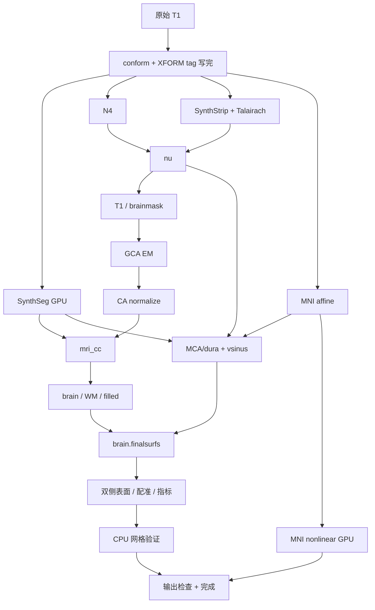

# recon-all 可并行阶段的依赖审计

## 1. 功能与范围

本页核对当前代码的输入、输出和写入屏障，给下一轮并行调度提供可执行边界。这里只读取源码和已有真实整例报告，**没有运行并行候选，也没有修改生产调度**。审计源码的提交和逐文件 SHA-256 见 [audit.json](audit.json)。计时只属于 `803aec50248385b3e4170cc8cdaa9667035f7288` 的公开 ds000114 两例四次原始 T1 整例，不能改标为后续候选的测量。

审计读取时协调者的 `native_free.py` 接线改动尚未提交；JSON 同时保存工作树 SHA、HEAD SHA 和 `matches_HEAD=false`，不把该文件冒称为 HEAD 的原样代码。此审计提交仅包含报告与复现脚本，没有提交协调者的接线。



图表示实际数据依赖，不表示这些阶段已并行。当前调度把 `MNI nonlinear` 放在 `brain.finalsurfs` 之前，但后者不读取非线性变换。

## 2. Python 调用、输入与输出

```python
from pathlib import Path
from benchmark.recon_parallel_dag_audit import build_audit

result = build_audit(
    repository=Path("."),  # 含当前 FNIT 源码、固定整例 CSV/JSON 的仓库根目录
    output=Path("local_reports/recon_dag"),  # 审计输出目录，不是被试影像目录
)
```

`repository` 默认由命令行取本脚本的仓库根目录；Python API 要求显式提供。`output` 要求显式提供，创建目录并写入同名审计文件。脚本只使用标准库，不初始化 CUDA、不读取影像或许可证、不下载资源。缺少函数、报告未完成、线程数不是四、CSV 与原始运行 JSON 的阶段时间不一致时抛异常。

输出：

- `audit.json`：当前代码提交、八个源码文件 SHA、函数定义位置、四个真实运行 JSON SHA、调度 DAG、候选顺序、读写冲突和待验证项。
- `selected_stage_times.csv`：`case/kind/stage/seconds/scope`，秒为完整阶段墙钟，嵌套和并行组不能相加。
- `MANIFEST.json`：脚本及上述两个输出的 SHA-256。

影像依赖均保持原空间：`orig/nu/brainmask/aseg/brain.finalsurfs` 为同一 conform 网格；表面验证读取有序 surface RAS 坐标；MNI warp 使用原有 MNI/个体网格及毫米位移。审计没有变换这些数据。

## 3. 命令行与复现

```bash
python3 benchmark/recon_parallel_dag_audit.py \
  --repository . \
  --output local_reports/recon_dag
```

`--repository` 指定代码和既有证据所在仓库，`--output` 指定报告目录。复跑在新目录进行，保留本次冻结报告；新 HEAD 会产生新的源码版本绑定。

## 4. 对应原软件调用与实际 FNIT 调用

这是一份调度审计，没有独立 FreeSurfer 命令。原完整流程为 `recon-all -s SUBJECT -i T1 -all`；相关子命令为 `mri_synthseg`、`mri_synthmorph`、`mri_ca_normalize` 及表面阶段，具体固定参数仍见各功能页。

本次检查的 FNIT 实现：

- `run_synthseg_and_write` 只读取 `orig.mgz`、声明的权重和 LUT，写 `synthseg.rca.mgz` 与体积 CSV。GCA EM 不需要 SynthSeg；第一个必须等待分割的消费者是 `mri_cc`。
- `run_mni_aux_chain` 读取 `orig/nu/synthseg.rca`，生成 affine/crop、`mca-dura/vsinus` 及统计。完整统计还需要自产 `talairach.xfm.lta`。
- `run_mni_nonlinear_chain` 只需要 `orig`、MNI affine/crop、声明的权重和模板；写前向/逆向 warp、检查图及临时变换。
- `run_finalsurfs` 读取 `brain/brainmask/mca-dura/vsinus/entowm/aseg.presurf`，不读取非线性 warp。white/pial 必须等它的最后一次原位编辑和 checkpoint 写完。
- `_validate_meshes` 只读取双侧 `orig/white/pial/sphere.reg`，执行 CPU 网格检查，不读取 MNI 变换。

生产实现仍遵循既有 FNIT/独立源码构建边界；本审计不会调用任何官方程序。

## 5. 真实阶段时间与并行建议

同一 A100/四线程预算的冻结整例阶段如下。控制和候选各一次，有共享负载；这些数值**不是新并行方案的实测收益**。

| 阶段 | sub06 控制 / 候选，秒 | sub07 控制 / 候选，秒 |
| --- | ---: | ---: |
| N4 | 171.746 / 165.616 | 168.565 / 168.426 |
| SynthSeg | 12.542 / 13.477 | 14.358 / 15.568 |
| CA normalize | 25.520 / 22.393 | 24.699 / 24.962 |
| MNI auxiliary | 7.927 / 8.907 | 8.166 / 8.718 |
| MNI nonlinear | 56.141 / 64.391 | 63.191 / 55.706 |
| 双侧 surface 组 | 710.723 / 658.870 | 776.876 / 815.586 |
| 最后 CPU 网格验证 | 82.773 / 80.868 | 60.826 / 62.030 |

建议按以下顺序实施和配对：

1. **MNI nonlinear 与最后的 CPU 网格验证重叠。** 此时所有半球目录复制已完成，变换输出与表面读取互不冲突。采用 fresh exec MNI worker；CPU 总预算四，MNI/验证各至多二，核对实际 Torch/Numba/BLAS/native 线程。两者都成功并完成发布后再生成完成状态与完整输出清单。相比早期开后台，这是改动最小的候选。
2. **SynthSeg 与 CPU CA normalize 重叠。** 在 GCA 结束后启动独立 SynthSeg worker，主链完成 CA normalize，`mri_cc` 前等待分割。它适用于已使用 GPU N4 的 profile，避免同时启动两个大网络阶段。两进程的 CPU 预算分别至多二，计时需包含进程导入、网络加载及两份输出写入。
3. **原生 CPU N4 与 SynthSeg 重叠。** 两者都读已完成 XFORM tag 写入的 `orig`。只适用于 native N4 profile；GPU N4 与 SynthSeg 的同期显存未验。将原来四线程 N4 分成二线程后可能变慢，必须测完整组墙钟，不能直接把 13–16 秒算成整例节省。
4. **MNI nonlinear 与早期表面 CPU 段重叠。** 有更长 CPU 窗口，但需要私有最小 subject、副本发布屏障和 GPU 资源准入。表面组包含 tessellation、曲率、法线，新的 Torch inflate 选项也会使用 GPU；不能把整个表面组称为 CPU 工作。

关键冲突：`run_hemisphere_group` 在每组开始时复制整个 `mri/surf/label/stats` 并建立快照。后台 MNI 直接写父被试目录时，目录遍历可能遇到尚未写完的文件。若采用方案四，MNI worker 必须使用独立输入副本并在成功后发布；不得让它与半球复制同时写父目录，也不使用可被原位写入的 hardlink。

保留 `surface.defects.mgz` 左后右累计顺序。模型设备/精度和线程设置有进程全局状态，不能用同进程线程池并发改变这些设置。FP32 deform、SynthSeg cuDNN FP32 例外在子进程内明确施加，父进程 TF32 和现有 allocator 策略保持可检查。

本次四个旧整例的 allocator 为关闭缓存；PyTorch allocated/reserved 不可用，不能当作零显存。因此没有同期 20,000,000,000 字节保证。候选需要记录目标 GPU 的父子同期合计、实际采样间隔、整卡上界和映射缺失；再测 CLI、已初始化 CUDA API、同输入 ABBA 及原始 T1 空目录整例。已有精度和脑图见 [两例完整基准页](../20261009_whole_pair_a100_803aec50/README.md)，审计没有产生新的脑图或数值结果。

## 6. 更新与验证记录

- 本次运行脚本核对四份完整 JSON 与 CSV，保留当前源码和冻结计时版本的独立 SHA 绑定。
- 当前没有并行候选回归、同期显存或端到端提速结果。`measured_parallel_speedup=null`、`simultaneous_gpu_budget_verified=false`。
- ridge 消费范围优化已独立提交 `15f0a67c`，同输入两例完整第二轮归一化 8/8 MGZ 字节相同；它与本次调度建议属于不同证据范围。

## 7. 原代码与参考

- FNIT 调度源码：[native_free.py](../../../../src/fnit/recon_all/native_free.py)、[hemisphere_parallel.py](../../../../src/fnit/recon_all/hemisphere_parallel.py)。精确位置和 SHA 见审计 JSON。
- [FreeSurfer recon-all 源码](https://github.com/freesurfer/freesurfer/blob/dev/scripts/recon-all)。上游固定提交由各独立构建/数值报告记录；此链接仅用于阅读。
- [SynthSeg，Billot 等，NeuroImage 2023](https://doi.org/10.1016/j.neuroimage.2023.120012)。
- [SynthMorph，Hoffmann 等，IEEE TMI 2022](https://doi.org/10.1109/TMI.2021.3116879)。
