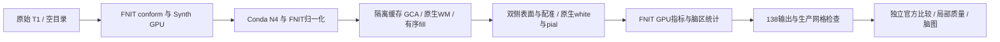
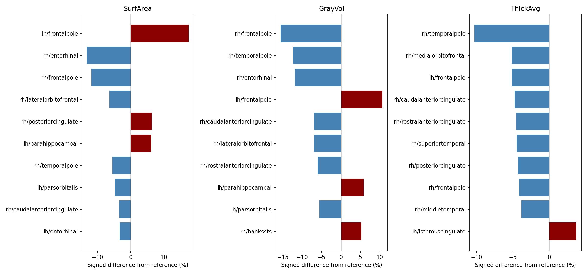
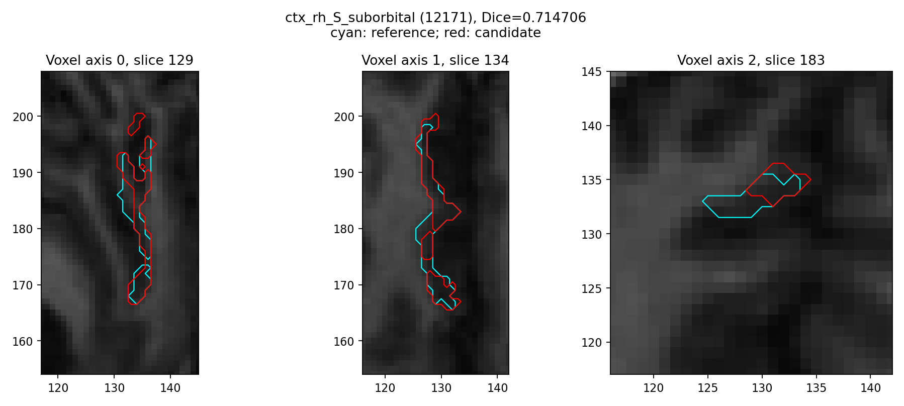

# 冻结 803aec50 的原始 T1 整例与官方比较

## 1. 范围与流程

本记录对应公开 ds000114 的 sub-06 原始单 T1，生成代码冻结在 `803aec50`。它不是后续 N4、WM、邻域卷积或 white 实验提交的整例结果。原始影像、官方输出和许可证不在本报告目录内。



CLI 完整墙钟为 **2255.064 秒**，API 为 **2250.969 秒**；本版本测量脚本从参数和路径校验之后开始的包装墙钟为 **2263.678 秒**。后处理比较另用 **1038.081 秒**，不计入生产 recon-all 时间。十分钟目标未达到。

## 2. 输入、输出与 Python 调用

- 输入：原始三维 T1 NIfTI，SHA-256 为 `7e33afb28f631fac31d81e2428a6144f61aba4102859c694eeb49ee584de04f7`。生产只读取它、声明的资源及自产中间结果。
- 几何：conform 为 `(256,256,256)`；候选与官方 scanner affine、vox2ras_tkr 相同。表面坐标为 surface RAS，单位 mm。
- 候选输出：标准 `mri/`、`surf/`、`label/`、`stats/` 和 `fnit-native-free-run.json`，**138/138 齐全**。所有路径及存在性见 [run.json](reports/candidate/run.json)。
- 比较输入：同一原始 T1 的归档 FreeSurfer 8.2.0 `d932c45`，只用于独立诊断。官方在另一主机生成，历史耗时不构成本轮配对加速证据。
- 机器报告：[SUMMARY.json](reports/SUMMARY.json)、[完整阶段表](stage_times.csv)、[半球内部阶段表](hemisphere_times.csv)、[全部比较](reports/comparison/evaluation.json)。JSON 保留原始数值，路径和主机经脱敏；[导出清单](reports/PUBLIC_EXPORT_MANIFEST.json)绑定原始/公开 SHA，并验证全部数值、布尔值、null 未改变。

复现候选的核心调用如下；每次使用新空目录。完整路径、参数和返回结构见 [recon-all 说明](../../../../docs/recon_all/README.md)。

```python
from pathlib import Path
from fnit.recon_all.native_free import run_recon_all_python

reconstruction_report = run_recon_all_python(
    t1=Path("input/sub06_T1w.nii.gz"),  # 与清单绑定的原始单T1
    subject_dir=Path("runs/new_subject"),  # 新空目录，不能补跑称为整例
    weights_dir=Path("resources/weights"),  # 已校验的外置权重
    assets_dir=Path("resources/assets"),  # 已声明的模板、图谱与标签表
    native_bin_dir=Path("resources/native/bin"),  # 固定源码独立Conda构建
    device="cuda:0",  # 显式逻辑GPU；实际卡由环境映射
    threads=4,  # 总CPU线程预算，双半球各2线程
    hemisphere_workers=2,  # 双侧隔离进程，保留共享输出顺序
    native_optimizations="auto",  # 本轮实际模式，仍含原生表面阶段
    defects_backend="native",  # 保持本次缺陷体积的实现
    sphere_normals_backend="numba",  # 保持既有同输入球面路径
    wm_backend="native",  # 本次没有使用后续WM GPU实验
    wm_edit_backend="native",  # 同上，保持核心编辑
    gca_inverse_backend="torch",  # 完整候选评分中的分块逆矩阵
    gca_candidate_chunk=1024,  # 实测候选块大小
    gca_execution="isolated",  # 仅子进程启用CUDA分配缓存
    fill_backend="torch-numba",  # GPU初始边界与有序CPU反馈
    profile_stages=True,  # 同步目标GPU，记录完整阶段墙钟
)
```

成功返回执行/输出/网格报告；计算、读写或必要质量检查失败抛异常并保留部分 JSON。该成功状态不表示与官方严格一致或整体指标等效。

## 3. 命令行复现

在冻结 `803aec50` 源码与已安装资源上执行；`output-root` 必须不存在。计时包含子解释器启动、校验、模型加载、搬运、计算和写出。

```bash
python tools/benchmark_recon_torch_end_to_end.py \
  --t1 input/sub06_T1w.nii.gz \
  --output-root runs/new_sub06_candidate \
  --weights-dir resources/weights \
  --assets-dir resources/assets \
  --native-bin-dir resources/native/bin \
  --device cuda:0 --threads 4 --hemisphere-workers 2 \
  --native-optimizations auto --defects-backend native \
  --sphere-normals-backend numba --wm-backend native --wm-edit-backend native \
  --gca-inverse-backend torch --gca-candidate-chunk 1024 \
  --gca-execution isolated --fill-backend torch-numba \
  --code-version 803aec50
```

独立比较使用 `tools/evaluate_recon_torch_run.py` 的具名参数，见[调用说明](../../../../docs/recon_all/PIPELINE_STAGE_EXECUTION_20261009.md)。它校验完成收据、原始输入 SHA 和实际生成源码 SHA，复用现有 138 项比较器；不会重跑或修改生产结果。

## 4. 官方参考

归档完整参考使用 `recon-all -i <T1> -s <subject> -all`，4线程、ITK拟合1线程、随机种子1234；实际完整配方及程序清单 SHA 保存在私有参考 manifest。归档 sub-06/sub-07 墙钟分别为 5735.363/6138.304 秒，来自另一主机。当前候选对归档文件的比较在同一 A100 主机进行；没有补做当前主机官方整例或官方完整整例重复性测试。

## 5. 实测结果

### 时间与实现

Xeon Platinum 8369B、A100-SXM4-80GB、4线程。运行期间有共享任务，完整各阶段和子阶段原始秒数保留在 CSV/JSON。并行子阶段已包含在组墙钟内，不能再相加。

| 本次主要阶段 | 完整墙钟（s） | 实际策略 |
| --- | ---: | --- |
| conform / SynthStrip / Talairach | 39.497 | FNIT Python/PyTorch，Synth GPU |
| N4 | 165.616 | 独立 Conda 编译的 ITK C++，CPU，拟合1线程 |
| 第一次归一化 | 67.890 | FNIT PyTorch + NumPy/Numba CPU；未用后续GPU邻域 |
| SynthSeg | 13.477 | FNIT 自有 PyTorch GPU，记录实际 FP32 卷积例外 |
| GCA 注册 | 36.114 | FNIT GPU候选评分 + Python EM，独立缓存子进程 |
| 第二次归一化 | 56.154 | FNIT PyTorch/NumPy/Numba，含有序CPU反馈 |
| WM segmentation / aseg edit | 48.557 / 22.612 | 固定 FS 源码在 Conda 独立构建，CPU |
| filled | 14.655 | FNIT GPU初始边界 + 编译有序CPU heap |
| MNI nonlinear | 64.391 | FNIT SynthMorph GPU及既有后处理 |
| 双侧表面组 | 658.870 | FNIT拓扑前段/CPU remesh/混合球面；Conda拓扑GA和white.preaparc |
| 双侧 sphere.reg | 302.088 | FNIT PyTorch/Numba CPU，GPU平均/部分重叠 |
| 双侧主要注释 | 109.193 | FNIT Python/Numba CPU，双侧并行 |
| 最终 white/pial 组 | 383.178 | 固定 FS 源码 Conda C++ CPU，双侧并行 |
| 厚度、面积、曲率 | LH 4.445 / RH 3.121 | FNIT PyTorch GPU，复用自产同一网格 |
| 生产网格检查 | 80.868 | 完整闭合、有序面与自相交检查 |

表面组的同一条关键链内部：LH/RH 拓扑GA121.772/67.420秒，remesh89.071/89.276秒，standard sphere128.040/145.876秒；sphere.reg281.315/286.199秒。当前瓶颈集中在这些步骤和 white/pial，不能把快速指标算子当成整例十分钟证据。

### 严格复现与指标

现有严格门保留，**6/138 通过**。在这138项比较的前段标准文件中，`orig` 全体素和几何相同；`nu` 差69体素、最大3、P99为0，随后 T1差111体素、最大5；norm差1,158,546体素、最大16、P99为2。这尚未定位N4内部的第一处差异。这些是本版本实际比较，不能用历史两体素记录替代，也不能一概称浮点尾差。新旧性能候选的同主机整例回归已完成，两例138项容差诊断通过、表面坐标与68区指标相同，零容差顶点图尾差另列，见[完整配对报告](../20261009_whole_pair_a100_803aec50/README.md)。既有官方差异仍独立记录。GCA当前复用的Python EM细化也没有获得完整官方EM等价结论，隔离缓存的同输入一致不等于这一算法缺口已解决。

MNI forward/inverse场的逐元素最大差分别为1.9769/69.2093，均未通过现有诊断；这里仅引用存储分量的数值，不把它直接解释成解剖表面位移。映射方向、场单位及误差传播需要单独核对，不能因皮层统计较接近而隐藏这两个失败输出。

| aparc 68区统计 | MAE | 相对误差中位数 / P90 | 最大绝对误差 |
| --- | ---: | ---: | ---: |
| 平均厚度 | 0.044824 mm | 1.4329% / 4.1711% | 0.289 mm |
| white面积 | 31.3971 mm² | 1.1226% / 4.9738% | 181 mm² |
| 原统计灰质体积 | 151.1471 mm³ | 1.9067% / 5.9040% | 681 mm³ |
| 统一 no-th3 灰质体积 | 151.1922 mm³ | 1.9081% / 5.9008% | 680.7812 mm³ |

no-th3 使用两组自产输出各自的 white/pial/厚度/注释，统一同一算法另算；原统计保留，TH3顶点体积没有替代脑区体积。全局皮层体积差为-0.4828%，LH +1.2404%、RH -2.2329%，左右差异不能由总体均值掩盖。原始逐脑区数值及零参考区见 JSON。

| 分割图 | 非背景标签Dice中位数 | 最低Dice |
| --- | ---: | ---: |
| aseg | 1.0000 | 0.9645 |
| aparc+aseg | 0.9512 | 0.8363 |
| a2009s+aseg | 0.9131 | 0.7147 |
| DKT+aseg | 0.9546 | 0.8870 |
| wmparc | 0.9487 | 0.8363 |
| ribbon | 0.9743 | 0.9594 |
| filled | 0.9938 | 0.9935 |

最低 a2009s 标签为右侧 S_suborbital，Dice0.7147；aparc最低为左frontalpole，0.8363。所有标签、计数和LUT语义逐项保留，不以标签数值相关性代替Dice。





候选LH/RH顶点数130679/132459，官方129504/131629，**没有逐顶点对应关系**。下表为全部候选顶点到官方完整三角面的距离；反向也独立报告。不是连续 Hausdorff 距离。

| 表面 | 候选→官方 mean / P99 / max（mm） | 官方→候选 mean / P99 / max（mm） |
| --- | --- | --- |
| LH white | 0.0758 / 0.4720 / 3.0048 | 0.0728 / 0.4066 / 3.0332 |
| RH white | 0.0748 / 0.4214 / 3.1975 | 0.0756 / 0.4489 / 2.5679 |
| LH pial | 0.1064 / 0.7189 / 4.8525 | 0.0981 / 0.6787 / 3.0944 |
| RH pial | 0.1057 / 0.7178 / 3.3877 | 0.1073 / 0.6809 / 3.0128 |

### 网格与局部质量

候选双侧单连通、Euler2、边界/非流形/顶点link异常0，sphere/sphere.reg负面积、零面积和非有限面积均0；生产 white/pial各自自相交为0。扩展检查的 **white/pial严格横穿三角对** 为候选LH/RH **567/260**，官方 **441/269**；其中六个顶点均处于cortex的对数为候选501/237、官方395/221。计数是三角对，不能解释为穿越顶点或脑区数量。端点接触、共面命中和同索引重合面另外记录。完整覆盖已测，质量整体验收没有因官方也有穿越而宣布通过。

### 显存与安装

目标卡整卡采样峰值12,315,525,120字节（12.316GB），包括其他任务；同期计算进程合计采样峰值12,306,087,936字节也是独立上界。父子树归属未解析，不能据此保证FNIT真实连续峰值。计划间隔0.5秒，实际最大间隔9.149秒，5次查询超时。缓存关闭路径的PyTorch计数不可用，0不代表零显存；隔离GCA子进程的可用allocated/reserved单列在阶段报告。

使用已迁移并校验的主页依赖环境及独立构建原生程序，没有新增依赖。全新Conda安装和物理上不存在预装脑影像软件的隔离整例尚未验证。

## 6. 更新与未完成项

2026-10-09：实际冻结源码538个Python模块、输入/权重/资产/候选原生程序SHA和四线程配置记录在benchmark。官方pial别名最初未随参考打包，首次比较失败保留在私有日志；修正为经SHA确认的原始链接目标后，本次完整比较成功，候选输出没有改变。

两例同主机基线/候选的整例配对尚在运行；本记录只有sub-06候选完成。整体等效阈值尚未正式确认，保持 `not_assessed`；无最终端到端提速比例。后续 N4/WM/归一化/white 实验的同输入结果在各专页，不能相加或改标为本整例性能。

## 7. 实现与参考

- [FNIT recon-all](https://github.com/weikanggong1/Fudan-Neuroimaging-toolkit/tree/803aec50/src/fnit/recon_all)
- [FreeSurfer 固定源码](https://github.com/freesurfer/freesurfer/tree/d932c45)
- [ds000114 公开数据](https://openneuro.org/datasets/ds000114)
- Fischl et al. (2002), *Whole brain segmentation*, Neuron 33:341–355。
- Dale et al. (1999), *Cortical surface-based analysis. I. Segmentation and surface reconstruction*, NeuroImage 9:179–194。
