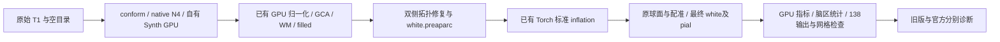

# GPU 标准 inflation 接入后的两例原始 T1 完整验证

## 1．功能与范围

生产源码冻结于 **589e2749**，549个Python模块及15个候选程序逐SHA绑定。源码包 SHA-256 为
`06f4cf1c72bce4b47812c9094710bb635f71fc7796a5ff57c9e1f9c87e650bde`。
公开 ds000114 sub-06/sub-07 从原始 T1 和新空目录连续运行，标准 smoothwm
inflation 复用 FNIT 已有 PyTorch GPU 实现，双侧各在独立 worker 中执行。
对照为上一版 0cd9cbd5 的同例完整结果：相同原始输入、主机、A100 GPU6/7、
CPU 亲和性40–43/44–47和总四线程。每例一次完整配对，未做整例 ABBA。



nofix inflation、拓扑 GA、remesh、white/pial 的原实现保留，未整条替换为
GPU，也未降低任何输出或验收门槛。后续 pial 和末尾 MNI 并行实验不属于
本次源码与结果。**纯 Python/GPU 与十分钟目标仍未完成。**

## 2．Python 调用、输入输出与限制

```python
from pathlib import Path
from fnit.recon_all.native_free import run_recon_all_python

reconstruction_report = run_recon_all_python(
    t1=Path("input/sub07_T1w.nii.gz"),  # 三维原始公开T1，清单绑定大小与SHA
    subject_dir=Path("runs/new_sub07"),  # 新空目录；不用手动补跑代替连续整例
    weights_dir=Path("resources/weights"),  # 已校验的外置Synth模型权重
    assets_dir=Path("resources/assets"),  # 已声明的模板、图谱和LUT
    native_bin_dir=Path("resources/native/bin"),  # Conda固定源码独立构建的程序
    device="cuda:0",  # 显式目标逻辑GPU，尊重调用者CUDA_VISIBLE_DEVICES
    threads=4,  # 被试总计算线程预算
    hemisphere_workers=2,  # 左右半球各2线程，发布屏障保持
    inflate_backend="torch",  # 标准inflation用成熟Torch实现，默认native
    sphere_normals_backend="numba",  # 球面法向仍保持本版原后端
    normalization_controls_backend="torch",  # 两轮既有GPU邻域，默认cpu
    normalization_initial_bias_backend="torch",  # 第二轮既有GPU偏置，默认cpu
    native_optimizations="auto",  # 既有GPU评分/Python EM混合链
    n4_backend="native",  # 本次固定独立Conda ITK N4
    wm_backend="native",  # 本次固定原生WM，不混入后续实验
    wm_edit_backend="native",  # 本次固定原生aseg编辑
    defects_backend="native",  # 本次固定原生缺陷体积投射
    gca_inverse_backend="torch",  # 与对照相同的完整批量求逆
    gca_candidate_chunk=1024,  # 与对照相同的候选分块
    gca_execution="isolated",  # GCA局部缓存worker，父allocator保持
    fill_backend="torch-numba",  # 既有GPU边界与有序CPU堆
    profile_stages=True,  # 同步目标GPU做阶段计时；生产默认False
)
```

`inflate_backend` 默认 native；torch 必须显式 cuda:N、双半球 worker 与至少
两线程。半球 surface worker 局部启用 CUDA 缓存，父 allocator 不变；没有
自动混合精度或静默回退。完整参数、失败行为与坐标定义见
[recon-all接口](../../../../docs/recon_all/README.md)和
[inflation功能](../../../../docs/recon_all/INFLATE_TORCH_20261009.md)。

输入为三维原始 T1 文件及独立权重/资产目录。两例原始输入 SHA 分别为
`7e33afb28f631fac31d81e2428a6144f61aba4102859c694eeb49ee584de04f7` 与
`59ef7bed60d4db64d56d947ebed2ef62a9257c26fe879848fe24d10a490f74fc`。
资源、候选程序和逐模块 SHA 保存在每例 benchmark；本页不发布影像、
权重、许可证或凭据。完整输出为 mri/surf/label/stats 的138项及 JSON。
conform 为256³、1 mm网格；表面坐标为surface RAS/mm，有序面和顶点图
对应关系保持。厚度mm、面积mm²、体积mm³；TH3顶点图与-no-th3脑区体积
分开。运行成功返回路径与分项状态，资源或阶段失败抛异常并保留部分报告；
成功返回不代表已通过官方整体指标等效。

## 3．命令行与复现报告

```bash
python tools/benchmark_recon_torch_end_to_end.py \
  --t1 input/sub07_T1w.nii.gz --output-root runs/new_sub07 \
  --weights-dir resources/weights --assets-dir resources/assets \
  --native-bin-dir resources/native/bin --device cuda:0 --threads 4 \
  --hemisphere-workers 2 --inflate-backend torch \
  --sphere-normals-backend numba --native-optimizations auto \
  --n4-backend native --wm-backend native --wm-edit-backend native \
  --defects-backend native --normalization-controls-backend torch \
  --normalization-initial-bias-backend torch \
  --gca-inverse-backend torch --gca-candidate-chunk 1024 \
  --gca-execution isolated --fill-backend torch-numba \
  --code-version 589e2749
```

输入影像、资源、目标GPU、四线程、新输出目录与冻结版本均显式指定。
两份 benchmark 中的 cli_command 是本轮实际完整命令。比较器仅在生产
结束后读取对照和官方，不将参考目录传入重建。全部加载、传输、计算、
写出、同步及退出包含在 CLI 墙钟；包装器资源哈希另列完整 harness 时间。

本页 `summarize_results.py` 接收当前 reports、上一版 reports 和已创建的
输出目录，检查实际完成与源码绑定，生成 SUMMARY、全部阶段 CSV 和44张
顶点图零容差诊断。`summarize_official_results.py` 读取本版新官方诊断，
生成官方摘要和逐脑区指标 CSV。文件缺失、未完成或覆盖输出直接抛异常；
汇总与脱敏属于内部报告操作，没有对应原软件 CLI。

```python
from pathlib import Path
from summarize_results import summarize_results

summary_report = summarize_results(
    reports_directory=Path("reports"),  # 本版完整JSON树
    previous_reports_directory=Path("../20261009_whole_normalization_a100_0cd9cbd5/reports"),  # 同例旧控制
    output_directory=Path("new_summary"),  # 已创建空目录，不覆盖已有摘要
)
```

复用上一版 `export_receipts.py`，仅替换私有字符串；逐文件验证数值、布尔和
null的原类型与遍历序列。当前 [公开导出清单](reports/PUBLIC_EXPORT_MANIFEST.json)
绑定90个JSON，186716个数值/布尔/null字段保持原值。无需新增生产依赖。

## 4．原软件与官方参考

标准 inflation 对应以下参考调用，并同时写出同序 `lh.sulc`：

```bash
mris_inflate -threads 2 subject/surf/lh.smoothwm subject/surf/lh.inflated
```

每半球两线程对应本次四线程总预算。完整参数及固定源码链接见 inflation
功能页和实际 benchmark 子步骤。
FNIT 内部 GPU 函数没有独立 FreeSurfer CLI；官方程序只用于独立参考生成。
官方归档为 FreeSurfer8.2.0 d932c45、相同原始 T1 与四线程、另一主机。
历史官方5735.363/6138.304秒不作为本主机配对速度或官方重复性证明。
本轮新读取589e2749实际输出做官方诊断，未改标上一版官方报告。

## 5．真实整例精度、时间、资源和脑图

| 原始T1 | 旧控制CLI，s | GPU inflation CLI，s | CLI缩短 | 完整harness，s |
|---|---:|---:|---:|---:|
| sub-06 | 2151.856 | 2141.872 | 0.4639% | 2150.563 |
| sub-07 | 2129.266 | 2110.975 | 0.8590% | 2119.676 |

完整CLI为35.70/35.18分钟，未达到10分钟。每例一次配对且共享负载有变化，
不把局部算子倍率外推为整例稳定吞吐。完整 [阶段CSV](stage_times.csv)和
[半球子步骤CSV](surface_substeps.csv)保留原计时；并行及嵌套阶段不能累加。

两例138输出齐全，生产网格检查通过；相对旧控制138/138满足原容差。
16张表面有序面与全部坐标零差异，7张分区图最低标签Dice均1，68区
厚度/面积/体积/平均曲率的MAE及最大差均0；全局和-no-th3统计相同。
这是优化前后的回归结论，不等于与官方字节一致或整体指标等效。

每例20/44张GPU顶点图仍有零容差尾差：[逐图CSV](vertex_map_exact_differences.csv)
保存计数、偏差、MAE、P99与最大值。sub-06面积最大9.5367e-7mm²、
TH3体积1.9073e-6mm³；sub-07 LH inflated.K最大0.00793457，P99为
1.4300e-9。未只报平均相关性，也未将这些局部差异改写成字节相同。
既有GPU法向原子求和重复性诊断见
[指标重复性](../../../../docs/recon_all/SURFACE_METRIC_REPEATABILITY.md)。

显式目标GPU整卡采样峰12315525120/12302942208字节；同期全计算进程
快照的和峰12306087936/13593739264字节。两项来源是连续查询，并非同一
瞬间，不能互相替代或将各进程不同时刻峰值相加。PID归属未解析，父子
树峰为null；名义采样0.5秒，最大实际间隔7.943/5.215秒。未证明连续
峰值低于20,000,000,000字节，也不把关闭缓存后的计数未知写成零。
已验证FP32模型例外保持，其他适用阶段默认TF32，不启用FP16/BF16。

### 本版与官方的完整诊断

本轮分别重新评估589e2749两例真实整例，诊断墙钟1031.397/1126.234秒，
不计入生产时间。严格逐文件为6/138、7/138；所有失败项保存在
[完整官方摘要](OFFICIAL_SUMMARY.json)及原始逐项报告，没有改变门槛。
与0cd9cbd5的实际官方摘要再次逐字段核对：两例68区统计、7张分区Dice、
-no-th3统计和双向表面距离均相同，既有官方差异没有因本次inflation新增。

| 官方68区比较 | sub-06 MAE | sub-07 MAE | sub-06中位绝对相对误差 | sub-07中位绝对相对误差 |
|---|---:|---:|---:|---:|
| 平均厚度，mm | 0.044824 | 0.050676 | 1.4329% | 1.4704% |
| 面积，mm² | 31.397059 | 35.867647 | 1.1226% | 1.1051% |
| 灰质体积，mm³ | 151.147059 | 153.955882 | 1.9067% | 2.2451% |
| 平均曲率，mm⁻¹ | 0.002456 | 0.001368 | 1.2545% | 0.8368% |

完整[P90/最大误差CSV](official_region_errors.csv)保留局部异常：厚度最大
0.289/0.175mm，面积181/233mm²，灰质体积681/729mm³。

| 分区图 | sub-06最低/中位Dice | sub-07最低/中位Dice |
|---|---:|---:|
| aseg.mgz | 0.964525 / 1.000000 | 0.666667 / 1.000000 |
| aparc+aseg.mgz | 0.836297 / 0.951238 | 0.666667 / 0.957093 |
| aparc.a2009s+aseg.mgz | 0.714706 / 0.913075 | 0.666667 / 0.920712 |
| aparc.DKTatlas+aseg.mgz | 0.887007 / 0.954639 | 0.666667 / 0.963532 |
| wmparc.mgz | 0.836297 / 0.948653 | 0.867488 / 0.956286 |
| ribbon.mgz | 0.959380 / 0.974314 | 0.962799 / 0.983648 |
| filled.mgz | 0.993523 / 0.993808 | 0.999820 / 0.999840 |

官方与候选的顶点数及有序面不同，不做逐索引顶点等同。下表分别报告
候选→官方、官方→候选的完整三角面距离，单位mm，保留两个方向。

| 被试/侧/表面 | 均值，两个方向 | P99，两个方向 | 最大，两个方向 |
|---|---:|---:|---:|
| sub-06 / lh / white | 0.075759 / 0.072758 | 0.472040 / 0.406583 | 3.004846 / 3.033236 |
| sub-06 / lh / pial | 0.106381 / 0.098131 | 0.718854 / 0.678709 | 4.852521 / 3.094433 |
| sub-06 / rh / white | 0.074754 / 0.075603 | 0.421361 / 0.448948 | 3.197487 / 2.567878 |
| sub-06 / rh / pial | 0.105700 / 0.107285 | 0.717832 / 0.680946 | 3.387739 / 3.012765 |
| sub-07 / lh / white | 0.050402 / 0.054976 | 0.315634 / 0.385787 | 1.263907 / 6.179060 |
| sub-07 / lh / pial | 0.119819 / 0.117527 | 0.726327 / 0.613016 | 2.868614 / 2.728400 |
| sub-07 / rh / white | 0.043309 / 0.043921 | 0.280691 / 0.289441 | 1.698829 / 2.210640 |
| sub-07 / rh / pial | 0.072245 / 0.071929 | 0.508773 / 0.479063 | 2.257495 / 2.945023 |

生产网格检查通过与扩展异常诊断分开。四个候选半球均闭合、单连通、
Euler=2，无非流形边、重复面及异常顶点link。扩展检查仍发现white/pial
横向穿越：sub-06 LH/RH为567/260对，官方441/269对；sub-07为189/261对，
官方240/213对。完全位于皮层的对应计数为501/237、158/151，官方为
395/221、207/133。这些是相交三角面对，不能解释为独立病灶数量；完整
局部坐标、脑区和几何深度保存在quality JSON，未证明pial完全包含white。

sub-06 sphere及sphere.reg均无负向面；sub-07候选LH为47/37、RH为0/0，
官方LH58/26、RH27/35。已有这些翻折和穿越，不能将生产mesh passed
改写为所有扩展几何质量均通过。整体指标等效仍未判定。

两例本版脑图由各自已绑定SHA的conform T1、最终white/pial和aparc生成；
图像仅用于展示，不替代完整数值。每例三个方向为conform网格中心切面。

**sub-06：T1表面叠加与68区误差**


[异常脑区边界图](official_reports/runs/evaluate_inflate_589e2749_sub06_vs_official_20261009_v1/figures/local_region_boundary.png)

**sub-07：T1表面叠加与68区误差**


[异常脑区边界图](official_reports/runs/evaluate_inflate_589e2749_sub07_vs_official_20261009_v1/figures/local_region_boundary.png)

官方29个JSON的67355个数值/布尔/null字段经脱敏逐项保持原类型和值；
[JSON导出清单](official_reports/PUBLIC_EXPORT_MANIFEST.json)与
[脑图及复现脚本SHA](official_reports/FIGURE_AND_REPRODUCTION_MANIFEST.json)
单列。实际完整诊断启动脚本保留线程、CPU亲和性、冻结源码与参数，
仅私有根目录替换为`$FNIT`；公开T1来源和参考程序哈希保存在逐例evaluation。


剩余最长阶段为双侧初始表面657.1/758.9秒、球面配准278.1/278.8秒、
最终white/pial371.6/299.0秒及N4166.2/167.0秒。现有重定位Conda运行通过；
全新主页安装、物理无预装软件整例和完整文件访问审计未验证。

annotation完整组为110.178/91.240秒。只读实际子步骤显示，每半球共享
几何/曲率准备7.53–10.18秒；三图谱有序Gibbs累计43.29–53.47秒，
皮层标签累计14.99–17.92秒。三个图谱已共享GCSAFeatureCache，
不能重复宣称新增几何缓存收益。GPU缓存开关只可能影响几何准备，
尚未做该组完整ABBA，不能推断整组加速。完整
[只读拆分](annotation_read_only_breakdown.json)及[逐图谱CSV](annotation_substeps.csv)
保留原有计时；有序Gibbs不能改为Jacobi并行而保持原语义。

## 6．最近更新与benchmark

- 589e2749：本页两例从原始T1验证Torch标准inflation；生产默认native保持。
- 0cd9cbd5：[GPU归一化两例整例](../20261009_whole_normalization_a100_0cd9cbd5/README.md)
  是本轮控制，仍承担比较作用。
- 同输入inflation完整链与ABBA在功能页单列；后续pial、MNI并行尚不属于
  本页冻结生产源码。没有把多个阶段的历史收益相加。

整体指标等效状态保持 `not_assessed_no_confirmed_prospective_thresholds`。
严格复现诊断、优化是否退化和整体官方等效分别报告。

## 7．原代码库和参考文献

- [FNIT recon-all](../../../../docs/recon_all/README.md)、[Torch inflation](../../../../docs/recon_all/INFLATE_TORCH_20261009.md)。
- [FreeSurfer固定源码 mris_inflate](https://github.com/freesurfer/freesurfer/tree/d932c45b7941662ea380a05efef580568b98d41a/mris_inflate)。
- [OpenNeuro ds000114](https://openneuro.org/datasets/ds000114)，公开T1与既有授权派生图。
- Fischl B. FreeSurfer. *NeuroImage*. 2012;62:774–781. DOI:10.1016/j.neuroimage.2012.01.021。
