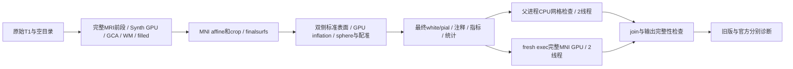
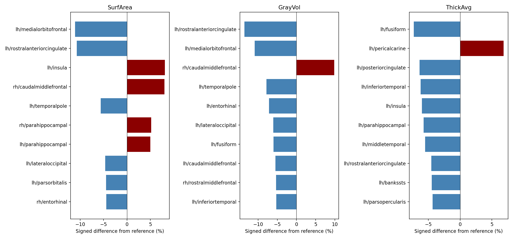

# 末尾 MNI 与网格检查并行后的两例原始 T1 完整验证

## 1．功能与范围

生产源码冻结于 **765c0fe9**，逐模块、程序、权重和资产SHA绑定实际完整
benchmark。源码包SHA-256为
`63d006eeb8890df0169af5406b3dfae51f8c8ecf3f32a41e0f00e702a0c6ea1c`。
公开ds000114 sub-06/sub-07从原始T1和空目录连续生成标准138项输出。
本版复用成熟FNIT SynthMorph GPU、完整warp转换/求逆/重采样，将末尾
MNI非线性与CPU网格检查同时执行；两侧join后才检查输出并写complete。



对照589e2749为相同原始输入、主机、A100 GPU6/7、CPU40–43/44–47和
总四线程的上一版完整结果。每例一次完整配对，未做整例ABBA。半球策略、
N4、WM、拓扑GA、white/pial及Gibbs算法保持本次冻结版本；后续Numba
Gibbs和sphere finish实验不属于本页。**纯Python/GPU与十分钟目标未完成。**

## 2．Python调用、输入输出与限制

```python
from pathlib import Path
from fnit.recon_all.native_free import run_recon_all_python

reconstruction_report = run_recon_all_python(
    t1=Path("input/sub07_T1w.nii.gz"),  # 三维原始T1，大小与SHA预先校验
    subject_dir=Path("runs/new_sub07"),  # 新空目录，不用手动补跑代替整例
    weights_dir=Path("resources/weights"),  # 声明且已校验的外置Synth权重
    assets_dir=Path("resources/assets"),  # 模板、图谱和LUT目录
    native_bin_dir=Path("resources/native/bin"),  # Conda固定源码独立构建程序
    device="cuda:0",  # 显式逻辑目标GPU，尊重CUDA_VISIBLE_DEVICES
    threads=4,  # 请求的总计算线程预算
    hemisphere_workers=2,  # 双侧各2线程，保持发布屏障
    native_optimizations="auto",  # 既有GPU评分与Python EM链
    n4_backend="native",  # 本轮固定独立Conda ITK N4
    n4_execution="in-process",  # 保持本版原N4执行策略
    wm_backend="native",  # 本轮固定原生WM
    wm_execution="in-process",  # 保持本版原WM执行策略
    wm_edit_backend="native",  # 保持aseg编辑
    defects_backend="native",  # 保持缺陷投射
    normalization_controls_backend="torch",  # 两轮已验GPU邻域
    normalization_initial_bias_backend="torch",  # 第二轮已验GPU偏置
    sphere_normals_backend="numba",  # 保持原球面法向
    inflate_backend="torch",  # 与对照相同的标准GPU inflation
    gca_inverse_backend="torch",  # 与对照相同的GCA完整求逆
    gca_candidate_chunk=1024,  # 与对照相同的候选分块
    gca_execution="isolated",  # 已验GCA局部缓存worker
    fill_backend="torch-numba",  # 既有GPU边界与有序CPU堆
    mni_execution="parallel-late",  # 完整末尾MNI与mesh并行，默认in-process
    profile_stages=True,  # 同步显式目标GPU计时，生产默认False
)
```

输入为三维原始T1及已声明的权重、模板、图谱与独立程序。两例原始SHA为
`7e33afb28f631fac31d81e2428a6144f61aba4102859c694eeb49ee584de04f7` 和
`59ef7bed60d4db64d56d947ebed2ef62a9257c26fe879848fe24d10a490f74fc`。
影像、权重、许可证和凭据不发布。体积conform为256³/1mm；表面surface
RAS/mm，标签对应原有顶点顺序，厚度mm、面积mm²、体积mm³。完整返回结构、
空间、参数和失败行为见[recon-all接口](../../../../docs/recon_all/README.md)。

并行MNI只写transforms，父网格检查只读取最终surf；两者join后完成
138项完整性检查。fresh exec保留FP32模型例外与父TF32/allocator状态，
不把已初始化CUDA进程fork后直接运行。异常保留子日志和部分报告并抛出，
不会将缺失warp写成complete；只清理helper自己创建的子树。
[MNI并行功能页](../../../../docs/recon_all/MNI_MESH_PARALLEL.md)列出全部内部
输入、输出与恢复约定；默认in-process保持。

## 3．命令行与复现报告

```bash
python tools/benchmark_recon_torch_end_to_end.py \
  --t1 input/sub07_T1w.nii.gz --output-root runs/new_sub07 \
  --weights-dir resources/weights --assets-dir resources/assets \
  --native-bin-dir resources/native/bin --device cuda:0 --threads 4 \
  --hemisphere-workers 2 --native-optimizations auto --profile-stages \
  --sphere-normals-backend numba --inflate-backend torch \
  --normalization-controls-backend torch --normalization-initial-bias-backend torch \
  --n4-backend native --n4-execution in-process --wm-backend native \
  --wm-execution in-process --wm-edit-backend native --defects-backend native \
  --gca-inverse-backend torch --gca-candidate-chunk 1024 \
  --gca-execution isolated --fill-backend torch-numba \
  --mni-execution parallel-late --code-version 765c0fe9
```

实际生产cli_command见两例benchmark；诊断只在生产后读取对照和官方。
CLI包含加载、传输、写出、GPU同步和子进程退出；资源校验另计完整harness。
本页汇总脚本不执行MRI算法，没有对应官方CLI；三个目录参数必填，输入
未完成、源码绑定不同、输出存在或有序表面坐标改变会抛异常。

```python
from pathlib import Path
from summarize_results import summarize_results

summary_report = summarize_results(
    reports_directory=Path("reports"),  # 本版完整JSON收据树
    previous_reports_directory=Path("../20261009_whole_inflate_a100_589e2749/reports"),  # 同例旧控制
    output_directory=Path("new_summary"),  # 预先创建的新目录，禁止覆盖摘要
)
```

复用既有[JSON脱敏器](../20261009_whole_normalization_a100_0cd9cbd5/export_receipts.py)，
只替换私有字符串；95份JSON中187475个数字、布尔和null的类型与值保持。
[导出清单](reports/PUBLIC_EXPORT_MANIFEST.json)同时保存原SHA与公开SHA。
源码、环境和公开报告无需新增依赖；主页已有Torch/Numba/nibabel。

## 4．原软件调用与参考

本并行helper属于FNIT调度，没有独立FreeSurfer等价命令。底层沿用完整
FNIT SynthMorph与后处理；对应官方SynthMorph、mri_ca_register形变求逆
及mri_convert检查调用见[MNI链](../../../../docs/recon_all/MNI_NONLINEAR_CHAIN.md)。
网格检查对应闭合、自相交和同序面质量判断；没有通过省略这些步骤提速。

官方归档为FreeSurfer8.2.0 d932c45、同原始T1和四线程、另一主机。历史
5735.363/6138.304秒仅为归档信息，不作本主机速度倍率或官方重复性证明。
本版官方评分独立运行并绑定765实际输出，不重命名589官方报告。

## 5．真实整例精度、时间、显存与脑图

| 原始T1 | 589控制CLI，s | 765末尾并行CLI，s | CLI缩短 | 完整harness，s |
|---|---:|---:|---:|---:|
| sub-06 | 2141.872 | 2117.283 | 1.1480% | 2126.229 |
| sub-07 | 2110.975 | 2061.494 | 2.3440% | 2070.468 |

完整CLI35.29/34.36分钟；每例一组共享节点配对，不代表整例稳定吞吐。
138输出齐全、生产网格通过、严格原容差138/138；16张有序表面全部坐标
零差异，7张分区最低标签Dice1、68区厚度/面积/体积/平均曲率MAE及最大差0。
两个向量warp及检查图的体素、header、affine、dtype和文件SHA也相同。

20/44张GPU顶点图每例仍有零容差尾差，[逐图CSV](vertex_map_exact_differences.csv)
保留全部计数、偏差、MAE/P99/最大值。sub-06最大为LH white.preaparc.K
0.001042247 mm⁻²（P99 5.2904e-8 mm⁻²）；sub-07 LH inflated.K最大0.03125 mm⁻²、P99
1.6007e-9 mm⁻²。严格容差通过不等于逐字节一致，局部最大差不隐去；成熟GPU
指标的重复性诊断仍[单独记录](../../../../docs/recon_all/SURFACE_METRIC_REPEATABILITY.md)。

末尾MNI/mesh完整组79.538/80.501秒，重叠46.243/44.119秒。父mesh请求2
线程、子MNI请求2线程，实际Torch/Numba及已有interop设置保存于收据；
线程和精度作用域退出后恢复。组内时间不能重复加到整例。

目标整卡采样峰12859736064/12845056000字节；全计算进程快照和峰
12845056000/12830375936字节。两者为连续不同查询，含共享负载；树归属
无法解析，父子峰为null。名义0.5秒、最大实际间隔10.301/7.497秒，
未证明连续峰低于20,000,000,000字节。父关闭缓存的Torch计数未知不记0。
已验FP32模型例外与TF32保持，无FP16/BF16。

### 本版与官方的完整诊断

本轮分别重新评估765c0fe9两例真实整例，诊断墙钟1030.516/1122.534秒，
不计入生产时间。严格逐文件为6/138、7/138；所有失败项保存在
[完整官方摘要](OFFICIAL_SUMMARY.json)及原始逐项报告，没有改变门槛。
与589e2749的实际官方摘要再次逐字段核对：两例68区统计、7张分区Dice、
-no-th3统计和双向表面距离均相同，既有官方差异没有因本次MNI并行新增。

| 官方68区比较 | sub-06 MAE | sub-07 MAE | sub-06中位绝对相对误差 | sub-07中位绝对相对误差 |
|---|---:|---:|---:|---:|
| 平均厚度，mm | 0.044824 | 0.050676 | 1.4329% | 1.4704% |
| 面积，mm² | 31.397059 | 35.867647 | 1.1226% | 1.1051% |
| 灰质体积，mm³ | 151.147059 | 153.955882 | 1.9067% | 2.2451% |
| 平均曲率，mm⁻¹ | 0.002456 | 0.001368 | 1.2545% | 0.8368% |

完整[P90/最大误差CSV](official_region_errors.csv)保留局部异常：厚度最大
0.289/0.175mm，面积181/233mm²，灰质体积681/729mm³。

| 分区图 | sub-06最低/中位Dice | sub-07最低/中位Dice |
|---|---:|---:|
| aseg.mgz | 0.964525 / 1.000000 | 0.666667 / 1.000000 |
| aparc+aseg.mgz | 0.836297 / 0.951238 | 0.666667 / 0.957093 |
| aparc.a2009s+aseg.mgz | 0.714706 / 0.913075 | 0.666667 / 0.920712 |
| aparc.DKTatlas+aseg.mgz | 0.887007 / 0.954639 | 0.666667 / 0.963532 |
| wmparc.mgz | 0.836297 / 0.948653 | 0.867488 / 0.956286 |
| ribbon.mgz | 0.959380 / 0.974314 | 0.962799 / 0.983648 |
| filled.mgz | 0.993523 / 0.993808 | 0.999820 / 0.999840 |

官方与候选的顶点数及有序面不同，不做逐索引顶点等同。下表分别报告
候选→官方、官方→候选的完整三角面距离，单位mm，保留两个方向。

| 被试/侧/表面 | 均值，两个方向 | P99，两个方向 | 最大，两个方向 |
|---|---:|---:|---:|
| sub-06 / lh / white | 0.075759 / 0.072758 | 0.472040 / 0.406583 | 3.004846 / 3.033236 |
| sub-06 / lh / pial | 0.106381 / 0.098131 | 0.718854 / 0.678709 | 4.852521 / 3.094433 |
| sub-06 / rh / white | 0.074754 / 0.075603 | 0.421361 / 0.448948 | 3.197487 / 2.567878 |
| sub-06 / rh / pial | 0.105700 / 0.107285 | 0.717832 / 0.680946 | 3.387739 / 3.012765 |
| sub-07 / lh / white | 0.050402 / 0.054976 | 0.315634 / 0.385787 | 1.263907 / 6.179060 |
| sub-07 / lh / pial | 0.119819 / 0.117527 | 0.726327 / 0.613016 | 2.868614 / 2.728400 |
| sub-07 / rh / white | 0.043309 / 0.043921 | 0.280691 / 0.289441 | 1.698829 / 2.210640 |
| sub-07 / rh / pial | 0.072245 / 0.071929 | 0.508773 / 0.479063 | 2.257495 / 2.945023 |

生产网格检查通过与扩展异常诊断分开。四个候选半球均闭合、单连通、
Euler=2，无非流形边、重复面及异常顶点link。扩展检查仍发现white/pial
横向穿越：sub-06 LH/RH为567/260对，官方441/269对；sub-07为189/261对，
官方240/213对。完全位于皮层的对应计数为501/237、158/151，官方为
395/221、207/133。这些是相交三角面对，不能解释为独立病灶数量；完整
局部坐标、脑区和几何深度保存在quality JSON，未证明pial完全包含white。

sub-06 sphere及sphere.reg均无负向面；sub-07候选LH为47/37、RH为0/0，
官方LH58/26、RH27/35。已有这些翻折和穿越，不能将生产mesh passed
改写为所有扩展几何质量均通过。整体指标等效仍未判定。

两例本版脑图由各自已绑定SHA的conform T1、最终white/pial和aparc生成；
图像仅用于展示，不替代完整数值。每例三个方向为conform网格中心切面。

**sub-06：T1表面叠加与68区误差**


[异常脑区边界图](official_reports/runs/evaluate_late_mni_765c0fe9_sub06_vs_official_20261009_v1/figures/local_region_boundary.png)

**sub-07：T1表面叠加与68区误差**



[异常脑区边界图](official_reports/runs/evaluate_late_mni_765c0fe9_sub07_vs_official_20261009_v1/figures/local_region_boundary.png)

官方29个JSON的67358个数值/布尔/null字段经脱敏逐项保持原类型和值；
[JSON导出清单](official_reports/PUBLIC_EXPORT_MANIFEST.json)与
[脑图及复现脚本SHA](official_reports/FIGURE_AND_REPRODUCTION_MANIFEST.json)
单列。实际完整诊断启动脚本保留线程、CPU亲和性、冻结源码与参数，
仅私有根目录替换为`$FNIT`；公开T1来源和参考程序哈希保存在逐例evaluation。


最长阶段为初始双侧表面674.6/754.2秒、球面配准281.1/278.8秒、最终
white/pial375.3/297.8秒、N4165.7/167.9秒；annotation为118.5秒及另一例
小于100秒。完整[阶段CSV](stage_times.csv)保留实际计时，不累加嵌套段。
现有重定位Conda环境可运行；全新主页安装、物理无预装脑影像软件整例
和完整程序/动态库/文件访问审计未验证。

## 6．最近更新与benchmark

- 765c0fe9：本页两例完整原始T1，显式parallel-late；默认保持原执行。
- 589e2749：[GPU标准inflation整例](../20261009_whole_inflate_a100_589e2749/README.md)
  是本版实际控制，完整旧结果保留。
- [MNI同输入ABBA](../../../../docs/recon_all/MNI_MESH_PARALLEL.md)为完整阶段验证，
  不是本页原始T1整例；同一功能的局部收益不相加。

分别记录执行完成、输出完整、生产网格、严格复现、优化是否退化和整体
官方指标等效；后者保持`not_assessed_no_confirmed_prospective_thresholds`。

## 7．原代码库和参考文献

- [FNIT recon-all](../../../../docs/recon_all/README.md)、[MNI完整链](../../../../docs/recon_all/MNI_NONLINEAR_CHAIN.md)。
- [FreeSurfer固定源码](https://github.com/freesurfer/freesurfer/tree/d932c45b7941662ea380a05efef580568b98d41a)。
- [OpenNeuro ds000114](https://openneuro.org/datasets/ds000114)，公开T1与既有授权派生图。
- Hoffmann M, et al. SynthMorph: learning contrast-invariant registration without acquired images. IEEE TMI. 2022;41:543–558. DOI:10.1109/TMI.2021.3116879。
- Fischl B. FreeSurfer. NeuroImage. 2012;62:774–781. DOI:10.1016/j.neuroimage.2012.01.021。
