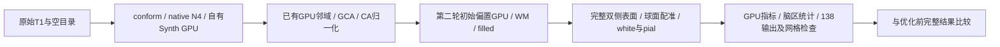
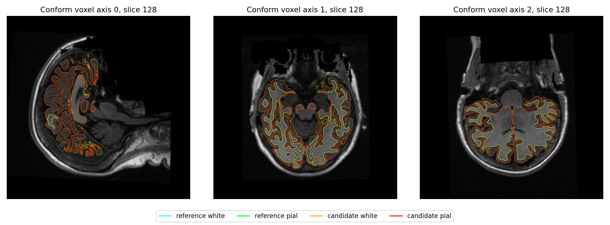

# GPU 归一化接入后的两例原始 T1 完整验证

## 1．功能与范围

本次生产源码冻结于 **0cd9cbd5**，547个Python模块逐SHA绑定。从公开
ds000114 sub-06/sub-07原始T1和新空目录连续运行，复用已有GPU控制点邻域
与第二轮初始偏置传播/平滑。对照是冻结803aec50的同例候选：相同原始输入、
主机、A100、CPU亲和性、四线程和GCA/fill配置。每例只有一次完整配对，
不是整例ABBA；共享负载、冷导入、JIT及读写包含在实际时间中。



没有更换N4、WM、拓扑GA、标准inflation、white/pial，也没有读取官方参考
补生产结果。后续inflation、pial、MNI并行实验不在本次整例内，阶段收益不相加。
**纯Python/GPU及十分钟目标仍未完成。**

## 2．Python 调用与输入输出

```python
from pathlib import Path
from fnit.recon_all.native_free import run_recon_all_python

reconstruction_report = run_recon_all_python(
    t1=Path("input/sub07_T1w.nii.gz"),  # 清单绑定的三维原始公开T1
    subject_dir=Path("runs/new_sub07"),  # 新空目录；不能手动补跑冒充整例
    weights_dir=Path("resources/weights"),  # 已校验大小/SHA的外置权重
    assets_dir=Path("resources/assets"),  # 已声明图谱、模板和LUT
    native_bin_dir=Path("resources/native/bin"),  # Conda内固定源码独立构建
    device="cuda:0",  # 显式目标逻辑GPU，尊重CUDA_VISIBLE_DEVICES
    threads=4,  # 被试总线程预算
    hemisphere_workers=2,  # 双侧独立worker，各2线程
    normalization_controls_backend="torch",  # 两轮已有GPU邻域，默认cpu
    normalization_initial_bias_backend="torch",  # 第二轮已有GPU偏置，默认cpu
    native_optimizations="auto",  # 原有自有GPU评分/Python EM混合链
    n4_backend="native",  # 本次固定独立Conda ITK N4
    wm_backend="native",  # 本次固定原生WM，不混入未验候选
    wm_edit_backend="native",  # 本次固定原生aseg编辑
    gca_inverse_backend="torch",  # 与旧候选相同的批量逆矩阵
    gca_candidate_chunk=1024,  # 与旧候选相同的完整候选分块
    gca_execution="isolated",  # GCA子进程局部缓存，父策略保持
    fill_backend="torch-numba",  # 原GPU边界与有序CPU堆
    profile_stages=True,  # 阶段同步显式设备；生产默认False
)
```

两归一化选项默认cpu，仅显式cuda:N可选torch；没有静默回退。距离/排序、
有序离群清理、迭代控制点规则和第二轮float64除后乘/float32输出保持原定义。
完整参数与失败行为见[recon-all接口](../../../../docs/recon_all/README.md)。

输入SHA：sub-06 `7e33afb28f631fac31d81e2428a6144f61aba4102859c694eeb49ee584de04f7`；
sub-07 `59ef7bed60d4db64d56d947ebed2ef62a9257c26fe879848fe24d10a490f74fc`。
权重、资产和15个独立程序的SHA在每例benchmark中；本目录不含影像、权重或许可证。

每例输出mri/surf/label/stats与JSON，138项齐全；conform体积256³，
表面为surface RAS/mm，顶点图沿相同有序网格。厚度mm、面积mm²、体积mm³。
TH3顶点体积与-no-th3脑区体积分开，不互换。成功返回路径清单和分项状态；
输入/资源非法或运行失败抛异常并保留部分JSON，不等于返回已验收的官方等效结果。

## 3．CLI、报告和复现

```bash
python tools/benchmark_recon_torch_end_to_end.py \
  --t1 input/sub07_T1w.nii.gz --output-root runs/new_sub07 \
  --weights-dir resources/weights --assets-dir resources/assets \
  --native-bin-dir resources/native/bin --device cuda:0 --threads 4 \
  --hemisphere-workers 2 --defects-backend native \
  --n4-backend native --wm-backend native --wm-edit-backend native \
  --sphere-normals-backend numba --native-optimizations auto \
  --normalization-controls-backend torch \
  --normalization-initial-bias-backend torch \
  --gca-inverse-backend torch --gca-candidate-chunk 1024 \
  --gca-execution isolated --fill-backend torch-numba \
  --code-version 0cd9cbd5

# 已完成整例才能比较；两源码目录须与收据中的逐模块SHA匹配。
python tools/evaluate_recon_optimization_pair.py \
  --control-benchmark runs/previous/benchmark.json \
  --candidate-benchmark runs/gpu_normalization/benchmark.json \
  --control-source-root frozen/803aec50 \
  --candidate-source-root frozen/0cd9cbd5 \
  --driver benchmark/compare_driver.py \
  --scripts-dir benchmark/comparators \
  --label-table resources/assets/FreeSurferColorLUT.txt \
  --case ds000114_sub-07 --threads 4 --output reports/new_pair
```

原始整例完整CLI配方见两份benchmark的cli_command，包括加载、搬运、读写和
退出。完整CLI墙钟与包装资源哈希时间分开。比较器只读，验证相同输入/硬件/
预算、完成状态和138输出；源码改变、目录已存在或比较失败抛异常，不更改门槛。

只读汇总脚本输入本页reports、上一版完整reports及已创建的新输出目录，生成
SUMMARY.json、全部阶段CSV与44张顶点图零容差CSV。数值/布尔/null按原类型
保留；公开收据只有字符串脱敏，[导出清单](reports/PUBLIC_EXPORT_MANIFEST.json)
记录46文件的原始和公开SHA，129601个数值/布尔/null字段不变。

```python
from pathlib import Path
from summarize_results import summarize_results

summary_report = summarize_results(
    reports_directory=Path("reports"),  # 本次完整JSON收据树
    previous_reports_directory=Path("../20261009_whole_pair_a100_803aec50/reports"),  # 同例旧候选
    output_directory=Path("new_summary"),  # 已创建空目录，不能覆盖旧报告
)
```

export_receipts.py仅处理JSON，input_directory为原始收据目录，
output_directory须不存在，replacements_file为本地str→str替换JSON；
逐文件核对所有数值类型/序列并输出哈希清单。汇总和脱敏没有原软件独立CLI。
新增生产依赖为零，已有主页Conda环境覆盖Torch/Triton/Numba/nibabel。

```python
from pathlib import Path
from export_receipts import export_receipts
from summarize_official_results import summarize_official_results

export_manifest = export_receipts(
    input_directory=Path("private_receipts"),  # 完整原始JSON树，不复制其他类型
    output_directory=Path("new_public_receipts"),  # 必须不存在的公开副本目录
    replacements_file=Path("private_replacements.json"),  # 私有字符串到公开占位符的JSON对象
)
official_summary = summarize_official_results(
    reports_directory=Path("official_reports"),  # 两例已完成官方比较的完整JSON树
    output_directory=Path("new_official_summary"),  # 已创建空目录，不覆盖旧汇总
)
```

## 4．原软件参考

归一化配方对应`mri_normalize -g 1 -seed 1234 -mprage nu.mgz T1.mgz`
与`mri_normalize -seed 1234 -mprage -aseg aseg.presurf.mgz -mask brainmask.mgz norm.mgz brain.mgz`。
这些命令只用于独立benchmark，生产不调用。GPU邻域和偏置为命令内部步骤。
官方归档为FreeSurfer8.2.0 d932c45，同原始输入/四线程/seed1234、另一主机；
旧官方整例5735.363/6138.304秒不能作为本主机配对速度或重复性证明。
本版两例独立官方比较已完成，见[完整官方摘要](OFFICIAL_SUMMARY.json)。
严格文件诊断分别6/138、7/138，失败项全部保留。比较及质量/绘图耗时
1011.718/1101.626秒另计，不包含在生产时间中。没有把历史官方整例
重标为本机新运行，既有精度差异不归因于随机性。

## 5．真实整例精度、耗时和资源

| 原始T1 | 旧候选CLI，s | GPU归一化CLI，s | 整例缩短 | 新完整输出 |
|---|---:|---:|---:|---|
| sub-06 | 2255.064 | 2151.856 | 4.5767% | 138/138 |
| sub-07 | 2281.571 | 2129.266 | 6.6754% | 138/138 |

新整例为35.86/35.49分钟。首次归一化67.890→29.274秒、53.111→26.790秒；
第二轮56.154→30.530秒、58.076→30.474秒。其他阶段共享负载也有变化，
不能把两段差简单相加当整例收益。完整[阶段CSV](stage_times.csv)含两版本240条记录。
额外完整回归126.886/133.586秒，不含在生产时间中。

两例前段12张体积和LTA零差异；16张表面有序面、全部坐标相同；标签Dice=1；
68区厚度/面积/体积/平均曲率MAE及最大差0，全局统计和-no-th3脑区体积相同。
生产网格双侧连通/有限、Euler2、无开放边，white/pial源方向自相交检查通过。
完整比较均138/138满足**原容差**，不等于字节完全一致。

每例20/44张GPU顶点图有零容差差异：面积最大9.5367e-7mm²、TH3体积
1.9073e-6mm³；sub-07 LH inflated.K最大0.01171875，P99及全部计数见
[逐图CSV](vertex_map_exact_differences.csv)。固定相同面贡献的重复实验已定位
CUDA法向index_add原子求和次序对曲率的放大，见[指标重复性](../../../../docs/recon_all/SURFACE_METRIC_REPEATABILITY.md)。
本次没有全局禁用TF32或更改阈值。严格字节复现未通过；优化相对旧版没有观察到
表面/标签/已输出脑区指标退化；整体官方指标等效仍为not_assessed。

显式目标GPU的整卡采样峰为13603176448/13536067584字节（含共享负载），
同期全计算进程上界12306087936/12293505024字节。PID归属未解析，父子树峰
为null；名义间隔0.5秒，最大实际10.731/7.352秒。不能把null或缓存关闭后的
allocated/reserved不可用写成零，也不能宣布连续20,000,000,000字节峰已验收。
FP32 Synth例外保持，其他阶段TF32默认开启，无半精度。

### 本版官方指标与完整质量诊断

| 原始T1 / 68区 | 厚度MAE，mm | 面积MAE，mm² | GM体积MAE，mm³ | 相对误差P90：厚度/面积/体积 |
|---|---:|---:|---:|---|
| sub-06 | 0.044824 | 31.3971 | 151.1471 | 4.1711% / 4.9738% / 5.9040% |
| sub-07 | 0.050676 | 35.8676 | 153.9559 | 4.8174% / 4.7437% / 5.6292% |

这些是本版输出与归档官方新做的比较，与优化前逐项相同。
表面网格不同，不能逐索引比官方：sub-06 LH/RH官方129504/131629顶点，
FNIT130679/132459；sub-07官方114221/115082，FNIT114247/114951。
完整双向顶点到三角面的均值/P99/最大值和超过0.1mm的计数见JSON，
不是连续三角面Hausdorff。sub-07 LH white反向最大6.1791mm，不能只报均值。

| 标签图 | sub-06 Dice中位数 / 最低 | sub-07 Dice中位数 / 最低 |
|---|---|---|
| aseg | 1.0000 / 0.9645 | 1.0000 / 0.6667 |
| aparc+aseg | 0.9512 / 0.8363 | 0.9571 / 0.6667 |
| a2009s+aseg | 0.9131 / 0.7147 | 0.9207 / 0.6667 |
| DKT+aseg | 0.9546 / 0.8870 | 0.9635 / 0.6667 |
| wmparc | 0.9487 / 0.8363 | 0.9563 / 0.8675 |

生产网格检查通过不代表扩展质量全部通过。white/pial横穿面配对
sub-06 FNIT LH/RH567/260，官方441/269；sub-07 FNIT189/261，官方240/213。
全部皮层面、仅任一皮层顶点及非皮层的计数和具体面编号分别保存。
sub-06两端sphere及sphere.reg负面均0；sub-07 FNIT LH为47/37、RH0/0，
官方LH58/26、RH27/35。这些是既有问题，未被GPU归一化改变；没有将
其他软件也有异常当作FNIT质量通过的依据。连通性、非流形、顶点链接和
有序拓扑检查无新增异常，整体指标等效仍未判定。




六张公开CC0派生图的SHA见FIGURE_AND_REPRODUCTION_MANIFEST.json；
两例完整官方收据30个JSON、67360个数值/布尔/null字段按原值脱敏，
原始和公开SHA另记。summarize_official_results()输入官方reports目录和
已创建的新输出目录，返回实际摘要并写OFFICIAL_SUMMARY.json与逐指标CSV；
失败/缺失/覆盖直接抛异常，不建立新等效门。

剩余最慢为双侧初始表面678.8/788.4秒、sphere.reg277.6/274.6秒、
最终white/pial369.7/298.0秒、N4172.7/168.2秒。拓扑GA/white/pial仍有原生
CPU，球面仍有有序CPU热点。现有重定位Conda环境运行通过；全新主页安装、
物理无预装软件隔离及完整进程/文件访问审计尚未验证。

后续589e2749的独立wheel范围也已实测：现有Conda编译器构建15.247秒，
无依赖重装的私有target安装3.505秒、独立CLI导入及help2.612秒；7个
实际接入模块与冻结源码字节相同。wheel5007328字节，SHA
`26329a26920fb370b68e98685e60174292146bf728dc052afe941f65ed80ea4c`。
这是现有Conda环境中的包安装/接口检查，不是全新Conda或物理隔离整例，
也不把它当作本页0cd9整例源码版本。

## 6．最近更新与benchmark

2026-10-09：0cd9cbd5首次从原始T1完整验证两GPU归一化选项；保留默认cpu，
新接线不添加算法。完整逐文件/前段/表面/脑区诊断和版本哈希全部保存。
后续inflation接线合同单列在本页收据中，不能算作本版整例覆盖。

803aec50旧GCA/fill完整配对及官方误差继续保留作对照，见[上一版报告](../20261009_whole_pair_a100_803aec50/README.md)。
同输入阶段ABBA与本次原始T1整例分开，分别见GPU邻域、初始偏置功能页。

## 7．原实现和参考文献

- [FNIT recon-all完整接口](../../../../docs/recon_all/README.md)
- [FreeSurfer固定源码](https://github.com/freesurfer/freesurfer/tree/d932c45/mri_normalize)
- [PyTorch](https://github.com/pytorch/pytorch)、[nibabel](https://github.com/nipy/nibabel)
- Fischl B. FreeSurfer. NeuroImage. 2012;62:774–781. DOI:10.1016/j.neuroimage.2012.01.021。
