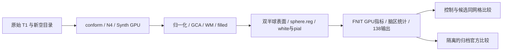
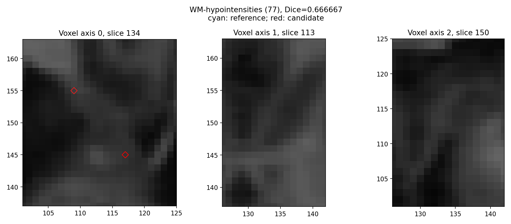

# 两例原始 T1 整例：冻结 803aec50 的性能与数值回归

## 1. 功能与范围

本页记录公开 ds000114 的 sub-06/sub-07，分别从同一原始 T1 与新空目录连续完成控制、候选各一次。生产代码为 **803aec50**，不是后续 N4、WM、归一化或 white 实验提交。运行主机为 Xeon Platinum 8369B / A100-SXM4-80GB，每例总四线程，双半球各两线程；每例控制与候选固定同一 GPU 和 CPU 亲和性。sub-06 按候选→控制、sub-07 按控制→候选运行，有共享负载，尚无完整整例 ABBA 重复。



候选只改 GCA 的隔离分配缓存、Torch cofactor 分块（1024）和 `torch-numba` filled 边界/有序反馈。控制为进程内无缓存 GCA、CPU 逆矩阵分块（64）和旧 fill 路径。**两者都使用已有 FNIT GPU GCA 评分与 Python EM**；本组不比较官方完整 EM 算法。未更换原生 N4、WM、拓扑 GA、white/pial，未读取官方结果、补跑或复制参考文件。

## 2. Python 调用与输入输出

- 输入为三维原始 T1 NIfTI。sub-06 SHA 为 `7e33afb28f631fac31d81e2428a6144f61aba4102859c694eeb49ee584de04f7`；sub-07 为 `59ef7bed60d4db64d56d947ebed2ef62a9257c26fe879848fe24d10a490f74fc`。
- 权重、图谱、模板和独立 Conda 构建程序的逐文件 SHA 见四份 `benchmark.json`；原始影像、许可证及完整资产不发布在本目录。
- 候选/控制各输出 `mri/`、`surf/`、`label/`、`stats/` 与运行 JSON，**四次均 138/138 齐全、执行完成、生产网格通过**。conform 为 256³，表面坐标为 surface RAS mm。MRI dtype、几何、标签 Dice、逐脑区值和异常图逐项保留。
- 同网格厚度为 mm，面积为 mm²，体积为 mm³。TH3 顶点体积和脑区 `-no-th3` 体积分别记录，不能互换。
- 汇总为 [SUMMARY.json](SUMMARY.json)；完整数值诊断为 [两例配对报告](reports/runs/)，全部阶段为 [stage_times.csv](stage_times.csv)，逐顶点零容差差异为 [vertex_map_exact_differences.csv](vertex_map_exact_differences.csv)。公开副本替换私有路径/主机，数值、布尔值及 null 保持；[导出清单](reports/PUBLIC_EXPORT_MANIFEST.json)保存原始/公开 SHA。

以下在冻结版本运行候选；所有输入、参数和默认限制见 [recon-all 说明](../../../../docs/recon_all/README.md)。失败抛异常并保留部分 JSON，成功返回不代表官方等效。

```python
from pathlib import Path
from fnit.recon_all.native_free import run_recon_all_python

reconstruction_report = run_recon_all_python(
    t1=Path("input/sub07_T1w.nii.gz"),  # 清单绑定的原始影像
    subject_dir=Path("runs/new_sub07"),  # 新空目录；不得补跑冒充整例
    weights_dir=Path("resources/weights"),  # 已校验外置权重
    assets_dir=Path("resources/assets"),  # 已声明模板与图谱
    native_bin_dir=Path("resources/native/bin"),  # 固定源码独立构建产物
    device="cuda:0",  # 显式目标逻辑 GPU，尊重设备映射
    threads=4,  # 总线程预算，双侧各2线程
    hemisphere_workers=2,  # 独立半球进程，保持共享输出顺序
    native_optimizations="auto",  # 实际混合路径
    defects_backend="native",  # 本组固定原缺陷体积实现
    sphere_normals_backend="numba",  # 已验证球面法线
    wm_backend="native",  # 本组固定 Conda WM
    wm_edit_backend="native",  # 本组固定 Conda aseg 编辑
    gca_inverse_backend="torch",  # 分块候选逆矩阵
    gca_candidate_chunk=1024,  # 本次实测块大小
    gca_execution="isolated",  # 仅 GCA 子进程启用分配缓存
    fill_backend="torch-numba",  # GPU 边界与有序 CPU heap
    profile_stages=True,  # 阶段同步目标设备，包含读写
)
```

## 3. CLI 与只读复现

原始整例使用 `tools/benchmark_recon_torch_end_to_end.py`，完整具名配方、精度及设备记录见各 benchmark 的 `cli_command`。完整 CLI 时间包含解释器启动、参数/路径校验、模型加载、传输、计算和写出；803的包装计时另含资源哈希校验，但从前置路径检查之后开始，不是完整冷包装进程时间。CLI完整墙钟与后处理比较时间单列。

`tools/evaluate_recon_optimization_pair.py` 要求两次已完成整例、实际冻结源码、相同原始 T1/硬件/四线程/GPU 映射。它复用已有比较器，非法配对或变化源码直接报错；输出严格文件、Dice、逐脑区/no-th3、双向表面距离及完整绑定报告，不计算新的等效阈值。

```python
from pathlib import Path
from summarize_results import summarize_results

summary_report = summarize_results(
    reports_dir=Path("reports"),  # 本页保留的完整公开 JSON 树
    sub06_official_dir=Path("../20261009_whole_a100_803aec50/reports/comparison"),  # 原始第一例官方诊断
    output_dir=Path("new_summary"),  # 已创建目录，不能覆盖现有汇总
)
```

只读摘要脚本没有独立原软件 CLI。逐项输入、输出、单位、默认值和失败行为亦见脚本中文说明。

```bash
python tools/evaluate_recon_optimization_pair.py \
  --control-benchmark runs/control/benchmark.json \
  --candidate-benchmark runs/candidate/benchmark.json \
  --control-source-root frozen/control --candidate-source-root frozen/candidate \
  --driver benchmark/compare_driver.py --scripts-dir benchmark/comparators \
  --label-table resources/assets/FreeSurferColorLUT.txt \
  --case sub-07 --threads 4 --output reports/new_pair
```

## 4. 原软件参考

官方为归档 FreeSurfer 8.2.0 `d932c45`，同一原始影像，`recon-all -i <T1> -s <subject> -all`，四线程、ITK拟合一线程、随机种子1234。归档 sub-06/sub-07 墙钟为 5735.363/6138.304 秒，来自另一主机；**不是本次同主机官方配对计时**，当前未补官方整例重复性测试。官方参考只在独立诊断中读取。当前官方严格比较分别为 **6/138、7/138**，全部失败项保留。

## 5. 实测结果

### 整例性能与优化回归

| 原始 T1 | 控制 CLI（s） | 候选 CLI（s） | 配对加速 | 墙钟减少 | 完整输出 |
| --- | ---: | ---: | ---: | ---: | --- |
| sub-06 | 6137.234 | 2255.064 | 2.7215× | 63.2560% | 两次138/138 |
| sub-07 | 6040.677 | 2281.571 | 2.6476× | 62.2299% | 两次138/138 |

候选分别 **37.58、38.03 分钟**；十分钟目标未达到。包装墙钟为控制6146.850/6049.303秒、候选2263.678/2293.631秒，资源哈希校验分别9.602/8.599、8.599/12.047秒。配对数值诊断139.402/178.776秒另计，不算整例生产耗时。

两例优化前后均通过现有 **138/138 容差诊断**。十二张前段图及 LTA 数值、双侧八个表面阶段的有序面与全部坐标、所有离散分割 Dice=1；68区厚度/面积/灰质体积/平均曲率 MAE及最大误差均0，全局指标相同。相同有序网格已证明，才使用同索引比较。

**逐字节/零容差复现未通过**：头信息含各自路径，每例20张 GPU 顶点图存在微小非零差异。面积最大9.5367e-7 mm²、TH3体积最大1.9073e-6 mm³；sub-06 RH `curv.pial` 最大0.000878662，sub-07 LH `inflated.K` 最大0.00793457。局部 P99、所有异常顶点及计数保留在零容差诊断，不把138通过称为逐字节一致。后续固定输入重复已复现同量级法线/曲率尾差；未把 FNIT 与官方全部差异归因于随机性。

### 完整阶段墙钟与实际策略

| 阶段 | sub-06（s） | sub-07（s） | 策略 |
| --- | ---: | ---: | --- |
| conform / SynthStrip / Talairach | 39.497 | 38.386 | FNIT PyTorch GPU + nibabel |
| N4 | 165.616 | 168.426 | 独立 Conda ITK C++，CPU |
| 首次归一化 | 67.890 | 53.111 | FNIT PyTorch / NumPy / 有序Numba |
| SynthSeg | 13.477 | 15.568 | FNIT PyTorch GPU |
| GCA | 36.114 | 42.389 | FNIT GPU评分 / Python EM；隔离缓存 |
| 第二次归一化 | 56.154 | 58.076 | FNIT PyTorch / NumPy / 有序Numba |
| WM segmentation | 48.557 | 44.016 | 固定 FS 源码 Conda C++，CPU |
| aseg edit | 22.612 | 23.223 | 固定 FS 源码 Conda C++，CPU |
| filled | 14.655 | 15.127 | FNIT GPU边界 / 编译有序CPU heap |
| MNI nonlinear | 64.391 | 55.706 | FNIT SynthMorph GPU / 既有后处理 |
| 双侧表面组 | 658.870 | 815.586 | Conda拓扑GA/white.preaparc；FNIT remesh/球面 |
| 双侧sphere.reg | 302.088 | 299.095 | FNIT PyTorch/Numba CPU + GPU平均 |
| 双侧主要注释 | 109.193 | 102.915 | FNIT Python/Numba，CPU，双侧并行 |
| 最终white/pial组 | 383.178 | 311.172 | 固定 FS 源码 Conda C++，CPU，双侧并行 |
| 完整生产网格质量 | 80.868 | 62.030 | FNIT完整检查，保留质量门 |

全部240个阶段记录见CSV，嵌套/并行时间不能相加。官方当前主机逐阶段重测尚未执行；归档官方总时间与版本单列，不能把跨主机时间当严格速度比较。

### 保留的官方误差

| 原始 T1 / 68区 | 厚度 MAE（mm） | 面积 MAE（mm²） | 灰质体积 MAE（mm³） | 厚度/面积/体积相对误差 P90 |
| --- | ---: | ---: | ---: | --- |
| sub-06 | 0.044824 | 31.3971 | 151.1471 | 4.1711% / 4.9738% / 5.9040% |
| sub-07 | 0.050676 | 35.8676 | 153.9559 | 4.8174% / 4.7437% / 5.6292% |

统一 no-th3 MAE为151.1922/153.9481 mm³；全局 CortexVol 差-0.4828%/-1.5077%。第二例LH/RH分别-2.9509%/-0.08784%，不能用全脑平均掩盖偏侧差异。

| 分割图 | sub-06 Dice中位数 / 最低 | sub-07 Dice中位数 / 最低 |
| --- | --- | --- |
| aseg | 1.0000 / 0.9645 | 1.0000 / 0.6667 |
| aparc+aseg | 0.9512 / 0.8363 | 0.9571 / 0.6667 |
| a2009s+aseg | 0.9131 / 0.7147 | 0.9207 / 0.6667 |
| DKT+aseg | 0.9546 / 0.8870 | 0.9635 / 0.6667 |
| wmparc | 0.9487 / 0.8363 | 0.9563 / 0.8675 |

最低值保留小标签，不删异常项；各标签名称、体素数及交集见完整 Dice JSON。官方和 FNIT 网格不同，官方比较只用双向全部顶点到三角面距离，不声称逐顶点对应。连通性、非流形、sphere翻折、white/pial相互穿越和局部异常见完整 geometry 报告；生产自相交通过不能代替这些检查。第一例穿越及距表面最大局部误差见 [已有详细页](../20261009_whole_a100_803aec50/README.md)。第二例完整报告见 [官方比较](reports/runs/evaluate_803aec50_sub07_candidate_vs_official_20261009_v1/)。**整体指标等效尚未判定**。




### 显存、精度与安装范围

Synth GPU实际前向均记录 float32/无autocast，保留既有 FP32 卷积例外；其他适用算子 TF32，没有开启半精度。新 GPU 归一化接线不属于803整例。

容器/宿主PID归属未解析，四次完整 `peak_tree_total_bytes=null`，**同期父子总显存与20GB预算未验收**。目标卡全部负载的采样峰值为 sub-06控制/候选33.703/12.316 GB、sub-07控制/候选41.920/47.857 GB，包含共享任务，不能称为FNIT自身峰值。采样目标0.5秒，最大实际间隔8.199–9.315秒，失败采样5–10次；细节保留，不把关闭分配缓存后的计数0当作零显存。

实际使用迁移的已有 Conda 环境，源码与15个独立构建程序逐文件绑定。没有全新主页Conda安装或物理上无预装软件的隔离整例，二者标记未验证。生产没有读取独立官方目录。

## 6. 更新与下一步

- `803aec50`：两例控制/候选均原始T1完整运行，性能与数值报告已收齐；已有精度问题单列。
- `3960f0b4`：第一例官方全量诊断；本页补第二例控制和候选官方诊断及两例配对。
- `0cd9cbd5`：第二轮初始偏置GPU接线，通过实际24项入口契约；其两例新原始T1整例另行运行，不把本页速度改标给它。
- N4、WM、white/grid/MHT、ridge、allocator实验均独立记录。未确认整体等效前不删除失败结果；sphere缓存完整ABBA未提速，保留原策略。

剩余主要瓶颈为表面组、sphere.reg及最终white/pial；组内串行依赖必须保留。以后续实际整例墙钟确认收益，不能将阶段加速比例相加。

## 7. 原代码与参考

- [FNIT源码](https://github.com/weikanggong1/Fudan-Neuroimaging-toolkit)。
- [FreeSurfer recon-all与源码](https://github.com/freesurfer/freesurfer/blob/d932c45/scripts/recon-all)。
- [公开 ds000114 数据集](https://openneuro.org/datasets/ds000114)。
- Fischl B. FreeSurfer. *NeuroImage* 62, 774–781 (2012)。
