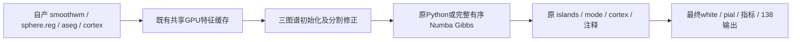

# recon-all 复用完整有序 GCSA 候选

## 1. 功能与流程

将已经通过两例双侧三图谱实测的 `label_surface(gibbs_backend="numba")` 接入整例显式选项。GPU几何准备和现有文件版本缓存继续复用，仅有序Gibbs循环使用已编译的CPU核，保留随机排列、同分选择、临时标签恢复与逐顶点反馈。默认仍为python，不称为纯GPU。



## 2. Python、输入与输出

```python
from fnit.recon_all.native_free import run_recon_all_python

reconstruction_report = run_recon_all_python(
    t1="/data/public_T1w.nii.gz",  # 一幅原始三维T1
    subject_dir="/data/outputs/new_subject",  # 新空目录，不复用官方结果
    weights_dir="/data/fnit/weights",  # 已校验权重
    assets_dir="/data/fnit/assets",  # 已校验模板及图谱
    native_bin_dir="/data/fnit/native/bin",  # 声明的独立Conda源码构建程序
    device="cuda:0",  # GPU几何与Synth明确指定同一逻辑设备
    threads=4,  # 总线程预算不因编译候选增加
    hemisphere_workers=2,  # 每侧私有exec各分得2线程
    annotation_gibbs_backend="numba",  # 复用完整有序核；默认python
    remesh_scalar_storage="python",  # 已有完整CPU remesh的双精度标量存储，拆缩/堆/平滑不变
    profile_stages=True,  # 指定设备同步剖析，包含加载/搬运/读写
)
```

新增 `annotation_gibbs_backend` 为字符串python（默认）或numba，非法值在CUDA/输出设置前抛ValueError。单例API、批量API及CLI原样传递；默认API省略该非默认参数，保留已有调用兼容性。输入、输出清单及空间见[主接口](../../../../docs/recon_all/README.md)：体积在conform网格，表面为surface RAS/mm，注释的标签数组与当前有序顶点对应。图谱、颜色表、名称和统计定义不随后端改变；没有新增标准输出。

`_hemisphere_operation(..., annotation_gibbs_backend="python")` 仅在annotation阶段消费该选项，两侧分别在私有目录创建一次 `GCSAFeatureCache`，三套图谱逐次汇总；其他阶段保持原流程。缓存检查输入真实文件版本，white.preaparc、final white及pial不会混用。返回result/stages字典；主报告新增annotation字段，记录Gibbs后端、几何设备、CPU有序反馈及原随机规则。文件、模型或计算错误向上传播，不回退或复制占位注释。

## 3. CLI 与复现

```bash
fnit-recon-all /data/public_T1w.nii.gz /data/outputs/new_subject \
  --weights-dir /data/fnit/weights \
  --assets-dir /data/fnit/assets \
  --native-bin-dir /data/fnit/native/bin \
  --device cuda:0 --threads 4 --hemisphere-workers 2 \
  --annotation-gibbs-backend numba --remesh-scalar-storage python --profile-stages
```

全部路径与Python示例一致；`--annotation-gibbs-backend python` 保留控制路径。整例测评脚本 `tools/benchmark_recon_torch_end_to_end.py` 支持同名选项，收据与实际CLI都记录所选后端；首次JIT、模型打包、导入和写出计入墙钟。没有新增依赖，编译使用主页Conda已声明的Numba。

remesh_scalar_storage默认numpy；python只改变已有双精度CPU标量容器，三轮有序拆缩、堆并列规则和Numba平滑保持。API、CLI、batch、半球worker和整例测评全部透传；报告remesh字段记录实际存储、三轮和原规则。空间仍是surface RAS/mm，失败直接抛出，不改拓扑GA/white/sphere后端；没有新增依赖。完整参数、四侧真实回归、ABBA和脑图见[remesh功能页](../../../../docs/recon_all/REMESH_SCALAR_STORAGE_20261010.md)。

## 4. 原软件对应

对应 `mris_ca_label` 的完整有序Gibbs重分类，属于内部步骤，没有独立官方Gibbs CLI。正式参考命令、完整函数参数和上游固定源码见[GCSA功能页](../../../../docs/recon_all/GCSA_ANNOTATION_ACCELERATION_20261007.md)。生产只读取自产表面/分割与声明图谱，官方结果只用于独立评分。

## 5. 实测精度、时间和显存范围

接入前的两例四半球三图谱完整冷进程ABBA（每半球四CPU线程）为150.759→89.887、133.845→111.659、116.017→71.484、108.449→70.456秒。48份最终注释的文件SHA、标签、颜色表、名称、每轮计数均相同；没有将每轮计数称为每轮完整标签SHA。完整数据及共享负载、首次JIT、30.6GB整卡上界/树归属未知的限制见[阶段报告](../20261009_gcsa_profile/README.md)。

GCSA单独接线的60项入口/缓存/完整循环契约通过，4.482秒；随后合并remesh存储接线的61项通过，4.356秒。实际[收据](reports/)绑定各自冻结覆盖及脚本。这些是契约回归，不是MRI速度证据。附加pytest命令因本环境未装独立测试工具未执行，未计入通过项；已有remesh真实阶段与9项契约见其固定报告。整例仍使用每侧两线程，不能把单半球四线程的收益外推或叠加成整例提速。接线后的原始T1整例、官方指标和脑图尚待独立运行，整体等效未判定。生产N4仍为ITK，避免把已发现的上游差异混入本次性能候选。

完整CPU remesh存储候选的sub07LH冷进程ABBA中位数162.021→137.540秒，缩短15.109%；四份真实网格最终坐标、有序面、文件尾部均相同。其他三份单次A/B与逐堆决策证据见上述功能页，不能当整例速度。

## 6. 版本与更新

GCSA算法绑定 `22cc6687`；remesh算法绑定 `8f73828c`。接线验证基线为 `1ddd8fe2ba63d10b6391a666fb025a4ed4effc42` 加四份根入口/契约覆盖，冻结源码包SHA `c1f09eec4a80b5bccee6f6deb9e3f3d606db85aabf64f50cf16a95472437ddbb`。实际模块、覆盖和测试SHA逐项保留，不能把将来的提交追标到当前测试。完整remesh接线基线为 `8f73828c16466bf38ac80395e06c8abfc9046d08` 加四份入口/测试覆盖，源码包SHA `7f0a2a134ace3296743e022666d1c3aa2a997c527bf4b8342ebe6aa1f5d13909`；61项回归及逐文件SHA单独保留。未替换默认流程，不删除仍承担参考作用的Python循环。

## 7. 参考与源码

- [成熟GCSA接口](../../../../src/fnit/recon_all/gcsa_label_python.py)、[有序核](../../../../src/fnit/recon_all/gcsa_gibbs_numba.py)、[接线契约](../../../../tests/recon_all/test_annotation_gibbs_wiring.py)。
- [完整算法、命令、上游源码和参考文献](../../../../docs/recon_all/GCSA_ANNOTATION_ACCELERATION_20261007.md)。
