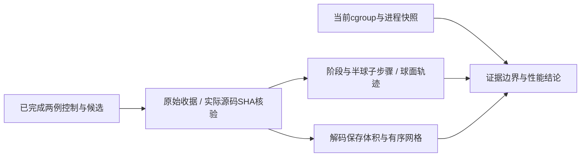

# GCSA / remesh 组合整例变慢的只读诊断

## 1．功能与范围

本页分解两例已完成原始T1整例的实际耗时：对照为`e34a1829`，候选为`79a41cdd`，候选显式接入GCSA有序Numba和remesh Python标量存储。只读取既有收据与输出，没有新跑重建、改生产默认或修改冻结源码。

本组实际整例慢了28.05%/29.01%。未改的N4、GA、white/pial和球面配准也慢；球面步数、权重、步长等轨迹没有增加。当前容器有40CPU总配额，虽然cpuset有128逻辑核，分开亲和性仍共用配额。但没有此前运行时的配额/频率/利用率时间序列，**不能把变慢全部归因共享负载，也不能从这一对运行隔离新remesh的贡献**。



## 2．Python调用、输入与输出

```python
from pathlib import Path
from inspect_recorded_runtime import read_record, time_fields, summarize_memory
from read_current_cgroup import snapshot

benchmark, binding = read_record(
    path=Path("runs/control/sub06-candidate/benchmark.json"),  # 已完成整例的原始JSON收据
)
timers = time_fields(
    value=benchmark,  # 只提取既有嵌套秒字段，不相加
    prefix="",  # 字段名的可选前缀，默认空字符串
)
memory = summarize_memory(
    receipt=benchmark["process_memory"],  # 实际目标GPU采样和归属状态
    started=None,  # 默认读取整份记录；可用worker实际开始的monotonic秒限定
    ended=None,  # 默认不限制终点；与started使用同一进程时钟
)
current = snapshot(
    root=Path("/sys/fs/cgroup"),  # 当前cgroup控制器挂载根，只读
)
```

`read_record`返回JSON字典与`path/SHA256/bytes`绑定；`time_fields`返回字段→秒字典，忽略列表中的逐步计时；`summarize_memory`返回采样覆盖、整卡最小/中位/最大占用、所有计算进程合计上界和实际任务归属状态。它不查询CUDA，也不把归属未决的值当任务显存。`inspect_worker(path=..., memory=...)`进一步返回真实worker阶段计时、分配器、线程预算、算法子计时和球面轨迹SHA；仍保留原先异步/同步计时边界。`snapshot`返回当前时钟与可读控制器原文，不回推历史运行状态。

| 参数 | 格式和含义 |
|---|---|
| `--control-root` / `--candidate-root` | 两套已完成run根；包含`<case>-candidate/benchmark.json`和`subject/`。要求exit0/statuscomplete，不读取官方参考 |
| `--control-source-root` / `--candidate-source-root` | 各自实际冻结仓库根；逐项校验整例声明的所有`src/fnit`源码SHA，拒绝改变或越界路径 |
| `--project-root` | 只用于当前`/proc`筛选属于本项目的进程；不导出命令参数、凭据或项目外命令内容 |
| `--case` | 可重复的公开case目录前缀，如sub06/sub07，不接收路径。同例原始T1、主机、CPU/亲和性、线程、设备、环境、权重资产和native程序必须相同 |
| `--output` | 新JSON文件路径；已有文件直接报错。不会写入原运行或冻结源码 |
| `--interval-seconds` | 仅`read_current_cgroup.py`，默认1.0秒，支持0.1至5秒；两次当前快照间隔，不是历史整例采样间隔 |

`verify_decoded_saved_geometry.py`只需要两套run根、重复case和新output。体积在各自conform网格，检查shape/dtype/affine及全部体素；表面采用surface RAS毫米坐标，检查有序坐标、有序面和全部nibabel解析空间头，来源filename另列。输出仅数量、最大差、SHA和布尔结果，不导出影像或顶点数组。

文件缺失、JSON格式错误、源码/资源/预算变化或运行未完成会报错。本页没有新增数值容差，也没有把此有限几何清点当作138项或整体等效验收。

## 3．命令行复现

```bash
CUDA_VISIBLE_DEVICES="" taskset -c 56-59 python inspect_recorded_runtime.py \
  --control-root runs/control_e34 \
  --candidate-root runs/gcsa_remesh_79a \
  --control-source-root frozen/e34a1829 \
  --candidate-source-root frozen/79a41cdd \
  --project-root FNIT_ROOT \
  --case sub06 --case sub07 \
  --output diagnostics/recorded_runtime.json
```

参数中文含义逐项见第2节；固定四核和隐藏CUDA只控制本次只读分析，不重标原生产的线程预算。执行`verify_decoded_saved_geometry.py`时沿用两套run根、case和新的output；执行`read_current_cgroup.py --interval-seconds 1 --output diagnostics/current_cgroup.json`得到独立当前快照。既有主页Conda的nibabel/NumPy用于几何读取，其余函数只用标准库，没有新增依赖。

## 4．原软件与实现边界

这是事后性能分解，没有独立FreeSurfer等价CLI。本轮没有重新运行官方程序；官方精度和历史计时由协调者独立评价。原始生产的GA、white/pial、N4等仍采用声明的固定源码Conda程序，其SHA在报告逐项核对。球面、GPU inflate、GCSA和remesh复用既有FNIT函数；本诊断不改它们。

GPU计时沿用原始收据边界：父stage有同步和完整墙钟，部分worker内部子计时是原函数计时或异步混合计时，不能当独占GPU kernel计时或相加到整例。现有TF32及FP32例外保持，无FP16/BF16。

## 5．2026-10-10实测结果

完整小报告：[记录分解](reports/report.json)、[解码几何](reports/decoded_geometry.json)、[当前v1配额](reports/current_cgroup_v1.json)。四份报告均先在服务器脱敏，7367个数值/bool/null叶保持；下载后逐公开SHA与实际测试脚本SHA再核验。

| 阶段 / CLI，秒 | sub06对照→候选 | sub07对照→候选 |
|---|---:|---:|
| 完整CLI | 2122.900 → 2718.390 | 2056.372 → 2653.001 |
| surface双侧组 | 687.041 → 903.320 | 728.750 → 970.375 |
| sphere.reg双侧组 | 281.788 → 375.839 | 288.875 → 390.971 |
| annotation双侧组 | 103.918 → 86.243 | 89.796 → 76.625 |
| final white/pial双侧组 | 377.466 → 475.841 | 308.161 → 388.259 |
| native N4 | 171.212 → 199.539 | 168.317 → 200.376 |

两个完整CLI分别增加595.490/596.628秒。三个surface/register/finish主组墙钟增量为408.705/423.820秒；annotation分别缩短17.675/13.171秒。下面的半球子计时存在包含关系，尤其topology准备与nofix球面，**不要相加或把两半球串行求和**。

| 半球子步骤，秒 | sub06 LH | sub06 RH | sub07 LH | sub07 RH |
|---|---:|---:|---:|---:|
| native GA | 134.452→177.243 | 73.206→106.202 | 152.099→212.630 | 95.265→139.148 |
| remesh | 95.676→125.533 | 101.482→128.647 | 87.906→111.535 | 85.514→110.390 |
| native white.preaparc放置 | 188.715→251.064 | 193.800→259.374 | 246.711→323.284 | 154.476→218.201 |
| quick sphere nofix | 88.869→128.344 | 86.678→131.291 | 81.365→117.221 | 81.667→114.645 |
| 完整standard sphere | 118.061→157.012 | 134.300→176.956 | 110.818→142.634 | 109.070→143.014 |
| sphere metric含首次JIT | 26.969→27.229 | 27.435→34.902 | 23.401→28.436 | 23.471→29.496 |

不能用“首次JIT”解释所有增加：sub06 LH的metric含JIT只多0.261秒，而完整sphere多38.951秒；相同154步更新计时之和由88.314增至126.887秒。四个半球更新步数为154/189/168/189，剔除时间字段后的步长、权重、averages轨迹SHA和全部negative-count轨迹均相同。没有单独编译器计时，不能再把混合metric计时拆成真实JIT秒数。

未改CPU计算也慢：sub06 N4子CPU秒由168.186增至195.586，第一归一化父CPU秒27.805→36.218；surface LH父/子CPU秒401.016/445.784→536.182/587.167。这些CPU秒不是单纯等待时间，但当前记录不能进一步区分频率、内存带宽、缓存、共享调度或其他系统因素。

### 精度、显存和当前资源

两例`orig/nu/filled`体素、shape、dtype、affine均精确相同；每例16张`orig.premesh/orig/smoothwm/inflated/sphere/sphere.reg/white/pial`有序坐标、面和空间头精确相同，最大坐标差0mm。原文件SHA很多不同，来源filename也不同，不能用封装字节或路径元信息代替数值比较。本有限检查支持本次两套工作量没有因网格改变而增加；整体精度仍以协调者的完整比较为准。

四半球surface worker的PyTorch allocated/reserved峰值与对照逐项精确相同。整卡占用的中位数sub06约17.45→34.92GB；全部样本为`ownership_unresolved`，任务树峰为null，没有历史GPU利用率。该值包括归属未决占用，既不能确定来自哪个外部任务，也不能证明FNIT满足20,000,000,000字节预算。

当前为cgroup v1：配额4,000,000µs/100,000µs=40CPU，cpuset为0–127；因此四核亲和性不会给每个任务独占的容器CPU配额。当前累计`nr_throttled=473`、`throttled_time=288,270,823,563ns`；新1.000587秒快照窗口10个period、0次限流。旧运行没有时间对齐的同类采样，不能据累计值认定79整例当时受限流。当前10个项目进程的可读线程/亲和性/RSS也保留；线程数包含休眠线程，不等于正在使用CPU的数量。v2路径与PSI不可读被明确记录，没有将缺失值当0。

## 6．更新与下一步

本次仅新增三份只读复现脚本、四份小JSON报告、脱敏映射和说明。实际源码SHA与输出SHA完整绑定；没有重新跑长整例、改环境配额或覆盖他人任务。既有remesh同输入ABBA收益不能替代这组较慢的整例，也不能凭共同变慢模式断言新代码绝无性能问题。

下一性能验证应在固定总并发预算和可记录的资源窗口做新的整例ABBA；同时采样cgroup配额/限流、CPU时间与频率、RSS/带宽代理、GPU利用率和进程归属。若资源允许，可在同一实际半球worker预算2线程下单独配对remesh新旧存储，以分离已测阶段收益与生产部署开销。本轮未执行这些补测，10分钟目标仍未达到。

## 7．源码与参考

- [半球调度](../../../../src/fnit/recon_all/hemisphere_parallel.py)、[真实调度入口](../../../../src/fnit/recon_all/native_free.py)、[remesh](../../../../src/fnit/recon_all/mris_remesh_python.py)、[完整standard sphere](../../../../src/fnit/recon_all/sphere_standard_run.py)。
- [原始T1计时入口](../../../../tools/benchmark_recon_torch_end_to_end.py)、[remesh同输入报告](../20261009_inflate_torch/reports/a100_remesh_scalar_20261010_v1/)。
- 原算法来源为仓库声明的FreeSurfer8.2固定源码`d932c45`和ITK5.4.7；本分析没有新增原软件算法或引用一个未经补跑的官方耗时。
